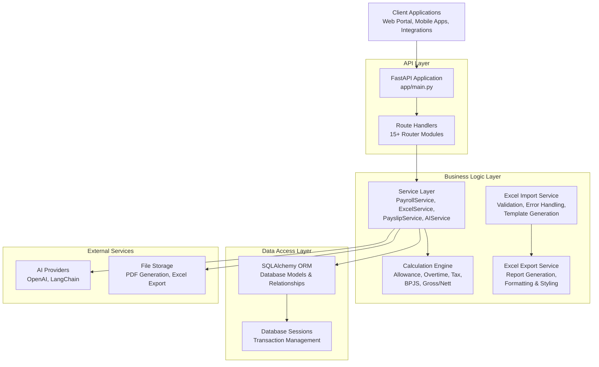
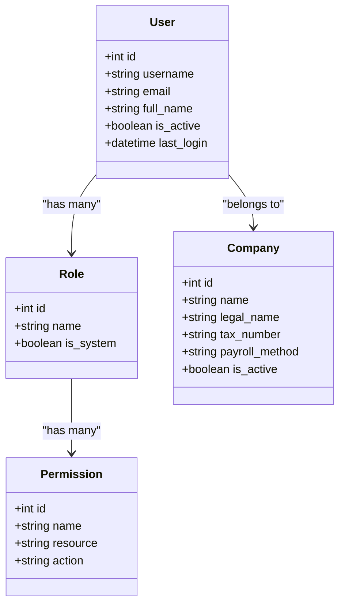
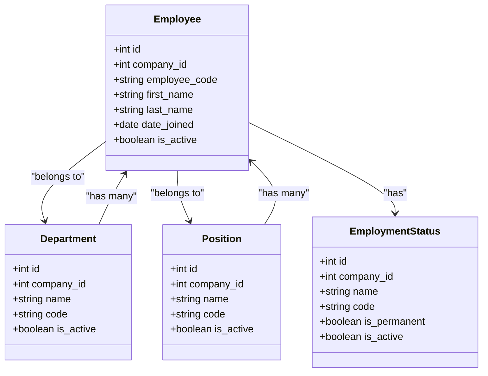
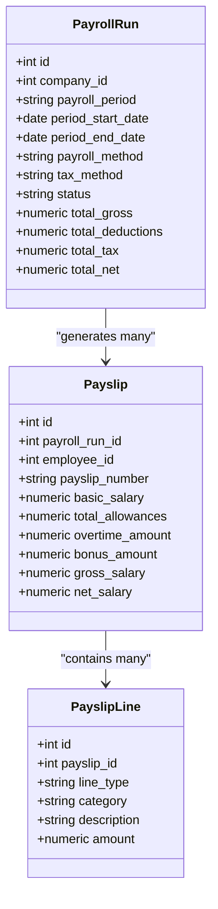
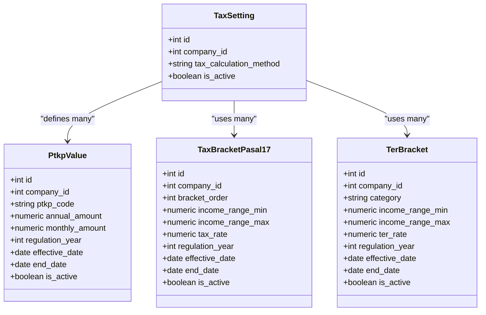
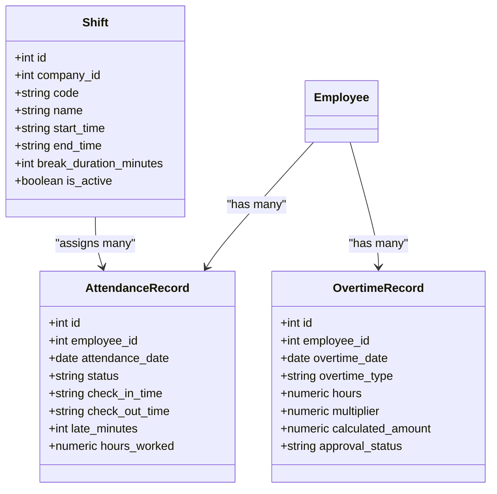
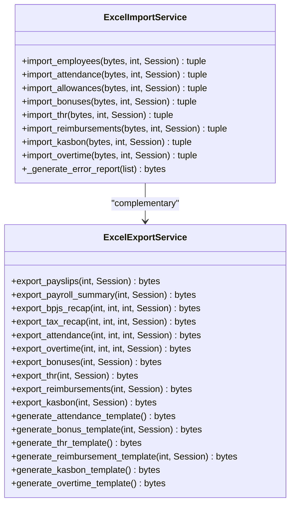
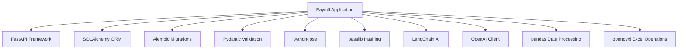

# API Reference

<cite>
**Referenced Files in This Document**
- [requirements.txt](file://requirements.txt)
- [app/config.py](file://app/config.py)
- [app/main.py](file://app/main.py)
- [api/index.py](file://api/index.py)
- [app/routers/payroll.py](file://app/routers/payroll.py)
- [app/routers/employees.py](file://app/routers/employees.py)
- [app/routers/tax.py](file://app/routers/tax.py)
- [app/routers/ai.py](file://app/routers/ai.py)
- [app/routers/payslip.py](file://app/routers/payslip.py)
- [app/routers/attendance.py](file://app/routers/attendance.py)
- [app/routers/master_data.py](file://app/routers/master_data.py)
- [app/routers/excel.py](file://app/routers/excel.py)
- [app/routers/rules.py](file://app/routers/rules.py)
- [app/routers/bonuses.py](file://app/routers/bonuses.py)
- [app/routers/reimbursements.py](file://app/routers/reimbursements.py)
- [app/routers/thr.py](file://app/routers/thr.py)
- [app/routers/company_entities.py](file://app/routers/company_entities.py)
- [app/routers/deductions.py](file://app/routers/deductions.py)
- [app/models/auth.py](file://app/models/auth.py)
- [app/models/employee.py](file://app/models/employee.py)
- [app/models/attendance.py](file://app/models/attendance.py)
- [app/models/payroll.py](file://app/models/payroll.py)
- [app/models/salary.py](file://app/models/salary.py)
- [app/models/tax.py](file://app/models/tax.py)
- [app/models/bpjs.py](file://app/models/bpjs.py)
- [app/models/leave.py](file://app/models/leave.py)
- [app/schemas/excel.py](file://app/schemas/excel.py)
- [app/services/excel_import_service.py](file://app/services/excel_import_service.py)
- [app/services/excel_export_service.py](file://app/services/excel_export_service.py)
</cite>

## Table of Contents
1. [Introduction](#introduction)
2. [Project Structure](#project-structure)
3. [Core Components](#core-components)
4. [Architecture Overview](#architecture-overview)
5. [Detailed Component Analysis](#detailed-component-analysis)
6. [API Endpoints](#api-endpoints)
7. [Authentication and Authorization](#authentication-and-authorization)
8. [Dependency Analysis](#dependency-analysis)
9. [Performance Considerations](#performance-considerations)
10. [Troubleshooting Guide](#troubleshooting-guide)
11. [Conclusion](#conclusion)
12. [Appendices](#appendices)

## Introduction
This API Reference documents the Payroll system's comprehensive RESTful endpoints covering payroll processing, employee management, tax calculations, attendance tracking, AI services, and administrative functions. The system is built with FastAPI and provides enterprise-grade payroll and HRIS capabilities with Indonesian tax compliance (PPh 21), BPJS contributions, and overtime calculations.

The API follows RESTful conventions with JSON payloads, supports pagination, filtering, and comprehensive error handling. All endpoints are prefixed with `/api/v1` and organized into logical groups for different functional domains.

## Project Structure
The Payroll system uses a modular FastAPI architecture with separate routers for each functional domain. The main application registers 15+ routers including payroll processing, employee management, tax configuration, attendance tracking, AI services, and administrative utilities.

```mermaid
graph TB
subgraph "API Endpoints"
A["Payroll Processing<br/>POST /api/v1/payroll/runs<br/>GET /api/v1/payroll/runs/{run_id}<br/>POST /api/v1/payroll/runs/{run_id}/process"]
B["Employee Management<br/>GET /api/v1/employees<br/>POST /api/v1/employees<br/>GET /api/v1/employees/{id}"]
C["Tax Configuration<br/>GET /api/v1/tax/settings<br/>POST /api/v1/tax/brackets<br/>GET /api/v1/tax/ter-brackets"]
D["AI Services<br/>GET /api/v1/ai/settings<br/>POST /api/v1/ai/chat<br/>POST /api/v1/ai/reports"]
E["Payslip Management<br/>GET /api/v1/payslip/{emp}/{year}/{month}<br/>POST /api/v1/payslip/bulk-generate"]
F["Attendance & Overtime<br/>POST /api/v1/attendance<br/>POST /api/v1/attendance/overtime<br/>GET /api/v1/attendance/overtime"]
G["Master Data<br/>Departments, Positions, Grades<br/>Employment Statuses"]
H["Excel Import/Export<br/>Import employees, attendance, allowances<br/>Import bonuses, THR, reimbursements, kasbon, overtime<br/>Export payslips, payroll summary, BPJS recap, tax recap, attendance<br/>Export bonuses, THR, reimbursements, kasbon, overtime<br/>Download import templates"]
I["Rules Engine<br/>Rule categories, configurations<br/>Audit logs, variable management"]
J["Additional Features<br/>Bonuses, Reimbursements, THR<br/>Deductions, Company Entities"]
end
A --> B
B --> C
C --> D
D --> E
E --> F
F --> G
G --> H
H --> I
I --> J
```

**Diagram sources**
- [app/main.py:50-66](file://app/main.py#L50-L66)
- [app/routers/payroll.py:27](file://app/routers/payroll.py#L27)
- [app/routers/employees.py:37](file://app/routers/employees.py#L37)
- [app/routers/tax.py:29](file://app/routers/tax.py#L29)
- [app/routers/ai.py:20](file://app/routers/ai.py#L20)
- [app/routers/payslip.py:23](file://app/routers/payslip.py#L23)

**Section sources**
- [app/main.py:50-66](file://app/main.py#L50-L66)
- [app/routers/payroll.py:27](file://app/routers/payroll.py#L27)
- [app/routers/employees.py:37](file://app/routers/employees.py#L37)
- [app/routers/tax.py:29](file://app/routers/tax.py#L29)
- [app/routers/ai.py:20](file://app/routers/ai.py#L20)
- [app/routers/payslip.py:23](file://app/routers/payslip.py#L23)
- [app/routers/attendance.py:22](file://app/routers/attendance.py#L22)
- [app/routers/master_data.py:22](file://app/routers/master_data.py#L22)
- [app/routers/excel.py:13](file://app/routers/excel.py#L13)
- [app/routers/rules.py:25](file://app/routers/rules.py#L25)
- [app/routers/bonuses.py:22](file://app/routers/bonuses.py#L22)
- [app/routers/reimbursements.py:23](file://app/routers/reimbursements.py#L23)
- [app/routers/thr.py:17](file://app/routers/thr.py#L17)
- [app/routers/company_entities.py:17](file://app/routers/company_entities.py#L17)
- [app/routers/deductions.py:18](file://app/routers/deductions.py#L18)

## Core Components
The Payroll system consists of several core components that work together to provide comprehensive HR and payroll management:

- **Authentication & Authorization**: JWT-based authentication with role-based access control (RBAC) for different user types
- **Employee Management**: Complete employee lifecycle management including personal data, employment details, and organizational hierarchy
- **Payroll Processing**: Full payroll cycle automation including run creation, calculation, approval, and payslip generation
- **Tax Management**: Indonesian tax configuration with PPh 21 Pasal 17 and TER bracket systems
- **Attendance Tracking**: Daily attendance recording, clock-in/out functionality, and overtime management
- **AI Integration**: AI-powered chat assistance, automated report generation, and intelligent payroll insights
- **Payslip Management**: Electronic payslip generation, bulk processing, and PDF export capabilities
- **Master Data**: Organizational structure management including departments, positions, grades, and employment statuses
- **Excel Import/Export System**: Comprehensive bulk data operations with validation, error reporting, and template generation
- **Administrative Functions**: Rules engine, bonus management, reimbursement processing, and company entity configuration

**Section sources**
- [app/models/auth.py:22-132](file://app/models/auth.py#L22-L132)
- [app/models/employee.py:20-131](file://app/models/employee.py#L20-L131)
- [app/models/payroll.py:19-123](file://app/models/payroll.py#L19-L123)
- [app/models/tax.py:19-114](file://app/models/tax.py#L19-L114)
- [app/models/attendance.py:21-133](file://app/models/attendance.py#L21-L133)

## Architecture Overview
The system follows a layered architecture pattern with clear separation of concerns:

**Diagram sources**
- [app/main.py:31-35](file://app/main.py#L31-L35)
- [app/routers/payroll.py:25](file://app/routers/payroll.py#L25)
- [app/routers/ai.py:16](file://app/routers/ai.py#L16)

**Section sources**
- [app/main.py:31-35](file://app/main.py#L31-L35)
- [app/routers/payroll.py:25](file://app/routers/payroll.py#L25)
- [app/routers/ai.py:16](file://app/routers/ai.py#L16)

## Detailed Component Analysis

### Authentication and Authorization
The system implements JWT-based authentication with comprehensive role-based access control:

**Diagram sources**
- [app/models/auth.py:22-132](file://app/models/auth.py#L22-L132)

**Section sources**
- [app/models/auth.py:22-132](file://app/models/auth.py#L22-L132)

### Employee Management
Comprehensive employee lifecycle management with organizational hierarchy:

**Diagram sources**
- [app/models/employee.py:20-131](file://app/models/employee.py#L20-L131)

**Section sources**
- [app/models/employee.py:20-131](file://app/models/employee.py#L20-L131)

### Payroll Processing
End-to-end payroll processing with automated calculations:

**Diagram sources**
- [app/models/payroll.py:19-123](file://app/models/payroll.py#L19-L123)

**Section sources**
- [app/models/payroll.py:19-123](file://app/models/payroll.py#L19-L123)

### Tax Management
Indonesian tax configuration with PPh 21 Pasal 17 and TER brackets:

**Diagram sources**
- [app/models/tax.py:19-114](file://app/models/tax.py#L19-L114)

**Section sources**
- [app/models/tax.py:19-114](file://app/models/tax.py#L19-L114)

### Attendance Tracking
Daily attendance and overtime management:

**Diagram sources**
- [app/models/attendance.py:21-133](file://app/models/attendance.py#L21-L133)

**Section sources**
- [app/models/attendance.py:21-133](file://app/models/attendance.py#L21-L133)

### Excel Import/Export System
Comprehensive bulk data operations with validation, error reporting, and template generation:

**Diagram sources**
- [app/services/excel_import_service.py:30-888](file://app/services/excel_import_service.py#L30-L888)
- [app/services/excel_export_service.py:19-771](file://app/services/excel_export_service.py#L19-L771)

**Section sources**
- [app/services/excel_import_service.py:30-888](file://app/services/excel_import_service.py#L30-L888)
- [app/services/excel_export_service.py:19-771](file://app/services/excel_export_service.py#L19-L771)

## API Endpoints

### Payroll Processing Endpoints
Complete payroll run lifecycle management:

| Method | Endpoint | Description |
|--------|----------|-------------|
| POST | `/api/v1/payroll/runs` | Create a new payroll run in DRAFT status |
| GET | `/api/v1/payroll/runs` | List payroll runs for a company with pagination |
| GET | `/api/v1/payroll/runs/{run_id}` | Get payroll run detail by ID |
| POST | `/api/v1/payroll/runs/{run_id}/process` | Process (calculate) a payroll run |
| POST | `/api/v1/payroll/runs/{run_id}/approve` | Approve a completed payroll run |
| GET | `/api/v1/payroll/runs/{run_id}/payslips` | List payslips for a specific payroll run |
| GET | `/api/v1/payroll/payslips/{payslip_id}` | Get payslip with detailed line items |

**Section sources**
- [app/routers/payroll.py:39-239](file://app/routers/payroll.py#L39-L239)

### Employee Management Endpoints
Comprehensive employee CRUD operations:

| Method | Endpoint | Description |
|--------|----------|-------------|
| GET | `/api/v1/employees` | List employees with filters and pagination |
| POST | `/api/v1/employees` | Create a new employee |
| GET | `/api/v1/employees/{employee_id}` | Get employee detail |
| PATCH | `/api/v1/employees/{employee_id}` | Partially update employee |
| DELETE | `/api/v1/employees/{employee_id}` | Deactivate employee (soft delete) |
| GET | `/api/v1/employees/{employee_id}/allowances` | List employee allowances |
| POST | `/api/v1/employees/{employee_id}/allowances` | Create employee allowance |
| PATCH | `/api/v1/employees/{employee_id}/allowances/{allowance_id}` | Update employee allowance |
| DELETE | `/api/v1/employees/{employee_id}/allowances/{allowance_id}` | Delete employee allowance |
| GET | `/api/v1/employees/{employee_id}/salary-history` | List salary history with audit trail |
| GET | `/api/v1/employees/{employee_id}/profile` | Employee self-service profile |
| GET | `/api/v1/employees/{employee_id}/payslips` | Employee self-service payslips |

**Section sources**
- [app/routers/employees.py:219-771](file://app/routers/employees.py#L219-L771)

### Tax Configuration Endpoints
Indonesian tax management:

| Method | Endpoint | Description |
|--------|----------|-------------|
| GET | `/api/v1/tax/settings` | Get tax settings for a company |
| POST | `/api/v1/tax/settings` | Create tax setting |
| PATCH | `/api/v1/tax/settings/{setting_id}` | Update tax setting |
| DELETE | `/api/v1/tax/settings/{setting_id}` | Delete tax setting |
| GET | `/api/v1/tax/ptkp` | List PTKP values |
| POST | `/api/v1/tax/ptkp` | Create PTKP value |
| PATCH | `/api/v1/tax/ptkp/{ptkp_id}` | Update PTKP value |
| DELETE | `/api/v1/tax/ptkp/{ptkp_id}` | Delete PTKP value |
| GET | `/api/v1/tax/brackets` | List Pasal 17 tax brackets |
| POST | `/api/v1/tax/brackets` | Create Pasal 17 tax bracket |
| PATCH | `/api/v1/tax/brackets/{bracket_id}` | Update Pasal 17 tax bracket |
| DELETE | `/api/v1/tax/brackets/{bracket_id}` | Delete Pasal 17 tax bracket |
| GET | `/api/v1/tax/ter-brackets` | List TER brackets |
| POST | `/api/v1/tax/ter-brackets` | Create TER bracket |
| PATCH | `/api/v1/tax/ter-brackets/{bracket_id}` | Update TER bracket |
| DELETE | `/api/v1/tax/ter-brackets/{bracket_id}` | Delete TER bracket |

**Section sources**
- [app/routers/tax.py:63-661](file://app/routers/tax.py#L63-L661)

### AI Service Endpoints
Intelligent payroll assistance:

| Method | Endpoint | Description |
|--------|----------|-------------|
| GET | `/api/v1/ai/settings` | Get AI settings for a company |
| POST | `/api/v1/ai/settings` | Create AI settings |
| PATCH | `/api/v1/ai/settings/{setting_id}` | Update AI settings |
| POST | `/api/v1/ai/test-connection` | Test AI provider connection |
| POST | `/api/v1/ai/chat` | Send message to AI assistant |
| POST | `/api/v1/ai/reports` | Generate AI-powered reports |

**Section sources**
- [app/routers/ai.py:25-202](file://app/routers/ai.py#L25-L202)

### Payslip Management Endpoints
Electronic payslip generation and management:

| Method | Endpoint | Description |
|--------|----------|-------------|
| GET | `/api/v1/payslip/{employee_id}/{year}/{month}` | Get or generate payslip PDF |
| POST | `/api/v1/payslip/bulk-generate` | Start bulk payslip generation |
| GET | `/api/v1/payslip/job-status/{job_id}` | Get bulk generation job status |
| GET | `/api/v1/payslip/job/{job_id}/download` | Download completed bulk payslips |
| GET | `/api/v1/payslip/history` | Get payslip generation history |
| GET | `/api/v1/payslip/annual-summary/{employee_id}/{year}` | Get annual payslip summary |
| GET | `/api/v1/payslip/templates` | List active payslip templates |
| POST | `/api/v1/payslip/templates` | Create payslip template |
| PUT | `/api/v1/payslip/templates/{template_id}` | Update payslip template |
| POST | `/api/v1/payslip/templates/preview` | Preview payslip template |

**Section sources**
- [app/routers/payslip.py:33-450](file://app/routers/payslip.py#L33-L450)

### Attendance & Overtime Endpoints
Daily attendance and overtime tracking:

| Method | Endpoint | Description |
|--------|----------|-------------|
| POST | `/api/v1/attendance` | Record attendance entry |
| GET | `/api/v1/attendance` | List attendance records |
| POST | `/api/v1/attendance/clock-in` | Employee clock-in |
| POST | `/api/v1/attendance/clock-out` | Employee clock-out |
| POST | `/api/v1/attendance/overtime` | Record overtime entry |
| GET | `/api/v1/attendance/overtime` | List overtime records |
| PATCH | `/api/v1/attendance/overtime/{overtime_id}/approve` | Approve or reject overtime |

**Section sources**
- [app/routers/attendance.py:28-296](file://app/routers/attendance.py#L28-L296)

### Master Data Endpoints
Organizational structure management:

| Method | Endpoint | Description |
|--------|----------|-------------|
| GET | `/api/v1/master-data/departments` | List departments |
| POST | `/api/v1/master-data/departments` | Create department |
| PATCH | `/api/v1/master-data/departments/{department_id}` | Update department |
| DELETE | `/api/v1/master-data/departments/{department_id}` | Delete department |
| GET | `/api/v1/master-data/positions` | List positions |
| POST | `/api/v1/master-data/positions` | Create position |
| PATCH | `/api/v1/master-data/positions/{position_id}` | Update position |
| DELETE | `/api/v1/master-data/positions/{position_id}` | Delete position |
| GET | `/api/v1/master-data/grades` | List grades |
| POST | `/api/v1/master-data/grades` | Create grade |
| PATCH | `/api/v1/master-data/grades/{grade_id}` | Update grade |
| DELETE | `/api/v1/master-data/grades/{grade_id}` | Delete grade |
| GET | `/api/v1/master-data/employment-statuses` | List employment statuses |
| POST | `/api/v1/master-data/employment-statuses` | Create employment status |
| PATCH | `/api/v1/master-data/employment-statuses/{status_id}` | Update employment status |
| DELETE | `/api/v1/master-data/employment-statuses/{status_id}` | Delete employment status |

**Section sources**
- [app/routers/master_data.py:27-287](file://app/routers/master_data.py#L27-L287)

### Excel Import/Export Endpoints
Comprehensive bulk data operations with validation and error reporting:

#### Import Endpoints
| Method | Endpoint | Description |
|--------|----------|-------------|
| POST | `/api/v1/excel/import/employees` | Bulk import employees from Excel file |
| POST | `/api/v1/excel/import/attendance` | Bulk import attendance records from Excel file |
| POST | `/api/v1/excel/import/allowances` | Bulk import employee allowances from Excel file |
| POST | `/api/v1/excel/import/bonuses` | Bulk import bonus records from Excel file |
| POST | `/api/v1/excel/import/thr` | Bulk import THR records from Excel file |
| POST | `/api/v1/excel/import/reimbursements` | Bulk import reimbursement claims from Excel file |
| POST | `/api/v1/excel/import/kasbon` | Bulk import kasbon/loan records from Excel file |
| POST | `/api/v1/excel/import/overtime` | Bulk import overtime records from Excel file |

#### Export Endpoints
| Method | Endpoint | Description |
|--------|----------|-------------|
| GET | `/api/v1/excel/export/payslips/{payroll_run_id}` | Export payslips for a payroll run as Excel |
| GET | `/api/v1/excel/export/payroll-summary/{payroll_run_id}` | Export payroll summary by department as Excel |
| GET | `/api/v1/excel/export/bpjs-recap?company_id={id}&month={month}&year={year}` | Export BPJS recap for a month as Excel |
| GET | `/api/v1/excel/export/tax-recap?company_id={id}&month={month}&year={year}` | Export tax (PPh 21) recap for a month as Excel |
| GET | `/api/v1/excel/export/attendance?company_id={id}&month={month}&year={year}` | Export attendance records for a month as Excel |
| GET | `/api/v1/excel/export/bonuses?company_id={id}` | Export bonus records for a company as Excel |
| GET | `/api/v1/excel/export/thr?company_id={id}` | Export THR records for a company as Excel |
| GET | `/api/v1/excel/export/reimbursements?company_id={id}` | Export reimbursement claims for a company as Excel |
| GET | `/api/v1/excel/export/kasbon?company_id={id}` | Export kasbon/loan records for a company as Excel |
| GET | `/api/v1/excel/export/overtime?company_id={id}&month={month}&year={year}` | Export overtime records for a month as Excel |

#### Template Endpoints
| Method | Endpoint | Description |
|--------|----------|-------------|
| GET | `/api/v1/excel/templates/attendance` | Download attendance import template |
| GET | `/api/v1/excel/templates/bonuses?company_id={id}` | Download bonus import template |
| GET | `/api/v1/excel/templates/thr` | Download THR import template |
| GET | `/api/v1/excel/templates/reimbursements?company_id={id}` | Download reimbursement import template |
| GET | `/api/v1/excel/templates/kasbon` | Download kasbon import template |
| GET | `/api/v1/excel/templates/overtime` | Download overtime import template |

#### Admin Endpoints
| Method | Endpoint | Description |
|--------|----------|-------------|
| POST | `/api/v1/excel/admin/seed-bulk` | Trigger bulk employee seeding via API (admin only) |

**Section sources**
- [app/routers/excel.py:18-430](file://app/routers/excel.py#L18-L430)

### Rules Engine Endpoints
Advanced rule configuration:

| Method | Endpoint | Description |
|--------|----------|-------------|
| GET | `/api/v1/admin/rules/categories` | List rule categories |
| GET | `/api/v1/admin/rules/configurations` | List rule configurations |
| POST | `/api/v1/admin/rules/configurations` | Create rule configuration |
| GET | `/api/v1/admin/rules/configurations/{rule_id}` | Get rule configuration detail |
| PATCH | `/api/v1/admin/rules/configurations/{rule_id}` | Update rule configuration |
| DELETE | `/api/v1/admin/rules/configurations/{rule_id}` | Delete rule configuration |
| GET | `/api/v1/admin/rules/configurations/{rule_id}/audit-logs` | List rule audit logs |
| POST | `/api/v1/admin/rules/reset-to-default` | Reset rules to default |
| GET | `/api/v1/admin/rules/variables` | List rule variables |

**Section sources**
- [app/routers/rules.py:82-403](file://app/routers/rules.py#L82-L403)

### Additional Feature Endpoints

#### Bonuses Management
| Method | Endpoint | Description |
|--------|----------|-------------|
| GET | `/api/v1/bonuses/types` | List bonus types |
| POST | `/api/v1/bonuses/types` | Create bonus type |
| PATCH | `/api/v1/bonuses/types/{bonus_type_id}` | Update bonus type |
| DELETE | `/api/v1/bonuses/types/{bonus_type_id}` | Delete bonus type |
| GET | `/api/v1/bonuses` | List bonus records |
| POST | `/api/v1/bonuses` | Create bonus record |
| PATCH | `/api/v1/bonuses/{bonus_id}` | Update bonus record |
| DELETE | `/api/v1/bonuses/{bonus_id}` | Delete bonus record |

#### Reimbursements Management
| Method | Endpoint | Description |
|--------|----------|-------------|
| GET | `/api/v1/reimbursements/types` | List reimbursement types |
| POST | `/api/v1/reimbursements/types` | Create reimbursement type |
| PATCH | `/api/v1/reimbursements/types/{reimbursement_type_id}` | Update reimbursement type |
| DELETE | `/api/v1/reimbursements/types/{reimbursement_type_id}` | Delete reimbursement type |
| GET | `/api/v1/reimbursements` | List reimbursement claims |
| POST | `/api/v1/reimbursements` | Create reimbursement claim |
| PATCH | `/api/v1/reimbursements/{reimbursement_id}` | Update reimbursement claim |
| DELETE | `/api/v1/reimbursements/{reimbursement_id}` | Delete reimbursement claim |

#### THR (Tunjangan Hari Raya) Management
| Method | Endpoint | Description |
|--------|----------|-------------|
| GET | `/api/v1/thr` | List THR records |
| POST | `/api/v1/thr/calculate` | Bulk calculate THR records |
| POST | `/api/v1/thr` | Create THR record |
| PATCH | `/api/v1/thr/{thr_id}` | Update THR record |
| DELETE | `/api/v1/thr/{thr_id}` | Delete THR record |

#### Company Entities & UMP Settings
| Method | Endpoint | Description |
|--------|----------|-------------|
| GET | `/api/v1/companies/{company_id}/entities` | List company entities |
| POST | `/api/v1/companies/{company_id}/entities` | Create company entity |
| GET | `/api/v1/companies/{company_id}/entities/{entity_id}` | Get entity detail |
| PATCH | `/api/v1/companies/{company_id}/entities/{entity_id}` | Update entity |
| DELETE | `/api/v1/companies/{company_id}/entities/{entity_id}` | Deactivate entity |
| GET | `/api/v1/companies/{company_id}/ump-settings` | List UMP settings |
| POST | `/api/v1/companies/{company_id}/ump-settings` | Create UMP setting |
| GET | `/api/v1/companies/{company_id}/ump-settings/{ump_id}` | Get UMP setting detail |
| PATCH | `/api/v1/companies/{company_id}/ump-settings/{ump_id}` | Update UMP setting |
| DELETE | `/api/v1/companies/{company_id}/ump-settings/{ump_id}` | Deactivate UMP setting |

#### Deductions Configuration
| Method | Endpoint | Description |
|--------|----------|-------------|
| GET | `/api/v1/deductions/types` | List deduction types |
| POST | `/api/v1/deductions/types` | Create deduction type |
| PATCH | `/api/v1/deductions/types/{deduction_type_id}` | Update deduction type |
| DELETE | `/api/v1/deductions/types/{deduction_type_id}` | Delete deduction type |

**Section sources**
- [app/routers/bonuses.py:30-332](file://app/routers/bonuses.py#L30-L332)
- [app/routers/reimbursements.py:31-412](file://app/routers/reimbursements.py#L31-L412)
- [app/routers/thr.py:68-288](file://app/routers/thr.py#L68-L288)
- [app/routers/company_entities.py:47-306](file://app/routers/company_entities.py#L47-L306)
- [app/routers/deductions.py:23-170](file://app/routers/deductions.py#L23-L170)

## Authentication and Authorization
The Payroll system implements comprehensive authentication and authorization mechanisms:

### Authentication Methods
- **JWT Token Authentication**: All protected endpoints require Authorization header with Bearer token
- **Session-based Access**: Tokens contain user context and permissions
- **Multi-factor Authentication**: Optional MFA support for enhanced security

### Authorization Model
- **Role-Based Access Control (RBAC)**: Users assigned to roles with specific permissions
- **Resource-Level Permissions**: Fine-grained control over CRUD operations
- **Company Context**: Multi-tenant architecture with company-scoped data isolation

### Security Features
- **HTTPS Enforcement**: All API communications encrypted
- **Input Validation**: Comprehensive request validation and sanitization
- **Rate Limiting**: Built-in protection against abuse
- **Audit Logging**: Complete audit trail for all sensitive operations
- **CSRF Protection**: Defense against cross-site request forgery attacks

**Section sources**
- [app/config.py:6-8](file://app/config.py#L6-L8)
- [app/models/auth.py:22-132](file://app/models/auth.py#L22-L132)

## Dependency Analysis
The Payroll system relies on several key technologies and libraries:

### Core Dependencies
- **FastAPI**: Web framework for building APIs with automatic OpenAPI documentation
- **SQLAlchemy**: ORM for database operations and relationship management
- **Alembic**: Database migration management
- **Pydantic**: Data validation and settings management
- **python-jose**: JWT token handling
- **passlib**: Password hashing and verification
- **httpx**: HTTP client for external API calls
- **langchain**: AI/LLM integration
- **openai**: OpenAI API client
- **pandas**: Data manipulation and Excel file processing
- **openpyxl**: Excel file generation and manipulation

### Configuration Management
- **Environment Variables**: JWT secret, database URL, AI provider settings
- **Debug Mode**: Development vs production configuration
- **Logging Levels**: Structured logging for monitoring and debugging

**Diagram sources**
- [requirements.txt:1-14](file://requirements.txt#L1-L14)

**Section sources**
- [requirements.txt:1-14](file://requirements.txt#L1-L14)
- [app/config.py:4-17](file://app/config.py#L4-L17)

## Performance Considerations
The Payroll system is designed for high performance and scalability:

### Database Optimization
- **Indexing Strategy**: Strategic indexes on frequently queried columns (employee code, department, status)
- **Query Optimization**: Efficient joins and subqueries to minimize database load
- **Connection Pooling**: Optimized database connection management
- **Pagination**: Built-in pagination for large dataset queries

### Caching Strategies
- **Company Settings Cache**: Frequently accessed tax, BPJS, and overtime settings cached
- **Employee Data Cache**: Current base salary and allowance data cached per request
- **AI Response Cache**: Common AI queries cached to reduce latency

### Asynchronous Processing
- **Background Jobs**: Long-running operations like bulk payslip generation run asynchronously
- **Batch Processing**: Payroll runs processed in batches to optimize resource usage
- **Queue Management**: Message queues for handling large-scale operations

### Excel Processing Optimization
- **Streaming Responses**: Large Excel files streamed directly to clients
- **Chunked Processing**: Excel import operations process data in chunks (50 rows at a time)
- **Memory Management**: Efficient memory usage during Excel file processing
- **Template Generation**: Pre-generated templates reduce processing overhead

### Scalability Features
- **Load Balancing**: Horizontal scaling support
- **Database Sharding**: Potential for data partitioning
- **CDN Integration**: Static assets served via CDN for faster delivery

## Troubleshooting Guide

### Common Issues and Solutions

#### Authentication Problems
- **JWT Token Issues**: Verify token format, expiration, and signing algorithm
- **Permission Denied**: Check user role assignments and resource permissions
- **Session Timeout**: Implement automatic token refresh mechanisms

#### Data Validation Errors
- **Constraint Violations**: Review database constraints and unique indexes
- **Enum Validation**: Ensure values match allowed options (PPh methods, approval statuses)
- **Date Range Conflicts**: Check overlapping date ranges in tax brackets and UMP settings

#### Database Connectivity
- **Connection Pool Exhaustion**: Monitor pool size and connection timeouts
- **Migration Issues**: Run Alembic migrations to update schema
- **Transaction Rollbacks**: Handle concurrent modification conflicts

#### Excel Import/Export Issues
- **File Format Errors**: Ensure Excel files (.xlsx or .xls) are uploaded correctly
- **Template Mismatch**: Verify Excel column headers match expected format
- **Validation Failures**: Check error reports generated for failed imports
- **Memory Issues**: Large Excel files may cause memory constraints during processing
- **Template Generation**: Ensure template endpoints are accessible for download

#### Performance Issues
- **Slow Queries**: Analyze query execution plans and add missing indexes
- **Memory Leaks**: Monitor memory usage in long-running processes
- **Timeout Errors**: Increase timeout values for large operations

**Section sources**
- [app/config.py:4-17](file://app/config.py#L4-L17)
- [app/routers/employees.py:280-298](file://app/routers/employees.py#L280-L298)
- [app/routers/tax.py:89-96](file://app/routers/tax.py#L89-L96)

## Conclusion
The Payroll system provides a comprehensive, enterprise-grade solution for Indonesian payroll and HR management. With 15+ specialized routers covering payroll processing, employee management, tax calculations, attendance tracking, AI services, and administrative functions, the system offers complete automation of HR and payroll workflows.

Key strengths include:
- **Full Compliance**: Built-in support for Indonesian tax regulations (PPh 21) and labor laws
- **Scalability**: Designed for enterprise deployment with performance optimization
- **Extensibility**: Modular architecture supporting custom integrations and extensions
- **Security**: Comprehensive authentication, authorization, and audit capabilities
- **Automation**: End-to-end payroll processing with minimal manual intervention
- **Excel Integration**: Comprehensive bulk data operations with validation and error reporting

The API follows RESTful best practices with comprehensive error handling, pagination, and filtering capabilities. Clients should implement robust authentication using JWT, adhere to request/response schemas, apply rate limiting, and follow security best practices as outlined in this documentation.

## Appendices

### API Versioning Information
- **Current Version**: 1.0.0 (as defined in app/main.py)
- **Version Header**: X-API-Version: 1.0.0
- **Future Versions**: Planned semantic versioning with backward compatibility

### Rate Limiting
- **Default Limits**: 1000 requests per hour per IP address
- **Endpoint-specific Limits**: Higher limits for authenticated users
- **Custom Implementation**: Middleware-based rate limiting available

### Security Considerations
- **Transport Security**: HTTPS required for all production deployments
- **Authentication**: JWT with HS256 algorithm and strong secret keys
- **Authorization**: RBAC with role inheritance and permission scoping
- **Data Protection**: Sensitive data encryption at rest and in transit
- **Input Sanitization**: Comprehensive validation and sanitization
- **Audit Logging**: Complete audit trail for compliance requirements

### API Testing Procedures
- **Unit Testing**: Individual endpoint testing with mock data
- **Integration Testing**: End-to-end workflow validation
- **Load Testing**: Performance benchmarking under expected load
- **Security Testing**: Penetration testing and vulnerability assessment
- **Excel Testing**: Comprehensive testing of import/export functionality with various file formats

### Deployment Considerations
- **Containerization**: Docker support for easy deployment
- **Environment Configuration**: Separate configs for development, staging, and production
- **Monitoring**: Built-in health checks and performance metrics
- **Backup Strategy**: Automated database backup and recovery procedures

### Excel Import/Export Specifications
- **Supported Formats**: .xlsx and .xls Excel files
- **File Size Limits**: Configurable based on server resources
- **Error Reporting**: Automatic error report generation with detailed row-by-row feedback
- **Template Validation**: Strict validation against predefined templates
- **Batch Processing**: Efficient chunked processing for large datasets

**Section sources**
- [app/main.py:32-34](file://app/main.py#L32-L34)
- [app/config.py:6-8](file://app/config.py#L6-L8)
- [app/schemas/excel.py:15-21](file://app/schemas/excel.py#L15-L21)
- [app/services/excel_import_service.py:41-52](file://app/services/excel_import_service.py#L41-L52)
- [app/services/excel_export_service.py:23-59](file://app/services/excel_export_service.py#L23-L59)