# API Reference

<cite>
**Referenced Files in This Document**
- [requirements.txt](file://requirements.txt)
- [app/config.py](file://app/config.py)
- [app/models/auth.py](file://app/models/auth.py)
- [app/models/employee.py](file://app/models/employee.py)
- [app/models/attendance.py](file://app/models/attendance.py)
- [app/models/payroll.py](file://app/models/payroll.py)
- [app/models/salary.py](file://app/models/salary.py)
- [app/models/tax.py](file://app/models/tax.py)
- [app/models/bpjs.py](file://app/models/bpjs.py)
- [app/models/leave.py](file://app/models/leave.py)
</cite>

## Table of Contents
1. [Introduction](#introduction)
2. [Project Structure](#project-structure)
3. [Core Components](#core-components)
4. [Architecture Overview](#architecture-overview)
5. [Detailed Component Analysis](#detailed-component-analysis)
6. [Dependency Analysis](#dependency-analysis)
7. [Performance Considerations](#performance-considerations)
8. [Troubleshooting Guide](#troubleshooting-guide)
9. [Conclusion](#conclusion)
10. [Appendices](#appendices)

## Introduction
This API Reference documents the Payroll system’s RESTful endpoints and related data models. It focuses on the major functional areas:
- Authentication and Authorization
- Employee Management
- Payroll Processing
- Attendance Tracking
- Tax Management
- Salary and Compensation
- Leave Management
- BPJS Configuration

It describes HTTP method usage, URL patterns, request/response schemas, authentication requirements, and error handling strategies. It also provides common use cases, client implementation guidelines, API versioning information, rate limiting, security considerations, and testing procedures.

## Project Structure
The Payroll system is built with FastAPI and SQLAlchemy. The backend defines domain models under app/models representing entities such as Companies, Users, Employees, Departments, Positions, Payroll Runs, Payslips, Attendance Records, Tax Settings, Salary Structures, Leave Types, and BPJS Settings. These models define the data schema and constraints used by the API.

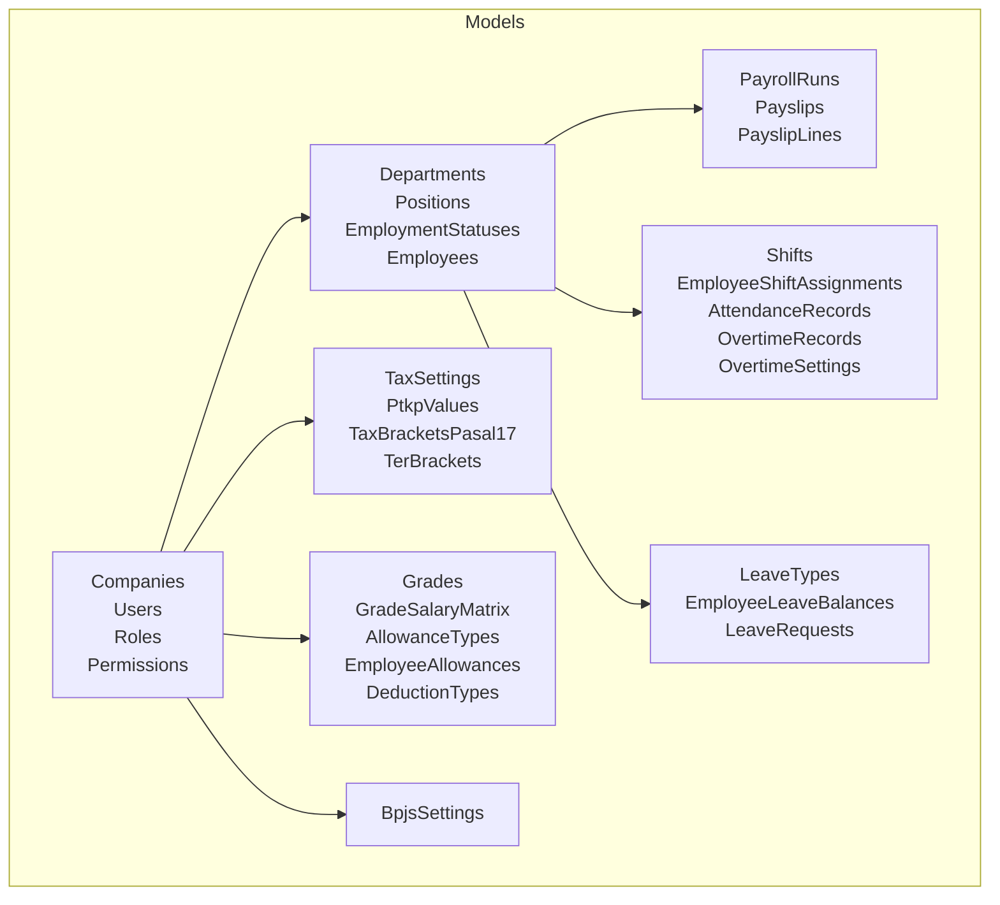

**Diagram sources**
- [app/models/auth.py:22-132](file://app/models/auth.py#L22-L132)
- [app/models/employee.py:20-131](file://app/models/employee.py#L20-L131)
- [app/models/payroll.py:19-123](file://app/models/payroll.py#L19-L123)
- [app/models/attendance.py:21-133](file://app/models/attendance.py#L21-L133)
- [app/models/tax.py:19-114](file://app/models/tax.py#L19-L114)
- [app/models/salary.py:21-134](file://app/models/salary.py#L21-L134)
- [app/models/leave.py:19-96](file://app/models/leave.py#L19-L96)
- [app/models/bpjs.py:17-43](file://app/models/bpjs.py#L17-L43)

**Section sources**
- [requirements.txt:1-14](file://requirements.txt#L1-L14)
- [app/config.py:4-17](file://app/config.py#L4-L17)

## Core Components
- Authentication and Authorization: Companies, Roles, Permissions, User Roles, Role Permissions, and Users define RBAC and user account management.
- Employee Management: Departments, Positions, Employment Statuses, and Employees form the organizational and personnel master data.
- Payroll Processing: Payroll Runs, Payslips, and Payslip Lines represent batch processing and individual pay statements.
- Attendance Tracking: Shifts, Employee Shift Assignments, Attendance Records, Overtime Records, and Overtime Settings capture daily attendance and overtime.
- Tax Management: Tax Settings, PTKP Values, Tax Brackets for Pasal 17, and TER Brackets define Indonesian tax configurations.
- Salary and Compensation: Grades, Grade-Salary Matrix, Allowance Types, Employee Allowances, and Deduction Types manage compensation structures.
- Leave Management: Leave Types, Employee Leave Balances, and Leave Requests handle leave lifecycle.
- BPJS Configuration: BPJS Settings define contribution rates and caps for health, pension, unemployment, and related insurances.

**Section sources**
- [app/models/auth.py:22-132](file://app/models/auth.py#L22-L132)
- [app/models/employee.py:20-131](file://app/models/employee.py#L20-L131)
- [app/models/payroll.py:19-123](file://app/models/payroll.py#L19-L123)
- [app/models/attendance.py:21-133](file://app/models/attendance.py#L21-L133)
- [app/models/tax.py:19-114](file://app/models/tax.py#L19-L114)
- [app/models/salary.py:21-134](file://app/models/salary.py#L21-L134)
- [app/models/leave.py:19-96](file://app/models/leave.py#L19-L96)
- [app/models/bpjs.py:17-43](file://app/models/bpjs.py#L17-L43)

## Architecture Overview
The system follows a layered architecture:
- Data Access Layer: SQLAlchemy ORM models define entities and relationships.
- Business Logic: Not shown here; endpoints orchestrate model queries and validations.
- API Layer: FastAPI routes expose REST endpoints grouped by functional domains.

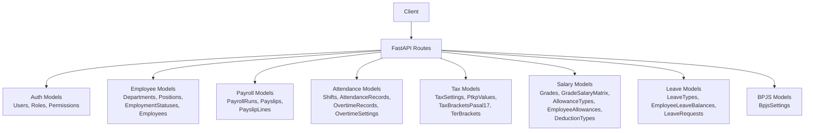

**Diagram sources**
- [app/models/auth.py:22-132](file://app/models/auth.py#L22-L132)
- [app/models/employee.py:20-131](file://app/models/employee.py#L20-L131)
- [app/models/payroll.py:19-123](file://app/models/payroll.py#L19-L123)
- [app/models/attendance.py:21-133](file://app/models/attendance.py#L21-L133)
- [app/models/tax.py:19-114](file://app/models/tax.py#L19-L114)
- [app/models/salary.py:21-134](file://app/models/salary.py#L21-L134)
- [app/models/leave.py:19-96](file://app/models/leave.py#L19-L96)
- [app/models/bpjs.py:17-43](file://app/models/bpjs.py#L17-L43)

## Detailed Component Analysis

### Authentication and Authorization
- Purpose: Manage organizations, roles, permissions, and user accounts with RBAC.
- Key Entities:
  - Company: Organization/company metadata and payroll defaults.
  - Role: Role definitions with associated permissions.
  - Permission: Resource-action granular permissions.
  - User: System user accounts linked to company and employee.
  - User Roles and Role Permissions: Many-to-many associations.

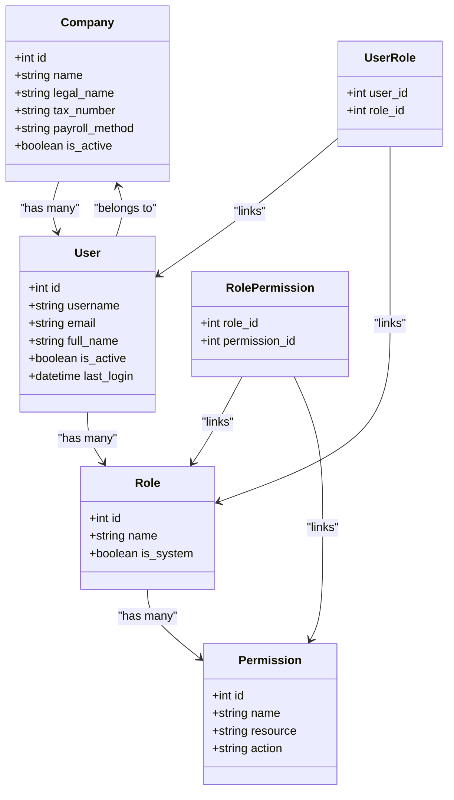

**Diagram sources**
- [app/models/auth.py:22-132](file://app/models/auth.py#L22-L132)

**Section sources**
- [app/models/auth.py:22-132](file://app/models/auth.py#L22-L132)

### Employee Management
- Purpose: Maintain organizational structure and employee master data.
- Key Entities:
  - Department: Hierarchical departments with self-reference.
  - Position: Job positions/titles.
  - EmploymentStatus: Employment types (e.g., permanent, contract).
  - Employee: Personal and employment details, linked to department, position, and status.

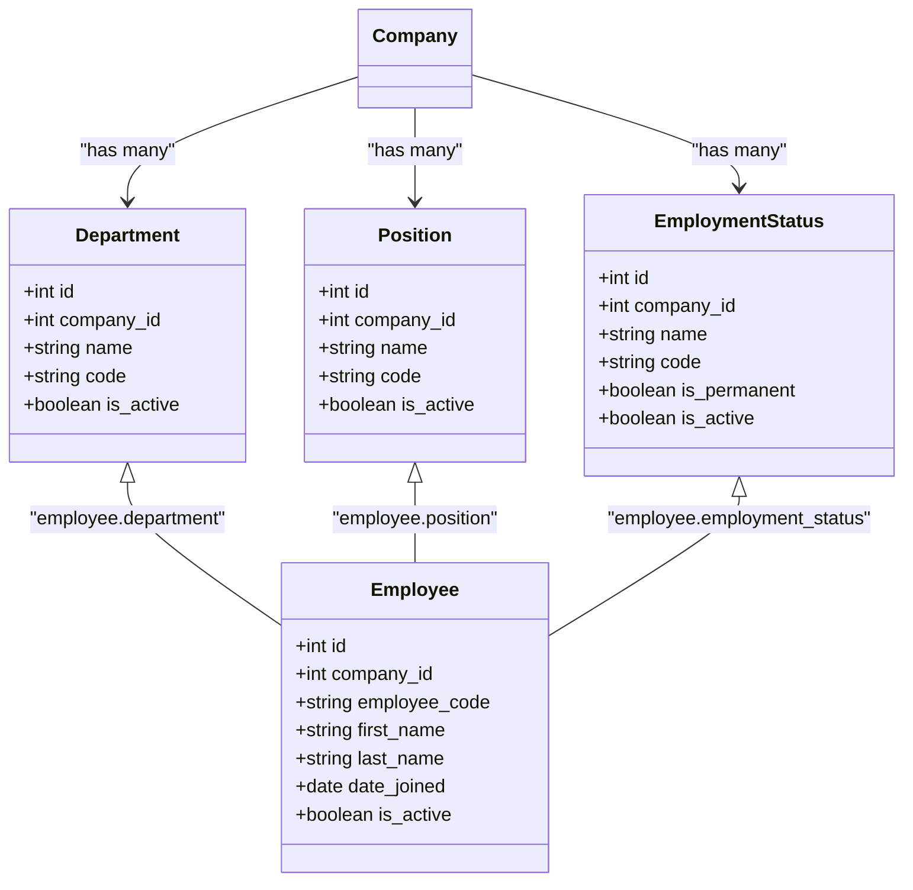

**Diagram sources**
- [app/models/employee.py:20-131](file://app/models/employee.py#L20-L131)

**Section sources**
- [app/models/employee.py:20-131](file://app/models/employee.py#L20-L131)

### Payroll Processing
- Purpose: Batch payroll runs and compute individual payslips with earnings, deductions, taxes, and BPJS contributions.
- Key Entities:
  - PayrollRun: Batch run metadata and totals.
  - Payslip: Per-employee payslip with computed amounts.
  - PayslipLine: Line items categorized as earnings, deductions, taxes, BPJS, or net.

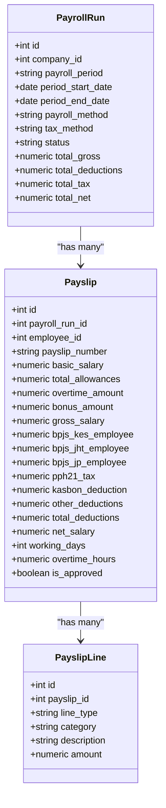

**Diagram sources**
- [app/models/payroll.py:19-123](file://app/models/payroll.py#L19-L123)

**Section sources**
- [app/models/payroll.py:19-123](file://app/models/payroll.py#L19-L123)

### Attendance Tracking
- Purpose: Track daily attendance, assign shifts, and record overtime with approval workflows.
- Key Entities:
  - Shift: Work shift definitions.
  - EmployeeShiftAssignment: Effective date ranges for shift assignments.
  - AttendanceRecord: Daily presence with status and worked hours.
  - OvertimeRecord: Overtime hours with approval status.
  - OvertimeSetting: Company-level overtime multipliers and policies.

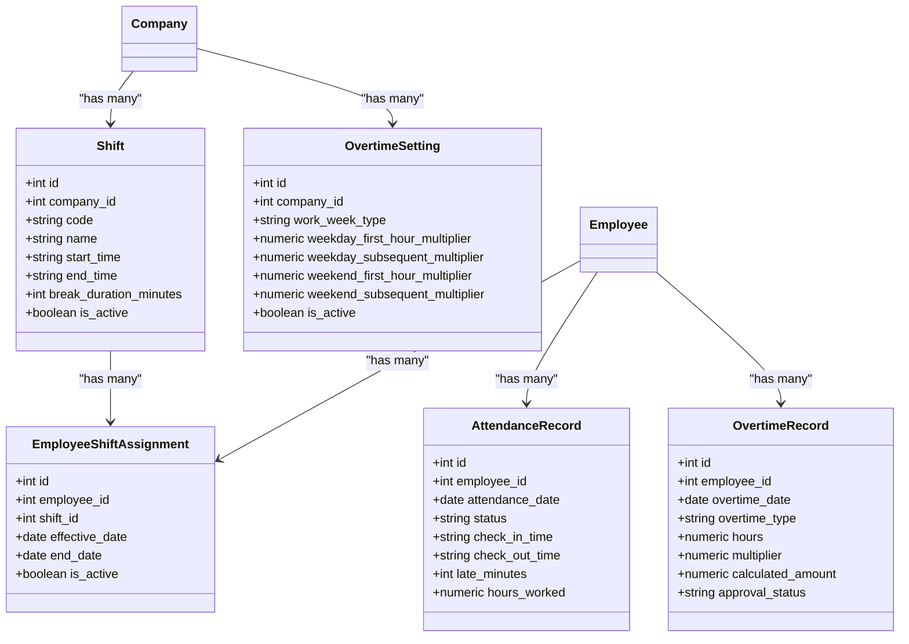

**Diagram sources**
- [app/models/attendance.py:21-133](file://app/models/attendance.py#L21-L133)

**Section sources**
- [app/models/attendance.py:21-133](file://app/models/attendance.py#L21-L133)

### Tax Management
- Purpose: Configure and calculate Indonesian income tax using PPh Pasal 17 or TER.
- Key Entities:
  - TaxSetting: Company-level tax method selection.
  - PtkpValue: PTKP thresholds per regulation year.
  - TaxBracketPasal17: Progressive tax brackets.
  - TerBracket: TER brackets for simplified tax.

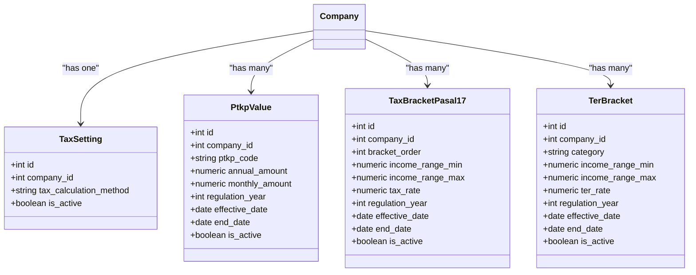

**Diagram sources**
- [app/models/tax.py:19-114](file://app/models/tax.py#L19-L114)

**Section sources**
- [app/models/tax.py:19-114](file://app/models/tax.py#L19-L114)

### Salary and Compensation
- Purpose: Define salary structures, allowance types, and employee-specific allowances and deductions.
- Key Entities:
  - Grade: Employee grade definitions.
  - GradeSalaryMatrix: Salary bands per grade with effective dates.
  - AllowanceType: Types of allowances with calculation modes.
  - EmployeeAllowance: Employee-specific allowance assignments.
  - DeductionType: Types of deductions.

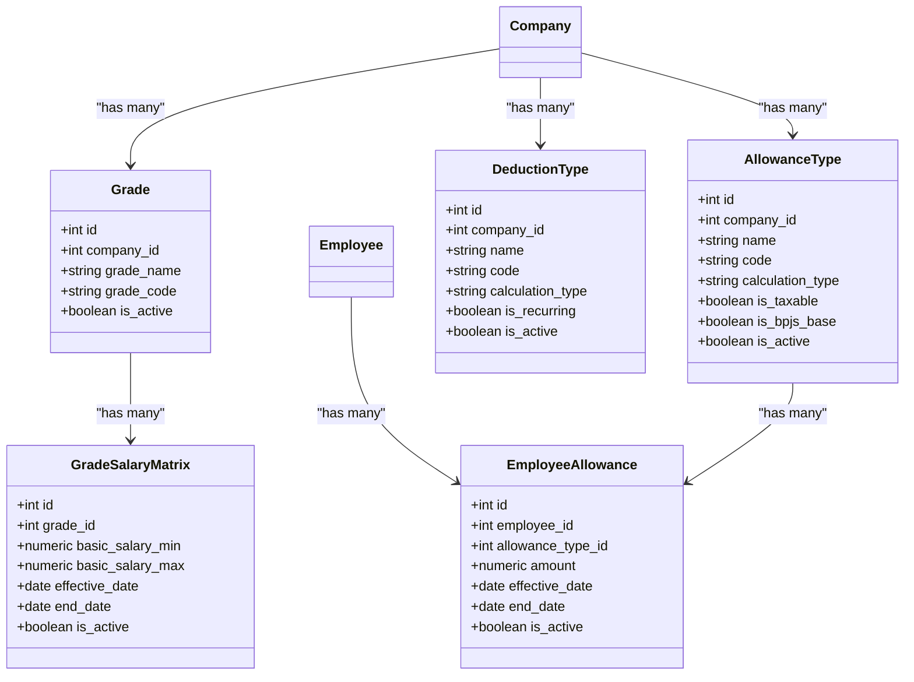

**Diagram sources**
- [app/models/salary.py:21-134](file://app/models/salary.py#L21-L134)

**Section sources**
- [app/models/salary.py:21-134](file://app/models/salary.py#L21-L134)

### Leave Management
- Purpose: Track leave types, employee balances, and requests with approval workflows.
- Key Entities:
  - LeaveType: Types of leave with entitlement and approval requirements.
  - EmployeeLeaveBalance: Annual leave balances per year.
  - LeaveRequest: Leave requests with statuses and approvals.

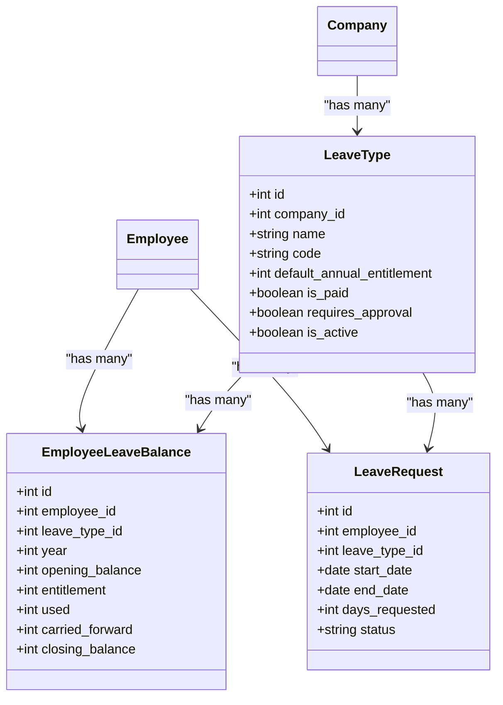

**Diagram sources**
- [app/models/leave.py:19-96](file://app/models/leave.py#L19-L96)

**Section sources**
- [app/models/leave.py:19-96](file://app/models/leave.py#L19-L96)

### BPJS Configuration
- Purpose: Configure BPJS contribution rates and caps for employee and employer.
- Key Entity:
  - BpjsSetting: Contribution rates and caps per BPJS type.

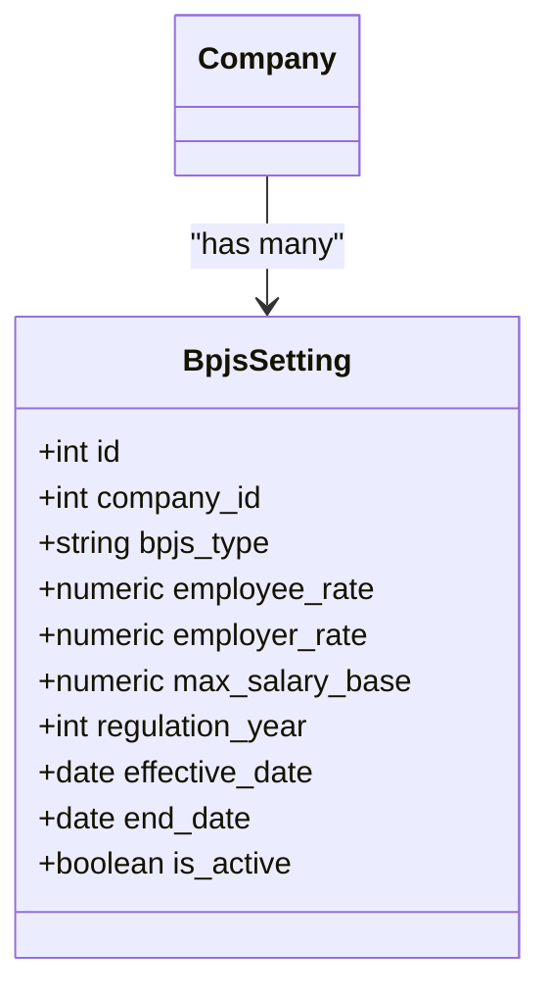

**Diagram sources**
- [app/models/bpjs.py:17-43](file://app/models/bpjs.py#L17-L43)

**Section sources**
- [app/models/bpjs.py:17-43](file://app/models/bpjs.py#L17-L43)

## Dependency Analysis
- External Dependencies: FastAPI, Uvicorn, SQLAlchemy, Alembic, Pydantic, python-jose, passlib, httpx, langchain, openai, python-dotenv.
- Configuration: JWT secret, algorithm, expiration minutes, database URL, debug, and log level are managed via settings.

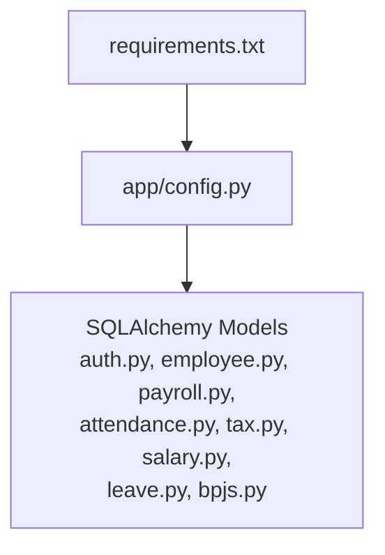

**Diagram sources**
- [requirements.txt:1-14](file://requirements.txt#L1-L14)
- [app/config.py:4-17](file://app/config.py#L4-L17)

**Section sources**
- [requirements.txt:1-14](file://requirements.txt#L1-L14)
- [app/config.py:4-17](file://app/config.py#L4-L17)

## Performance Considerations
- Indexes: Models define indexes on frequently queried columns (e.g., employee code, department, status, payroll period, attendance date).
- Constraints: Check constraints enforce valid enumerations and data ranges, preventing invalid writes and reducing runtime validation overhead.
- Pagination: For large datasets, implement pagination in API responses.
- Caching: Cache company-level settings (e.g., tax, BPJS, overtime) to reduce repeated reads.
- Asynchronous Operations: Offload heavy computations (e.g., payroll run) to background tasks.

[No sources needed since this section provides general guidance]

## Troubleshooting Guide
- Authentication Failures: Verify JWT secret, algorithm, and expiration settings. Ensure clients send Authorization header with bearer token.
- Data Validation Errors: Check constraint violations (enums, numeric ranges) and unique constraints (codes, usernames, emails).
- Database Connectivity: Confirm database URL and connection string in settings.
- Logging: Enable debug mode and appropriate log levels for diagnostics.

**Section sources**
- [app/config.py:4-17](file://app/config.py#L4-L17)
- [app/models/auth.py:128-132](file://app/models/auth.py#L128-L132)
- [app/models/employee.py:119-131](file://app/models/employee.py#L119-L131)
- [app/models/payroll.py:45-61](file://app/models/payroll.py#L45-L61)
- [app/models/attendance.py:72-80](file://app/models/attendance.py#L72-L80)

## Conclusion
This API Reference outlines the Payroll system’s RESTful endpoints and data models across authentication, employee management, payroll processing, attendance tracking, tax management, salary and compensation, leave management, and BPJS configuration. Clients should implement robust authentication using JWT, adhere to request/response schemas, apply rate limiting, and follow security best practices. Use the provided models and constraints to guide API design and validation.

[No sources needed since this section summarizes without analyzing specific files]

## Appendices

### API Versioning Information
- No explicit versioning scheme is defined in the repository. Consider adopting semantic versioning (e.g., v1, v2) and X-API-Version header for future releases.

[No sources needed since this section provides general guidance]

### Rate Limiting
- No built-in rate limiting is present in the repository. Implement rate limiting at the gateway or middleware level (e.g., per IP, per user, per endpoint).

[No sources needed since this section provides general guidance]

### Security Considerations
- Transport Security: Enforce HTTPS/TLS.
- Authentication: Use signed JWT with HS256 and a strong secret key.
- Authorization: Enforce RBAC via roles and permissions.
- Input Sanitization: Validate and sanitize all inputs; rely on model constraints.
- Secrets Management: Store JWT secret and database credentials in environment variables.

**Section sources**
- [app/config.py:6-8](file://app/config.py#L6-L8)

### API Testing Procedures
- Unit Tests: Validate model constraints and business rules.
- Integration Tests: Simulate end-to-end flows for payroll runs, payslip generation, and attendance/overtime updates.
- Load Tests: Assess performance under concurrent requests for payroll computation.
- Security Tests: Verify JWT handling, RBAC enforcement, and SQL injection prevention.

[No sources needed since this section provides general guidance]