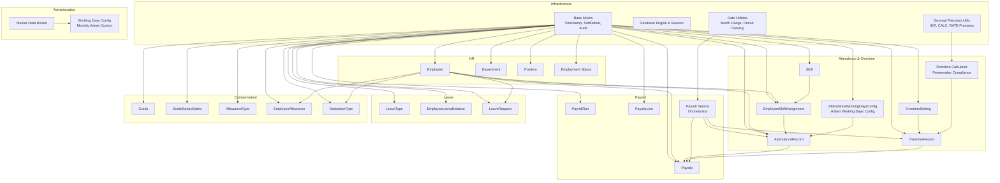
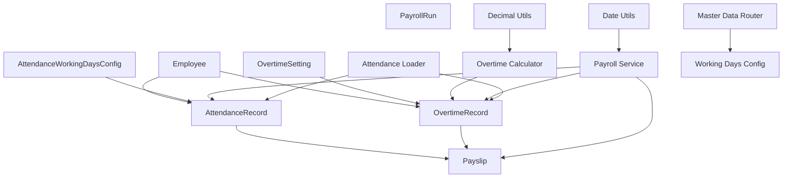
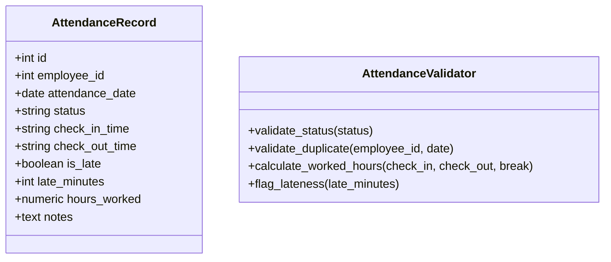
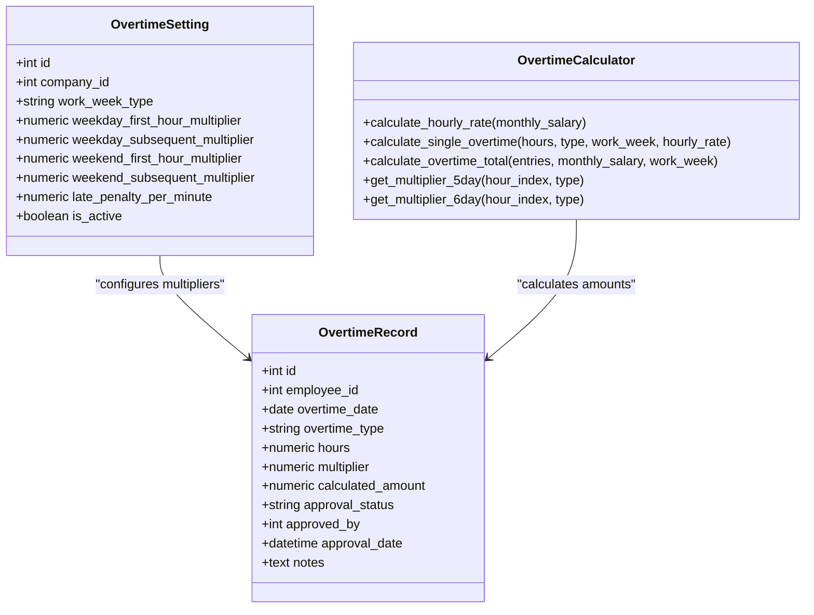
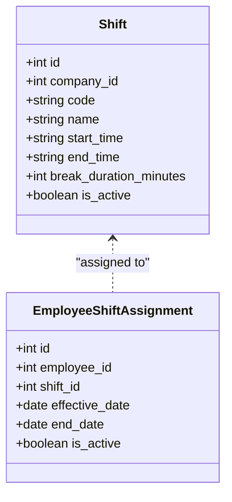
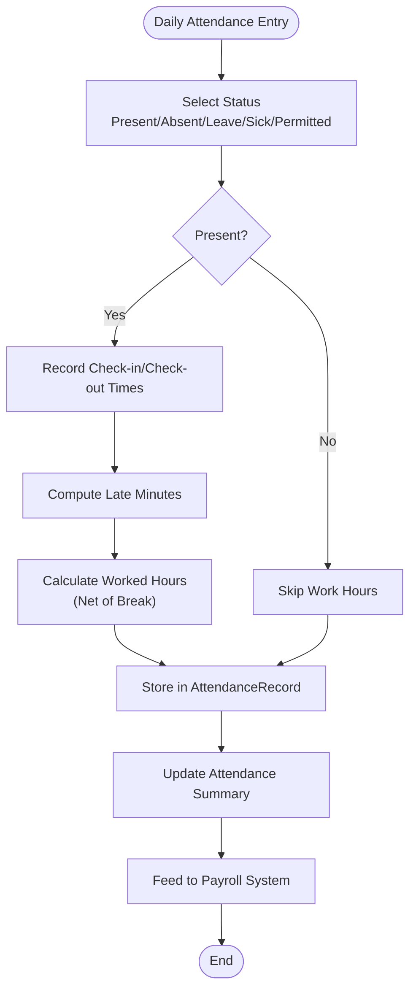
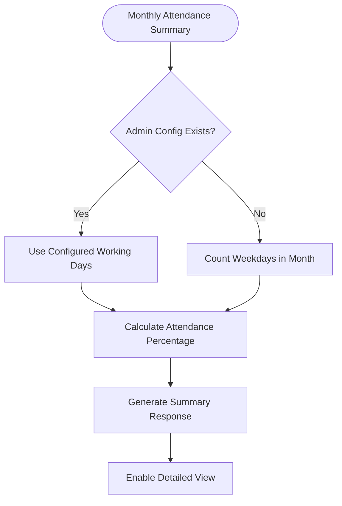
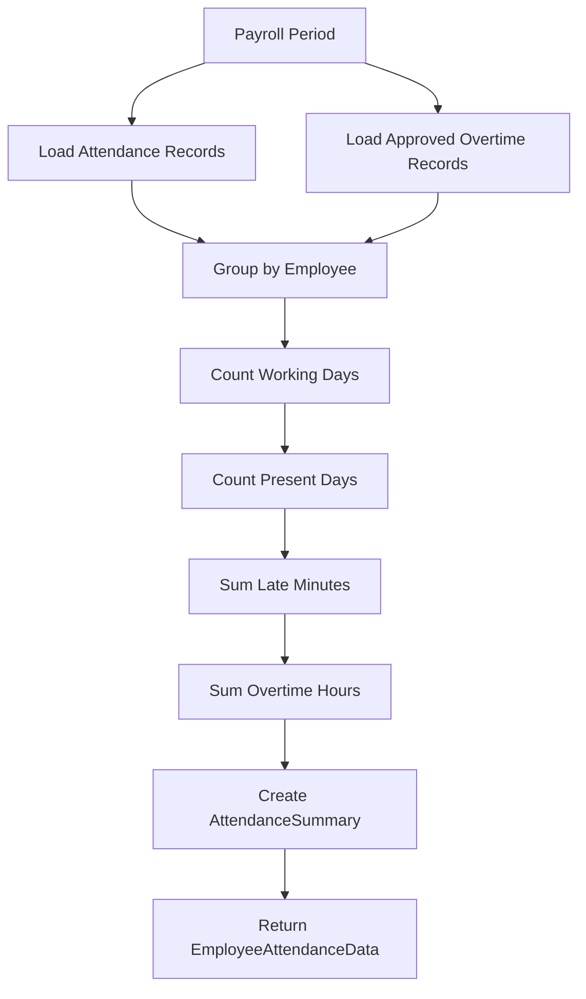
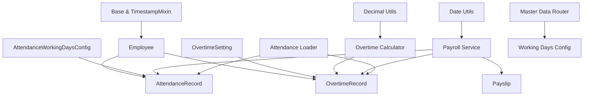

# Attendance & Overtime

<cite>
**Referenced Files in This Document**
- [attendance.py](file://app/models/attendance.py)
- [employee.py](file://app/models/employee.py)
- [payroll.py](file://app/models/payroll.py)
- [leave.py](file://app/models/leave.py)
- [salary.py](file://app/models/salary.py)
- [base.py](file://app/models/base.py)
- [database.py](file://app/database.py)
- [overtime.py](file://app/calculations/overtime.py)
- [attendance.py](file://app/routers/attendance.py)
- [master_data.py](file://app/routers/master_data.py)
- [schemas/attendance.py](file://app/schemas/attendance.py)
- [services/attendance_loader.py](file://app/services/attendance_loader.py)
- [utils/date_utils.py](file://app/utils/date_utils.py)
- [utils/decimal_utils.py](file://app/utils/decimal_utils.py)
- [services/payroll_service.py](file://app/services/payroll_service.py)
- [page.tsx](file://frontend/src/app/(dashboard)/attendance/page.tsx)
- [working-days/page.tsx](file://frontend/src/app/(dashboard)/settings/working-days/page.tsx)
- [008_attendance_working_days_config.sql](file://migrations/008_attendance_working_days_config.sql)
</cite>

## Update Summary
**Changes Made**
- Added comprehensive monthly attendance summary system with detailed modal views for employee attendance details
- Integrated administrative working days configuration allowing custom working day counts per month
- Enhanced overtime management with monthly summaries and detailed overtime tracking
- Implemented comprehensive frontend UI with attendance and overtime tabs, modals, and detailed views
- Added working days configuration management interface for administrators

## Table of Contents
1. [Introduction](#introduction)
2. [Project Structure](#project-structure)
3. [Core Components](#core-components)
4. [Architecture Overview](#architecture-overview)
5. [Detailed Component Analysis](#detailed-component-analysis)
6. [Monthly Attendance Summary System](#monthly-attendance-summary-system)
7. [Administrative Working Days Configuration](#administrative-working-days-configuration)
8. [Enhanced Overtime Management](#enhanced-overtime-management)
9. [Frontend Implementation](#frontend-implementation)
10. [Overtime Calculation Engine](#overtime-calculator-engine)
11. [Attendance Data Loading](#attendance-data-loading)
12. [API Integration](#api-integration)
13. [Decimal Precision Management](#decimal-precision-management)
14. [Payroll Integration](#payroll-integration)
15. [Dependency Analysis](#dependency-analysis)
16. [Performance Considerations](#performance-considerations)
17. [Troubleshooting Guide](#troubleshooting-guide)
18. [Conclusion](#conclusion)
19. [Appendices](#appendices)

## Introduction
This document explains the complete attendance and overtime management system implemented in the Payroll & HRIS application. The system provides comprehensive tracking of employee attendance, automated overtime calculation compliant with Indonesian labor regulations (Permenaker), shift configuration, work hour computation, and seamless integration with payroll processing, leave management, and productivity tracking. The system adheres to Indonesian timekeeping regulations and supports both 5-day and 6-day work week configurations. The latest enhancements include comprehensive monthly attendance summaries with detailed modal views, administrative working days configuration, and enhanced overtime management with monthly summaries.

## Project Structure
The system is built with SQLAlchemy models organized by domain, featuring a robust overtime calculation engine, comprehensive attendance tracking, and enhanced administrative controls:

- **Attendance and Overtime**: Shift definitions, employee shift assignments, attendance records, overtime records with Permenaker-compliant calculations, company-wide overtime settings, and administrative working days configuration
- **Employees and Organization**: Departments, positions, employment statuses, and comprehensive employee master data
- **Payroll**: Payroll runs, payslips, and detailed payslip line items with attendance-derived metrics
- **Leave**: Leave types, balances, and leave requests with impact on attendance status
- **Salary**: Grades, salary matrix, allowance types, employee allowances, and deduction types
- **Infrastructure**: Base mixins, database engine/session configuration, and utility functions
- **Administration**: Working days configuration management for customizing monthly working day counts

**Diagram sources**
- [base.py:18-57](file://app/models/base.py#L18-L57)
- [employee.py:76-142](file://app/models/employee.py#L76-L142)
- [attendance.py:21-157](file://app/models/attendance.py#L21-L157)
- [payroll.py:19-197](file://app/models/payroll.py#L19-L197)
- [leave.py:19-97](file://app/models/leave.py#L19-L97)
- [salary.py:21-248](file://app/models/salary.py#L21-L248)
- [database.py:17-82](file://app/database.py#L17-L82)
- [overtime.py:1-200](file://app/calculations/overtime.py#L1-L200)
- [services/attendance_loader.py:1-104](file://app/services/attendance_loader.py#L1-L104)
- [utils/decimal_utils.py:1-33](file://app/utils/decimal_utils.py#L1-L33)
- [utils/date_utils.py:1-31](file://app/utils/date_utils.py#L1-L31)
- [master_data.py:290-372](file://app/routers/master_data.py#L290-L372)

**Section sources**
- [base.py:18-57](file://app/models/base.py#L18-L57)
- [database.py:17-82](file://app/database.py#L17-L82)

## Core Components
This section introduces the central models for attendance and overtime and their roles in the system, enhanced with the new comprehensive monthly summary system and administrative controls.

### Attendance Models
- **Shift**: Defines company work shifts with start/end times, break duration, and activity flag
- **EmployeeShiftAssignment**: Assigns a shift to an employee with effective and end dates
- **AttendanceRecord**: Captures daily attendance status, check-in/out times, lateness flags, minutes late, computed worked hours, and notes
- **AttendanceWorkingDaysConfig**: Administrative configuration for monthly working days, allowing custom working day counts per company per month

### Overtime Models
- **OvertimeRecord**: Stores overtime hours, type (weekday/weekend/holiday), multiplier, calculated amount, approval metadata, and notes
- **OvertimeSetting**: Company-wide overtime configuration including weekly work type, hourly multipliers, and optional late penalty per minute

### Overtime Calculation Engine
- **Overtime Calculator**: Pure functions implementing Permenaker regulations with hour-by-hour multipliers
- **Decimal Precision Utils**: Specialized rounding for IDR amounts, calculation precision, and rate calculations
- **Attendance Loader**: Efficient data loading and aggregation for payroll processing

Key constraints and indexes ensure data integrity and efficient queries:
- AttendanceRecord validates status values and enforces uniqueness per employee-date
- OvertimeRecord validates type and approval status, and indexes employee-date combinations
- OvertimeSetting validates weekly work type and ensures single company setting
- AttendanceWorkingDaysConfig validates month and working days ranges with unique constraints

**Section sources**
- [attendance.py:21-157](file://app/models/attendance.py#L21-L157)
- [overtime.py:1-200](file://app/calculations/overtime.py#L1-L200)
- [services/attendance_loader.py:1-104](file://app/services/attendance_loader.py#L1-L104)

## Architecture Overview
The attendance and overtime subsystem integrates seamlessly with payroll, leave, and compensation domains. The new comprehensive system ensures compliance with Indonesian labor regulations while maintaining performance and accuracy, with enhanced administrative controls for working days configuration.

**Diagram sources**
- [attendance.py:56-157](file://app/models/attendance.py#L56-L157)
- [payroll.py:64-102](file://app/models/payroll.py#L64-L102)
- [overtime.py:34-200](file://app/calculations/overtime.py#L34-L200)
- [services/attendance_loader.py:35-104](file://app/services/attendance_loader.py#L35-L104)
- [utils/decimal_utils.py:11-33](file://app/utils/decimal_utils.py#L11-L33)
- [master_data.py:290-372](file://app/routers/master_data.py#L290-L372)

## Detailed Component Analysis

### Attendance Tracking
AttendanceRecord captures daily presence and work timing with comprehensive validation and indexing for optimal performance.

**Diagram sources**
- [attendance.py:56-80](file://app/models/attendance.py#L56-L80)

Validation rules and business logic:
- Status constrained to PRESENT, ABSENT, LEAVE, SICK, PERMITTED
- Unique constraint prevents duplicate entries per employee-date
- Indexes optimize lookups by employee-date and by date-status
- Clock-in/clock-out endpoints handle real-time time tracking

Example scenarios:
- Present day with check-in/out times and computed worked hours
- Leave day recorded with status LEAVE and zero worked hours
- Absent day with status ABSENT and no check-in/out

**Section sources**
- [attendance.py:72-80](file://app/models/attendance.py#L72-L80)
- [routers/attendance.py:28-195](file://app/routers/attendance.py#L28-L195)

### Overtime Management System
The system implements comprehensive overtime tracking with Permenaker-compliant calculations and approval workflows.

**Diagram sources**
- [attendance.py:83-133](file://app/models/attendance.py#L83-L133)
- [overtime.py:26-200](file://app/calculations/overtime.py#L26-L200)

**Section sources**
- [attendance.py:100-133](file://app/models/attendance.py#L100-L133)
- [overtime.py:34-200](file://app/calculations/overtime.py#L34-L200)

### Shift Configuration and Scheduling
Shift definitions enable flexible work schedule management with assignment tracking.

**Diagram sources**
- [attendance.py:21-54](file://app/models/attendance.py#L21-L54)

**Section sources**
- [attendance.py:21-54](file://app/models/attendance.py#L21-L54)

### Work Hour Computation
Work hour computation captures attendance-derived metrics for payroll processing.

**Diagram sources**
- [attendance.py:64-70](file://app/models/attendance.py#L64-L70)

**Section sources**
- [attendance.py:64-70](file://app/models/attendance.py#L64-L70)

### Attendance Validation Rules
The system enforces strict validation for attendance and overtime records to maintain data integrity.

- **AttendanceRecord**:
  - Status must be one of PRESENT, ABSENT, LEAVE, SICK, PERMITTED
  - Unique constraint per employee-date prevents duplication
  - Indexes on employee-date and date-status enable fast reporting

- **OvertimeRecord**:
  - Type must be WEEKDAY, WEEKEND, or HOLIDAY
  - Approval status must be PENDING, APPROVED, or REJECTED
  - Index on employee-date supports efficient overtime queries

- **OvertimeSetting**:
  - Weekly work week type must be 5_DAY or 6_DAY
  - Single company-wide setting enforced via unique constraint

- **AttendanceWorkingDaysConfig**:
  - Month must be between 1-12
  - Working days must be between 0-31
  - Unique constraint prevents duplicate configurations per company-month

**Section sources**
- [attendance.py:72-157](file://app/models/attendance.py#L72-L157)

## Monthly Attendance Summary System
The system now provides comprehensive monthly attendance summaries with detailed modal views for in-depth analysis.

### Monthly Summary Features
- **Total Working Days**: Calculated either from administrative configuration or default weekday counting
- **Attendance Categories**: Present, Absent, Sick, Leave, and Permitted days
- **Late Minutes Tracking**: Aggregated lateness penalties across the month
- **Percentage Calculation**: Attendance percentage based on total working days
- **Detailed Modal Views**: Clickable employee rows that open detailed attendance records

### Working Days Calculation Logic
The system prioritizes administrative configuration over default calculation:

**Diagram sources**
- [attendance.py:141-159](file://app/models/attendance.py#L141-L159)
- [routers/attendance.py:141-159](file://app/routers/attendance.py#L141-159)

**Section sources**
- [routers/attendance.py:119-219](file://app/routers/attendance.py#L119-L219)
- [page.tsx:126-171](file://frontend/src/app/(dashboard)/attendance/page.tsx#L126-L171)

## Administrative Working Days Configuration
The system includes comprehensive administrative controls for managing monthly working days.

### Configuration Management
- **Custom Working Days**: Administrators can override default weekday-based calculation
- **Monthly Control**: Separate configuration per company per month
- **Validation**: Ensures month (1-12) and working days (0-31) ranges
- **Unique Constraints**: Prevents duplicate configurations for the same company-month combination

### Frontend Interface
The working days configuration page provides:
- Year selection dropdown
- Monthly table with editable working days fields
- Real-time validation and error handling
- Save and delete functionality
- Informational notes explaining the configuration purpose

**Section sources**
- [attendance.py:137-157](file://app/models/attendance.py#L137-L157)
- [master_data.py:293-372](file://app/routers/master_data.py#L293-L372)
- [working-days/page.tsx:32-233](file://frontend/src/app/(dashboard)/settings/working-days/page.tsx#L32-L233)

## Enhanced Overtime Management
The system now provides comprehensive monthly overtime summaries with detailed tracking and approval workflows.

### Monthly Overtime Summary
- **Workday vs Non-Workday**: Automatic grouping of overtime records
- **Daily and Hourly Totals**: Separate tracking for weekday and weekend/holiday hours
- **Total Calculation**: Combined totals for comprehensive reporting
- **Approval Status Tracking**: Visual indicators for pending, approved, and rejected records

### Detailed Overtime Views
- **Modal Interface**: Clickable rows open detailed overtime records
- **Type Classification**: Clear categorization of overtime types (Weekday, Weekend, Holiday)
- **Approval Workflow**: Direct approval/rejection from the detailed view
- **Status Indicators**: Color-coded badges for different approval states

**Section sources**
- [routers/attendance.py:337-409](file://app/routers/attendance.py#L337-L409)
- [page.tsx:191-285](file://frontend/src/app/(dashboard)/attendance/page.tsx#L191-L285)

## Frontend Implementation
The frontend provides comprehensive user interfaces for attendance and overtime management with modern React patterns.

### Attendance Page Features
- **Tabbed Interface**: Separate tabs for attendance and overtime management
- **Filter Controls**: Month and year selectors with dynamic options
- **Summary Cards**: Key metrics display for quick overview
- **Interactive Tables**: Clickable rows that open detailed modal views
- **Action Buttons**: Approve, reject, and manage records directly from tables
- **Import/Export**: Excel integration for bulk operations

### Modal Components
- **Attendance Detail Modal**: Shows complete attendance history for selected employee
- **Overtime Detail Modal**: Displays detailed overtime records with approval controls
- **Add Overtime Modal**: Form for submitting new overtime requests
- **Responsive Design**: Mobile-friendly layouts with appropriate spacing

### State Management
- **React Hooks**: Modern state management with useState and useEffect
- **Loading States**: Comprehensive loading indicators for all async operations
- **Error Handling**: User-friendly error messages and retry mechanisms
- **Memoization**: Optimized calculations with useMemo for performance

**Section sources**
- [page.tsx:126-1151](file://frontend/src/app/(dashboard)/attendance/page.tsx#L126-L1151)

## Overtime Calculator Engine
The new calculation engine implements Permenaker regulations with precise hour-by-hour multipliers.

### Permenaker Compliance
The calculator follows Indonesian labor regulations (PP 35/2021, Kepmenaker 102/MEN/VI/2004) with standardized hourly rate calculation.

**Hourly Rate Calculation**: 1/173 × monthly_salary (standard for all work week types)

### Multiplier Structures

#### 5-Day Work Week
- **Weekday**: 1st hour = 1.5×, subsequent hours = 2×
- **Weekend/Holiday**: 1-8 hours = 2×, 9th hour = 3×, 10th+ hours = 4×

#### 6-Day Work Week
- **Weekday**: 1st hour = 1.5×, subsequent hours = 2×
- **Saturday**: 1-5 hours = 2×, 6th hour = 3×, 7th+ hours = 4×
- **Sunday/Holiday**: 1-7 hours = 2×, 8th hour = 3×, 9th+ hours = 4×

### Calculation Precision
- **Intermediate calculations**: 2 decimal places for accuracy
- **Final amounts**: Rounded to nearest Rupiah (0 decimal places)
- **Rate calculations**: 4 decimal places for precision

**Section sources**
- [overtime.py:1-200](file://app/calculations/overtime.py#L1-L200)
- [utils/decimal_utils.py:11-33](file://app/utils/decimal_utils.py#L11-L33)

## Attendance Data Loading
The AttendanceLoader efficiently processes attendance and overtime data for payroll periods.

### Data Aggregation
The loader processes all records for a given period and creates summary statistics:

**Diagram sources**
- [services/attendance_loader.py:35-104](file://app/services/attendance_loader.py#L35-L104)

### Performance Optimization
- Single database query for each record type
- In-memory grouping for O(1) lookup performance
- Efficient decimal conversion and aggregation
- Support for large-scale payroll processing

**Section sources**
- [services/attendance_loader.py:16-104](file://app/services/attendance_loader.py#L16-L104)

## API Integration
The attendance and overtime system provides comprehensive RESTful APIs for real-time management.

### Attendance Endpoints
- **POST /attendance**: Create attendance record with duplicate prevention
- **GET /attendance**: List attendance records with filtering options
- **GET /attendance/summary**: Monthly attendance summary by employee with working days configuration
- **POST /attendance/clock-in**: Employee clock-in with automatic record creation
- **POST /attendance/clock-out**: Employee clock-out with validation

### Overtime Endpoints
- **POST /attendance/overtime**: Submit overtime work entry
- **GET /attendance/overtime**: List overtime records with approval filtering
- **GET /attendance/overtime/summary**: Monthly overtime summary by employee with workday grouping
- **PATCH /attendance/overtime/{id}/approve**: Approve or reject overtime requests

### Master Data Endpoints
- **GET /master-data/working-days**: List working days configurations
- **POST /master-data/working-days**: Create or update working days configuration
- **PATCH /master-data/working-days/{config_id}**: Update working days configuration
- **DELETE /master-data/working-days/{config_id}**: Delete working days configuration

### Request/Response Validation
All endpoints use Pydantic schemas for input validation and structured responses, ensuring data integrity and consistent API behavior.

**Section sources**
- [routers/attendance.py:1-487](file://app/routers/attendance.py#L1-L487)
- [routers/master_data.py:293-372](file://app/routers/master_data.py#L293-L372)
- [schemas/attendance.py:1-138](file://app/schemas/attendance.py#L1-L138)

## Decimal Precision Management
Specialized utilities ensure accurate financial calculations compliant with Indonesian Rupiah standards.

### Precision Levels
- **IDR_PRECISION**: 0 decimal places for final amounts (nearest Rupiah)
- **CALC_PRECISION**: 2 decimal places for intermediate calculations
- **RATE_PRECISION**: 4 decimal places for rate calculations

### Rounding Strategies
- **round_money()**: Uses ROUND_HALF_UP for fair rounding to Rupiah
- **round_calc()**: Maintains calculation accuracy during intermediate steps
- **to_decimal()**: Safe conversion avoiding floating-point errors

**Section sources**
- [utils/decimal_utils.py:1-33](file://app/utils/decimal_utils.py#L1-L33)

## Payroll Integration
The system seamlessly integrates attendance and overtime data into the payroll processing pipeline.

### Payroll Processing Flow
1. **Configuration Loading**: Load company settings and employee data
2. **Attendance Loading**: Fetch attendance and approved overtime for the period
3. **Individual Calculation**: Process each employee's components
4. **Payslip Generation**: Create payslips with attendance-derived metrics
5. **Bulk Insertion**: Efficient database insertion of all payslips

### Attendance Metrics in Payroll
- **Working Days**: Total days worked during period (from working days configuration)
- **Late Minutes**: Accumulated lateness penalties
- **Overtime Hours**: Approved overtime hours for compensation
- **Leave/Sick Days**: Time off impact on payroll calculations

**Section sources**
- [services/payroll_service.py:136-200](file://app/services/payroll_service.py#L136-L200)
- [payroll.py:64-102](file://app/models/payroll.py#L64-L102)

## Dependency Analysis
The models share common infrastructure via Base and TimestampMixin. The new comprehensive system adds specialized dependencies while maintaining clean separation of concerns.

**Diagram sources**
- [base.py:18-33](file://app/models/base.py#L18-L33)
- [employee.py:76-118](file://app/models/employee.py#L76-L118)
- [attendance.py:56-110](file://app/models/attendance.py#L56-L110)
- [payroll.py:64-102](file://app/models/payroll.py#L64-L102)
- [overtime.py:34-200](file://app/calculations/overtime.py#L34-L200)
- [services/attendance_loader.py:35-104](file://app/services/attendance_loader.py#L35-L104)
- [utils/decimal_utils.py:11-33](file://app/utils/decimal_utils.py#L11-L33)
- [utils/date_utils.py:5-31](file://app/utils/date_utils.py#L5-L31)
- [master_data.py:290-372](file://app/routers/master_data.py#L290-L372)

**Section sources**
- [base.py:18-33](file://app/models/base.py#L18-L33)
- [database.py:17-82](file://app/database.py#L17-L82)

## Performance Considerations
- **Indexing Strategy**: Optimized indexes on attendance_employee_date, attendance_date_status, and overtime_employee_date
- **Batch Processing**: AttendanceLoader uses single queries with in-memory grouping for efficiency
- **Precision Management**: Specialized decimal utilities prevent floating-point errors and ensure accurate calculations
- **Memory Efficiency**: Dataclass-based structures minimize memory overhead during payroll processing
- **Database Optimization**: WAL mode and foreign key enforcement for concurrent access
- **Frontend Optimization**: React hooks and memoization for efficient UI rendering

## Troubleshooting Guide
Common issues and resolutions:

### Attendance Issues
- **Duplicate attendance record**: Check uniqueness constraint on employee-date combination and resolve duplicates before reprocessing
- **Invalid status value**: Ensure status is one of PRESENT, ABSENT, LEAVE, SICK, PERMITTED
- **Clock-in/clock-out conflicts**: Verify employee has proper clock-in status before clock-out

### Overtime Issues
- **Invalid overtime type**: Verify type is WEEKDAY, WEEKEND, or HOLIDAY
- **Unapproved overtime**: Confirm approval status is APPROVED before including in payroll
- **Calculation errors**: Check monthly salary is positive and work week type is valid

### Working Days Configuration Issues
- **Invalid month/year**: Ensure month is between 1-12 and year is valid
- **Invalid working days**: Verify working days is between 0-31
- **Duplicate configuration**: Check unique constraint for company-year-month combination

### Calculation Issues
- **Precision errors**: Verify decimal utilities are used consistently for all calculations
- **Permenaker compliance**: Ensure multipliers match the specified work week configuration
- **Data loading failures**: Check AttendanceLoader returns expected employee IDs and data completeness

**Section sources**
- [attendance.py:72-157](file://app/models/attendance.py#L72-L157)
- [overtime.py:129-140](file://app/calculations/overtime.py#L129-L140)
- [services/attendance_loader.py:35-104](file://app/services/attendance_loader.py#L35-L104)

## Conclusion
The attendance and overtime subsystem provides a comprehensive, Permenaker-compliant solution for tracking employee attendance and calculating overtime compensation. The system features real-time clock-in/clock-out capabilities, sophisticated calculation engine, efficient data loading for payroll processing, and seamless integration with the broader payroll ecosystem. The latest enhancements include comprehensive monthly attendance summaries with detailed modal views, administrative working days configuration for custom working day counts, and enhanced overtime management with monthly summaries. The addition of specialized decimal precision utilities and performance optimizations ensures accurate financial calculations while maintaining system scalability. The comprehensive frontend implementation provides intuitive user interfaces for both operational staff and administrators.

## Appendices

### Attendance Entry Example
- **Employee**: ID X
- **Date**: 2025-06-01
- **Status**: PRESENT
- **Check-in**: 08:15:00
- **Check-out**: 17:00:00
- **Late minutes**: 15
- **Hours worked**: 8.25
- **Notes**: Standard day

### Overtime Calculation Example
- **Employee**: ID X
- **Date**: 2025-06-01
- **Type**: WEEKDAY
- **Hours**: 3.00
- **Multipliers**: 1.5× (1st hour), 2× (subsequent hours)
- **Calculated amount**: 4.50 (first hour) + 4.00 (2nd hour) + 4.00 (3rd hour) = 12.50 Rupiah
- **Approval status**: APPROVED

### Monthly Attendance Summary Example
- **Employee**: ID X
- **Month**: June 2025
- **Total Working Days**: 22 (configured)
- **Present Days**: 20
- **Absent Days**: 1
- **Late Minutes**: 45
- **Attendance Percentage**: 95.45%

### Working Days Configuration Example
- **Company**: ABC Corporation
- **Year**: 2025
- **Month**: June
- **Working Days**: 22 (custom override)
- **Default**: 22 weekdays (if no configuration)

### Overtime Summary Example
- **Employee**: ID X
- **Month**: June 2025
- **Weekday Days**: 3
- **Weekday Hours**: 6.50
- **Weekend/Holiday Days**: 2
- **Weekend/Holiday Hours**: 4.00
- **Total Days**: 5
- **Total Hours**: 10.50

### Shift Configuration Example
- **Shift code**: DS001
- **Name**: Day Shift
- **Start time**: 08:00
- **End time**: 17:00
- **Break**: 60 minutes
- **Active**: true
- **Assignment**: Employee X effective 2025-06-01

### Payroll Integration Example
- **Payroll Run**: June 2025
- **Attendance metrics**: 22 working days, 45 late minutes, 6 overtime hours
- **Overtime earnings**: 12.50 Rupiah
- **Late penalties**: 0.75 Rupiah (if applicable)
- **Total overtime amount**: 12.50 Rupiah

### Frontend Usage Example
- **Attendance Tab**: Monthly summary with clickable employee rows
- **Overtime Tab**: Monthly summary with workday/non-workday grouping
- **Detail Modals**: Comprehensive views for individual employee records
- **Approval Workflow**: Direct approval/rejection from detailed views
- **Import/Export**: Excel integration for bulk operations