# Attendance & Overtime

<cite>
**Referenced Files in This Document**
- [attendance.py](file://app/models/attendance.py)
- [employee.py](file://app/models/employee.py)
- [payroll.py](file://app/models/payroll.py)
- [leave.py](file://app/models/leave.py)
- [salary.py](file://app/models/salary.py)
- [base.py](file://app/models/base.py)
- [database.py](file://app/database.py)
</cite>

## Table of Contents
1. [Introduction](#introduction)
2. [Project Structure](#project-structure)
3. [Core Components](#core-components)
4. [Architecture Overview](#architecture-overview)
5. [Detailed Component Analysis](#detailed-component-analysis)
6. [Dependency Analysis](#dependency-analysis)
7. [Performance Considerations](#performance-considerations)
8. [Troubleshooting Guide](#troubleshooting-guide)
9. [Conclusion](#conclusion)
10. [Appendices](#appendices)

## Introduction
This document explains the attendance and overtime management system implemented in the Payroll & HRIS application. It covers attendance tracking, shift configuration, work hour computation, overtime calculation, and validation rules. It also describes how attendance integrates with payroll processing, leave management, and productivity tracking, and outlines attendance policies aligned with Indonesian timekeeping regulations.

## Project Structure
The system is built with SQLAlchemy models organized by domain:
- Attendance and overtime: shifts, employee shift assignments, attendance records, overtime records, and overtime settings
- Employees and organization: departments, positions, employment statuses, and employee master data
- Payroll: payroll runs, payslips, and payslip line items
- Leave: leave types, balances, and leave requests
- Salary: grades, salary matrix, allowance types, employee allowances, and deduction types
- Infrastructure: base mixins and database engine/session configuration

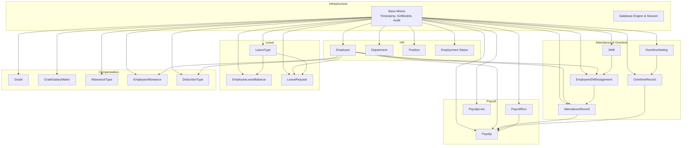

**Diagram sources**
- [base.py:18-57](file://app/models/base.py#L18-L57)
- [employee.py:76-132](file://app/models/employee.py#L76-L132)
- [attendance.py:21-134](file://app/models/attendance.py#L21-L134)
- [payroll.py:19-124](file://app/models/payroll.py#L19-L124)
- [leave.py:19-97](file://app/models/leave.py#L19-L97)
- [salary.py:21-135](file://app/models/salary.py#L21-L135)
- [database.py:17-63](file://app/database.py#L17-L63)

**Section sources**
- [base.py:18-57](file://app/models/base.py#L18-L57)
- [database.py:17-63](file://app/database.py#L17-L63)

## Core Components
This section introduces the central models for attendance and overtime and their roles in the system.

- Shift: Defines company work shifts with start/end times, break duration, and activity flag.
- EmployeeShiftAssignment: Assigns a shift to an employee with effective and end dates.
- AttendanceRecord: Captures daily attendance status, check-in/out times, lateness flags, minutes late, computed worked hours, and notes.
- OvertimeRecord: Stores overtime hours, type (weekday/weekend/holiday), multiplier, calculated amount, approval metadata, and notes.
- OvertimeSetting: Company-wide overtime configuration including weekly work type, hourly multipliers, and optional late penalty per minute.

Key constraints and indexes ensure data integrity and efficient queries:
- AttendanceRecord validates status values and enforces uniqueness per employee-date.
- OvertimeRecord validates type and approval status, and indexes employee-date combinations.
- OvertimeSetting validates weekly work type and ensures single company setting.

**Section sources**
- [attendance.py:21-134](file://app/models/attendance.py#L21-L134)

## Architecture Overview
The attendance and overtime subsystem integrates with payroll, leave, and compensation domains. Attendance data feeds into payslips, while overtime records contribute to earnings and tax calculations. Leave requests impact attendance status and workday counts.

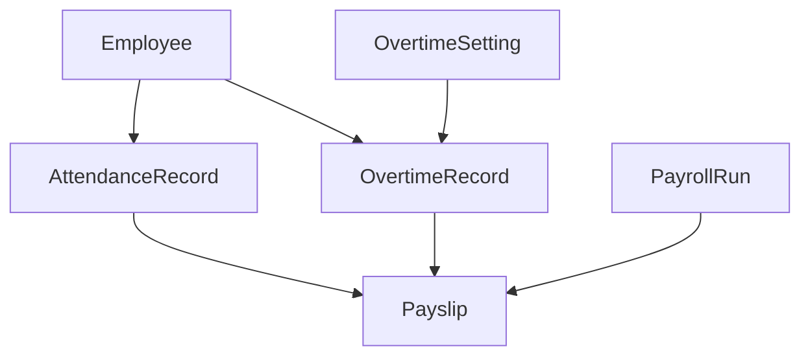

**Diagram sources**
- [attendance.py:56-110](file://app/models/attendance.py#L56-L110)
- [payroll.py:64-94](file://app/models/payroll.py#L64-L94)

## Detailed Component Analysis

### Attendance Tracking
AttendanceRecord captures daily presence and work timing. It supports five statuses: present, absent, leave, sick, and permitted. The model computes whether an employee was late and accumulates minutes late and worked hours.

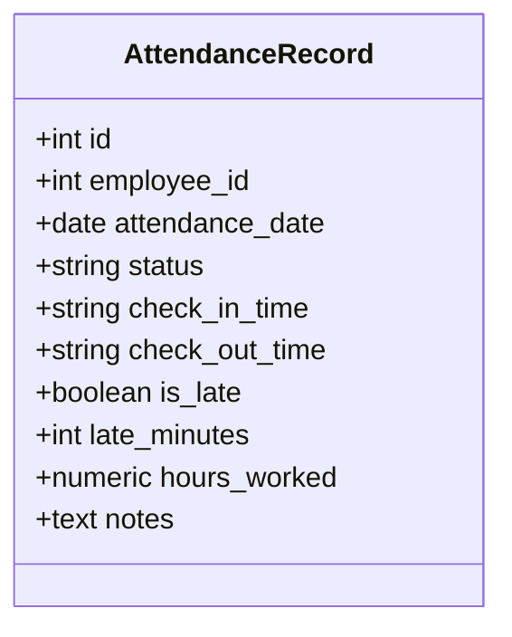

**Diagram sources**
- [attendance.py:56-80](file://app/models/attendance.py#L56-L80)

Validation rules:
- Status constrained to predefined values.
- Unique constraint prevents duplicate entries per employee-date.
- Indexes optimize lookups by employee-date and by date-status.

Example scenarios:
- Present day with check-in/out times and computed worked hours.
- Leave day recorded with status LEAVE and zero worked hours.
- Absent day with status ABSENT and no check-in/out.

**Section sources**
- [attendance.py:72-80](file://app/models/attendance.py#L72-L80)

### Overtime Calculation Methods
OvertimeRecord stores hours, type, and multiplier. OvertimeSetting defines company-wide multipliers for weekday and weekend hours, and the weekly work week type (5-day or 6-day). Optional late penalty per minute can be configured.

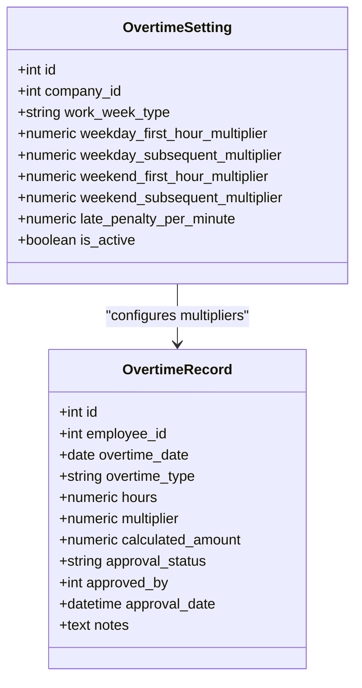

**Diagram sources**
- [attendance.py:83-110](file://app/models/attendance.py#L83-L110)
- [attendance.py:113-133](file://app/models/attendance.py#L113-L133)

Calculation logic outline:
- Determine overtime type (weekday/weekend/holiday) based on the overtime_date.
- Select appropriate first-hour and subsequent multipliers from OvertimeSetting.
- Compute calculated_amount = hours × multiplier.
- Approval workflow: PENDING → APPROVED/REJECTED with audit fields.

Approval workflow sequence:

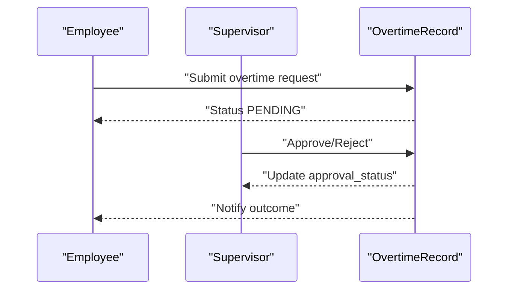

**Diagram sources**
- [attendance.py:95-98](file://app/models/attendance.py#L95-L98)

**Section sources**
- [attendance.py:100-110](file://app/models/attendance.py#L100-L110)
- [attendance.py:118-126](file://app/models/attendance.py#L118-L126)

### Shift Configuration and Scheduling
Shift defines company work shifts with code, name, start/end times, and break duration. EmployeeShiftAssignment links employees to shifts with effective and end dates, enabling historical tracking.

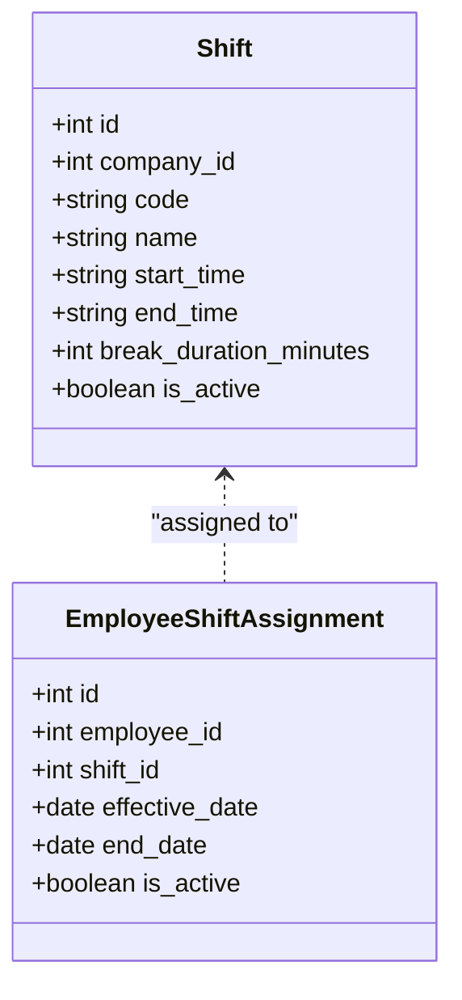

**Diagram sources**
- [attendance.py:21-40](file://app/models/attendance.py#L21-L40)
- [attendance.py:43-54](file://app/models/attendance.py#L43-L54)

Shift scheduling example:
- An employee is assigned to a day shift with a 60-minute break.
- Effective date starts today and remains until a future end_date.

**Section sources**
- [attendance.py:38-40](file://app/models/attendance.py#L38-L40)
- [attendance.py:51-53](file://app/models/attendance.py#L51-L53)

### Work Hour Computation
Work hour computation is captured in AttendanceRecord.hours_worked. The model flags lateness and tracks late minutes, enabling productivity and compliance reporting.

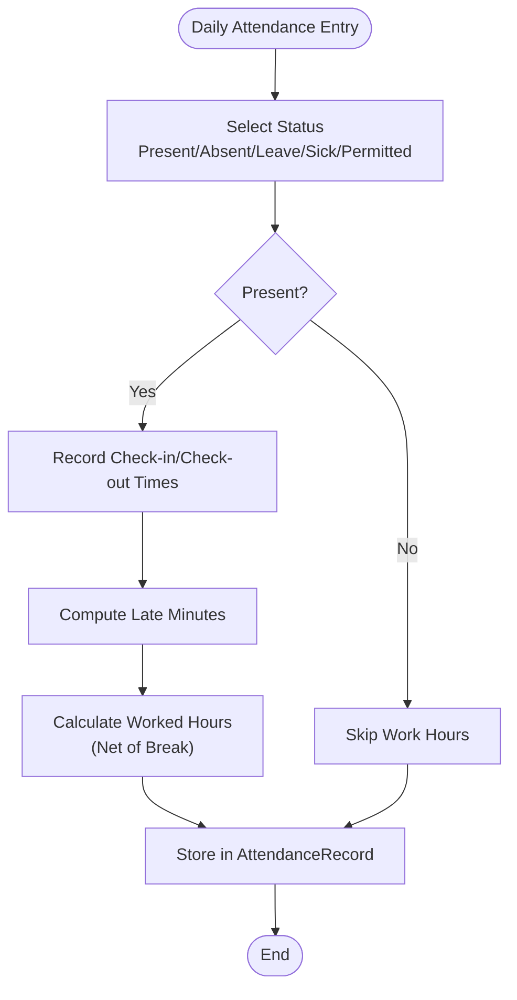

**Diagram sources**
- [attendance.py:64-70](file://app/models/attendance.py#L64-L70)

**Section sources**
- [attendance.py:67-70](file://app/models/attendance.py#L67-L70)

### Attendance Validation Rules
The system enforces strict validation for attendance records and overtime records to maintain data integrity and regulatory compliance.

- AttendanceRecord:
  - Status must be one of PRESENT, ABSENT, LEAVE, SICK, PERMITTED.
  - Unique constraint per employee-date prevents duplication.
  - Indexes on employee-date and date-status enable fast reporting.

- OvertimeRecord:
  - Type must be WEEKDAY, WEEKEND, or HOLIDAY.
  - Approval status must be PENDING, APPROVED, or REJECTED.
  - Index on employee-date supports efficient overtime queries.

- OvertimeSetting:
  - Weekly work week type must be 5_DAY or 6_DAY.
  - Single company-wide setting enforced via unique constraint.

**Section sources**
- [attendance.py:72-80](file://app/models/attendance.py#L72-L80)
- [attendance.py:100-110](file://app/models/attendance.py#L100-L110)
- [attendance.py:128-133](file://app/models/attendance.py#L128-L133)

### Attendance Recording System
The recording system integrates with employee master data and payroll reporting. AttendanceRecord links to Employee and contributes to Payslip totals.

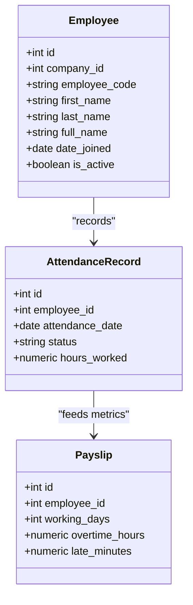

**Diagram sources**
- [employee.py:76-118](file://app/models/employee.py#L76-L118)
- [attendance.py:56-80](file://app/models/attendance.py#L56-L80)
- [payroll.py:64-94](file://app/models/payroll.py#L64-L94)

### Overtime Policy Enforcement
Overtime policy is enforced via OvertimeSetting and OvertimeRecord. Multipliers and approval workflow ensure compliance with company policy and tax regulations.

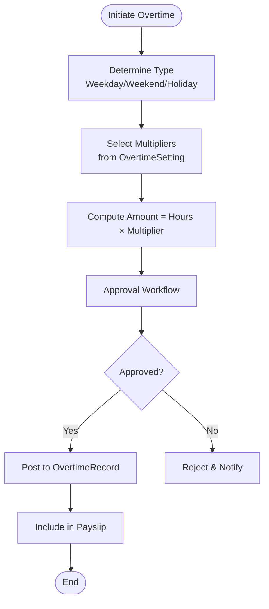

**Diagram sources**
- [attendance.py:113-126](file://app/models/attendance.py#L113-L126)
- [attendance.py:83-110](file://app/models/attendance.py#L83-L110)

### Integration with Payroll Processing
PayrollRun aggregates payslips per period. Payslip includes attendance-derived metrics (working days, late minutes) and overtime earnings. PayslipLine categorizes earnings, taxes, and deductions.

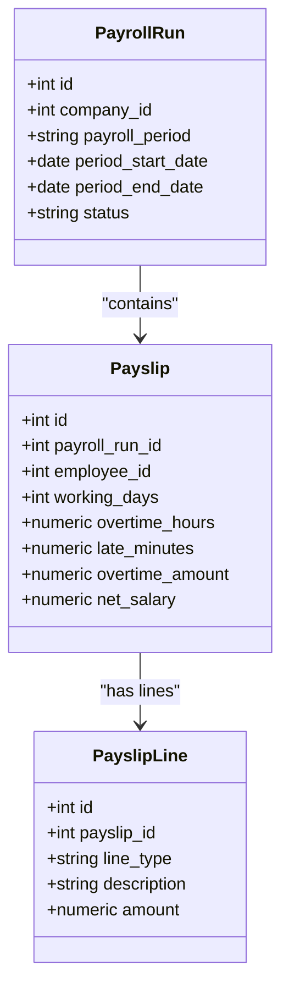

**Diagram sources**
- [payroll.py:19-61](file://app/models/payroll.py#L19-L61)
- [payroll.py:64-102](file://app/models/payroll.py#L64-L102)
- [payroll.py:105-124](file://app/models/payroll.py#L105-L124)

### Integration with Leave Management
Leave types define entitlements and approval requirements. Leave requests impact attendance status and workday counts during leave periods.

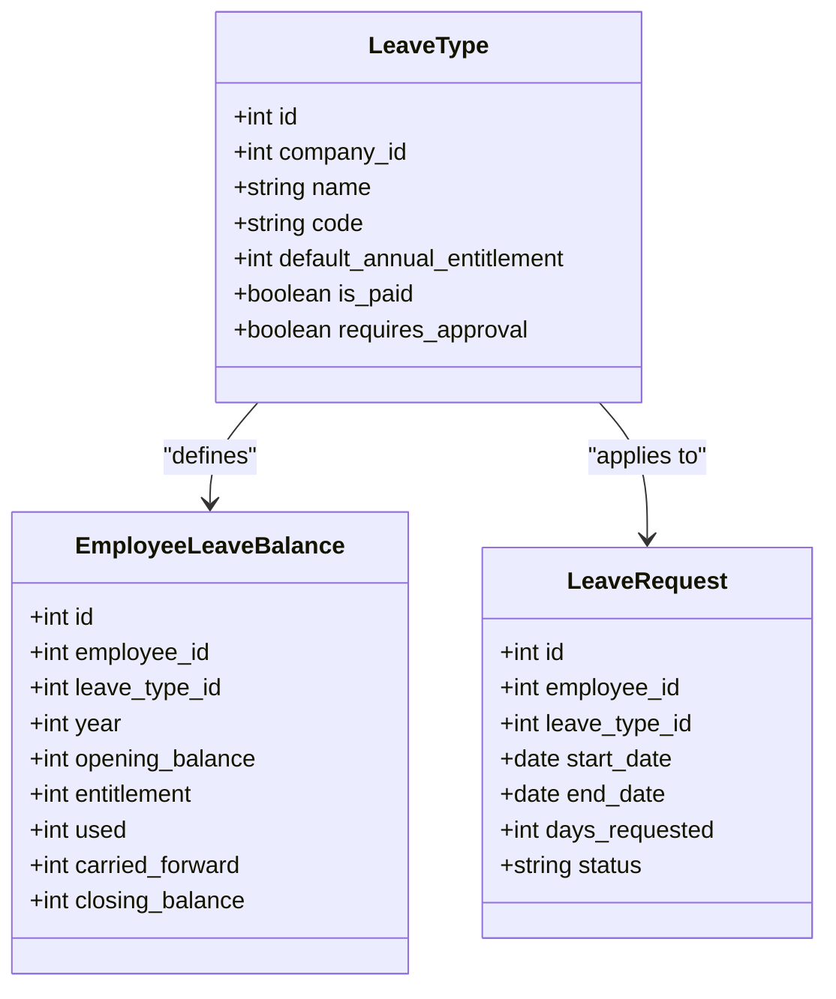

**Diagram sources**
- [leave.py:19-41](file://app/models/leave.py#L19-L41)
- [leave.py:43-63](file://app/models/leave.py#L43-L63)
- [leave.py:66-97](file://app/models/leave.py#L66-L97)

### Productivity Tracking
Productivity metrics derive from AttendanceRecord (hours_worked, late_minutes) and LeaveRequest (days requested). These feed into Payslip summaries for reporting.

**Section sources**
- [attendance.py:67-70](file://app/models/attendance.py#L67-L70)
- [leave.py:76-77](file://app/models/leave.py#L76-L77)
- [payroll.py:87-89](file://app/models/payroll.py#L87-L89)

## Dependency Analysis
The models share common infrastructure via Base and TimestampMixin. Attendance and overtime depend on Employee, while payroll depends on both Attendance and Overtime. Leave and compensation models are orthogonal but integrate through Employee.

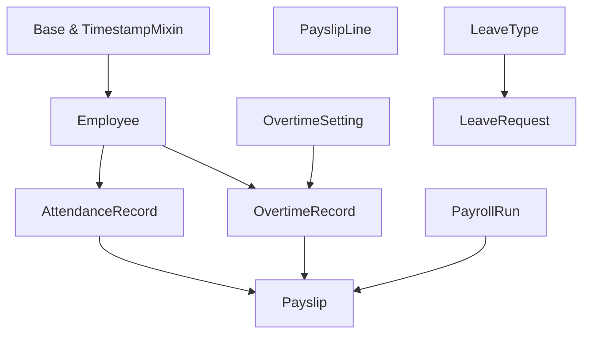

**Diagram sources**
- [base.py:18-33](file://app/models/base.py#L18-L33)
- [employee.py:76-118](file://app/models/employee.py#L76-L118)
- [attendance.py:56-110](file://app/models/attendance.py#L56-L110)
- [payroll.py:64-102](file://app/models/payroll.py#L64-L102)
- [leave.py:19-97](file://app/models/leave.py#L19-L97)

**Section sources**
- [base.py:18-33](file://app/models/base.py#L18-L33)
- [database.py:17-63](file://app/database.py#L17-L63)

## Performance Considerations
- Indexes on attendance_employee_date and attendance_date_status accelerate daily rollups and status reporting.
- Index on overtime_employee_date supports efficient overtime aggregation per employee and date.
- Unique constraints prevent redundant writes and ensure accurate aggregations.
- PayrollRun and Payslip indexing supports batch processing and filtering by status.

[No sources needed since this section provides general guidance]

## Troubleshooting Guide
Common issues and resolutions:
- Duplicate attendance record: Check uniqueness constraint on employee-date combination and resolve duplicates before reprocessing.
- Invalid status value: Ensure status is one of PRESENT, ABSENT, LEAVE, SICK, PERMITTED.
- Invalid overtime type: Verify type is WEEKDAY, WEEKEND, or HOLIDAY.
- Unapproved overtime: Confirm approval status is APPROVED before including in payroll.
- Overtime setting mismatch: Validate work week type and multipliers align with company policy.

**Section sources**
- [attendance.py:72-80](file://app/models/attendance.py#L72-L80)
- [attendance.py:100-110](file://app/models/attendance.py#L100-L110)
- [attendance.py:128-133](file://app/models/attendance.py#L128-L133)

## Conclusion
The attendance and overtime subsystem provides robust tracking, configurable policies, and seamless integration with payroll, leave, and productivity reporting. Constraints and indexes ensure data integrity and performance, while approval workflows enforce policy compliance.

[No sources needed since this section summarizes without analyzing specific files]

## Appendices

### Attendance Entry Example
- Employee: ID X
- Date: 2025-06-01
- Status: PRESENT
- Check-in: 08:15:00
- Check-out: 17:00:00
- Late minutes: 15
- Hours worked: 8.25
- Notes: Standard day

### Overtime Calculation Example
- Employee: ID X
- Date: 2025-06-01
- Type: WEEKDAY
- Hours: 3.00
- Multiplier: 1.5 (first hour)
- Calculated amount: 4.50
- Approval status: APPROVED

### Shift Configuration Example
- Shift code: DS001
- Name: Day Shift
- Start time: 08:00
- End time: 17:00
- Break: 60 minutes
- Active: true
- Assignment: Employee X effective 2025-06-01

### Attendance Reporting Example
- Period: 2025-06-01 to 2025-06-30
- Working days: 22
- Overtime hours: 6.00
- Late minutes: 45
- Leave days: 2
- Sick days: 1

[No sources needed since this section provides general guidance]