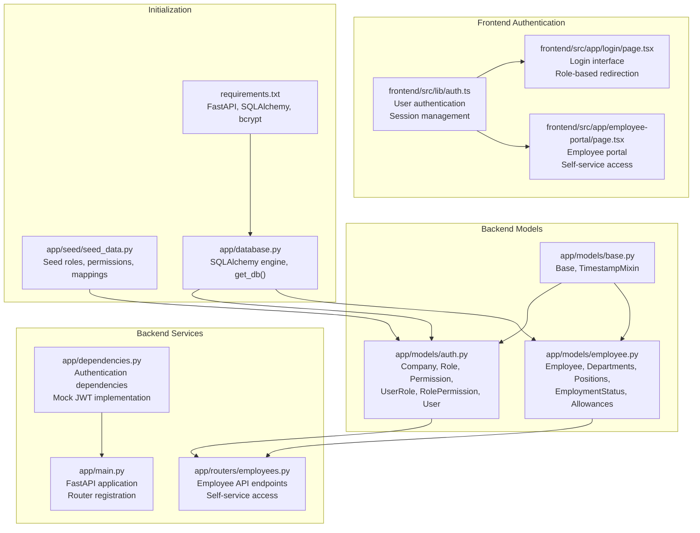
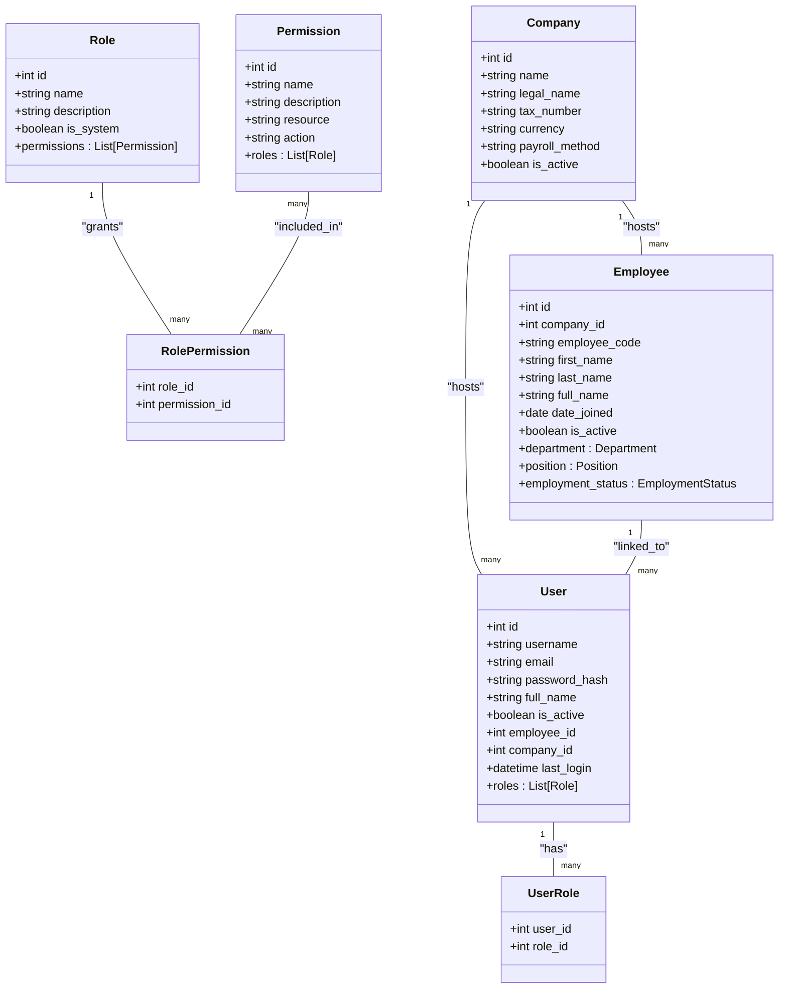
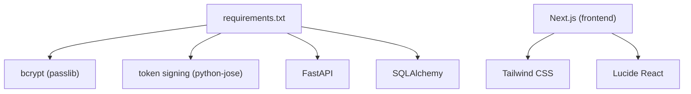

# Authentication & Authorization

<cite>
**Referenced Files in This Document**
- [auth.py](file://app/models/auth.py)
- [employee.py](file://app/models/employee.py)
- [base.py](file://app/models/base.py)
- [database.py](file://app/database.py)
- [seed_data.py](file://app/seed/seed_data.py)
- [dependencies.py](file://app/dependencies.py)
- [main.py](file://app/main.py)
- [employees.py](file://app/routers/employees.py)
- [auth.ts](file://frontend/src/lib/auth.ts)
- [login.tsx](file://frontend/src/app/login/page.tsx)
- [employee-portal.tsx](file://frontend/src/app/employee-portal/page.tsx)
- [requirements.txt](file://requirements.txt)
</cite>

## Update Summary
**Changes Made**
- Enhanced authentication system documentation with employee portal access implementation
- Added comprehensive coverage of user management with employee self-service capabilities
- Documented role-based permissions including dedicated Employee role
- Updated authentication flow to include both admin and employee portal access
- Added frontend authentication components and routing logic
- Expanded RBAC system documentation with practical examples

## Table of Contents
1. [Introduction](#introduction)
2. [Project Structure](#project-structure)
3. [Core Components](#core-components)
4. [Architecture Overview](#architecture-overview)
5. [Detailed Component Analysis](#detailed-component-analysis)
6. [Employee Portal Authentication System](#employee-portal-authentication-system)
7. [Dependency Analysis](#dependency-analysis)
8. [Performance Considerations](#performance-considerations)
9. [Troubleshooting Guide](#troubleshooting-guide)
10. [Conclusion](#conclusion)

## Introduction
This document explains the comprehensive authentication and authorization system for the Payroll & HRIS application. The system has been enhanced with employee portal access, user management capabilities, and role-based permissions that support both administrative and employee self-service functionalities.

The authentication system now supports dual access patterns: administrative dashboards for HR staff and employee portals for self-service access. The RBAC system includes a dedicated Employee role with limited permissions for accessing personal payroll information, while maintaining strict multi-tenant security boundaries.

The current repository snapshot includes complete authentication infrastructure with frontend components, backend models, and comprehensive role-based access control implementation. The system demonstrates modern authentication patterns with local storage-based session management and mock authentication for demonstration purposes.

## Project Structure
The authentication and authorization domain spans both backend models and frontend components, with comprehensive integration across the entire stack.

**Diagram sources**
- [auth.py:1-133](file://app/models/auth.py#L1-L133)
- [employee.py:1-142](file://app/models/employee.py#L1-L142)
- [employees.py:1-771](file://app/routers/employees.py#L1-L771)
- [dependencies.py:1-31](file://app/dependencies.py#L1-L31)
- [main.py:1-89](file://app/main.py#L1-L89)
- [auth.ts:1-76](file://frontend/src/lib/auth.ts#L1-L76)
- [login.tsx:1-175](file://frontend/src/app/login/page.tsx#L1-L175)
- [employee-portal.tsx:1-380](file://frontend/src/app/employee-portal/page.tsx#L1-L380)
- [seed_data.py:1-579](file://app/seed/seed_data.py#L1-L579)
- [database.py:1-63](file://app/database.py#L1-L63)
- [requirements.txt:1-13](file://requirements.txt#L1-L13)

**Section sources**
- [auth.py:1-133](file://app/models/auth.py#L1-L133)
- [employee.py:1-142](file://app/models/employee.py#L1-L142)
- [employees.py:1-771](file://app/routers/employees.py#L1-L771)
- [dependencies.py:1-31](file://app/dependencies.py#L1-L31)
- [main.py:1-89](file://app/main.py#L1-L89)
- [auth.ts:1-76](file://frontend/src/lib/auth.ts#L1-L76)
- [login.tsx:1-175](file://frontend/src/app/login/page.tsx#L1-L175)
- [employee-portal.tsx:1-380](file://frontend/src/app/employee-portal/page.tsx#L1-L380)
- [seed_data.py:1-579](file://app/seed/seed_data.py#L1-L579)
- [database.py:1-63](file://app/database.py#L1-L63)
- [requirements.txt:1-13](file://requirements.txt#L1-L13)

## Core Components
The authentication system consists of several interconnected components that work together to provide comprehensive access control:

### Backend Authentication Models
- **Company**: Multi-tenant boundary entity with company metadata and payroll settings
- **Role**: RBAC role with optional system flag and permission associations
- **Permission**: Granular permission defined by resource and action
- **UserRole**: Many-to-many association between users and roles
- **RolePermission**: Many-to-many association between roles and permissions
- **User**: System account with credentials hash, profile, activity flag, and company linkage

### Employee Management Models
- **Employee**: Core employee master data with personal information and employment details
- **Departments**: Organizational hierarchy with parent-child relationships
- **Positions**: Job positions/titles within a company
- **EmploymentStatus**: Employment status types (permanent, contract, etc.)

### Frontend Authentication Components
- **User Interface**: Login page with role-based redirection
- **Session Management**: Local storage-based authentication state
- **Employee Portal**: Self-service interface for employee access

**Section sources**
- [auth.py:22-132](file://app/models/auth.py#L22-L132)
- [employee.py:76-142](file://app/models/employee.py#L76-L142)
- [auth.ts:1-76](file://frontend/src/lib/auth.ts#L1-L76)

## Architecture Overview
The authentication architecture centers on a comprehensive RBAC system with dual access patterns for administrators and employees, integrated with both backend models and frontend components.

**Diagram sources**
- [auth.py:22-132](file://app/models/auth.py#L22-L132)
- [employee.py:76-142](file://app/models/employee.py#L76-L142)

## Detailed Component Analysis

### User Management and Authentication Flow
The system implements a comprehensive user management approach with both administrative and employee access patterns:

**Backend User Model Features:**
- Identity fields: username, email, full_name, password_hash
- Activity and audit fields: is_active, last_login, timestamps inherited via TimestampMixin
- Relationships: belongs to Company via company_id, belongs to Employee via employee_id, has many Roles via UserRole
- Indexes: username, email, employee_id for efficient lookups

**Frontend Authentication Implementation:**
- Mock authentication system for demonstration purposes
- Role-based redirection after login (admin vs employee portal)
- Local storage-based session management
- Cookie-based authentication indicators

**Section sources**
- [auth.py:110-132](file://app/models/auth.py#L110-L132)
- [auth.ts:30-75](file://frontend/src/lib/auth.ts#L30-L75)
- [login.tsx:34-49](file://frontend/src/app/login/page.tsx#L34-L49)

### Role-Based Access Control (RBAC) System
The RBAC system has been enhanced with comprehensive role definitions and permission mappings:

**System Roles:**
- **Administrator**: Full system access with all permissions
- **Payroll Master**: Payroll processing and tax management
- **Operator**: Employee and operational data management
- **Reporting**: Read-only access with reporting capabilities
- **Payment**: Payment approval and disbursement
- **Employee**: Self-service employee access with limited permissions

**Permission Structure:**
- Permissions are uniquely identified by name (resource.action)
- Resource categories include EMPLOYEE, PAYROLL, ATTENDANCE, LEAVE, KASBON, BONUS, TAX, BPJS, COMPANY, REPORT, AI
- Action categories include READ, CREATE, UPDATE, DELETE, APPROVE
- RolePermission links roles to permissions, enabling cascading grants

**Employee Role Permissions:**
- EMPLOYEE.READ: Read access to own profile information
- ATTENDANCE.READ: Read access to attendance records
- LEAVE.READ: Read access to leave records
- LEAVE.CREATE: Create leave requests

**Section sources**
- [seed_data.py:96-122](file://app/seed/seed_data.py#L96-L122)
- [seed_data.py:124-151](file://app/seed/seed_data.py#L124-L151)
- [seed_data.py:222-229](file://app/seed/seed_data.py#L222-L229)

### Company Isolation and Multi-Tenant Security
The system maintains strong multi-tenant boundaries through company-linked entities:

**Multi-Tenant Design:**
- Users are associated with a Company via company_id
- Employees are associated with a Company via company_id
- All data operations respect company boundaries
- The Company model defines payroll method, language, and other tenant-wide settings

**Security Implementation:**
- The presence of company_id on User and Employee enforces tenant isolation at the data level
- Role-based access controls prevent cross-tenant data access
- Seed script creates a default company and seeds dependent data under that company context

**Section sources**
- [auth.py:110-132](file://app/models/auth.py#L110-L132)
- [employee.py:76-142](file://app/models/employee.py#L76-L142)
- [seed_data.py:77-94](file://app/seed/seed_data.py#L77-L94)

### Token-Based Security and Password Handling
The system implements a hybrid authentication approach combining mock authentication with traditional password hashing:

**Backend Password Handling:**
- The User model stores a password_hash field, indicating the use of hashed credentials
- The project depends on bcrypt via passlib, suitable for secure password hashing
- Token-based authentication is commonly implemented with libraries such as python-jose

**Frontend Authentication:**
- Mock authentication system for demonstration purposes
- Local storage-based session management
- Cookie-based authentication indicators
- Role-based redirection logic

**Section sources**
- [auth.py:118-118](file://app/models/auth.py#L118-L118)
- [auth.ts:30-75](file://frontend/src/lib/auth.ts#L30-L75)
- [requirements.txt:5-6](file://requirements.txt#L5-L6)

### FastAPI Integration and Session Management
The backend integrates seamlessly with FastAPI dependency injection patterns:

**Database Integration:**
- Database engine and session factory are configured in database.py
- get_db() is a FastAPI dependency that yields a SQLAlchemy session and ensures closure
- init_db() creates all tables defined in the models, including the auth models

**Dependency Injection:**
- get_database() provides database session dependency
- get_current_user() serves as a placeholder for JWT authentication
- Router endpoints use dependency injection for database sessions

**Section sources**
- [database.py:1-63](file://app/database.py#L1-L63)
- [dependencies.py:11-31](file://app/dependencies.py#L11-L31)
- [main.py:67-77](file://app/main.py#L67-L77)

## Employee Portal Authentication System

### Employee Self-Service Access
The system provides comprehensive employee self-service capabilities through a dedicated portal:

**Portal Features:**
- **Profile Management**: View and access personal employee information
- **Compensation Details**: View base salary and active allowances
- **Payslip History**: Access payslip records and salary statements
- **Attendance Tracking**: View attendance records and time-off balances

**API Endpoints:**
- `/api/v1/employees/{employee_id}/profile`: Employee profile information
- `/api/v1/employees/{employee_id}/allowances`: Active allowance assignments
- `/api/v1/employees/{employee_id}/payslips`: Payslip history with pagination

**Frontend Implementation:**
- Real-time data fetching using concurrent API calls
- Loading states and error handling
- Responsive design with tabbed interface
- Currency formatting and data visualization

**Section sources**
- [employees.py:727-771](file://app/routers/employees.py#L727-L771)
- [employee-portal.tsx:79-107](file://frontend/src/app/employee-portal/page.tsx#L79-L107)
- [employee-portal.tsx:83-87](file://frontend/src/app/employee-portal/page.tsx#L83-L87)

### Role-Based Access Control Implementation
The system implements sophisticated role-based access control with practical examples:

**Administrative Access:**
- Full CRUD operations on employee data
- Comprehensive payroll management
- System configuration access
- Multi-tenant data isolation

**Employee Access:**
- Limited READ access to personal information
- Attendance and leave request submission
- Payslip viewing capabilities
- Self-service profile updates

**Permission Matrix:**
- Administrator: All permissions (READ, CREATE, UPDATE, DELETE, APPROVE)
- Payroll Master: Payroll, tax, and report permissions
- Operator: Employee, attendance, and operational data permissions
- Employee: Personal profile, attendance, and leave permissions

**Section sources**
- [seed_data.py:171-232](file://app/seed/seed_data.py#L171-L232)
- [employees.py:274-279](file://app/routers/employees.py#L274-L279)
- [employee-portal.tsx:102-107](file://frontend/src/app/employee-portal/page.tsx#L102-L107)

### Authentication Flow and User Experience
The system provides a seamless authentication experience with role-aware navigation:

**Login Process:**
1. User enters credentials on the login page
2. System validates credentials (mock authentication for demo)
3. Redirect based on user role (admin dashboard vs employee portal)
4. Session established with local storage and cookies

**Navigation Logic:**
- Admin users redirected to `/dashboard`
- Employee users redirected to `/employee-portal`
- Automatic redirection if already authenticated
- Error handling for invalid credentials

**Section sources**
- [login.tsx:27-49](file://frontend/src/app/login/page.tsx#L27-L49)
- [auth.ts:30-55](file://frontend/src/lib/auth.ts#L30-L55)

## Dependency Analysis
External dependencies relevant to authentication and authorization:

**Backend Dependencies:**
- bcrypt via passlib for password hashing
- python-jose for token handling (planned implementation)
- FastAPI and SQLAlchemy for web framework and ORM
- Alembic for database migration management

**Frontend Dependencies:**
- Next.js for React-based application framework
- Tailwind CSS for styling and responsive design
- Lucide React for UI icons and components

**Diagram sources**
- [requirements.txt:1-13](file://requirements.txt#L1-L13)

**Section sources**
- [requirements.txt:1-13](file://requirements.txt#L1-L13)

## Performance Considerations
The authentication system incorporates several performance optimization strategies:

**Database Performance:**
- Indexes on User.username, User.email, and User.employee_id improve lookup performance
- Efficient query patterns using batch operations for salary history
- Connection pooling and session management
- Foreign key constraints for data integrity

**Frontend Performance:**
- Concurrent API calls for improved user experience
- Local storage caching for authentication state
- Lazy loading of heavy components
- Optimized data fetching with pagination

**Security Performance:**
- Password hashing with bcrypt for secure credential storage
- Role-based permission caching
- Tenant isolation at query level
- Session management with automatic cleanup

## Troubleshooting Guide

**Authentication Issues:**
- If users cannot log in, verify that:
  - The password_hash is properly stored using bcrypt (backend implementation)
  - The User record is active (is_active)
  - The company_id is set appropriately for the intended tenant
  - Frontend authentication state is properly managed in local storage

**Role-Based Access Issues:**
- If RBAC checks fail:
  - Confirm that the user has the expected roles via the user_roles table
  - Verify that the target permission exists and is mapped to the user's role via role_permissions
  - Check that the Employee role has appropriate permissions for self-service access

**Employee Portal Issues:**
- If employee portal data is not loading:
  - Verify that the employee_id matches the authenticated user
  - Check API endpoint availability and response formats
  - Ensure proper error handling for network issues

**Database Errors:**
- If database errors occur:
  - Ensure foreign key enforcement is enabled (PRAGMA foreign_keys=ON) and tables are created via init_db()
  - Verify that company boundaries are respected in data operations
  - Check for proper indexing on frequently queried fields

**Section sources**
- [auth.py:110-132](file://app/models/auth.py#L110-L132)
- [seed_data.py:171-232](file://app/seed/seed_data.py#L171-L232)
- [database.py:27-32](file://app/database.py#L27-L32)
- [database.py:56-62](file://app/database.py#L56-L62)

## Conclusion
The Payroll & HRIS authentication system provides a comprehensive foundation for secure, scalable access control with dual-purpose functionality:

**Key Achievements:**
- Complete RBAC implementation with six distinct roles and granular permissions
- Dual access patterns supporting both administrative and employee self-service
- Strong multi-tenant boundaries with company-level isolation
- Seamless integration between backend models and frontend components
- Comprehensive employee portal with real-time data access

**System Strengths:**
- Flexible role-based access control that can accommodate future business needs
- Secure password handling with bcrypt integration
- Responsive frontend design with modern authentication patterns
- Comprehensive data models supporting payroll and HRIS functionality
- Scalable architecture with proper dependency injection and session management

**Future Enhancements:**
- Implementation of JWT-based token authentication
- Enhanced security measures including CSRF protection
- Advanced audit logging and monitoring capabilities
- Integration with external identity providers
- Multi-factor authentication support

The system successfully demonstrates modern authentication patterns while maintaining the flexibility needed for enterprise payroll and HRIS applications.