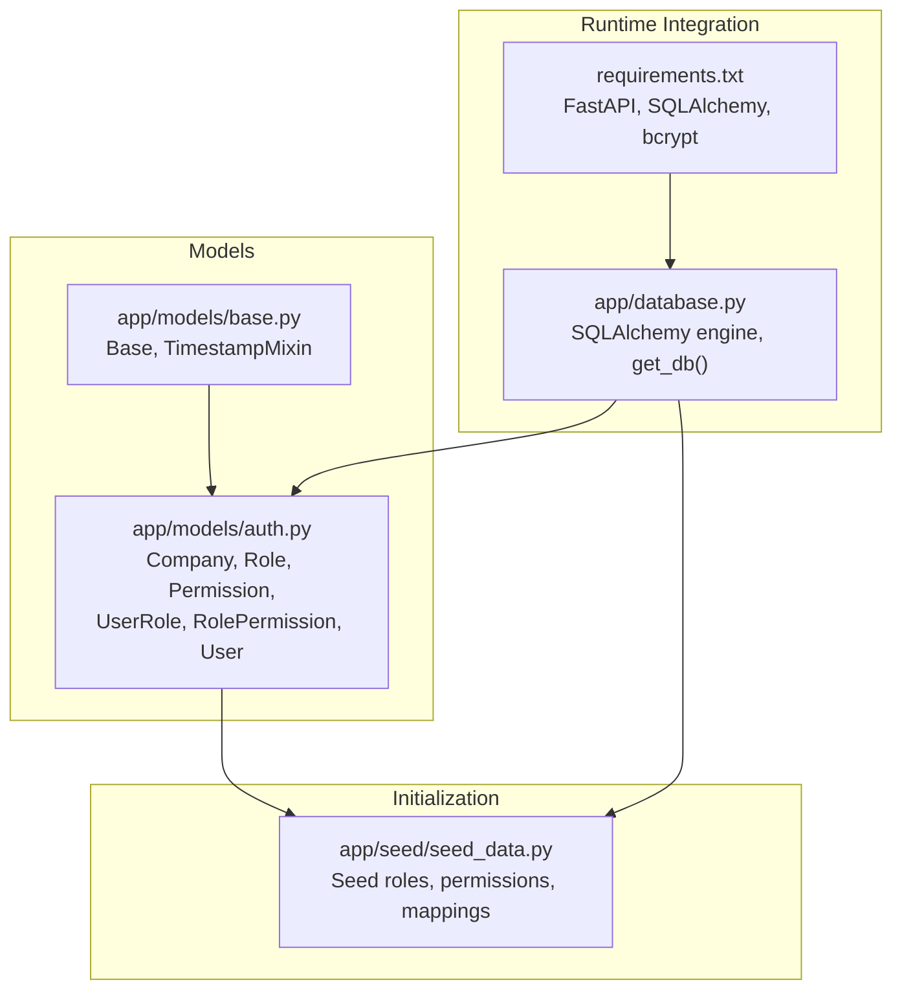
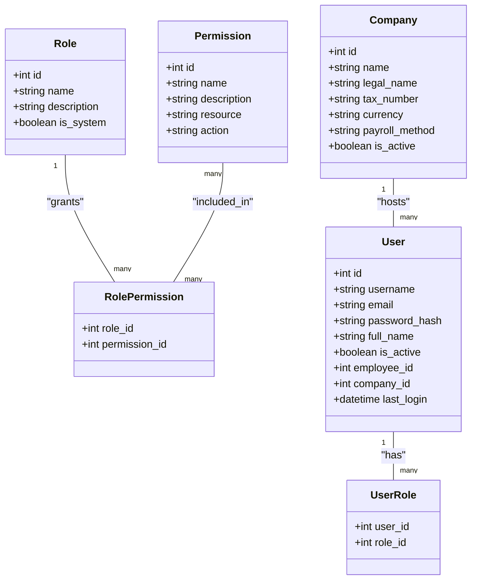
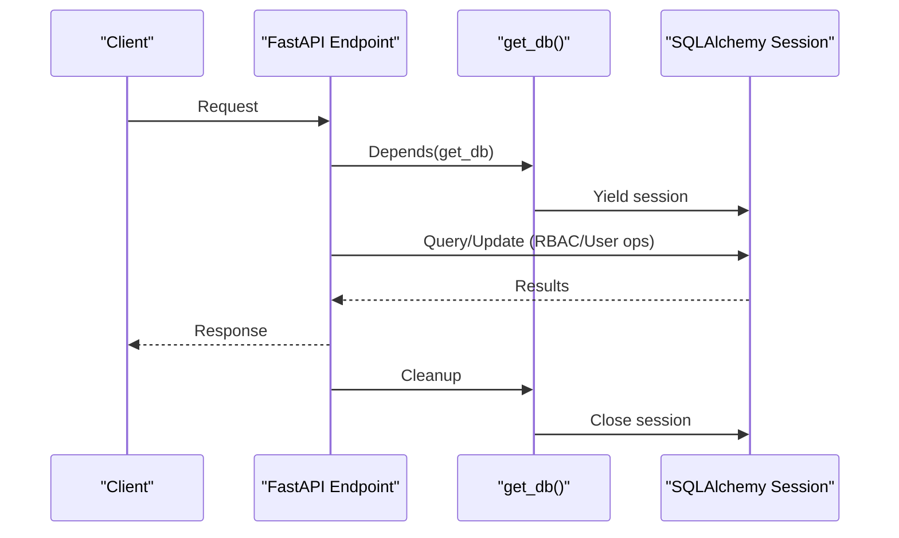
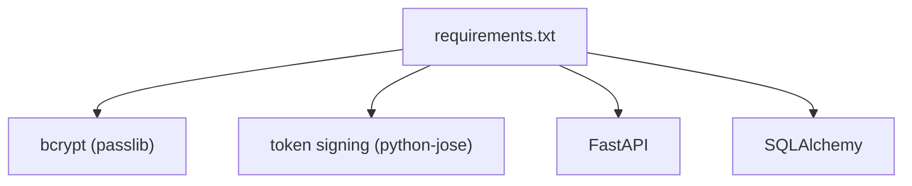

# Authentication & Authorization

<cite>
**Referenced Files in This Document**
- [auth.py](file://app/models/auth.py)
- [base.py](file://app/models/base.py)
- [database.py](file://app/database.py)
- [seed_data.py](file://app/seed/seed_data.py)
- [requirements.txt](file://requirements.txt)
</cite>

## Table of Contents
1. [Introduction](#introduction)
2. [Project Structure](#project-structure)
3. [Core Components](#core-components)
4. [Architecture Overview](#architecture-overview)
5. [Detailed Component Analysis](#detailed-component-analysis)
6. [Dependency Analysis](#dependency-analysis)
7. [Performance Considerations](#performance-considerations)
8. [Troubleshooting Guide](#troubleshooting-guide)
9. [Conclusion](#conclusion)

## Introduction
This document explains the authentication and authorization system for the Payroll & HRIS application. It covers the user management implementation, role-based access control (RBAC), permission mechanisms, and company isolation features. It also documents the multi-tenant security boundaries, outlines the token-based security posture, password hashing with bcrypt, and how the system integrates with FastAPI dependencies for database sessions.

The current repository snapshot includes the foundational models and seeding logic for authentication and authorization. While the actual runtime authentication handlers (login, token issuance, protected routes) are not present here, the data model and seed scripts establish the RBAC foundation and multi-tenant boundaries.

## Project Structure
The authentication and authorization domain is primarily implemented in the models package and initialized via the seed script. The database engine and FastAPI dependency are configured in the database module.

**Diagram sources**
- [auth.py:1-133](file://app/models/auth.py#L1-L133)
- [base.py:1-57](file://app/models/base.py#L1-L57)
- [seed_data.py:1-448](file://app/seed/seed_data.py#L1-L448)
- [database.py:1-63](file://app/database.py#L1-L63)
- [requirements.txt:1-13](file://requirements.txt#L1-L13)

**Section sources**
- [auth.py:1-133](file://app/models/auth.py#L1-L133)
- [base.py:1-57](file://app/models/base.py#L1-L57)
- [database.py:1-63](file://app/database.py#L1-L63)
- [seed_data.py:1-448](file://app/seed/seed_data.py#L1-L448)
- [requirements.txt:1-13](file://requirements.txt#L1-L13)

## Core Components
- Company: Multi-tenant boundary entity with company metadata and payroll settings.
- Role: RBAC role with optional system flag.
- Permission: Granular permission defined by resource and action.
- UserRole: Many-to-many association between users and roles.
- RolePermission: Many-to-many association between roles and permissions.
- User: System account with credentials hash, profile, activity flag, and company linkage.

These components form a classic RBAC schema with explicit separation of concerns and strong referential integrity enforced by foreign keys.

**Section sources**
- [auth.py:22-132](file://app/models/auth.py#L22-L132)

## Architecture Overview
The authentication and authorization architecture centers on the SQLAlchemy models and the FastAPI dependency injection pattern for database sessions. The seed script initializes system roles, permissions, and role-to-permission mappings. Users are linked to companies, establishing tenant isolation.

**Diagram sources**
- [auth.py:22-132](file://app/models/auth.py#L22-L132)

## Detailed Component Analysis

### User Management
- Identity fields: username, email, full_name, password_hash.
- Activity and audit fields: is_active, last_login, timestamps inherited via TimestampMixin.
- Relationships:
  - belongs to Company via company_id.
  - belongs to Employee via employee_id.
  - has many Roles via UserRole.
- Indexes: username, email, employee_id for efficient lookups.

Concrete examples from the seed script demonstrate:
- Creating a default company record.
- Seeding system roles.
- Seeding granular permissions.
- Assigning permissions to roles (role-permission mappings).

These steps establish the baseline for user provisioning and access control.

**Section sources**
- [auth.py:110-132](file://app/models/auth.py#L110-L132)
- [seed_data.py:66-110](file://app/seed/seed_data.py#L66-L110)
- [seed_data.py:113-139](file://app/seed/seed_data.py#L113-L139)
- [seed_data.py:142-221](file://app/seed/seed_data.py#L142-L221)

### Role-Based Access Control (RBAC)
- Roles are seeded with distinct names and descriptions.
- Permissions are seeded across resources and actions (READ, CREATE, UPDATE, DELETE, APPROVE).
- RolePermission mappings define which roles receive which permissions.
- Administrator receives all permissions.
- Other roles receive tailored subsets aligned with job functions (e.g., Payroll Master, Operator, Reporting, Payment, Employee).

This establishes a flexible, maintainable access control scheme that can be extended without changing application logic.

**Section sources**
- [seed_data.py:85-110](file://app/seed/seed_data.py#L85-L110)
- [seed_data.py:113-139](file://app/seed/seed_data.py#L113-L139)
- [seed_data.py:142-221](file://app/seed/seed_data.py#L142-L221)

### Permission Mechanisms
- Permissions are uniquely identified by name (resource.action).
- Resource categories include EMPLOYEE, PAYROLL, ATTENDANCE, LEAVE, KASBON, BONUS, TAX, BPJS, COMPANY, REPORT, AI.
- Action categories include READ, CREATE, UPDATE, DELETE, APPROVE.
- RolePermission links roles to permissions, enabling cascading grants.

This granular mechanism supports least-privilege enforcement and auditability.

**Section sources**
- [seed_data.py:113-139](file://app/seed/seed_data.py#L113-L139)
- [seed_data.py:142-221](file://app/seed/seed_data.py#L142-L221)

### Company Isolation and Multi-Tenant Security Boundaries
- Users are associated with a Company via company_id.
- The Company model defines payroll method, language, and other tenant-wide settings.
- The presence of company_id on User enforces tenant isolation at the data level.
- The seed script creates a default company and seeds dependent data under that company context.

This design ensures that users operate within their company’s data silo, preventing cross-tenant access by default.

**Section sources**
- [auth.py:110-132](file://app/models/auth.py#L110-L132)
- [seed_data.py:66-82](file://app/seed/seed_data.py#L66-L82)

### Token-Based Security and Password Hashing
- The User model stores a password_hash field, indicating the use of hashed credentials.
- The project depends on bcrypt via passlib, suitable for secure password hashing.
- Token-based authentication is commonly implemented with libraries such as python-jose; however, the handler implementations are not present in this repository snapshot.

Practical guidance:
- Use bcrypt to hash passwords during user creation/update.
- Issue tokens (e.g., JWT) upon successful authentication.
- Protect endpoints with dependency injectors that validate tokens and enforce RBAC checks.

**Section sources**
- [auth.py:118-118](file://app/models/auth.py#L118-L118)
- [requirements.txt:5-6](file://requirements.txt#L5-L6)

### FastAPI Integration and Session Management
- Database engine and session factory are configured in database.py.
- get_db() is a FastAPI dependency that yields a SQLAlchemy session and ensures closure.
- init_db() creates all tables defined in the models, including the auth models.

This enables clean dependency injection of database sessions across FastAPI endpoints.

**Diagram sources**
- [database.py:38-53](file://app/database.py#L38-L53)

**Section sources**
- [database.py:1-63](file://app/database.py#L1-L63)

## Dependency Analysis
External dependencies relevant to authentication and authorization:
- bcrypt via passlib for password hashing.
- python-jose for token handling.
- FastAPI and SQLAlchemy for web framework and ORM.

**Diagram sources**
- [requirements.txt:1-13](file://requirements.txt#L1-L13)

**Section sources**
- [requirements.txt:1-13](file://requirements.txt#L1-L13)

## Performance Considerations
- Indexes on User.username, User.email, and User.employee_id improve lookup performance for authentication and user queries.
- Using static connection pooling reduces overhead in single-threaded environments.
- Keep permission sets concise and avoid excessive role granularity to minimize join costs during permission evaluation.

[No sources needed since this section provides general guidance]

## Troubleshooting Guide
- If users cannot log in, verify that:
  - The password_hash is properly stored using bcrypt.
  - The User record is active (is_active).
  - The company_id is set appropriately for the intended tenant.
- If RBAC checks fail:
  - Confirm that the user has the expected roles via the user_roles table.
  - Verify that the target permission exists and is mapped to the user’s role via role_permissions.
- If database errors occur:
  - Ensure foreign key enforcement is enabled (PRAGMA foreign_keys=ON) and tables are created via init_db().

**Section sources**
- [auth.py:110-132](file://app/models/auth.py#L110-L132)
- [seed_data.py:142-221](file://app/seed/seed_data.py#L142-L221)
- [database.py:27-32](file://app/database.py#L27-L32)
- [database.py:56-62](file://app/database.py#L56-L62)

## Conclusion
The repository establishes a robust foundation for authentication and authorization:
- A clear RBAC model with roles, permissions, and many-to-many associations.
- Strong multi-tenant boundaries via company-linked users.
- Seeding logic that provisions system roles, permissions, and mappings.
- FastAPI-compatible database integration with dependency injection.

While runtime authentication handlers and token management are not included here, the data model and seed scripts provide the blueprint for implementing secure, scalable authentication flows with bcrypt and token-based security.