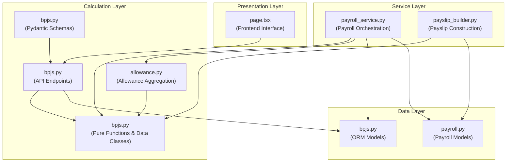
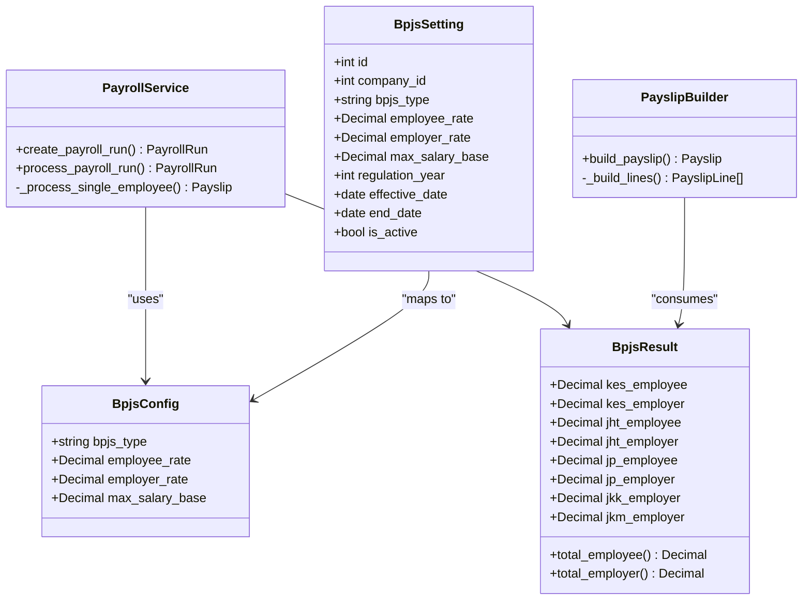
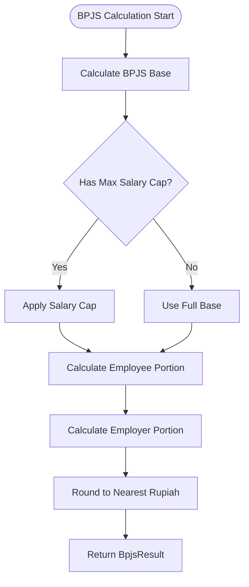
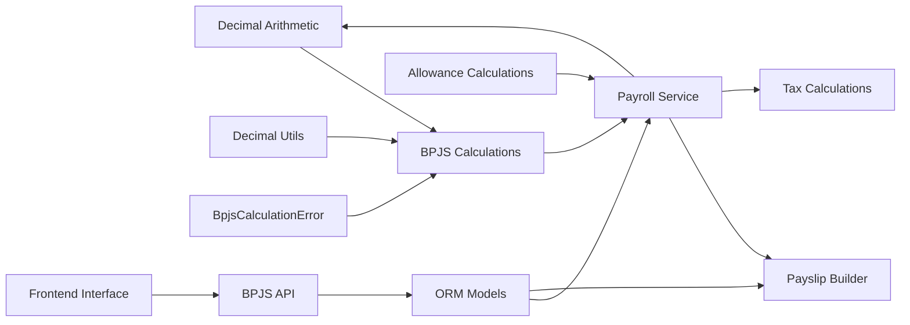

# BPJS Integration

<cite>
**Referenced Files in This Document**
- [bpjs.py](file://app/calculations/bpjs.py)
- [bpjs.py](file://app/models/bpjs.py)
- [bpjs.py](file://app/routers/bpjs.py)
- [bpjs.py](file://app/schemas/bpjs.py)
- [payroll_service.py](file://app/services/payroll_service.py)
- [payslip_builder.py](file://app/services/payslip_builder.py)
- [payroll.py](file://app/models/payroll.py)
- [allowance.py](file://app/calculations/allowance.py)
- [seed_data.py](file://app/seed/seed_data.py)
- [test_bpjs.py](file://tests/test_bpjs.py)
- [page.tsx](file://frontend/src/app/(dashboard)/settings/bpjs/page.tsx)
</cite>

## Update Summary
**Changes Made**
- Added comprehensive BPJS calculation engine with pure functions and data classes
- Integrated BPJS calculations into payroll processing pipeline
- Implemented BPJS API endpoints for configuration management
- Enhanced payslip builder to include BPJS line items
- Added frontend interface for BPJS settings management
- Updated payroll service to coordinate BPJS calculations with tax processing

## Table of Contents
1. [Introduction](#introduction)
2. [Project Structure](#project-structure)
3. [Core Components](#core-components)
4. [Architecture Overview](#architecture-overview)
5. [Detailed Component Analysis](#detailed-component-analysis)
6. [Dependency Analysis](#dependency-analysis)
7. [Performance Considerations](#performance-considerations)
8. [Troubleshooting Guide](#troubleshooting-guide)
9. [Conclusion](#conclusion)
10. [Appendices](#appendices)

## Introduction
This document explains the comprehensive BPJS (Badan Penyelenggara Jaminan Sosial) integration within the Payroll & HRIS system. The integration encompasses complete social security contribution management, including contribution calculation algorithms, employer and employee contribution splits, regulatory compliance features, and seamless integration with payroll processing, tax calculations, and employee benefit management.

The system implements a pure calculation engine for BPJS contributions with support for five major BPJS types: KESEHATAN (health insurance), JHT (old age pension), JP (retirement pension), JKK (work accident insurance), and JKM (death insurance). It provides real-time contribution calculations, salary base determination, rate application with optional caps, and comprehensive audit trails through detailed payslip line items.

## Project Structure
The BPJS integration spans multiple layers of the application architecture:

**Diagram sources**
- [bpjs.py:1-138](file://app/calculations/bpjs.py#L1-L138)
- [allowance.py:1-122](file://app/calculations/allowance.py#L1-L122)
- [payroll_service.py:25-303](file://app/services/payroll_service.py#L25-L303)
- [payslip_builder.py:17-243](file://app/services/payslip_builder.py#L17-L243)
- [bpjs.py:17-44](file://app/models/bpjs.py#L17-L44)
- [payroll.py:64-123](file://app/models/payroll.py#L64-L123)
- [page.tsx:65-190](file://frontend/src/app/(dashboard)/settings/bpjs/page.tsx#L65-L190)

**Section sources**
- [bpjs.py:1-138](file://app/calculations/bpjs.py#L1-L138)
- [allowance.py:1-122](file://app/calculations/allowance.py#L1-L122)
- [payroll_service.py:1-478](file://app/services/payroll_service.py#L1-L478)
- [payslip_builder.py:1-277](file://app/services/payslip_builder.py#L1-L277)
- [bpjs.py:17-44](file://app/models/bpjs.py#L17-L44)
- [payroll.py:64-123](file://app/models/payroll.py#L64-L123)
- [page.tsx:65-190](file://frontend/src/app/(dashboard)/settings/bpjs/page.tsx#L65-L190)

## Core Components

### Pure Calculation Engine
The BPJS calculation engine consists of three core pure functions that perform mathematical operations without side effects:

- **BpjsConfig**: In-memory configuration data class storing BPJS type, employee rate, employer rate, and maximum salary base
- **BpjsResult**: Complete calculation result data class with individual contributions for each BPJS type and aggregated totals
- **calculate_bpjs_base**: Computes BPJS base = base salary + sum of BPJS-eligible allowances
- **calculate_bpjs_contribution**: Applies rates to capped base amounts with proper rounding
- **calculate_all_bpjs**: Orchestrates calculations across all BPJS types with graceful handling of missing configurations

### API Configuration Management
Comprehensive RESTful API endpoints for BPJS settings management:
- **GET /bpjs/settings**: List active BPJS settings for a company
- **POST /bpjs/settings**: Create new BPJS configuration with overlap detection
- **PATCH /bpjs/settings/{id}**: Update existing BPJS rates or caps
- **DELETE /bpjs/settings/{id}**: Remove BPJS configuration

### Payroll Integration
Seamless integration with the payroll processing pipeline:
- **Base Calculation**: Uses BPJS-eligible allowances from allowance aggregation
- **Contribution Processing**: Applies rates and caps during payroll run processing
- **Tax Coordination**: Integrates with PPh 21 calculations considering BPJS deductions
- **Net Salary Calculation**: Incorporates BPJS deductions into final take-home pay

### Frontend Interface
User-friendly management interface for BPJS configurations with:
- Real-time validation and error handling
- Interactive forms for creating and editing settings
- Visual indicators for active/inactive configurations
- Responsive design supporting various screen sizes

**Section sources**
- [bpjs.py:22-138](file://app/calculations/bpjs.py#L22-L138)
- [bpjs.py:17-44](file://app/models/bpjs.py#L17-L44)
- [bpjs.py:48-171](file://app/routers/bpjs.py#L48-L171)
- [bpjs.py:12-51](file://app/schemas/bpjs.py#L12-L51)
- [payroll_service.py:262-378](file://app/services/payroll_service.py#L262-L378)
- [payslip_builder.py:17-243](file://app/services/payslip_builder.py#L17-L243)
- [page.tsx:65-190](file://frontend/src/app/(dashboard)/settings/bpjs/page.tsx#L65-L190)

## Architecture Overview
The BPJS integration follows a layered architecture pattern with clear separation of concerns:

**Diagram sources**
- [bpjs.py:22-60](file://app/calculations/bpjs.py#L22-L60)
- [bpjs.py:96-138](file://app/calculations/bpjs.py#L96-L138)
- [payroll_service.py:51-378](file://app/services/payroll_service.py#L51-L378)
- [payslip_builder.py:17-243](file://app/services/payslip_builder.py#L17-L243)
- [bpjs.py:17-44](file://app/models/bpjs.py#L17-L44)

## Detailed Component Analysis

### BPJS Calculation Engine
The calculation engine implements precise mathematical operations with proper decimal arithmetic:

#### Base Calculation Algorithm
The BPJS base is calculated as the sum of the employee's base salary and all allowances marked as BPJS-eligible. This approach ensures that only qualifying earnings contribute to social security calculations.

#### Contribution Calculation Method
Each BPJS contribution is calculated using the formula: `rounded(min(base, max_salary_base) × rate)`. The algorithm applies the maximum salary base cap when defined, ensuring compliance with regulatory limits.

#### Multi-Type Support
The system handles five distinct BPJS types with different rate structures and cap requirements:
- **KESEHATAN**: 1% employee, 4% employer with 12,000,000 cap
- **JHT**: 2% employee, 3.7% employer with no cap
- **JP**: 1% employee, 2% employer with 9,559,600 annual cap
- **JKK**: Employer-only (0.24%-1.74%) with no cap
- **JKM**: Employer-only (0.3%) with no cap

**Diagram sources**
- [bpjs.py:62-94](file://app/calculations/bpjs.py#L62-L94)
- [bpjs.py:96-138](file://app/calculations/bpjs.py#L96-L138)

**Section sources**
- [bpjs.py:62-138](file://app/calculations/bpjs.py#L62-L138)
- [test_bpjs.py:15-240](file://tests/test_bpjs.py#L15-L240)

### API Configuration Management
The BPJS configuration API provides comprehensive CRUD operations with robust validation:

#### Validation and Constraints
- **Type Validation**: Only predefined BPJS types are accepted
- **Date Range Overlap Detection**: Prevents conflicting active settings
- **Unique Constraint**: Ensures one active setting per company/type/effective_date combination
- **Rate Validation**: Maintains reasonable rate ranges for social security contributions

#### Error Handling
The API implements comprehensive error handling with meaningful error messages:
- Invalid BPJS type errors
- Date range overlap conflicts
- Not found scenarios for updates/deletes
- Business logic violations

**Section sources**
- [bpjs.py:48-171](file://app/routers/bpjs.py#L48-L171)
- [bpjs.py:12-51](file://app/schemas/bpjs.py#L12-L51)

### Payroll Integration Pipeline
The BPJS integration seamlessly fits into the payroll processing workflow:

#### Pre-Tax Processing
BPJS calculations occur before income tax computation, allowing proper integration with PPh 21 calculations. The system accounts for BPJS deductions when calculating tax-deductible amounts.

#### Post-Calculation Integration
After tax calculations, the system incorporates BPJS deductions into the final net salary computation, ensuring accurate take-home pay determination.

#### Payslip Generation
BPJS contributions are recorded as detailed line items on each payslip, providing transparency and auditability for all stakeholders.

**Section sources**
- [payroll_service.py:262-378](file://app/services/payroll_service.py#L262-L378)
- [payslip_builder.py:17-243](file://app/services/payslip_builder.py#L17-L243)

### Frontend Management Interface
The frontend provides an intuitive interface for BPJS configuration management:

#### Form Validation
Real-time validation prevents invalid configurations with immediate feedback to users. The interface validates rate ranges, date selections, and business logic constraints.

#### User Experience
The interface supports responsive design, keyboard navigation, and accessibility features. Users can easily view, edit, and manage BPJS configurations through a clean, modern interface.

#### Integration Patterns
The frontend follows React best practices with proper state management, error boundaries, and loading states for optimal user experience.

**Section sources**
- [page.tsx:65-190](file://frontend/src/app/(dashboard)/settings/bpjs/page.tsx#L65-L190)

### Regulatory Compliance Features
The system implements comprehensive compliance mechanisms:

#### Standard Rate Implementation
The system uses standardized Indonesian BPJS rates aligned with current regulations:
- KESEHATAN: 5% total (4% employer, 1% employee)
- JHT: 5.7% total (3.7% employer, 2% employee)
- JP: 3% total (2% employer, 1% employee)
- JKK: Employer-only rates based on risk classification
- JKM: Employer-only flat rate

#### Historical Tracking
Effective date management enables historical tracking of rate changes and regulatory updates. The system maintains audit trails for all configuration modifications.

#### Cap Enforcement
Salary caps are enforced automatically based on regulatory requirements, preventing overpayment and ensuring compliance with government guidelines.

**Section sources**
- [seed_data.py:310-344](file://app/seed/seed_data.py#L310-L344)
- [bpjs.py:17-44](file://app/models/bpjs.py#L17-L44)

### Concrete Examples

#### Example 1: BPJS Calculation Process
For an employee with base salary of 15,000,000 and 2,000,000 in BPJS-eligible allowances:

1. **Base Calculation**: 15,000,000 + 2,000,000 = 17,000,000
2. **KESEHATAN**: min(17M, 12M) × 5% = 600,000 (600,000 employee + 2,400,000 employer)
3. **JHT**: 17M × 5.7% = 969,000 (340,000 employee + 629,000 employer)
4. **JP**: min(17M, 9,559,600) × 3% = 286,788 (286,788 employee + 573,576 employer)
5. **JKK/JKM**: Applied based on risk classification and employment terms

#### Example 2: API Configuration Management
Creating a new BPJS setting through the API:
- Endpoint: POST /bpjs/settings
- Validation: Checks type against allowed values
- Conflict Detection: Verifies no overlapping active settings
- Persistence: Creates new configuration with audit trail

#### Example 3: Payroll Integration
During payroll processing:
- Allowance aggregation determines BPJS base
- BPJS calculations applied before tax
- Tax calculations adjusted for BPJS deductions
- Final net salary computed with all deductions

**Section sources**
- [test_bpjs.py:146-240](file://tests/test_bpjs.py#L146-L240)
- [payroll_service.py:301-303](file://app/services/payroll_service.py#L301-L303)

## Dependency Analysis
The BPJS integration creates strategic dependencies throughout the application:

**Diagram sources**
- [bpjs.py:17-138](file://app/calculations/bpjs.py#L17-L138)
- [payroll_service.py:23-31](file://app/services/payroll_service.py#L23-L31)
- [payslip_builder.py:9-14](file://app/services/payslip_builder.py#L9-L14)

**Section sources**
- [bpjs.py:17-138](file://app/calculations/bpjs.py#L17-L138)
- [payroll_service.py:23-31](file://app/services/payroll_service.py#L23-L31)
- [payslip_builder.py:9-14](file://app/services/payslip_builder.py#L9-L14)

## Performance Considerations
The BPJS integration is optimized for performance and scalability:

### Calculation Efficiency
- **Pure Functions**: Mathematical operations are stateless and cacheable
- **Decimal Precision**: Uses Decimal for exact arithmetic without floating-point errors
- **Minimal Memory Usage**: Data classes minimize memory footprint during calculations

### Database Optimization
- **Index Strategy**: Active settings indexed by company, type, and active flag
- **Constraint Enforcement**: Database constraints prevent invalid configurations
- **Efficient Queries**: Single query retrieves all active settings for a company

### API Performance
- **Validation Early Exit**: API endpoints validate input before database queries
- **Batch Operations**: Multiple settings can be processed efficiently
- **Error Prevention**: Frontend validation reduces server load

## Troubleshooting Guide

### Common Issues and Solutions

#### Calculation Errors
- **Negative Base Values**: System raises BpjsCalculationError for negative inputs
- **Missing Configurations**: Gracefully handles missing BPJS types by returning zeros
- **Rate Validation**: Ensures rates fall within acceptable ranges

#### API Integration Problems
- **Overlap Conflicts**: Date range overlap detection prevents conflicting settings
- **Type Validation**: Invalid BPJS types rejected with clear error messages
- **Not Found Scenarios**: Proper HTTP 404 responses for missing resources

#### Payroll Processing Issues
- **Configuration Loading**: Validates BPJS settings during payroll run creation
- **Integration Points**: Ensures proper sequencing between calculations
- **Audit Trail**: Maintains complete transaction history for debugging

**Section sources**
- [bpjs.py:114-119](file://app/calculations/bpjs.py#L114-L119)
- [bpjs.py:74-93](file://app/calculations/bpjs.py#L74-L93)
- [bpjs.py:20-44](file://app/routers/bpjs.py#L20-L44)

## Conclusion
The comprehensive BPJS integration provides a robust, compliant, and scalable solution for social security contribution management. The system's pure calculation engine ensures mathematical precision, while the layered architecture supports maintainability and extensibility. Integration with payroll processing, tax calculations, and employee benefits creates a unified financial management platform that meets Indonesian regulatory requirements while providing excellent user experience.

The implementation demonstrates best practices in financial software development, including proper error handling, comprehensive validation, audit trails, and user-friendly interfaces. The system is prepared for future enhancements and regulatory changes while maintaining backward compatibility.

## Appendices

### Appendix A: Default Configuration
The system seeds default BPJS configurations aligned with 2024 Indonesian regulations, providing immediate functionality for new installations.

**Section sources**
- [seed_data.py:310-344](file://app/seed/seed_data.py#L310-L344)

### Appendix B: Testing Framework
Comprehensive unit tests validate calculation accuracy, error handling, and edge cases across all BPJS types and scenarios.

**Section sources**
- [test_bpjs.py:1-240](file://tests/test_bpjs.py#L1-L240)

### Appendix C: Frontend Components
The React-based frontend provides intuitive management interfaces with real-time validation and responsive design.

**Section sources**
- [page.tsx:65-190](file://frontend/src/app/(dashboard)/settings/bpjs/page.tsx#L65-L190)