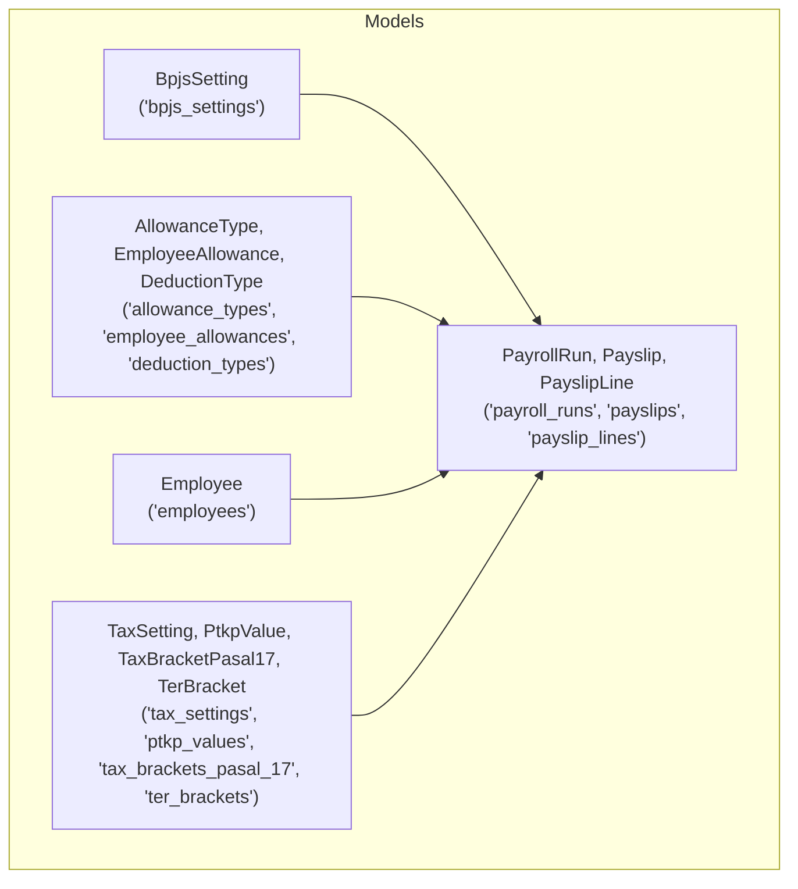
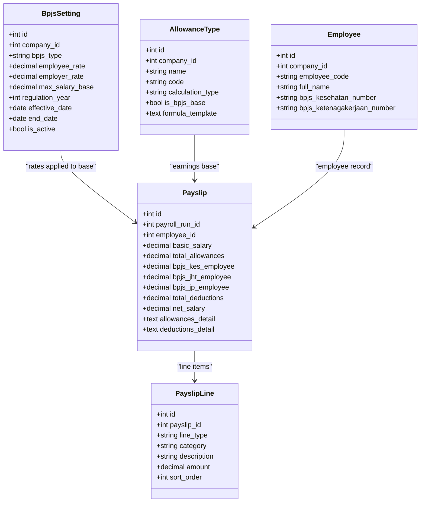
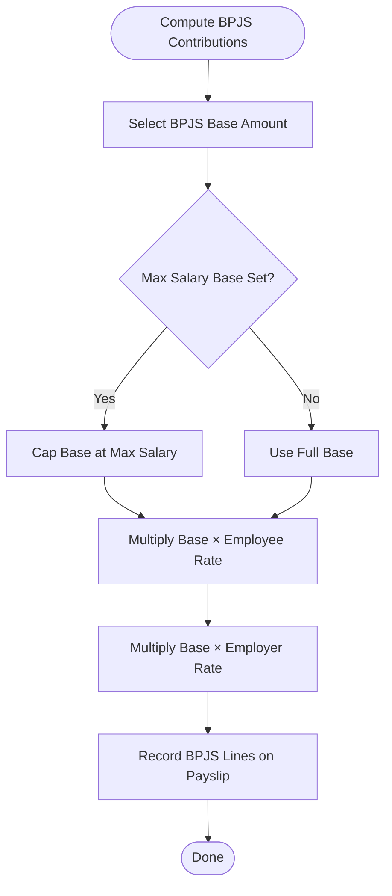
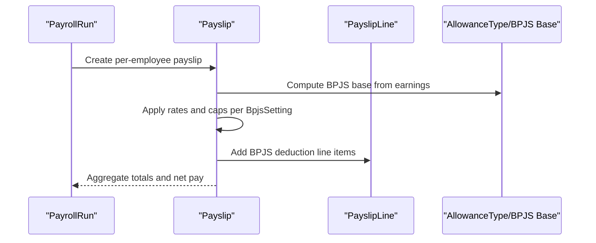
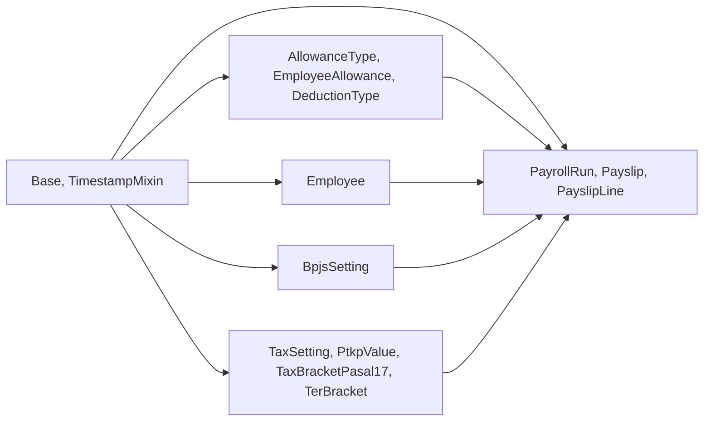

# BPJS Integration

<cite>
**Referenced Files in This Document**
- [bpjs.py](file://app/models/bpjs.py)
- [payroll.py](file://app/models/payroll.py)
- [salary.py](file://app/models/salary.py)
- [employee.py](file://app/models/employee.py)
- [tax.py](file://app/models/tax.py)
- [seed_data.py](file://app/seed/seed_data.py)
- [base.py](file://app/models/base.py)
- [__init__.py](file://app/models/__init__.py)
- [database.py](file://app/database.py)
</cite>

## Table of Contents
1. [Introduction](#introduction)
2. [Project Structure](#project-structure)
3. [Core Components](#core-components)
4. [Architecture Overview](#architecture-overview)
5. [Detailed Component Analysis](#detailed-component-analysis)
6. [Dependency Analysis](#dependency-analysis)
7. [Performance Considerations](#performance-considerations)
8. [Troubleshooting Guide](#troubleshooting-guide)
9. [Conclusion](#conclusion)
10. [Appendices](#appendices)

## Introduction
This document explains the BPJS (social security) integration within the Payroll & HRIS system. It covers BPJS settings management, contribution calculation methods, administration of social security contributions, and employee benefit tracking. It also documents the integration with payroll processing, tax calculations, and employee benefit management, along with regulatory compliance features such as contribution rates, salary caps, and effective dates.

## Project Structure
The BPJS integration spans several model modules:
- BPJS configuration and settings
- Payroll computation and payslip generation
- Allowance and deduction configuration affecting BPJS bases
- Employee master data with BPJS identifiers
- Tax settings and brackets (complementary to income tax processing)
- Seed data for default BPJS settings aligned to Indonesian regulations

**Diagram sources**
- [bpjs.py:17-43](file://app/models/bpjs.py#L17-L43)
- [payroll.py:19-123](file://app/models/payroll.py#L19-L123)
- [salary.py:62-135](file://app/models/salary.py#L62-L135)
- [employee.py:76-132](file://app/models/employee.py#L76-L132)
- [tax.py:19-115](file://app/models/tax.py#L19-L115)

**Section sources**
- [bpjs.py:1-44](file://app/models/bpjs.py#L1-L44)
- [payroll.py:1-124](file://app/models/payroll.py#L1-L124)
- [salary.py:1-135](file://app/models/salary.py#L1-L135)
- [employee.py:1-132](file://app/models/employee.py#L1-L132)
- [tax.py:1-115](file://app/models/tax.py#L1-L115)

## Core Components
- BpjsSetting: Stores BPJS contribution rates, employer/employee split, optional salary caps, regulation year, and effective/end dates. Enforces valid BPJS types and uniqueness per company/type/effective date.
- PayrollRun, Payslip, PayslipLine: Manage batch payroll runs, individual payslips, and line items. Includes dedicated fields for BPJS contributions per employee and categorization of line items including BPJS.
- AllowanceType: Supports configurable allowance types with a flag indicating whether the allowance contributes to BPJS bases. Used to compute earnings that form the BPJS salary base.
- Employee: Holds employee identifiers for BPJS programs and demographic data used in HRIS.
- Tax models: Provide complementary tax configuration and brackets used alongside BPJS during payroll computation.

Key implementation references:
- [BpjsSetting definition:17-43](file://app/models/bpjs.py#L17-L43)
- [PayrollRun, Payslip, PayslipLine fields:19-123](file://app/models/payroll.py#L19-L123)
- [AllowanceType.is_bpjs_base flag:72-77](file://app/models/salary.py#L72-L77)
- [Employee BPJS number fields:109-112](file://app/models/employee.py#L109-L112)
- [TaxSetting and brackets:19-115](file://app/models/tax.py#L19-L115)

**Section sources**
- [bpjs.py:17-43](file://app/models/bpjs.py#L17-L43)
- [payroll.py:64-123](file://app/models/payroll.py#L64-L123)
- [salary.py:62-85](file://app/models/salary.py#L62-L85)
- [employee.py:76-112](file://app/models/employee.py#L76-L112)
- [tax.py:19-115](file://app/models/tax.py#L19-L115)

## Architecture Overview
The BPJS integration is designed around:
- Regulatory configuration via BpjsSetting
- Earnings and deductions that influence the BPJS base
- Payroll computation that applies rates to the base and records per-line items
- Employee records that track BPJS identifiers
- Tax configuration that complements income tax processing

**Diagram sources**
- [bpjs.py:17-43](file://app/models/bpjs.py#L17-L43)
- [payroll.py:64-123](file://app/models/payroll.py#L64-L123)
- [salary.py:62-85](file://app/models/salary.py#L62-L85)
- [employee.py:76-112](file://app/models/employee.py#L76-L112)

## Detailed Component Analysis

### BPJS Settings Management
- Purpose: Define contribution rates, employer/employee split, optional salary caps, and validity periods per BPJS program type.
- Valid types: KESEHATAN, JHT, JP, JKK, JKM.
- Constraints: Enforce valid types, uniqueness by company/type/effective date, and indexing for active lookups.
- Regulatory alignment: Includes regulation year and effective/end dates for compliance.

Example configuration references:
- [BpjsSetting schema and constraints:17-43](file://app/models/bpjs.py#L17-L43)
- [Default 2024 BPJS settings seeding:299-332](file://app/seed/seed_data.py#L299-L332)

**Section sources**
- [bpjs.py:17-43](file://app/models/bpjs.py#L17-L43)
- [seed_data.py:299-332](file://app/seed/seed_data.py#L299-L332)

### Contribution Calculation Methods
- Base determination: Sum of earnings that count toward BPJS (e.g., basic salary and applicable allowances marked as BPJS bases).
- Rate application: Employee and employer portions computed using configured rates per BPJS type.
- Cap enforcement: If a maximum salary base is defined for a type, calculations cap at that value.
- Line item recording: Deductible employee contributions are recorded on payslips and as BPJS-type line items.

References:
- [Payslip fields for BPJS contributions:73-80](file://app/models/payroll.py#L73-L80)
- [PayslipLine line_type constraint including BPJS:119-122](file://app/models/payroll.py#L119-L122)
- [AllowanceType.is_bpjs_base flag:72-77](file://app/models/salary.py#L72-L77)

**Diagram sources**
- [payroll.py:73-80](file://app/models/payroll.py#L73-L80)
- [payroll.py:119-122](file://app/models/payroll.py#L119-L122)
- [salary.py:72-77](file://app/models/salary.py#L72-L77)

**Section sources**
- [payroll.py:64-123](file://app/models/payroll.py#L64-L123)
- [salary.py:62-85](file://app/models/salary.py#L62-L85)

### Social Security Contribution Administration
- Administration scope: Rates and caps are managed per company and effective date, enabling historical tracking and future updates.
- Active selection: Index on company, type, and active flag supports efficient retrieval of current settings.
- Compliance: Regulation year and effective dates ensure adherence to regulatory timelines.

References:
- [BpjsSetting indexes and constraints:33-42](file://app/models/bpjs.py#L33-L42)

**Section sources**
- [bpjs.py:33-42](file://app/models/bpjs.py#L33-L42)

### Employee Benefit Tracking
- Employee identifiers: Fields for BPJS Kesehatan and Ketenagakerjaan numbers enable tracking and reporting.
- Payslip linkage: Employee-specific BPJS contributions are recorded on each payslip for auditability.

References:
- [Employee BPJS number fields:109-112](file://app/models/employee.py#L109-L112)
- [Payslip BPJS fields:73-80](file://app/models/payroll.py#L73-L80)

**Section sources**
- [employee.py:109-112](file://app/models/employee.py#L109-L112)
- [payroll.py:73-80](file://app/models/payroll.py#L73-L80)

### Integration with Payroll Processing
- PayrollRun: Batch-level metadata and totals for a payroll period.
- Payslip: Per-employee computation of gross, deductions, taxes, and net pay, including BPJS contributions.
- PayslipLine: Categorization of line items including BPJS entries for transparency.

References:
- [PayrollRun schema:19-61](file://app/models/payroll.py#L19-L61)
- [Payslip schema:64-102](file://app/models/payroll.py#L64-L102)
- [PayslipLine schema:105-123](file://app/models/payroll.py#L105-L123)

**Diagram sources**
- [payroll.py:19-123](file://app/models/payroll.py#L19-L123)
- [salary.py:62-85](file://app/models/salary.py#L62-L85)
- [bpjs.py:17-43](file://app/models/bpjs.py#L17-L43)

**Section sources**
- [payroll.py:19-123](file://app/models/payroll.py#L19-L123)
- [salary.py:62-85](file://app/models/salary.py#L62-L85)
- [bpjs.py:17-43](file://app/models/bpjs.py#L17-L43)

### Tax Calculations and Income Tax Alignment
- TaxSetting defines the method (PASAL_17 or TER) used company-wide.
- PtkpValue and TaxBracketPasal17/TerBracket define thresholds and rates for income tax computation.
- While separate from BPJS, both systems operate within the same payslip lifecycle.

References:
- [TaxSetting:19-34](file://app/models/tax.py#L19-L34)
- [PtkpValue:37-60](file://app/models/tax.py#L37-L60)
- [TaxBracketPasal17:63-85](file://app/models/tax.py#L63-L85)
- [TerBracket:88-114](file://app/models/tax.py#L88-L114)

**Section sources**
- [tax.py:19-115](file://app/models/tax.py#L19-L115)

### Regulatory Compliance Features
- Type validation: Only predefined BPJS types are permitted.
- Uniqueness: One active setting per company/type/effective date.
- Effective dating: Historical compliance maintained via effective/end dates and regulation year.
- Indexing: Efficient lookup of active settings by company and type.

References:
- [BpjsSetting constraints and indexes:33-42](file://app/models/bpjs.py#L33-L42)

**Section sources**
- [bpjs.py:33-42](file://app/models/bpjs.py#L33-L42)

### Concrete Examples

#### Example 1: BPJS Setting Configuration
- Configure KESEHATAN with employee rate, employer rate, and maximum salary base for a company.
- Set effective date and regulation year to align with Indonesian regulations.
- Ensure uniqueness by company/type/effective date.

References:
- [BpjsSetting fields and constraints:22-31](file://app/models/bpjs.py#L22-L31)
- [Default 2024 seeding:299-332](file://app/seed/seed_data.py#L299-L332)

**Section sources**
- [bpjs.py:22-31](file://app/models/bpjs.py#L22-L31)
- [seed_data.py:299-332](file://app/seed/seed_data.py#L299-L332)

#### Example 2: Contribution Calculation
- Determine BPJS base from basic salary and applicable allowances flagged as BPJS bases.
- Apply employee and employer rates per BpjsSetting.
- Cap at max salary base if defined.
- Record BPJS lines on the payslip.

References:
- [Payslip BPJS fields:73-80](file://app/models/payroll.py#L73-L80)
- [AllowanceType.is_bpjs_base:72-77](file://app/models/salary.py#L72-L77)
- [PayslipLine BPJS type:119-122](file://app/models/payroll.py#L119-L122)

**Section sources**
- [payroll.py:73-80](file://app/models/payroll.py#L73-L80)
- [salary.py:72-77](file://app/models/salary.py#L72-L77)
- [payroll.py:119-122](file://app/models/payroll.py#L119-L122)

#### Example 3: Benefit Enrollment Tracking
- Store employee BPJS numbers in the Employee record.
- Reference these numbers on the payslip for audit trails.

References:
- [Employee BPJS number fields:109-112](file://app/models/employee.py#L109-L112)
- [Payslip fields:73-80](file://app/models/payroll.py#L73-L80)

**Section sources**
- [employee.py:109-112](file://app/models/employee.py#L109-L112)
- [payroll.py:73-80](file://app/models/payroll.py#L73-L80)

#### Example 4: Contribution Deduction Processing
- Create payslip line items categorized as BPJS for employee deductions.
- Aggregate total deductions and net pay accordingly.

References:
- [PayslipLine line_type constraint:119-122](file://app/models/payroll.py#L119-L122)
- [Payslip totals and deductions:73-84](file://app/models/payroll.py#L73-L84)

**Section sources**
- [payroll.py:119-122](file://app/models/payroll.py#L119-L122)
- [payroll.py:73-84](file://app/models/payroll.py#L73-L84)

## Dependency Analysis
- BpjsSetting depends on Base and TimestampMixin for ORM and auditing.
- Payslip depends on PayrollRun and Employee for relationships and computation.
- AllowanceType influences BPJS base computation and is part of the earnings aggregation.
- Tax models are independent but integrated within the same payslip lifecycle.

**Diagram sources**
- [base.py:18-57](file://app/models/base.py#L18-L57)
- [bpjs.py:17-43](file://app/models/bpjs.py#L17-L43)
- [payroll.py:19-123](file://app/models/payroll.py#L19-L123)
- [salary.py:62-135](file://app/models/salary.py#L62-L135)
- [employee.py:76-132](file://app/models/employee.py#L76-L132)
- [tax.py:19-115](file://app/models/tax.py#L19-L115)

**Section sources**
- [base.py:18-57](file://app/models/base.py#L18-L57)
- [__init__.py:17-33](file://app/models/__init__.py#L17-L33)

## Performance Considerations
- Indexes on company, type, and active flag in BpjsSetting enable fast retrieval of current settings.
- Unique constraints prevent redundant configurations and maintain data integrity.
- Separation of concerns keeps computations modular; ensure efficient joins when aggregating earnings for BPJS base.

[No sources needed since this section provides general guidance]

## Troubleshooting Guide
- Duplicate BPJS settings: Check uniqueness constraint by company/type/effective date.
- Invalid BPJS type: Verify against allowed values (KESEHATAN, JHT, JP, JKK, JKM).
- Missing active settings: Confirm index usage and is_active flag for current configuration.
- Incorrect contribution amounts: Validate base earnings, rate application, and cap enforcement.

References:
- [BpjsSetting constraints and indexes:33-42](file://app/models/bpjs.py#L33-L42)
- [PayslipLine line_type constraint:119-122](file://app/models/payroll.py#L119-L122)

**Section sources**
- [bpjs.py:33-42](file://app/models/bpjs.py#L33-L42)
- [payroll.py:119-122](file://app/models/payroll.py#L119-L122)

## Conclusion
The BPJS integration provides a structured, compliant framework for managing social security contributions. It separates regulatory configuration from computation, integrates with payroll and tax systems, and maintains auditability through explicit line items and employee identifiers. The design supports historical tracking, active setting selection, and scalable extension for additional BPJS types or regulatory changes.

[No sources needed since this section summarizes without analyzing specific files]

## Appendices

### Appendix A: Database Initialization
- Initializes all tables including BPJS settings, payroll, salary, and tax models.

References:
- [Database initialization:56-63](file://app/database.py#L56-L63)
- [Model package exports:17-68](file://app/models/__init__.py#L17-L68)

**Section sources**
- [database.py:56-63](file://app/database.py#L56-L63)
- [__init__.py:17-68](file://app/models/__init__.py#L17-L68)