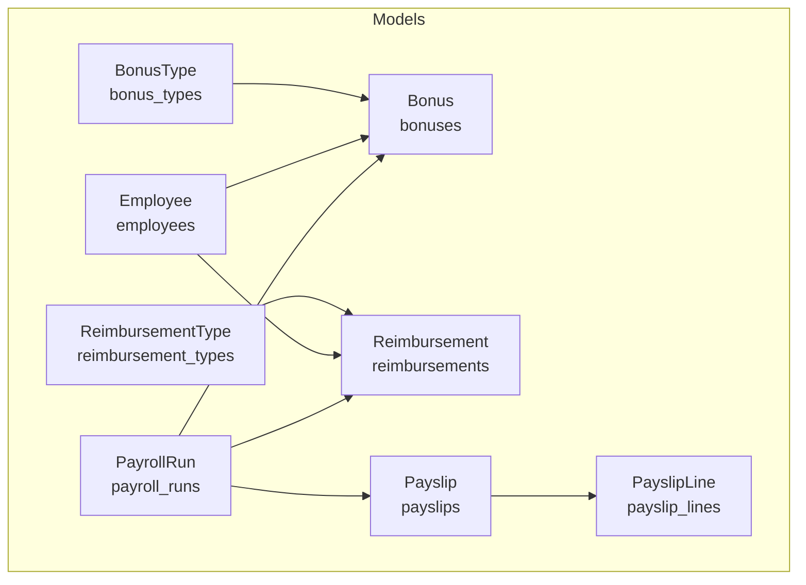
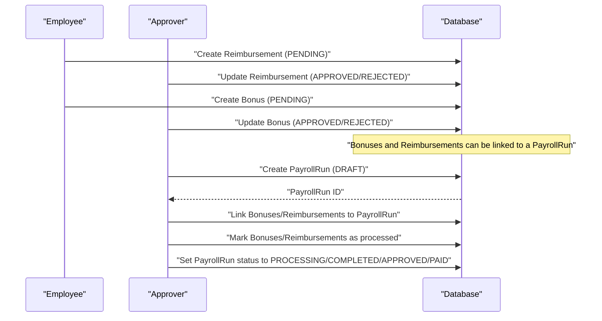
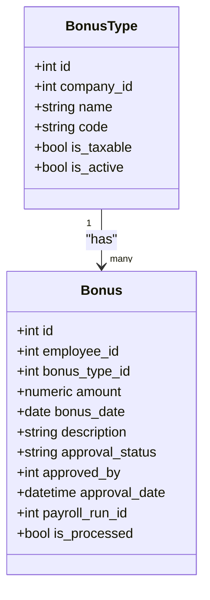
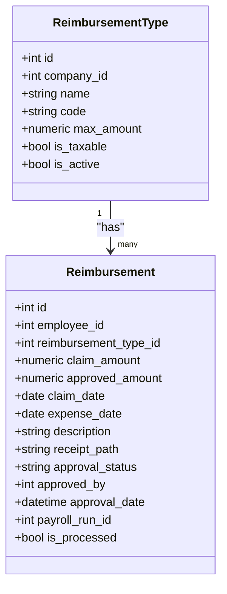
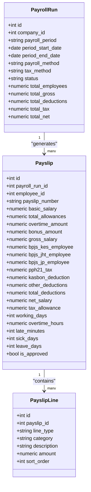
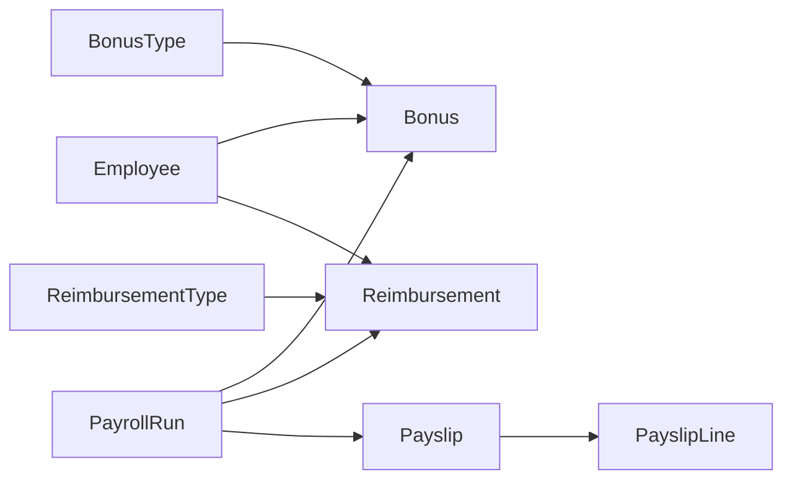

# Bonus & Reimbursement

<cite>
**Referenced Files in This Document**
- [bonus.py](file://app/models/bonus.py)
- [payroll.py](file://app/models/payroll.py)
- [salary.py](file://app/models/salary.py)
- [employee.py](file://app/models/employee.py)
- [base.py](file://app/models/base.py)
- [database.py](file://app/database.py)
</cite>

## Table of Contents
1. [Introduction](#introduction)
2. [Project Structure](#project-structure)
3. [Core Components](#core-components)
4. [Architecture Overview](#architecture-overview)
5. [Detailed Component Analysis](#detailed-component-analysis)
6. [Dependency Analysis](#dependency-analysis)
7. [Performance Considerations](#performance-considerations)
8. [Troubleshooting Guide](#troubleshooting-guide)
9. [Conclusion](#conclusion)
10. [Appendices](#appendices)

## Introduction
This document explains the bonus and reimbursement management system within the Payroll & HRIS platform. It covers:
- Bonus types and individual bonus records
- Reimbursement types and employee claims
- Approval workflows and payroll integration
- Data models, constraints, and indexes
- Practical examples for setup, calculation, distribution, and processing
- Integration touchpoints with payroll processing and financial accounting

Where applicable, the document references the exact model definitions and constraints that govern behavior.

## Project Structure
The bonus and reimbursement domain is implemented as SQLAlchemy models under the models package. Supporting models for payroll, salary structure, and employees provide integration points. The database engine and session management are centralized for consistent access.

**Diagram sources**
- [bonus.py:20-122](file://app/models/bonus.py#L20-L122)
- [payroll.py:19-124](file://app/models/payroll.py#L19-L124)
- [employee.py:76-132](file://app/models/employee.py#L76-L132)

**Section sources**
- [bonus.py:1-122](file://app/models/bonus.py#L1-L122)
- [payroll.py:1-124](file://app/models/payroll.py#L1-L124)
- [employee.py:1-132](file://app/models/employee.py#L1-L132)
- [database.py:1-63](file://app/database.py#L1-L63)

## Core Components
This section outlines the entities and their roles in the bonus and reimbursement lifecycle.

- BonusType: Defines configurable bonus categories (taxable/inactive flags, company-scoped code/name uniqueness).
- Bonus: Individual award records linked to an employee and bonus type, with approval and payroll linkage.
- ReimbursementType: Configures expense categories (optional caps, taxable flag, company-scoped code/name uniqueness).
- Reimbursement: Employee claims with amounts, dates, receipts, approvals, and payroll linkage.
- PayrollRun: Batch processing unit that aggregates earnings/deductions for payslips.
- Payslip: Per-employee summary of gross, taxes, deductions, and net pay.
- PayslipLine: Line items (earnings, deductions, taxes, BPJS, net) for traceability.
- Employee: Master data for individuals, including department, position, grade, and employment status.

Key constraints and indexes ensure data integrity and efficient queries:
- Positive amount checks for bonuses and reimbursements
- Approval status enums enforced
- Unique constraints on company+code combinations
- Indexed foreign keys and date fields for performance

**Section sources**
- [bonus.py:20-122](file://app/models/bonus.py#L20-L122)
- [payroll.py:19-124](file://app/models/payroll.py#L19-L124)
- [employee.py:76-132](file://app/models/employee.py#L76-L132)

## Architecture Overview
The bonus and reimbursement system integrates with payroll processing through shared foreign keys to PayrollRun. Approvals are tracked per record, and processed records are marked for inclusion in a payroll run.

**Diagram sources**
- [bonus.py:40-68](file://app/models/bonus.py#L40-L68)
- [bonus.py:92-122](file://app/models/bonus.py#L92-L122)
- [payroll.py:19-61](file://app/models/payroll.py#L19-L61)

## Detailed Component Analysis

### Bonus Types and Records
- BonusType: Company-scoped classification with code/name uniqueness, taxable flag, and activation toggle.
- Bonus: Per-employee award with amount, date, description, approval metadata, optional payroll linkage, and processed flag.

Approval workflow:
- Status transitions: PENDING → APPROVED | REJECTED
- Approved_by and approval_date capture approver actions
- After approval, bonuses can be included in a PayrollRun and marked processed

Processing pipeline:
- Select bonuses for a PayrollRun period
- Aggregate by employee and insert earnings into payslips
- Mark bonuses as processed upon successful inclusion

**Diagram sources**
- [bonus.py:20-68](file://app/models/bonus.py#L20-L68)

**Section sources**
- [bonus.py:20-68](file://app/models/bonus.py#L20-L68)

### Reimbursement Types and Claims
- ReimbursementType: Expense categories with optional maximum amount, taxable flag, and company-scoped code/name uniqueness.
- Reimbursement: Claim submission with claim and expense dates, receipt path, claim amount, approved amount, approval metadata, optional payroll linkage, and processed flag.

Approval workflow:
- Status transitions: PENDING → APPROVED | REJECTED
- Approved amount may differ from claim amount
- Approved_by and approval_date capture approver actions
- After approval, claims can be included in a PayrollRun and marked processed

Processing pipeline:
- Select reimbursements for a PayrollRun period
- Insert approved amounts as earnings or adjustments in payslips
- Mark claims as processed upon successful inclusion

**Diagram sources**
- [bonus.py:71-122](file://app/models/bonus.py#L71-L122)

**Section sources**
- [bonus.py:71-122](file://app/models/bonus.py#L71-L122)

### Payroll Integration
- PayrollRun: Batch run with period, method (gross/nett), tax method, and status lifecycle.
- Payslip: Per-employee summary including bonus_amount and other components.
- PayslipLine: Detailed line items categorized as earnings, deductions, taxes, BPJS, or net.

Integration points:
- Bonuses and Reimbursements reference PayrollRun via payroll_run_id
- After approval and processing, records are linked to a PayrollRun and marked processed
- PayrollRun status progression supports downstream accounting and payment flows

**Diagram sources**
- [payroll.py:19-124](file://app/models/payroll.py#L19-L124)

**Section sources**
- [payroll.py:19-124](file://app/models/payroll.py#L19-L124)

### Salary Structure Context (Allowances)
While not directly part of bonuses/reimbursements, allowance types and employee assignments inform compensation design and can influence bonus eligibility or thresholds in broader policies.

- AllowanceType: Calculation types (fixed, percentage, formula), taxable flags, and formula templates.
- EmployeeAllowance: Effective-date-based assignments.

These models provide a foundation for designing bonus-linked allowances or formulas.

**Section sources**
- [salary.py:62-135](file://app/models/salary.py#L62-L135)

### Employee Context
Employee master data ties bonus and reimbursement records to organizational units and statuses.

- Employee: Company, department, position, grade, employment status, and contact details.

**Section sources**
- [employee.py:76-132](file://app/models/employee.py#L76-L132)

## Dependency Analysis
The following diagram shows how bonus/reimbursement entities relate to payroll and employees.

**Diagram sources**
- [bonus.py:20-122](file://app/models/bonus.py#L20-L122)
- [payroll.py:19-124](file://app/models/payroll.py#L19-L124)
- [employee.py:76-132](file://app/models/employee.py#L76-L132)

**Section sources**
- [bonus.py:20-122](file://app/models/bonus.py#L20-L122)
- [payroll.py:19-124](file://app/models/payroll.py#L19-L124)
- [employee.py:76-132](file://app/models/employee.py#L76-L132)

## Performance Considerations
- Indexed foreign keys and date fields reduce query latency for filtering by employee, date, and status.
- Unique constraints on company+code prevent duplicates and support fast lookups.
- Positive amount checks and enum constraints avoid invalid data and simplify downstream calculations.
- Consider partitioning or range indexing for large-scale payroll periods.

## Troubleshooting Guide
Common issues and resolutions:
- Invalid approval status: Ensure status updates conform to PENDING/APPROVED/REJECTED.
- Non-positive amounts: Verify claim and bonus amounts exceed zero.
- Missing payroll linkage: Confirm PayrollRun exists and records are linked before marking processed.
- Duplicate codes: Check company+code uniqueness for types.
- Receipt path issues: Validate storage and access permissions for uploaded files.

Operational controls:
- Use PayrollRun status transitions to track progress from draft to paid.
- Audit logs can be leveraged to track approval actions and changes.

**Section sources**
- [bonus.py:57-68](file://app/models/bonus.py#L57-L68)
- [bonus.py:112-122](file://app/models/bonus.py#L112-L122)
- [payroll.py:45-61](file://app/models/payroll.py#L45-L61)

## Conclusion
The bonus and reimbursement system is modeled around approval-driven records with clear linkage to payroll processing. Type configurations enable flexible categorization, while constraints and indexes ensure data integrity and performance. Integration with PayrollRun and Payslip/PayslipLine provides a robust pathway to financial accounting and payment processing.

## Appendices

### Example Scenarios

- Setup: Create a BonusType and a ReimbursementType with company-scoped codes and desired flags.
  - Reference: [bonus.py:20-37](file://app/models/bonus.py#L20-L37), [bonus.py:71-89](file://app/models/bonus.py#L71-L89)

- Claim: An employee submits a Reimbursement with claim amount, dates, and receipt path; status starts as PENDING.
  - Reference: [bonus.py:92-122](file://app/models/bonus.py#L92-L122)

- Approval: Supervisor approves or rejects the claim; approved amount may differ from claim amount.
  - Reference: [bonus.py:106-110](file://app/models/bonus.py#L106-L110)

- Distribution: Link approved bonuses and reimbursements to a PayrollRun; mark as processed; update PayrollRun status.
  - References: [bonus.py](file://app/models/bonus.py#L54), [bonus.py](file://app/models/bonus.py#L109), [payroll.py](file://app/models/payroll.py#L31)

- Payslip integration: Bonus and approved reimbursement amounts appear as earnings on the payslip; detailed line items recorded.
  - References: [payroll.py](file://app/models/payroll.py#L76), [payroll.py:105-123](file://app/models/payroll.py#L105-L123)

- Formula-based allowance context: AllowanceType supports formula templates that can inform policy design for variable bonus components.
  - Reference: [salary.py](file://app/models/salary.py#L75)

### Data Model Constraints Summary
- Bonuses: amount > 0; approval_status ∈ {PENDING, APPROVED, REJECTED}
- Reimbursements: claim_amount > 0; approval_status ∈ {PENDING, APPROVED, REJECTED}
- PayrollRun: payroll_method ∈ {GROSS, NETT}; tax_method ∈ {PASAL_17, TER}; status ∈ {DRAFT, PROCESSING, COMPLETED, APPROVED, PAID}
- PayslipLine: line_type ∈ {EARNING, DEDUCTION, TAX, BPJS, NET}

**Section sources**
- [bonus.py:57-68](file://app/models/bonus.py#L57-L68)
- [bonus.py:112-122](file://app/models/bonus.py#L112-L122)
- [payroll.py:45-61](file://app/models/payroll.py#L45-L61)
- [payroll.py:118-123](file://app/models/payroll.py#L118-L123)