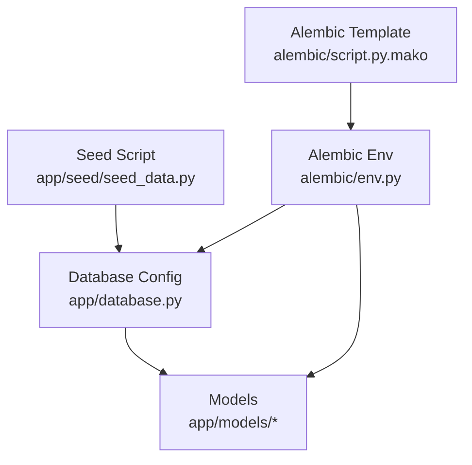
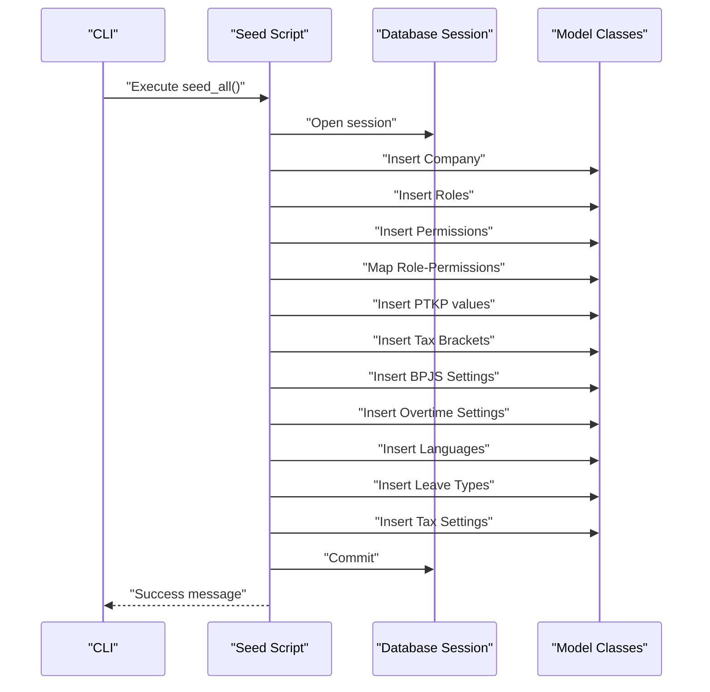
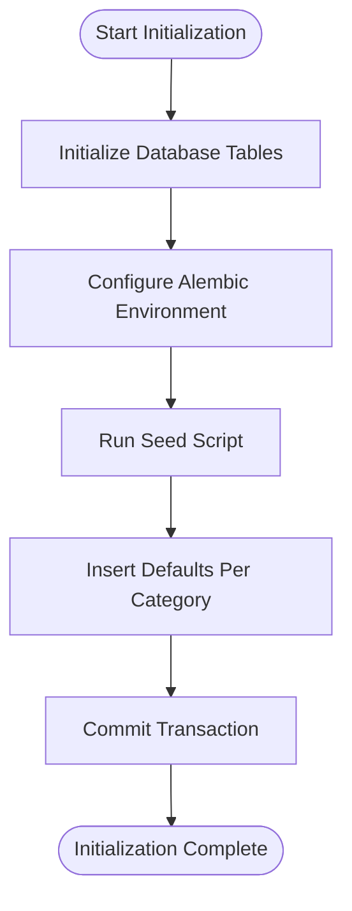
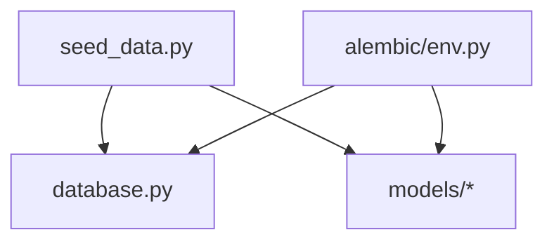

# Data Seeding & Configuration

<cite>
**Referenced Files in This Document**
- [seed_data.py](file://app/seed/seed_data.py)
- [env.py](file://alembic/env.py)
- [script.py.mako](file://alembic/script.py.mako)
- [database.py](file://app/database.py)
- [base.py](file://app/models/base.py)
- [tax.py](file://app/models/tax.py)
- [bpjs.py](file://app/models/bpjs.py)
- [leave.py](file://app/models/leave.py)
- [employee.py](file://app/models/employee.py)
- [payroll.py](file://app/models/payroll.py)
</cite>

## Table of Contents
1. [Introduction](#introduction)
2. [Project Structure](#project-structure)
3. [Core Components](#core-components)
4. [Architecture Overview](#architecture-overview)
5. [Detailed Component Analysis](#detailed-component-analysis)
6. [Dependency Analysis](#dependency-analysis)
7. [Performance Considerations](#performance-considerations)
8. [Troubleshooting Guide](#troubleshooting-guide)
9. [Conclusion](#conclusion)
10. [Appendices](#appendices)

## Introduction
This document explains the data seeding and configuration system for the Indonesian Payroll & HRIS platform. It covers how seed data is structured, how Indonesian regulations are configured (PTKP, Pasal 17 tax brackets, BPJS settings), default system settings, and how initial data is populated. It also documents the relationship between seed data and system functionality, and how to customize default configurations for different organizations.

## Project Structure
The seeding system is organized around:
- A central seed script that orchestrates insertion of default data
- Database configuration and session management
- Alembic migration environment for schema alignment
- Model definitions that represent the data structures seeded

**Diagram sources**
- [seed_data.py](file://app/seed/seed_data.py)
- [database.py](file://app/database.py)
- [env.py](file://alembic/env.py)
- [script.py.mako](file://alembic/script.py.mako)

**Section sources**
- [seed_data.py](file://app/seed/seed_data.py)
- [database.py](file://app/database.py)
- [env.py](file://alembic/env.py)
- [script.py.mako](file://alembic/script.py.mako)

## Core Components
- Seed orchestration: The main function coordinates seeding of default data in a deterministic order and is idempotent.
- Regulatory defaults: PTKP thresholds, Pasal 17 tax brackets, and BPJS contribution settings for the current regulation year.
- Operational defaults: Company profile, roles, permissions, role-permission mappings, languages, leave types, and tax method.
- Database and migrations: SQLite-backed sessions with Alembic offline/online migrations and batch rendering for SQLite compatibility.

Key responsibilities:
- Populate Indonesian payroll compliance defaults
- Establish baseline system configuration for roles, permissions, and company settings
- Provide extensible defaults that can be customized per organization

**Section sources**
- [seed_data.py](file://app/seed/seed_data.py)
- [database.py](file://app/database.py)
- [env.py](file://alembic/env.py)

## Architecture Overview
The seeding pipeline integrates with the database and models to initialize the system with Indonesian regulation-aligned defaults.

**Diagram sources**
- [seed_data.py](file://app/seed/seed_data.py)
- [database.py](file://app/database.py)

## Detailed Component Analysis

### Seed Orchestration and Idempotency
- The main function orchestrates seeding in a fixed order and checks for existing records before inserting new ones.
- Each seeding step is isolated and prints progress messages for traceability.
- The script handles exceptions and ensures rollback and closure of the database session.

Concrete execution example:
- Run the script directly to seed all defaults in a single transaction.

Customization tip:
- To adapt defaults for another organization, modify the seed steps to reflect local regulations or company-specific policies.

**Section sources**
- [seed_data.py](file://app/seed/seed_data.py)

### Default Company Setup
- Creates a default company record with standard attributes such as work week days, payroll method, and default language.
- Idempotency: Skips insertion if a company with the same identifying criteria exists.

Relationship to functionality:
- Many other seeded entities (e.g., PTKP, tax brackets, BPJS, leave types) are scoped to a company and rely on this default company being present.

**Section sources**
- [seed_data.py](file://app/seed/seed_data.py)

### Roles and Permissions
- Seeds six predefined roles with distinct scopes.
- Generates a comprehensive set of resource-action permission entries.
- Maps roles to permissions according to predefined policy rules.

Policy highlights:
- Administrator receives all permissions.
- Payroll Master gets broad access to payroll, tax, and reporting domains.
- Operator manages employee, attendance, leave, and bonus data.
- Reporting role is read-only except for report-related actions.
- Payment role focuses on payroll approval and reporting.
- Employee role supports self-service access.

Validation example:
- Verify that role-permission mappings align with the intended access matrix.

**Section sources**
- [seed_data.py](file://app/seed/seed_data.py)

### Indonesian Regulatory Defaults

#### PTKP Values (2024 Regulation)
- Inserts PTKP thresholds grouped by marital status and number of dependents.
- Includes annual and monthly amounts, regulation year, and effective date.
- Uniqueness constraints ensure only one active set per company per effective date.

Impact:
- Used by tax calculation routines to derive tax-free allowances per employee.

**Section sources**
- [seed_data.py](file://app/seed/seed_data.py)
- [tax.py](file://app/models/tax.py)

#### Tax Brackets Pasal 17 (2024 UU HPP)
- Seeds progressive tax brackets with minimum and maximum income ranges and tax rates.
- Supports unbounded upper limits for the top bracket.
- Effective date and regulation year are recorded for auditability.

Impact:
- Drives the computation of income tax based on taxable income.

**Section sources**
- [seed_data.py](file://app/seed/seed_data.py)
- [tax.py](file://app/models/tax.py)

#### BPJS Settings (2024)
- Seeds contribution rates and optional maximum salary bases for KESEHATAN, JHT, JP, JKK, and JKM.
- Applies regulation year and effective date for compliance tracking.

Impact:
- Supplies contribution calculations for statutory social insurance.

**Section sources**
- [seed_data.py](file://app/seed/seed_data.py)
- [bpjs.py](file://app/models/bpjs.py)

### Operational Defaults

#### Overtime Settings
- Defines multipliers for weekday and weekend overtime hours and sets late penalties.
- Provides a standardized baseline for payroll calculations requiring overtime rules.

**Section sources**
- [seed_data.py](file://app/seed/seed_data.py)

#### Supported Languages
- Seeds Indonesian and English with one default language marked.

**Section sources**
- [seed_data.py](file://app/seed/seed_data.py)

#### Leave Types
- Seeds standard leave categories with default entitlements and paid/unpaid indicators.
- Requires approval by default and is active.

**Section sources**
- [seed_data.py](file://app/seed/seed_data.py)
- [leave.py](file://app/models/leave.py)

#### Tax Method Setting
- Sets the default tax calculation method to Pasal 17 for the company.

**Section sources**
- [seed_data.py](file://app/seed/seed_data.py)
- [tax.py](file://app/models/tax.py)

### Data Initialization Procedures
- Database initialization creates all model tables.
- Alembic environment supports offline and online migrations with batch rendering for SQLite compatibility.
- The seed script relies on a session factory and commits all inserts atomically.

**Diagram sources**
- [database.py](file://app/database.py)
- [env.py](file://alembic/env.py)
- [seed_data.py](file://app/seed/seed_data.py)

**Section sources**
- [database.py](file://app/database.py)
- [env.py](file://alembic/env.py)
- [script.py.mako](file://alembic/script.py.mako)
- [seed_data.py](file://app/seed/seed_data.py)

## Dependency Analysis
The seed script depends on:
- Database session factory for transactions
- Model classes for entity creation
- Alembic environment for schema alignment

**Diagram sources**
- [seed_data.py](file://app/seed/seed_data.py)
- [database.py](file://app/database.py)
- [env.py](file://alembic/env.py)

**Section sources**
- [seed_data.py](file://app/seed/seed_data.py)
- [database.py](file://app/database.py)
- [env.py](file://alembic/env.py)

## Performance Considerations
- Idempotency checks reduce redundant writes and improve safety during repeated runs.
- Batch insertions (e.g., permissions, PTKP, tax brackets, BPJS) minimize round-trips.
- SQLite foreign key enforcement is enabled at connection level to maintain referential integrity.

## Troubleshooting Guide
Common issues and resolutions:
- Duplicate entries: The seed script skips existing records; verify that uniqueness constraints are satisfied.
- Missing company: Some entities require a company; ensure the default company is created first.
- Migration conflicts: Use Alembic offline/online modes to align schema before seeding.
- Transaction failures: The script rolls back on errors; inspect logs and fix underlying constraint violations.

**Section sources**
- [seed_data.py](file://app/seed/seed_data.py)
- [env.py](file://alembic/env.py)

## Conclusion
The seeding and configuration system establishes a robust baseline aligned with Indonesian payroll regulations while providing a flexible foundation for customization. By organizing defaults into discrete categories and enforcing idempotency, the system ensures predictable initialization and easy adaptation for diverse organizational needs.

## Appendices

### Seed Data Execution Examples
- Execute the seed script to populate all defaults in a single run.
- After seeding, verify that company, roles, permissions, and regulatory settings exist in the database.

### Customizing Default Configurations
- Modify the seed script to adjust PTKP thresholds, tax brackets, BPJS rates, or leave entitlements.
- Update role-permission mappings to reflect local access control policies.
- Change default company settings (e.g., payroll method, language) to match organizational preferences.