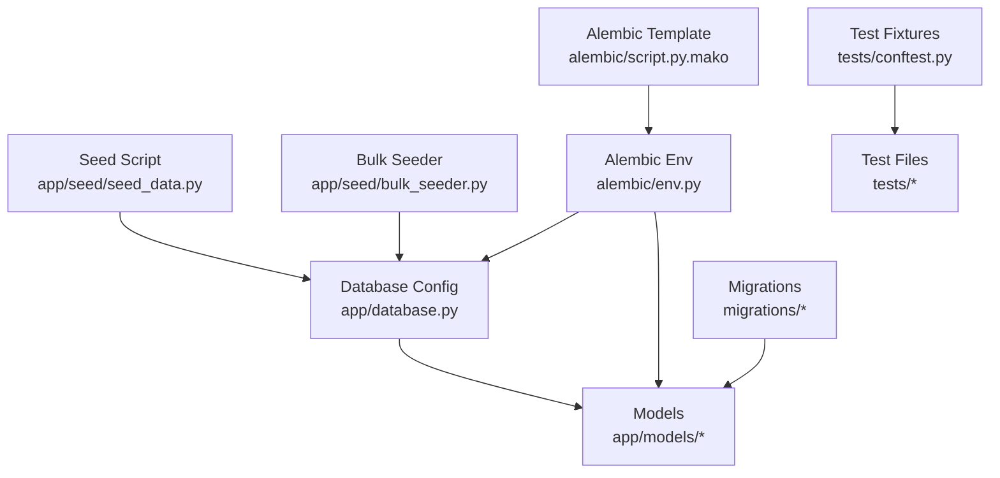
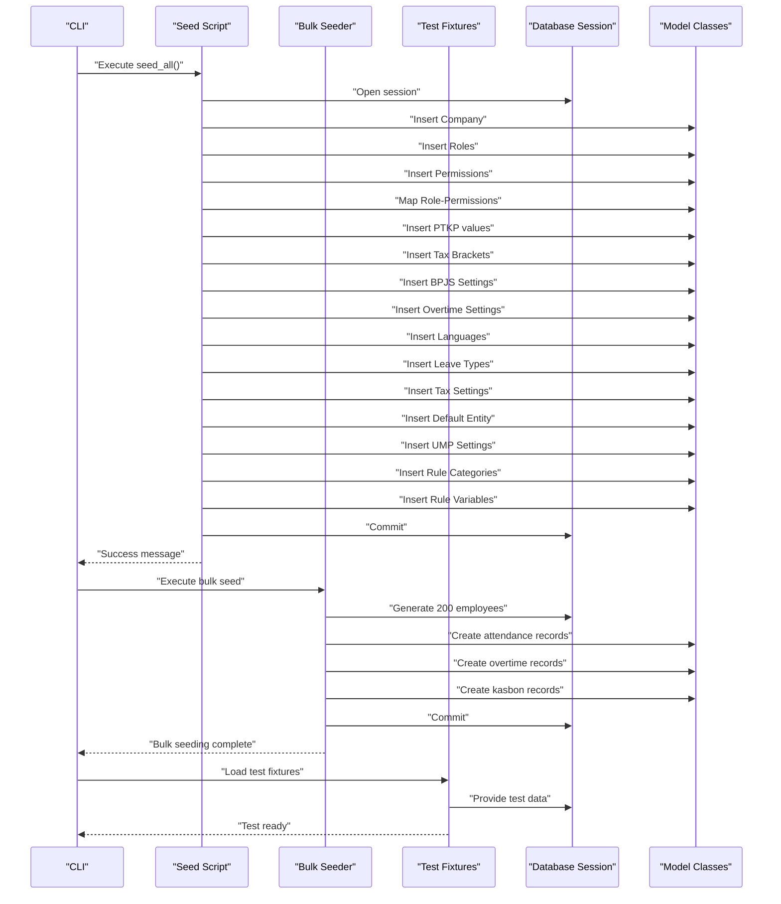
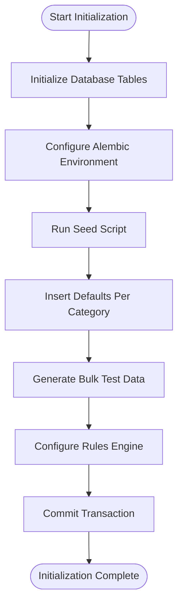
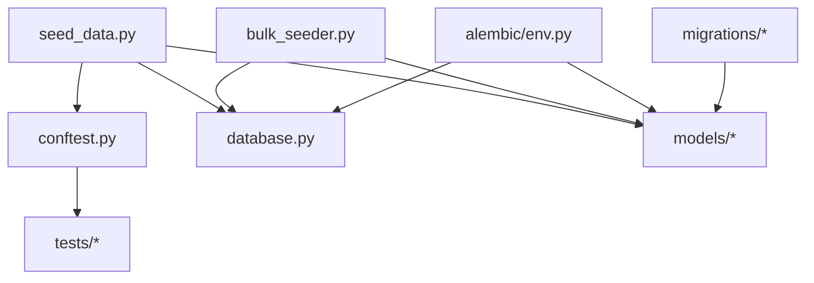

# Data Seeding & Configuration

<cite>
**Referenced Files in This Document**
- [seed_data.py](file://app/seed/seed_data.py)
- [bulk_seeder.py](file://app/seed/bulk_seeder.py)
- [env.py](file://alembic/env.py)
- [script.py.mako](file://alembic/script.py.mako)
- [database.py](file://app/database.py)
- [base.py](file://app/models/base.py)
- [tax.py](file://app/models/tax.py)
- [bpjs.py](file://app/models/bpjs.py)
- [leave.py](file://app/models/leave.py)
- [employee.py](file://app/models/employee.py)
- [payroll.py](file://app/models/payroll.py)
- [company_entity.py](file://app/models/company_entity.py)
- [rules.py](file://app/models/rules.py)
- [salary.py](file://app/models/salary.py)
- [conftest.py](file://tests/conftest.py)
- [test_bpjs.py](file://tests/test_bpjs.py)
- [test_gross_nett.py](file://tests/test_gross_nett.py)
- [test_overtime.py](file://tests/test_overtime.py)
- [001_employee_salary_history.sql](file://migrations/001_employee_salary_history.sql)
</cite>

## Update Summary
**Changes Made**
- Added comprehensive bulk employee seeding system with 200 realistic employees
- Enhanced automated configuration management with rules engine defaults
- Expanded test data framework with fixture-based comprehensive test scenarios
- Integrated multi-entity support with regional minimum wage (UMP) settings
- Added sophisticated salary structure with grade-based compensation matrices

## Table of Contents
1. [Introduction](#introduction)
2. [Project Structure](#project-structure)
3. [Core Components](#core-components)
4. [Architecture Overview](#architecture-overview)
5. [Detailed Component Analysis](#detailed-component-analysis)
6. [Enhanced Bulk Operations System](#enhanced-bulk-operations-system)
7. [Automated Configuration Management](#automated-configuration-management)
8. [Comprehensive Test Data Framework](#comprehensive-test-data-framework)
9. [Multi-Entity and Regional Configuration](#multi-entity-and-regional-configuration)
10. [Dependency Analysis](#dependency-analysis)
11. [Performance Considerations](#performance-considerations)
12. [Troubleshooting Guide](#troubleshooting-guide)
13. [Conclusion](#conclusion)
14. [Appendices](#appendices)

## Introduction
This document explains the enhanced data seeding and configuration system for the Indonesian Payroll & HRIS platform. The system now features comprehensive bulk operations, automated configuration management, and extensive test data setup. It covers how seed data is structured, how Indonesian regulations are configured (PTKP, Pasal 17 tax brackets, BPJS settings), default system settings, and how initial data is populated. The enhanced system now supports multi-entity configurations, regional minimum wage settings, and sophisticated salary structures with grade-based compensation matrices.

## Project Structure
The enhanced seeding system is organized around:
- A central seed script that orchestrates insertion of default data
- Comprehensive bulk employee seeding with realistic test data
- Automated configuration management for rules engine and salary structures
- Multi-entity support with regional minimum wage settings
- Extensive test data framework with fixture-based scenarios
- Database configuration and session management
- Alembic migration environment for schema alignment
- Model definitions that represent the data structures seeded

**Diagram sources**
- [seed_data.py](file://app/seed/seed_data.py)
- [bulk_seeder.py](file://app/seed/bulk_seeder.py)
- [conftest.py](file://tests/conftest.py)
- [database.py](file://app/database.py)
- [env.py](file://alembic/env.py)
- [script.py.mako](file://alembic/script.py.mako)

**Section sources**
- [seed_data.py](file://app/seed/seed_data.py)
- [bulk_seeder.py](file://app/seed/bulk_seeder.py)
- [conftest.py](file://tests/conftest.py)
- [database.py](file://app/database.py)
- [env.py](file://alembic/env.py)
- [script.py.mako](file://alembic/script.py.mako)

## Core Components
- **Seed orchestration**: The main function coordinates seeding of default data in a deterministic order and is idempotent.
- **Bulk employee operations**: Generates 200 realistic employees with comprehensive attendance, overtime, and kasbon data for testing.
- **Automated configuration management**: Seeds rules engine defaults, salary structures, and multi-entity configurations.
- **Regulatory defaults**: PTKP thresholds, Pasal 17 tax brackets, and BPJS contribution settings for the current regulation year.
- **Operational defaults**: Company profile, roles, permissions, role-permission mappings, languages, leave types, and tax method.
- **Multi-entity support**: Default company entities and regional minimum wage settings for different provinces.
- **Database and migrations**: SQLite-backed sessions with Alembic offline/online migrations and batch rendering for SQLite compatibility.

Key responsibilities:
- Populate Indonesian payroll compliance defaults
- Establish baseline system configuration for roles, permissions, and company settings
- Generate comprehensive test data for development and testing
- Support multi-entity configurations with regional variations
- Provide extensible defaults that can be customized per organization

**Section sources**
- [seed_data.py](file://app/seed/seed_data.py)
- [bulk_seeder.py](file://app/seed/bulk_seeder.py)
- [database.py](file://app/database.py)
- [env.py](file://alembic/env.py)

## Architecture Overview
The enhanced seeding pipeline integrates with the database and models to initialize the system with Indonesian regulation-aligned defaults, comprehensive test data, and automated configuration management.

**Diagram sources**
- [seed_data.py](file://app/seed/seed_data.py)
- [bulk_seeder.py](file://app/seed/bulk_seeder.py)
- [conftest.py](file://tests/conftest.py)
- [database.py](file://app/database.py)

## Detailed Component Analysis

### Seed Orchestration and Idempotency
- The main function orchestrates seeding in a fixed order and checks for existing records before inserting new ones.
- Each seeding step is isolated and prints progress messages for traceability.
- The script handles exceptions and ensures rollback and closure of the database session.
- Supports comprehensive coverage of all system defaults including new rules engine and multi-entity configurations.

Concrete execution example:
- Run the script directly to seed all defaults in a single transaction.
- The enhanced system now includes automated configuration management for rules engine and salary structures.

Customization tip:
- To adapt defaults for another organization, modify the seed steps to reflect local regulations or company-specific policies.
- The system now supports multi-entity configurations with regional variations.

**Section sources**
- [seed_data.py](file://app/seed/seed_data.py)

### Default Company Setup
- Creates a default company record with standard attributes such as work week days, payroll method, and default language.
- Idempotency: Skips insertion if a company with the same identifying criteria exists.
- Supports multi-entity configurations with multiple branches and locations.

Relationship to functionality:
- Many other seeded entities (e.g., PTKP, tax brackets, BPJS, leave types) are scoped to a company and rely on this default company being present.
- Multi-entity support enables regional variations in minimum wage and other configurations.

**Section sources**
- [seed_data.py](file://app/seed/seed_data.py)

### Roles and Permissions
- Seeds six predefined roles with distinct scopes.
- Generates a comprehensive set of resource-action permission entries.
- Maps roles to permissions according to predefined policy rules.

Policy highlights:
- Administrator receives all permissions.
- Payroll Master gets broad access to payroll, tax, and reporting domains.
- Operator manages employee, attendance, leave, and bonus data.
- Reporting role is read-only except for report-related actions.
- Payment role focuses on payroll approval and reporting.
- Employee role supports self-service access.

Validation example:
- Verify that role-permission mappings align with the intended access matrix.

**Section sources**
- [seed_data.py](file://app/seed/seed_data.py)

### Enhanced Regulatory Defaults

#### PTKP Values (2024 Regulation)
- Inserts PTKP thresholds grouped by marital status and number of dependents.
- Includes annual and monthly amounts, regulation year, and effective date.
- Uniqueness constraints ensure only one active set per company per effective date.

Impact:
- Used by tax calculation routines to derive tax-free allowances per employee.

**Section sources**
- [seed_data.py](file://app/seed/seed_data.py)
- [tax.py](file://app/models/tax.py)

#### Tax Brackets Pasal 17 (2024 UU HPP)
- Seeds progressive tax brackets with minimum and maximum income ranges and tax rates.
- Supports unbounded upper limits for the top bracket.
- Effective date and regulation year are recorded for auditability.

Impact:
- Drives the computation of income tax based on taxable income.

**Section sources**
- [seed_data.py](file://app/seed/seed_data.py)
- [tax.py](file://app/models/tax.py)

#### BPJS Settings (2024)
- Seeds contribution rates and optional maximum salary bases for KESEHATAN, JHT, JP, JKK, and JKM.
- Applies regulation year and effective date for compliance tracking.

Impact:
- Supplies contribution calculations for statutory social insurance.

**Section sources**
- [seed_data.py](file://app/seed/seed_data.py)
- [bpjs.py](file://app/models/bpjs.py)

### Operational Defaults

#### Overtime Settings
- Defines multipliers for weekday and weekend overtime hours and sets late penalties.
- Provides a standardized baseline for payroll calculations requiring overtime rules.

**Section sources**
- [seed_data.py](file://app/seed/seed_data.py)

#### Supported Languages
- Seeds Indonesian and English with one default language marked.

**Section sources**
- [seed_data.py](file://app/seed/seed_data.py)

#### Leave Types
- Seeds standard leave categories with default entitlements and paid/unpaid indicators.
- Requires approval by default and is active.

**Section sources**
- [seed_data.py](file://app/seed/seed_data.py)
- [leave.py](file://app/models/leave.py)

#### Tax Method Setting
- Sets the default tax calculation method to Pasal 17 for the company.

**Section sources**
- [seed_data.py](file://app/seed/seed_data.py)
- [tax.py](file://app/models/tax.py)

### Data Initialization Procedures
- Database initialization creates all model tables.
- Alembic environment supports offline and online migrations with batch rendering for SQLite compatibility.
- The seed script relies on a session factory and commits all inserts atomically.
- Enhanced system now includes automated configuration management and bulk operations.

**Diagram sources**
- [database.py](file://app/database.py)
- [env.py](file://alembic/env.py)
- [seed_data.py](file://app/seed/seed_data.py)
- [bulk_seeder.py](file://app/seed/bulk_seeder.py)

**Section sources**
- [database.py](file://app/database.py)
- [env.py](file://alembic/env.py)
- [script.py.mako](file://alembic/script.py.mako)
- [seed_data.py](file://app/seed/seed_data.py)

## Enhanced Bulk Operations System

### Comprehensive Employee Generation
The bulk seeder generates 200 realistic Indonesian employees with comprehensive data structures:

- **Realistic demographic distribution**: Based on Indonesian population statistics
- **Hierarchical organization**: Departments, positions, and employment status
- **Grade-based compensation**: 10 salary grades with realistic salary ranges
- **PTKP distribution**: Weighted distribution matching real-world demographics
- **Bank account information**: Randomized banking partners (BCA, Mandiri, BNI)

### Attendance Data Generation
Creates comprehensive attendance records for June 2026:
- **Working day simulation**: Monday-Friday schedule with realistic patterns
- **Status distribution**: Present, absent, sick, and leave with weighted probabilities
- **Check-in/out simulation**: Realistic timing with lateness detection
- **Batch processing**: Optimized for performance with 500-record batches

### Overtime and Kasbon Integration
- **Overtime generation**: ~10% of employees with realistic overtime patterns
- **Kasbon (loan) simulation**: Financial assistance requests with installment plans
- **Approval workflows**: Administrative approval processes with realistic timelines

### Performance Optimization
- **Batch operations**: 50-employee batches for efficient database operations
- **Idempotency checks**: Prevents duplicate data generation
- **Memory management**: Efficient handling of large datasets
- **Progress tracking**: Detailed logging for monitoring and debugging

**Section sources**
- [bulk_seeder.py](file://app/seed/bulk_seeder.py)

## Automated Configuration Management

### Rules Engine Defaults
The system automatically seeds comprehensive rules engine configurations:

- **Rule categories**: BPJS, PPh21, Overtime, Allowance configuration groups
- **Rule variables**: Employee fields, calculated values, and system constants
- **Dynamic formulas**: Configurable payroll calculation rules
- **Audit trails**: Complete change tracking for regulatory compliance

### Salary Structure Configuration
- **Grade definitions**: 10 salary grades with hierarchical structure
- **Salary matrices**: Effective date-based compensation ranges
- **Allowance configurations**: Multiple calculation types (fixed, percentage, formula)
- **Deduction types**: Comprehensive deduction categorization

### Multi-Entity Support
- **Default entity creation**: Head office and branch configurations
- **Regional minimum wage**: Province and city-specific UMP settings
- **Geographic coverage**: Major Indonesian provinces with realistic values

**Section sources**
- [seed_data.py](file://app/seed/seed_data.py)
- [rules.py](file://app/models/rules.py)
- [salary.py](file://app/models/salary.py)
- [company_entity.py](file://app/models/company_entity.py)

## Comprehensive Test Data Framework

### Fixture-Based Testing
The test framework provides comprehensive fixtures for reliable testing:

- **Tax bracket fixtures**: Realistic Pasal 17 tax brackets with precise boundaries
- **TER bracket fixtures**: PMK 168/2023 TER brackets for different categories
- **BPJS configuration fixtures**: Standard Indonesian contribution rates and caps
- **PTKP fixtures**: Annual and monthly PTKP thresholds for different statuses
- **Employee fixtures**: Integration-style test data with realistic attributes

### Calculation Engine Testing
Extensive test coverage for payroll calculation engines:

- **BPJS contribution calculations**: Multi-type contribution testing with caps
- **Gross/Nett method calculations**: Iterative tax allowance calculations
- **Overtime calculations**: Complex multi-tiered overtime rate computations
- **Progressive tax calculations**: Accurate tax bracket application

### Test Data Validation
- **Precision testing**: Decimal arithmetic validation with proper rounding
- **Edge case coverage**: Zero values, boundary conditions, and negative scenarios
- **Integration testing**: End-to-end calculation validation
- **Performance testing**: Large dataset processing validation

**Section sources**
- [conftest.py](file://tests/conftest.py)
- [test_bpjs.py](file://tests/test_bpjs.py)
- [test_gross_nett.py](file://tests/test_gross_nett.py)
- [test_overtime.py](file://tests/test_overtime.py)

## Multi-Entity and Regional Configuration

### Regional Minimum Wage (UMP) System
The system supports comprehensive regional minimum wage configurations:

- **Province coverage**: Major Indonesian provinces with realistic values
- **City-level granularity**: District-level minimum wages where applicable
- **Effective date tracking**: Historical minimum wage changes
- **Company-specific settings**: Multi-entity configurations with regional variations

### Multi-Location Support
- **Entity definitions**: Branch and location management
- **Regional compliance**: Local regulation adherence per location
- **Geographic indexing**: Efficient querying by province and city
- **Audit compliance**: Complete regional configuration tracking

### Geographic Data Integration
- **Province and city mapping**: Accurate geographic representation
- **Postal code integration**: Address validation and delivery optimization
- **Banking partner distribution**: Realistic banking partner allocation
- **Religious diversity**: Representative demographic distribution

**Section sources**
- [seed_data.py](file://app/seed/seed_data.py)
- [company_entity.py](file://app/models/company_entity.py)
- [001_employee_salary_history.sql](file://migrations/001_employee_salary_history.sql)

## Dependency Analysis
The enhanced seed script depends on:
- Database session factory for transactions
- Model classes for entity creation
- Alembic environment for schema alignment
- Test fixtures for comprehensive validation
- Bulk seeder for test data generation

**Diagram sources**
- [seed_data.py](file://app/seed/seed_data.py)
- [bulk_seeder.py](file://app/seed/bulk_seeder.py)
- [conftest.py](file://tests/conftest.py)
- [database.py](file://app/database.py)
- [env.py](file://alembic/env.py)

**Section sources**
- [seed_data.py](file://app/seed/seed_data.py)
- [bulk_seeder.py](file://app/seed/bulk_seeder.py)
- [conftest.py](file://tests/conftest.py)
- [database.py](file://app/database.py)
- [env.py](file://alembic/env.py)

## Performance Considerations
- **Idempotency checks**: Reduce redundant writes and improve safety during repeated runs.
- **Batch insertions**: Permissions, PTKP, tax brackets, BPJS, and bulk operations minimize round-trips.
- **SQLite foreign key enforcement**: Enabled at connection level to maintain referential integrity.
- **Bulk operation optimization**: 50-employee batches and 500-record attendance batches.
- **Memory management**: Efficient handling of large datasets with progress tracking.
- **Index optimization**: Strategic indexing for multi-entity and regional queries.

## Troubleshooting Guide
Common issues and resolutions:
- **Duplicate entries**: The seed script skips existing records; verify that uniqueness constraints are satisfied.
- **Missing company**: Some entities require a company; ensure the default company is created first.
- **Migration conflicts**: Use Alembic offline/online modes to align schema before seeding.
- **Transaction failures**: The script rolls back on errors; inspect logs and fix underlying constraint violations.
- **Bulk operation timeouts**: Monitor memory usage and adjust batch sizes for large datasets.
- **Test data inconsistencies**: Verify fixture dependencies and test data generation sequences.

**Section sources**
- [seed_data.py](file://app/seed/seed_data.py)
- [bulk_seeder.py](file://app/seed/bulk_seeder.py)
- [env.py](file://alembic/env.py)

## Conclusion
The enhanced seeding and configuration system establishes a robust baseline aligned with Indonesian payroll regulations while providing comprehensive testing infrastructure and automated configuration management. The system now supports multi-entity configurations, regional variations, and extensive test data generation. By organizing defaults into discrete categories with sophisticated bulk operations and automated configuration management, the system ensures predictable initialization, comprehensive testing capabilities, and easy adaptation for diverse organizational needs across Indonesia's complex regulatory landscape.

## Appendices

### Enhanced Seed Data Execution Examples
- Execute the seed script to populate all defaults in a single run.
- Use the bulk seeder to generate 200 realistic employees with comprehensive test data.
- Load test fixtures for reliable unit testing and integration validation.
- Verify that company, roles, permissions, regulatory settings, and multi-entity configurations exist in the database.

### Customizing Default Configurations
- Modify the seed script to adjust PTKP thresholds, tax brackets, BPJS rates, or leave entitlements.
- Update role-permission mappings to reflect local access control policies.
- Change default company settings (e.g., payroll method, language) to match organizational preferences.
- Configure multi-entity settings for regional variations and compliance requirements.
- Customize rules engine configurations for specialized payroll calculation needs.
- Adjust bulk test data generation parameters for different testing scenarios.

### Advanced Usage Patterns
- **Development environments**: Use bulk seeder for comprehensive testing data.
- **Production preparation**: Seed only essential defaults without bulk test data.
- **Regional deployments**: Configure UMP settings and regional compliance rules.
- **Multi-company setups**: Extend entity configurations for complex organizational structures.
- **Custom calculation rules**: Leverage rules engine for specialized payroll requirements.