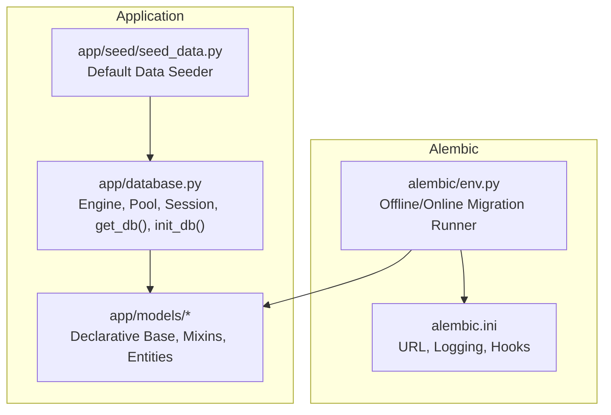
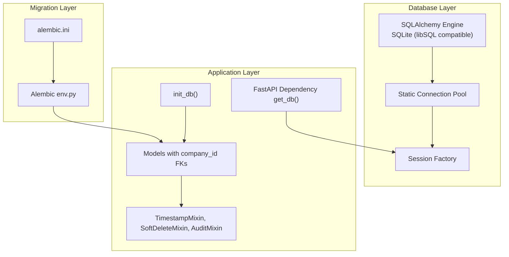
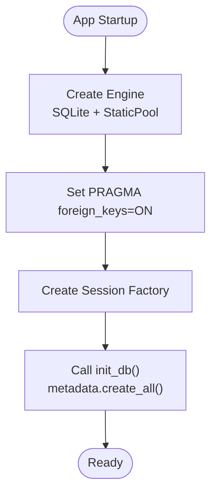
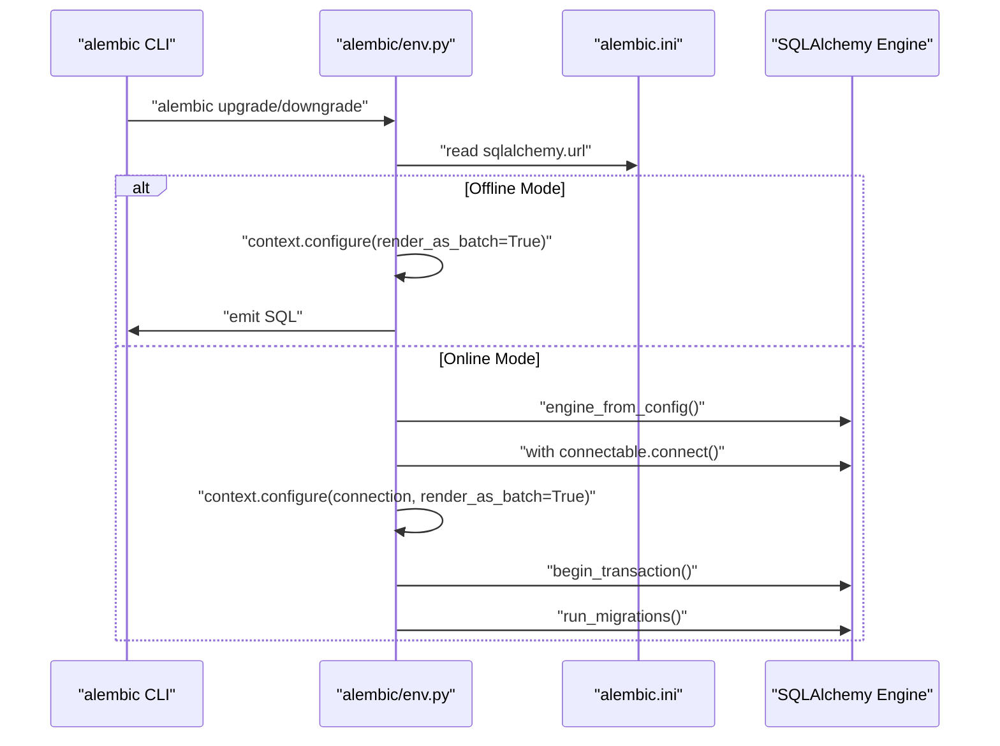
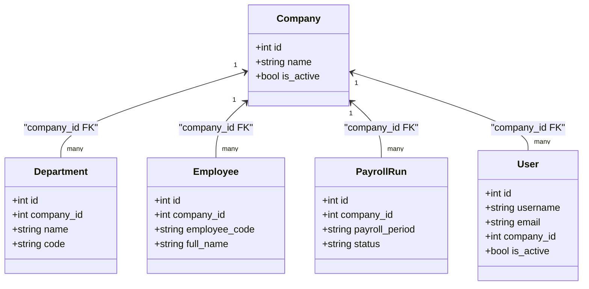
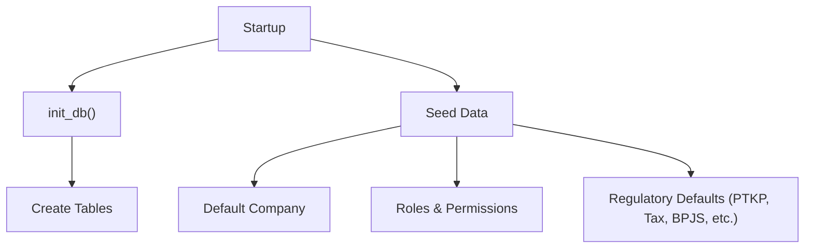
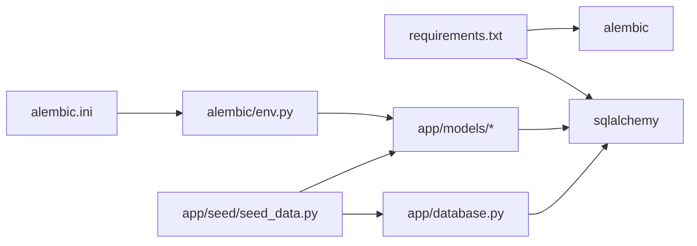

# Database Configuration

<cite>
**Referenced Files in This Document**
- [app/database.py](file://app/database.py)
- [alembic/env.py](file://alembic/env.py)
- [alembic.ini](file://alembic.ini)
- [app/models/base.py](file://app/models/base.py)
- [app/models/__init__.py](file://app/models/__init__.py)
- [app/models/auth.py](file://app/models/auth.py)
- [app/models/employee.py](file://app/models/employee.py)
- [app/models/payroll.py](file://app/models/payroll.py)
- [app/seed/seed_data.py](file://app/seed/seed_data.py)
- [requirements.txt](file://requirements.txt)
</cite>

## Table of Contents
1. [Introduction](#introduction)
2. [Project Structure](#project-structure)
3. [Core Components](#core-components)
4. [Architecture Overview](#architecture-overview)
5. [Detailed Component Analysis](#detailed-component-analysis)
6. [Dependency Analysis](#dependency-analysis)
7. [Performance Considerations](#performance-considerations)
8. [Troubleshooting Guide](#troubleshooting-guide)
9. [Conclusion](#conclusion)
10. [Appendices](#appendices)

## Introduction
This document explains the database configuration and management for the Payroll & HRIS system. It covers database setup, connection management, Alembic migration system, schema versioning, SQLAlchemy configuration, session management, connection pooling, and multi-tenant architecture with company isolation. It also provides practical examples for initializing the database, running migrations, applying schema updates, seeding default data, and maintaining performance and backups.

## Project Structure
The database-related components are organized as follows:
- SQLAlchemy engine and session management live in the application module.
- Alembic handles migrations and schema versioning.
- Models define the schema and multi-tenant fields.
- A seed script initializes default data and compliance settings.

**Diagram sources**
- [app/database.py:1-63](file://app/database.py#L1-L63)
- [alembic/env.py:1-80](file://alembic/env.py#L1-L80)
- [alembic.ini:1-77](file://alembic.ini#L1-L77)
- [app/models/__init__.py:1-69](file://app/models/__init__.py#L1-L69)

**Section sources**
- [app/database.py:1-63](file://app/database.py#L1-L63)
- [alembic/env.py:1-80](file://alembic/env.py#L1-L80)
- [alembic.ini:1-77](file://alembic.ini#L1-L77)
- [app/models/__init__.py:1-69](file://app/models/__init__.py#L1-L69)

## Core Components
- SQLAlchemy engine configured for SQLite (with libSQL compatibility hints) and static connection pooling.
- Session factory and FastAPI dependency for safe, scoped sessions.
- Alembic environment for offline and online migrations with batch rendering for SQLite.
- Declarative base and reusable mixins for timestamps, soft deletes, and audit fields.
- Multi-tenant models with company_id foreign keys to isolate data per company.
- Seed script to initialize default company, roles, permissions, and regulatory settings.

**Section sources**
- [app/database.py:17-63](file://app/database.py#L17-L63)
- [alembic/env.py:25-79](file://alembic/env.py#L25-L79)
- [alembic.ini:30](file://alembic.ini#L30)
- [app/models/base.py:18-57](file://app/models/base.py#L18-L57)
- [app/models/auth.py:22-133](file://app/models/auth.py#L22-L133)
- [app/seed/seed_data.py:27-63](file://app/seed/seed_data.py#L27-L63)

## Architecture Overview
The system uses a single-database, multi-tenant approach:
- All tenants share the same database file.
- Tenant isolation is achieved by adding company_id to most entities.
- Access control is enforced via RBAC with roles and permissions linked to companies.
- Migrations are managed centrally via Alembic with batch rendering for SQLite compatibility.

**Diagram sources**
- [app/database.py:19-53](file://app/database.py#L19-L53)
- [app/database.py:56-63](file://app/database.py#L56-L63)
- [alembic/env.py:25-79](file://alembic/env.py#L25-L79)
- [alembic.ini:30](file://alembic.ini#L30)
- [app/models/base.py:18-57](file://app/models/base.py#L18-L57)
- [app/models/auth.py:22-133](file://app/models/auth.py#L22-L133)

## Detailed Component Analysis

### SQLAlchemy Configuration and Session Management
- Engine creation supports SQLite with libSQL-compatible connection arguments and static pooling.
- Foreign key enforcement is enabled via a connection event hook for SQLite.
- Session factory binds to the engine with explicit autocommit/autoflush settings.
- FastAPI dependency yields a scoped session and ensures closure after use.
- Database initialization creates all tables defined by the declarative metadata.

**Diagram sources**
- [app/database.py:19-32](file://app/database.py#L19-L32)
- [app/database.py:35-35](file://app/database.py#L35-L35)
- [app/database.py:56-63](file://app/database.py#L56-L63)

**Section sources**
- [app/database.py:17-63](file://app/database.py#L17-L63)

### Alembic Migration System and Schema Versioning
- Alembic environment loads the target metadata from the shared Base.
- Offline mode renders SQL with batch rendering for SQLite ALTER TABLE compatibility.
- Online mode connects to the configured URL and runs migrations inside a transaction.
- Alembic configuration sets the SQLAlchemy URL and logging levels.

**Diagram sources**
- [alembic/env.py:29-79](file://alembic/env.py#L29-L79)
- [alembic.ini:30](file://alembic.ini#L30)

**Section sources**
- [alembic/env.py:1-80](file://alembic/env.py#L1-L80)
- [alembic.ini:1-77](file://alembic.ini#L1-L77)

### Multi-Tenant Architecture and Company Isolation
- The Company entity stores tenant metadata.
- Most domain entities include company_id as a foreign key to enforce per-company isolation.
- Indexes and constraints are defined to maintain data integrity and performance.
- Authentication and authorization models link users and roles to companies.

**Diagram sources**
- [app/models/auth.py:22-133](file://app/models/auth.py#L22-L133)
- [app/models/employee.py:20-132](file://app/models/employee.py#L20-L132)
- [app/models/payroll.py:19-124](file://app/models/payroll.py#L19-L124)

**Section sources**
- [app/models/auth.py:22-133](file://app/models/auth.py#L22-L133)
- [app/models/employee.py:20-132](file://app/models/employee.py#L20-L132)
- [app/models/payroll.py:19-124](file://app/models/payroll.py#L19-L124)

### Data Partitioning Strategies
- Horizontal partitioning by company_id across entities ensures logical separation.
- Composite unique constraints and indexes optimize lookups and prevent duplicates per company.
- Example constraints include unique codes per company and indexes on frequently filtered columns.

**Section sources**
- [app/models/employee.py:37-39](file://app/models/employee.py#L37-L39)
- [app/models/employee.py:119-131](file://app/models/employee.py#L119-L131)
- [app/models/payroll.py:45-61](file://app/models/payroll.py#L45-L61)

### Database Initialization and Maintenance
- Initialize the schema by calling the initialization routine at startup.
- Seed default data to bootstrap compliance and system roles.
- Use Alembic to manage schema changes and keep versions synchronized.

**Diagram sources**
- [app/database.py:56-63](file://app/database.py#L56-L63)
- [app/seed/seed_data.py:27-63](file://app/seed/seed_data.py#L27-L63)

**Section sources**
- [app/database.py:56-63](file://app/database.py#L56-L63)
- [app/seed/seed_data.py:27-63](file://app/seed/seed_data.py#L27-L63)

### Concrete Examples
- Database initialization: call the initialization routine to create all tables.
- Running migrations: use Alembic commands to upgrade or downgrade the schema.
- Seeding data: execute the seed script to populate default company, roles, permissions, and regulatory settings.
- Maintenance: periodically review indexes and constraints; ensure company_id is consistently applied.

**Section sources**
- [app/database.py:56-63](file://app/database.py#L56-L63)
- [alembic/env.py:29-79](file://alembic/env.py#L29-L79)
- [app/seed/seed_data.py:432-448](file://app/seed/seed_data.py#L432-L448)

## Dependency Analysis
- Application depends on SQLAlchemy for ORM and Alembic for migrations.
- Models depend on the shared declarative base and mixins.
- Alembic environment depends on the models package to resolve metadata.
- Seed script depends on the database session factory and models.

**Diagram sources**
- [requirements.txt:1-14](file://requirements.txt#L1-L14)
- [app/database.py:10-13](file://app/database.py#L10-L13)
- [app/models/__init__.py:1-69](file://app/models/__init__.py#L1-L69)
- [alembic/env.py:14-26](file://alembic/env.py#L14-L26)
- [alembic.ini:30](file://alembic.ini#L30)
- [app/seed/seed_data.py:19-24](file://app/seed/seed_data.py#L19-L24)

**Section sources**
- [requirements.txt:1-14](file://requirements.txt#L1-L14)
- [app/models/__init__.py:1-69](file://app/models/__init__.py#L1-L69)
- [alembic/env.py:14-26](file://alembic/env.py#L14-L26)
- [alembic.ini:30](file://alembic.ini#L30)
- [app/seed/seed_data.py:19-24](file://app/seed/seed_data.py#L19-L24)

## Performance Considerations
- Connection pooling: static pooling is used; evaluate dynamic pooling for production workloads.
- Foreign keys: PRAGMA enforcement is enabled for integrity; ensure appropriate indexing on foreign keys.
- Indexes: leverage existing indexes on company_id and frequently queried columns.
- Transactions: use short-lived sessions and commit promptly to reduce contention.
- Batch migrations: Alembic uses batch rendering for SQLite; keep migrations minimal and incremental.

[No sources needed since this section provides general guidance]

## Troubleshooting Guide
- Foreign key constraint errors: verify PRAGMA enforcement is active and foreign keys are properly defined.
- Session lifecycle: ensure sessions are closed after use via the FastAPI dependency.
- Migration failures: confirm Alembic environment resolves the correct metadata and URL; run online migrations against the configured database.
- Seed conflicts: seed script is idempotent; check for existing records before insertion.

**Section sources**
- [app/database.py:27-32](file://app/database.py#L27-L32)
- [app/database.py:38-53](file://app/database.py#L38-L53)
- [alembic/env.py:59-73](file://alembic/env.py#L59-L73)
- [app/seed/seed_data.py:66-82](file://app/seed/seed_data.py#L66-L82)

## Conclusion
The Payroll & HRIS system employs a straightforward, single-database, multi-tenant design with company_id-based isolation. SQLAlchemy and Alembic provide robust ORM and migration management, while FastAPI dependency injection ensures clean session handling. The seed script accelerates onboarding with regulatory defaults. For production, consider tuning connection pooling, monitoring index usage, and adopting standardized backup and migration procedures.

[No sources needed since this section summarizes without analyzing specific files]

## Appendices

### Appendix A: Environment Variables and Configuration
- DATABASE_URL: controls the SQLAlchemy URL for the database connection.
- Alembic URL: configured in the Alembic configuration file.

**Section sources**
- [app/database.py:17](file://app/database.py#L17)
- [alembic.ini:30](file://alembic.ini#L30)

### Appendix B: Model Mixins Reference
- TimestampMixin: adds created_at and updated_at fields.
- SoftDeleteMixin: adds is_deleted and deleted_at fields.
- AuditMixin: adds created_by and updated_by fields.

**Section sources**
- [app/models/base.py:23-57](file://app/models/base.py#L23-L57)