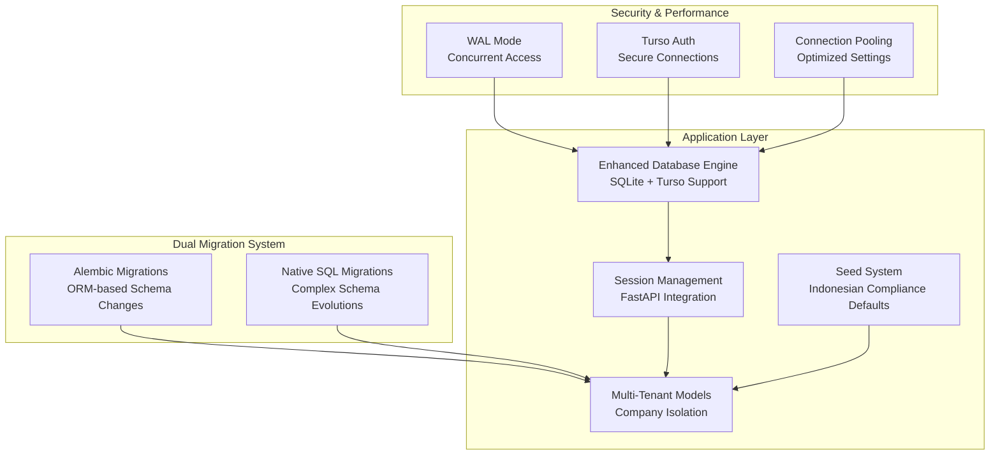
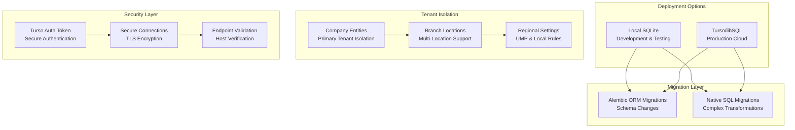
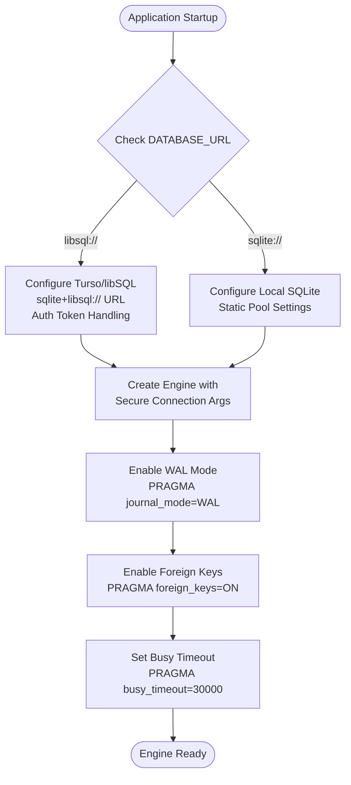
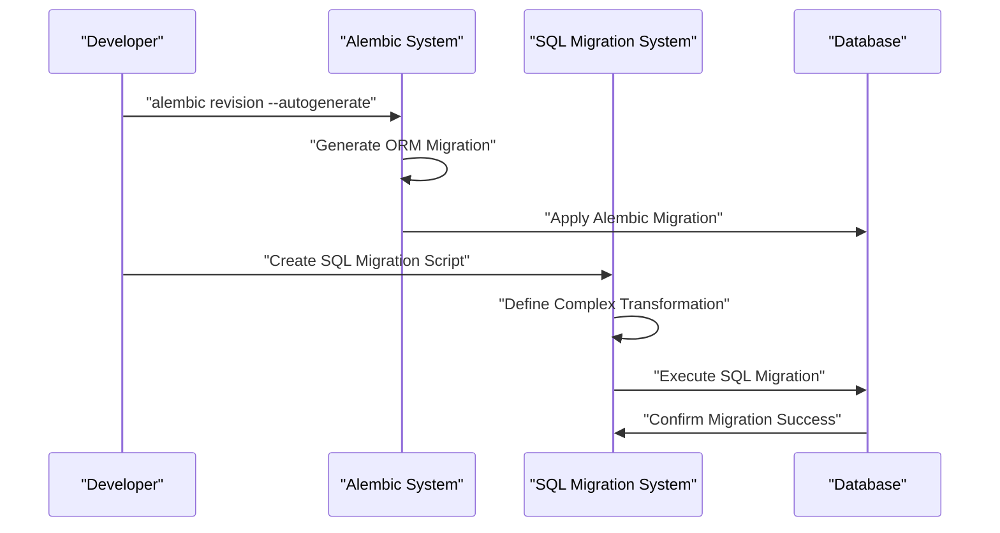
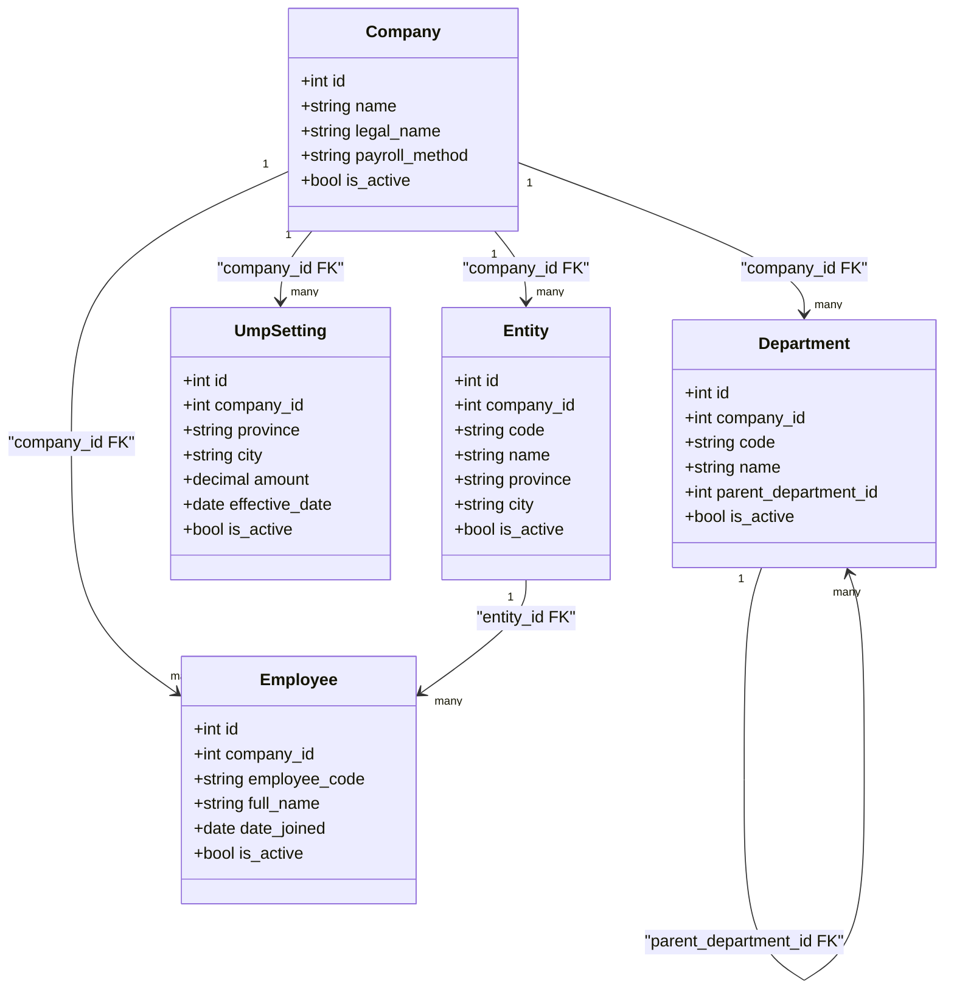
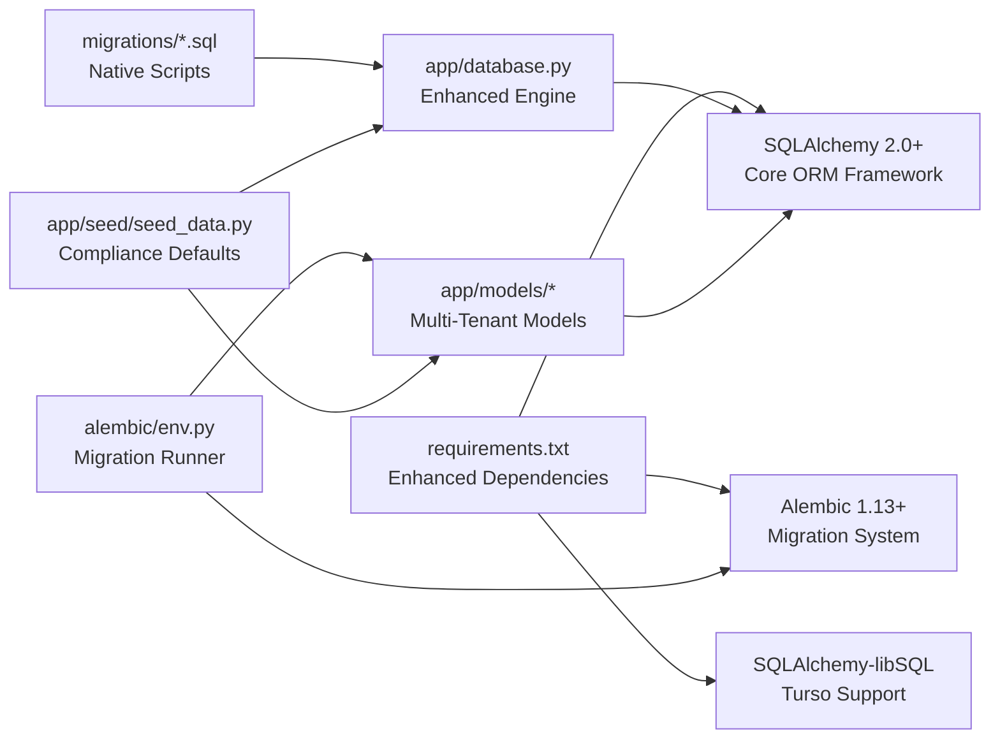

# Database Configuration

<cite>
**Referenced Files in This Document**
- [app/database.py](file://app/database.py)
- [alembic/env.py](file://alembic/env.py)
- [alembic.ini](file://alembic.ini)
- [app/models/base.py](file://app/models/base.py)
- [app/models/__init__.py](file://app/models/__init__.py)
- [app/models/auth.py](file://app/models/auth.py)
- [app/models/employee.py](file://app/models/employee.py)
- [app/models/payroll.py](file://app/models/payroll.py)
- [app/models/company_entity.py](file://app/models/company_entity.py)
- [app/seed/seed_data.py](file://app/seed/seed_data.py)
- [requirements.txt](file://requirements.txt)
- [migrations/001_employee_salary_history.sql](file://migrations/001_employee_salary_history.sql)
- [migrations/003_rules_engine.sql](file://migrations/003_rules_engine.sql)
- [migrations/005_rules_engine_fix_timestamps.sql](file://migrations/005_rules_engine_fix_timestamps.sql)
</cite>

## Update Summary
**Changes Made**
- Enhanced database engine configuration with Turso/libSQL support and improved SQLite optimizations
- Expanded multi-tenant architecture documentation with comprehensive company entity management
- Added detailed schema evolution tracking through SQL migrations alongside Alembic
- Updated performance optimization guidelines with WAL mode and connection pooling improvements
- Enhanced security considerations for Turso authentication and connection handling

## Table of Contents
1. [Introduction](#introduction)
2. [Project Structure](#project-structure)
3. [Core Components](#core-components)
4. [Architecture Overview](#architecture-overview)
5. [Detailed Component Analysis](#detailed-component-analysis)
6. [Dependency Analysis](#dependency-analysis)
7. [Performance Considerations](#performance-considerations)
8. [Troubleshooting Guide](#troubleshooting-guide)
9. [Conclusion](#conclusion)
10. [Appendices](#appendices)

## Introduction
This document explains the comprehensive database configuration and management for the Payroll & HRIS system. The system now features a sophisticated multi-tenant architecture with both Alembic-driven migrations and native SQL migrations, supporting both local SQLite development and cloud Turso/libSQL deployments. It covers database setup, connection management, dual migration systems, schema versioning, SQLAlchemy configuration, session management, connection pooling, and advanced multi-tenant data isolation strategies. The documentation includes practical examples for database initialization, migration execution, schema updates, data seeding, and performance optimization techniques.

## Project Structure
The database system is organized with a hybrid migration approach and comprehensive multi-tenant support:

- **SQLAlchemy engine** with dual deployment support (local SQLite and Turso/libSQL)
- **Alembic migration system** for ORM-managed schema changes
- **Native SQL migrations** for complex schema evolutions and data transformations
- **Enhanced models** with comprehensive multi-tenant architecture
- **Comprehensive seed system** for Indonesian payroll compliance defaults

**Diagram sources**
- [app/database.py:16-39](file://app/database.py#L16-L39)
- [alembic/env.py:14-26](file://alembic/env.py#L14-L26)
- [migrations/001_employee_salary_history.sql:1-38](file://migrations/001_employee_salary_history.sql#L1-L38)
- [migrations/003_rules_engine.sql:1-84](file://migrations/003_rules_engine.sql#L1-L84)

**Section sources**
- [app/database.py:1-82](file://app/database.py#L1-L82)
- [alembic/env.py:1-80](file://alembic/env.py#L1-L80)
- [alembic.ini:1-77](file://alembic.ini#L1-L77)
- [app/models/__init__.py:1-86](file://app/models/__init__.py#L1-L86)
- [app/seed/seed_data.py:1-200](file://app/seed/seed_data.py#L1-L200)

## Core Components
The database system now includes several enhanced components:

- **Dual Database Engine Support**: Configurable for both local SQLite and Turso/libSQL deployments with automatic dialect selection
- **Advanced Connection Management**: WAL mode activation, foreign key enforcement, and optimized connection parameters
- **Comprehensive Multi-Tenant Architecture**: Company entities, branches, and regional minimum wage settings
- **Hybrid Migration Strategy**: Combining Alembic ORM migrations with native SQL migrations for complex schema changes
- **Enhanced Security**: Turso authentication tokens and secure connection handling
- **Performance Optimizations**: Static pooling, busy timeout settings, and concurrent read/write support

**Section sources**
- [app/database.py:16-51](file://app/database.py#L16-L51)
- [app/models/company_entity.py:17-68](file://app/models/company_entity.py#L17-L68)
- [migrations/003_rules_engine.sql:1-84](file://migrations/003_rules_engine.sql#L1-L84)
- [migrations/005_rules_engine_fix_timestamps.sql:1-34](file://migrations/005_rules_engine_fix_timestamps.sql#L1-L34)

## Architecture Overview
The system employs a sophisticated multi-tenant architecture with dual migration support:

- **Single Database, Multi-Tenant Design**: All tenants share the same database with company_id-based isolation
- **Dual Migration System**: Alembic for ORM-managed changes, native SQL for complex transformations
- **Cloud and Local Deployment**: Seamless support for both local SQLite and Turso/libSQL cloud databases
- **Enhanced Security**: Turso authentication tokens and secure connection handling
- **Performance Optimization**: WAL mode, connection pooling, and concurrent access support

**Diagram sources**
- [app/database.py:22-31](file://app/database.py#L22-L31)
- [alembic/env.py:29-79](file://alembic/env.py#L29-L79)
- [migrations/001_employee_salary_history.sql:1-38](file://migrations/001_employee_salary_history.sql#L1-L38)
- [migrations/003_rules_engine.sql:1-84](file://migrations/003_rules_engine.sql#L1-L84)

**Section sources**
- [app/database.py:16-51](file://app/database.py#L16-L51)
- [alembic/env.py:29-79](file://alembic/env.py#L29-L79)
- [app/models/company_entity.py:17-68](file://app/models/company_entity.py#L17-L68)

## Detailed Component Analysis

### Enhanced Database Engine Configuration
The database engine now supports dual deployment scenarios with advanced optimizations:

- **Turso/libSQL Detection**: Automatic detection of libsql:// URLs and conversion to sqlite+libsql:// format
- **Authentication Integration**: Secure token-based authentication for Turso cloud deployments
- **WAL Mode Activation**: Journal mode set to Write-Ahead Logging for concurrent read/write support
- **Foreign Key Enforcement**: PRAGMA-based foreign key validation for data integrity
- **Connection Pooling**: Static pool configuration with optimized overflow handling
- **Timeout Configuration**: Busy timeout settings to handle concurrent access scenarios

**Diagram sources**
- [app/database.py:22-51](file://app/database.py#L22-L51)

**Section sources**
- [app/database.py:16-51](file://app/database.py#L16-L51)

### Hybrid Migration System
The system now employs a dual migration strategy combining Alembic and native SQL approaches:

- **Alembic ORM Migrations**: Standardized schema changes through SQLAlchemy models
- **Native SQL Migrations**: Complex transformations requiring direct SQL manipulation
- **Batch Rendering**: SQLite-compatible ALTER TABLE operations
- **Transaction Safety**: Online/offline migration modes with proper transaction handling
- **Schema Evolution Tracking**: Both ORM and SQL migration histories maintained separately

**Diagram sources**
- [alembic/env.py:29-79](file://alembic/env.py#L29-L79)
- [migrations/003_rules_engine.sql:1-84](file://migrations/003_rules_engine.sql#L1-L84)

**Section sources**
- [alembic/env.py:1-80](file://alembic/env.py#L1-L80)
- [alembic.ini:1-77](file://alembic.ini#L1-L77)
- [migrations/001_employee_salary_history.sql:1-38](file://migrations/001_employee_salary_history.sql#L1-L38)
- [migrations/003_rules_engine.sql:1-84](file://migrations/003_rules_engine.sql#L1-L84)

### Advanced Multi-Tenant Architecture
The system implements a comprehensive multi-tenant design with company entity management:

- **Company Hierarchy**: Primary tenant isolation through company entities
- **Branch Management**: Support for multiple locations per company with regional settings
- **Regional Minimum Wage**: Province/city-specific UMP settings per company
- **Entity Isolation**: Separate branch/location management with active status tracking
- **Hierarchical Organization**: Department structures with parent-child relationships

**Diagram sources**
- [app/models/auth.py:22-48](file://app/models/auth.py#L22-L48)
- [app/models/company_entity.py:17-68](file://app/models/company_entity.py#L17-L68)
- [app/models/employee.py:20-142](file://app/models/employee.py#L20-L142)

**Section sources**
- [app/models/auth.py:22-133](file://app/models/auth.py#L22-L133)
- [app/models/company_entity.py:17-68](file://app/models/company_entity.py#L17-L68)
- [app/models/employee.py:20-142](file://app/models/employee.py#L20-L142)

### Enhanced Schema Evolution and Data Management
The system tracks comprehensive schema evolution through both ORM and SQL migration approaches:

- **Employee Salary History**: Complete salary evolution tracking with effective dates
- **Rules Engine**: Dynamic configuration system with category-based organization
- **Audit Trail**: Comprehensive change tracking for all configurable systems
- **Data Integrity**: Complex constraints and validation rules for payroll compliance
- **Historical Tracking**: Permanent record of all configuration changes

**Section sources**
- [migrations/001_employee_salary_history.sql:1-38](file://migrations/001_employee_salary_history.sql#L1-L38)
- [migrations/003_rules_engine.sql:1-84](file://migrations/003_rules_engine.sql#L1-L84)
- [migrations/005_rules_engine_fix_timestamps.sql:1-34](file://migrations/005_rules_engine_fix_timestamps.sql#L1-L34)

### Comprehensive Data Seeding and Compliance
The seed system provides complete Indonesian payroll compliance defaults:

- **System Roles**: Six predefined roles covering all system access levels
- **Permission Matrix**: Comprehensive resource-action permission combinations
- **PTKP Values**: 2024 regulation-compliant tax exemption values
- **Tax Brackets**: Pasal 17 and TER bracket configurations
- **Regional Settings**: BPJS contributions, overtime rates, and leave types
- **Language Support**: Multi-language interface configurations
- **Rules Engine Defaults**: Category and variable configurations for dynamic rules

**Section sources**
- [app/seed/seed_data.py:28-200](file://app/seed/seed_data.py#L28-L200)

## Dependency Analysis
The database system has evolved to include enhanced dependencies and integration points:

- **Core Dependencies**: SQLAlchemy 2.0+, Alembic 1.13+, and SQLAlchemy-libSQL for cloud support
- **Model Dependencies**: Comprehensive model package with multi-tenant inheritance
- **Migration Dependencies**: Dual migration system with Alembic and native SQL support
- **Security Dependencies**: Turso authentication and secure connection handling
- **Performance Dependencies**: Optimized connection pooling and WAL mode support

**Diagram sources**
- [requirements.txt:1-23](file://requirements.txt#L1-L23)
- [app/database.py:10-14](file://app/database.py#L10-L14)
- [alembic/env.py:14-15](file://alembic/env.py#L14-L15)
- [app/models/__init__.py:1-86](file://app/models/__init__.py#L1-L86)

**Section sources**
- [requirements.txt:1-23](file://requirements.txt#L1-L23)
- [app/models/__init__.py:1-86](file://app/models/__init__.py#L1-L86)
- [alembic/env.py:14-26](file://alembic/env.py#L14-L26)

## Performance Considerations
Enhanced performance optimizations for the multi-tenant database system:

- **WAL Mode Benefits**: Improved concurrent read/write performance with reduced locking
- **Connection Pooling**: Static pool configuration optimized for single-database multi-tenant access
- **Busy Timeout Handling**: 30-second timeout for handling concurrent database access scenarios
- **Index Optimization**: Strategic indexing on company_id, frequently queried columns, and foreign keys
- **Memory Management**: Efficient memory usage through static pooling and connection reuse
- **Cloud Optimization**: Turso-specific optimizations for distributed database access

**Section sources**
- [app/database.py:42-51](file://app/database.py#L42-L51)
- [app/models/employee.py:124-141](file://app/models/employee.py#L124-L141)
- [app/models/payroll.py:45-61](file://app/models/payroll.py#L45-L61)

## Troubleshooting Guide
Enhanced troubleshooting for the comprehensive database system:

- **Turso Connection Issues**: Verify auth token configuration and endpoint URL format
- **WAL Mode Problems**: Ensure database supports WAL mode; check file system permissions
- **Migration Conflicts**: Resolve conflicts between Alembic and SQL migrations
- **Multi-Tenant Isolation**: Verify company_id foreign keys are properly enforced
- **Performance Issues**: Monitor connection pool saturation and adjust pool size
- **Data Integrity Errors**: Check composite unique constraints and check constraints

**Section sources**
- [app/database.py:22-31](file://app/database.py#L22-L31)
- [app/database.py:42-51](file://app/database.py#L42-L51)
- [app/models/employee.py:37-41](file://app/models/employee.py#L37-L41)

## Conclusion
The Payroll & HRIS system now features a comprehensive database architecture supporting both local development and cloud deployment through Turso/libSQL. The dual migration system provides flexibility for both simple ORM changes and complex schema transformations. The enhanced multi-tenant design with company entity management ensures proper data isolation while maintaining system efficiency. With WAL mode optimization, connection pooling, and comprehensive security measures, the system provides robust performance and reliability for Indonesian payroll compliance requirements.

## Appendices

### Appendix A: Enhanced Configuration Options
- **DATABASE_URL**: Supports both sqlite:/// and libsql:// formats with automatic dialect selection
- **TURSO_AUTH_TOKEN**: Required for Turso cloud database authentication
- **Connection Parameters**: Optimized settings for SQLite and Turso deployments
- **Logging Configuration**: Alembic logging levels and SQLAlchemy engine configuration

**Section sources**
- [app/database.py:16-17](file://app/database.py#L16-L17)
- [alembic.ini:30](file://alembic.ini#L30)
- [alembic.ini:53-77](file://alembic.ini#L53-L77)

### Appendix B: Multi-Tenant Model Reference
- **Company**: Primary tenant entity with compliance settings
- **Entity**: Branch/location management with regional settings
- **UmpSetting**: Regional minimum wage configurations
- **Department**: Hierarchical organizational structure
- **Employee**: Core employee data with company association

**Section sources**
- [app/models/auth.py:22-133](file://app/models/auth.py#L22-L133)
- [app/models/company_entity.py:17-68](file://app/models/company_entity.py#L17-L68)
- [app/models/employee.py:20-142](file://app/models/employee.py#L20-L142)

### Appendix C: Migration System Reference
- **Alembic Migrations**: ORM-managed schema changes with batch rendering
- **SQL Migrations**: Complex transformations for rules engine and salary history
- **Migration Order**: Proper sequencing of Alembic and SQL migrations
- **Rollback Strategy**: Safe rollback procedures for both migration types

**Section sources**
- [alembic/env.py:29-79](file://alembic/env.py#L29-L79)
- [migrations/001_employee_salary_history.sql:1-38](file://migrations/001_employee_salary_history.sql#L1-L38)
- [migrations/003_rules_engine.sql:1-84](file://migrations/003_rules_engine.sql#L1-L84)