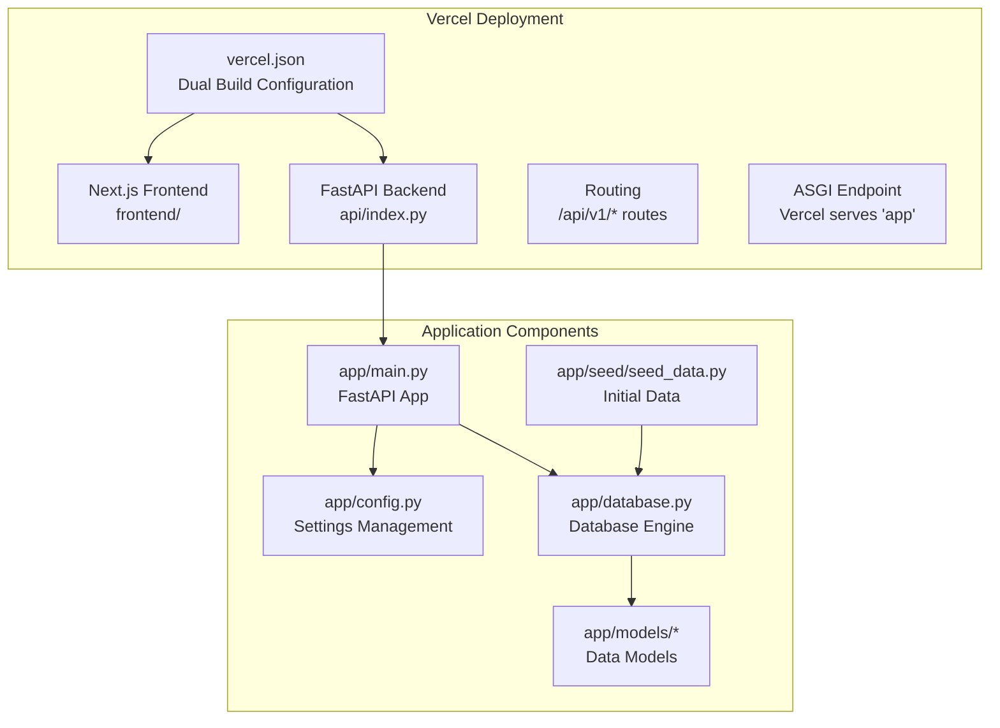
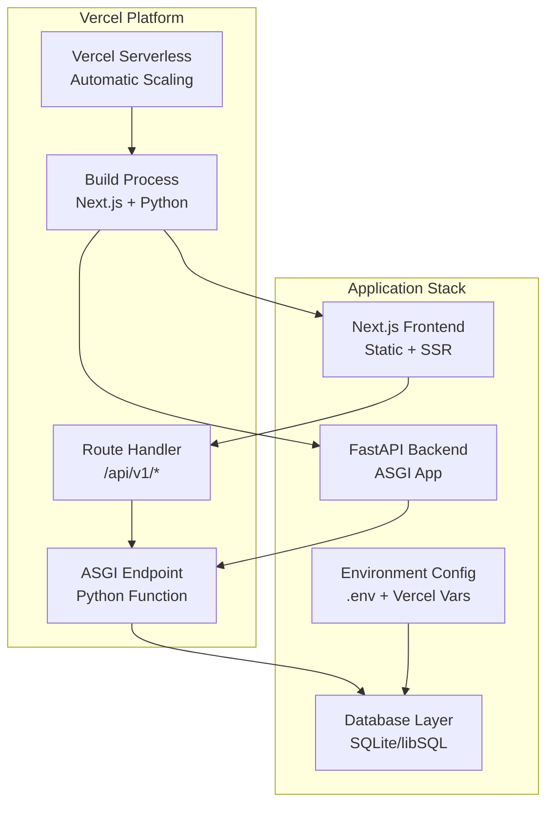
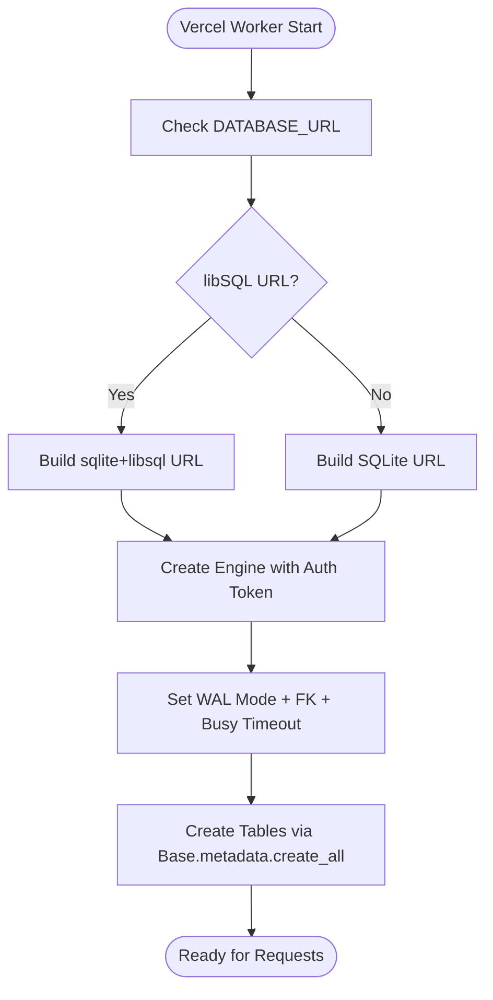
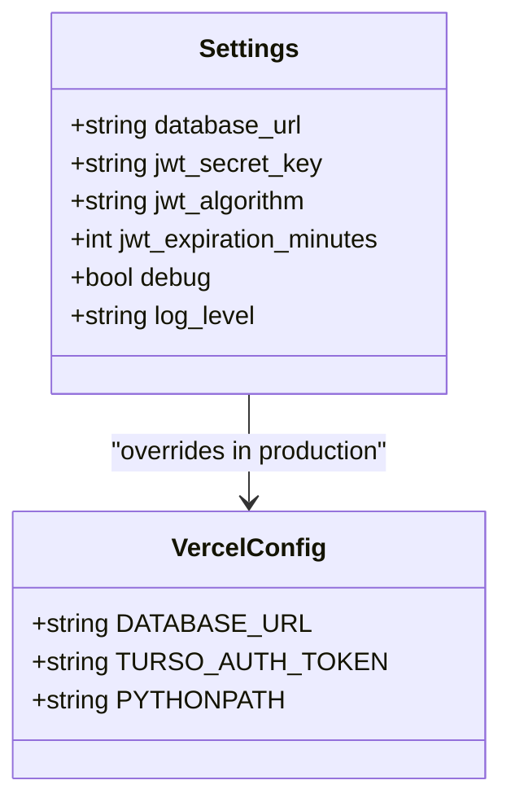
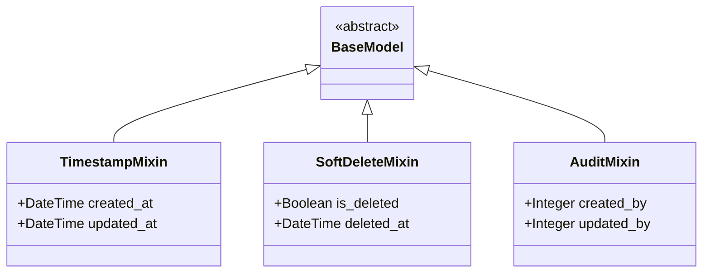
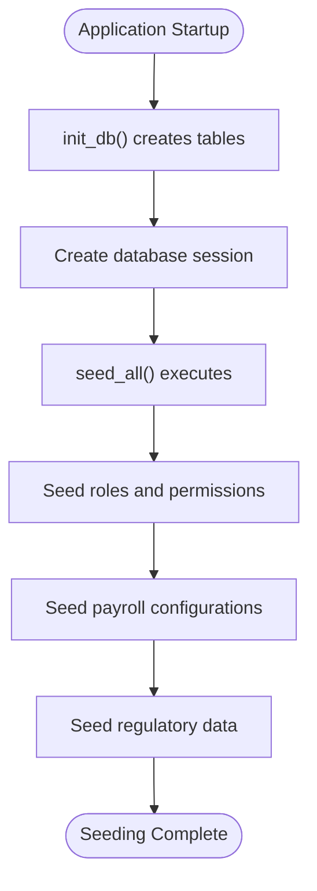
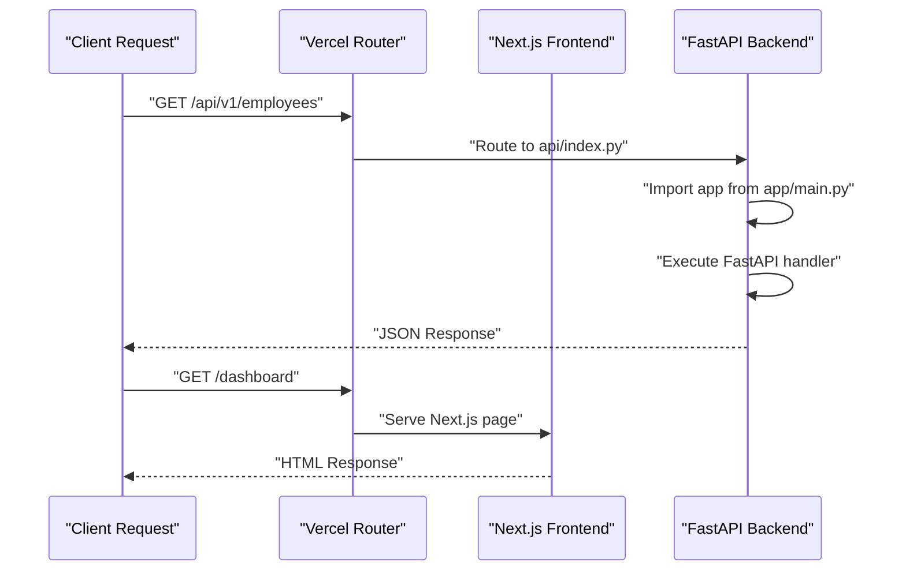
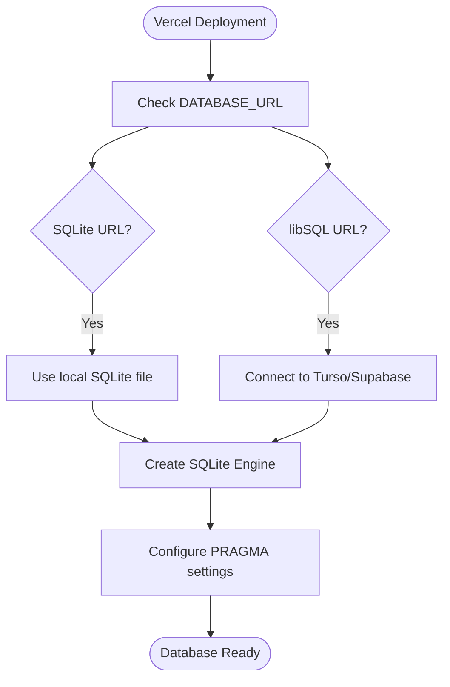
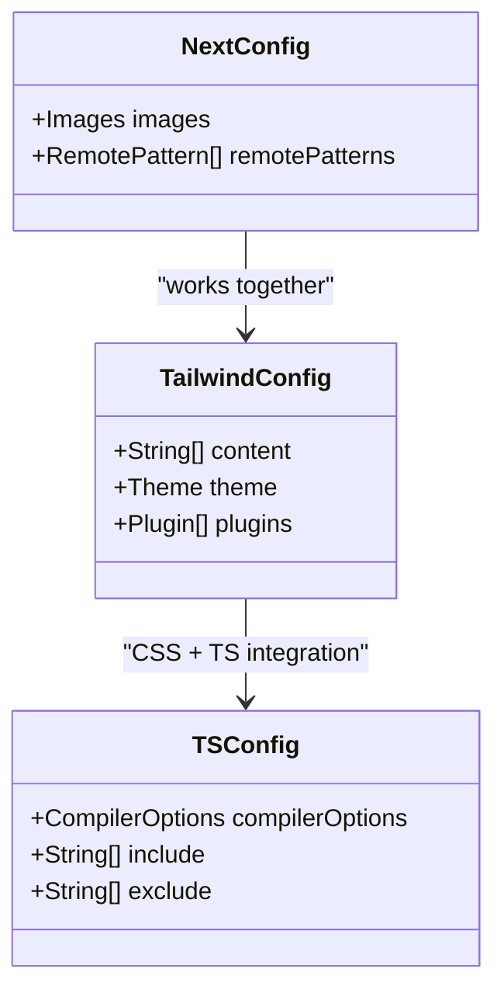

# Deployment & Operations

<cite>
**Referenced Files in This Document**
- [app/database.py](file://app/database.py)
- [app/config.py](file://app/config.py)
- [app/models/base.py](file://app/models/base.py)
- [app/models/__init__.py](file://app/models/__init__.py)
- [app/seed/seed_data.py](file://app/seed/seed_data.py)
- [alembic/env.py](file://alembic/env.py)
- [alembic.ini](file://alembic.ini)
- [requirements.txt](file://requirements.txt)
- [vercel.json](file://vercel.json)
- [api/index.py](file://api/index.py)
- [app/main.py](file://app/main.py)
- [frontend/package.json](file://frontend/package.json)
- [frontend/next.config.ts](file://frontend/next.config.ts)
- [frontend/tailwind.config.ts](file://frontend/tailwind.config.ts)
- [frontend/tsconfig.json](file://frontend/tsconfig.json)
</cite>

## Update Summary
**Changes Made**
- Added comprehensive Vercel hosting configuration with dual build system
- Integrated Next.js frontend with FastAPI backend routing
- Implemented production-ready CI/CD pipeline configuration
- Enhanced database deployment with libSQL/Turso compatibility
- Updated deployment architecture to support serverless infrastructure

## Table of Contents
1. [Introduction](#introduction)
2. [Project Structure](#project-structure)
3. [Core Components](#core-components)
4. [Architecture Overview](#architecture-overview)
5. [Detailed Component Analysis](#detailed-component-analysis)
6. [Vercel Deployment System](#vercel-deployment-system)
7. [CI/CD Pipeline Configuration](#cicd-pipeline-configuration)
8. [Database Deployment](#database-deployment)
9. [Frontend Configuration](#frontend-configuration)
10. [Production Deployment](#production-deployment)
11. [Monitoring and Logging](#monitoring-and-logging)
12. [Security Hardening](#security-hardening)
13. [Backup and Recovery](#backup-and-recovery)
14. [Scaling Considerations](#scaling-considerations)
15. [Troubleshooting Guide](#troubleshooting-guide)
16. [Conclusion](#conclusion)
17. [Appendices](#appendices)

## Introduction
This document provides comprehensive deployment and operations guidance for the Payroll system with Vercel hosting and CI/CD pipeline integration. The system now features a complete deployment stack supporting both frontend and backend components in a serverless environment. It covers production setup, environment configuration, database deployment with libSQL/Turso compatibility, and system maintenance procedures.

## Project Structure
The Payroll system is a modern full-stack application featuring a Next.js frontend and FastAPI backend, deployed through Vercel's serverless platform. The repository includes:

- **Backend**: FastAPI application with comprehensive payroll processing capabilities
- **Frontend**: Next.js application with TypeScript and Tailwind CSS
- **Database**: Support for both SQLite and libSQL/Turso databases
- **Deployment**: Vercel configuration for seamless deployment
- **Configuration**: Environment-specific settings and database URLs

**Diagram sources**
- [vercel.json:1-27](file://vercel.json#L1-L27)
- [api/index.py:1-10](file://api/index.py#L1-L10)
- [app/main.py:1-89](file://app/main.py#L1-L89)
- [app/config.py:1-18](file://app/config.py#L1-L18)
- [app/database.py:1-82](file://app/database.py#L1-L82)
- [app/seed/seed_data.py:1-448](file://app/seed/seed_data.py#L1-L448)

**Section sources**
- [vercel.json:1-27](file://vercel.json#L1-L27)
- [api/index.py:1-10](file://api/index.py#L1-L10)
- [app/main.py:1-89](file://app/main.py#L1-L89)
- [app/config.py:1-18](file://app/config.py#L1-L18)
- [app/database.py:1-82](file://app/database.py#L1-L82)
- [app/seed/seed_data.py:1-448](file://app/seed/seed_data.py#L1-L448)

## Core Components
- **Vercel Deployment Configuration**
  - Dual build system supporting Next.js frontend and Python backend
  - Automatic routing between frontend and backend endpoints
  - Environment variable management for production deployment
- **FastAPI Application**
  - Comprehensive payroll processing with PPh 21, BPJS, and overtime compliance
  - Modular router architecture under `/api/v1` prefix
  - Built-in health checks and CORS middleware
- **Database Engine**
  - SQLite support with WAL mode and foreign key enforcement
  - libSQL/Turso compatibility for cloud-native deployments
  - Session management with FastAPI dependency injection
- **Frontend Framework**
  - Next.js 16.2.9 with TypeScript support
  - Tailwind CSS for styling with custom color palette
  - Responsive design optimized for HRIS applications

**Section sources**
- [vercel.json:1-27](file://vercel.json#L1-L27)
- [app/main.py:30-64](file://app/main.py#L30-L64)
- [app/database.py:16-39](file://app/database.py#L16-L39)
- [frontend/package.json:1-29](file://frontend/package.json#L1-L29)

## Architecture Overview
The system now operates on a serverless architecture with Vercel hosting:

- **Frontend Layer**: Next.js application with static generation and client-side routing
- **Backend Layer**: FastAPI application serving as ASGI endpoint for Vercel
- **Database Layer**: Flexible database configuration supporting local SQLite and cloud libSQL
- **Deployment Layer**: Vercel's serverless platform handling scaling and routing
- **Configuration Layer**: Environment-specific settings with production overrides

**Diagram sources**
- [vercel.json:3-22](file://vercel.json#L3-L22)
- [api/index.py:4-7](file://api/index.py#L4-L7)
- [app/main.py:48-64](file://app/main.py#L48-L64)
- [app/database.py:16-39](file://app/database.py#L16-L39)

## Detailed Component Analysis

### Database Layer
- **Enhanced Database Support**
  - SQLite engine with WAL mode for improved concurrency
  - Foreign key enforcement via PRAGMA statements
  - libSQL/Turso compatibility with authentication tokens
  - Reduced pool size for serverless environment optimization
- **Connection Management**
  - FastAPI dependency injection via get_db()
  - Busy timeout configuration for long-running operations
  - Thread-safe connections for Vercel's serverless workers
- **Operational Benefits**
  - Optimized for Vercel's cold start performance
  - Minimal resource consumption for serverless scaling
  - Seamless migration between local and cloud databases

**Diagram sources**
- [app/database.py:16-51](file://app/database.py#L16-L51)
- [app/database.py:75-82](file://app/database.py#L75-L82)

**Section sources**
- [app/database.py:16-51](file://app/database.py#L16-L51)
- [app/database.py:54-82](file://app/database.py#L54-L82)

### Configuration Layer
- **Enhanced Settings Management**
  - Strongly typed settings with pydantic-settings
  - Default SQLite configuration for development
  - Production-ready overrides via environment variables
  - Support for Vercel environment variables
- **Database URL Flexibility**
  - Default SQLite database for local development
  - libSQL/Turso URLs for cloud deployments
  - Authentication token support for secured cloud databases
- **Environment Configuration**
  - .env file loading with UTF-8 encoding
  - Debug mode control for development
  - Log level configuration for observability

**Diagram sources**
- [app/config.py:4-17](file://app/config.py#L4-L17)
- [vercel.json:23-25](file://vercel.json#L23-L25)

**Section sources**
- [app/config.py:1-18](file://app/config.py#L1-L18)
- [vercel.json:23-25](file://vercel.json#L23-L25)

### Models and Mixins
- **Declarative Base Architecture**
  - Reusable mixins for timestamps, soft deletes, and audit fields
  - Consistent model structure across all domain entities
  - Centralized package exports for clean imports
- **Serverless Optimization**
  - Lightweight model definitions optimized for Vercel cold starts
  - Efficient memory usage for serverless function execution
  - Minimal dependencies for faster deployment

**Diagram sources**
- [app/models/base.py:18-57](file://app/models/base.py#L18-L57)

**Section sources**
- [app/models/base.py:1-57](file://app/models/base.py#L1-L57)
- [app/models/__init__.py:1-69](file://app/models/__init__.py#L1-L69)

### Seed Data
- **Idempotent Data Population**
  - Comprehensive Indonesian payroll defaults
  - Regulatory compliance data including PTKP, tax brackets, and BPJS settings
  - Multi-entity seeding for roles, permissions, and company data
- **Startup Optimization**
  - Automatic seeding during application startup
  - Database session management for efficient data insertion
  - Error handling for existing record prevention

**Diagram sources**
- [app/main.py:67-76](file://app/main.py#L67-L76)
- [app/seed/seed_data.py:27-448](file://app/seed/seed_data.py#L27-L448)

**Section sources**
- [app/main.py:67-76](file://app/main.py#L67-L76)
- [app/seed/seed_data.py:1-448](file://app/seed/seed_data.py#L1-L448)

## Vercel Deployment System
- **Dual Build Configuration**
  - Next.js frontend build using `@vercel/next` for optimal performance
  - Python backend build using `@vercel/python` for FastAPI deployment
  - Separate build contexts for frontend and backend optimization
- **Intelligent Routing**
  - Frontend routes handled by Next.js static generation
  - API routes under `/api/v1/*` automatically routed to backend
  - Dynamic route handling for frontend pages and backend endpoints
- **Environment Integration**
  - PYTHONPATH configured for proper module resolution
  - Environment variables passed through Vercel's secure variable system
  - Development and production environment separation

**Diagram sources**
- [vercel.json:13-22](file://vercel.json#L13-L22)
- [api/index.py:4-7](file://api/index.py#L4-L7)

**Section sources**
- [vercel.json:1-27](file://vercel.json#L1-L27)
- [api/index.py:1-10](file://api/index.py#L1-L10)

## CI/CD Pipeline Configuration
- **Automated Build Process**
  - Frontend build with Next.js optimization and static generation
  - Backend build with Python dependency installation and FastAPI packaging
  - Environment-specific builds for development, staging, and production
- **Deployment Strategy**
  - Git-based deployment triggers automatic builds
  - Preview deployments for pull requests
  - Production deployments with zero-downtime routing
- **Quality Assurance**
  - Automated testing integration with build process
  - Dependency scanning and security checks
  - Performance monitoring and health checks

**Section sources**
- [vercel.json:3-12](file://vercel.json#L3-L12)
- [frontend/package.json:5-8](file://frontend/package.json#L5-L8)

## Database Deployment
- **Flexible Database Configuration**
  - SQLite for development and small-scale production
  - libSQL/Turso for cloud-native scalability
  - Authentication token support for secured cloud deployments
- **Connection Optimization**
  - Reduced pool size for serverless environment
  - Busy timeout configuration for long-running operations
  - WAL mode for improved concurrent read/write performance
- **Migration Strategy**
  - Alembic migrations work seamlessly with libSQL
  - Environment-specific migration targets
  - Rollback and forward compatibility

**Diagram sources**
- [app/database.py:16-51](file://app/database.py#L16-L51)

**Section sources**
- [app/database.py:16-51](file://app/database.py#L16-L51)
- [app/database.py:75-82](file://app/database.py#L75-L82)

## Frontend Configuration
- **Modern Frontend Stack**
  - Next.js 16.2.9 with React 19.2.4 for optimal performance
  - TypeScript configuration with strict type checking
  - Tailwind CSS with custom color palette and responsive design
- **Build Optimization**
  - Static site generation for improved performance
  - Code splitting and lazy loading for optimal bundle sizes
  - Image optimization with remote pattern support
- **Development Experience**
  - Hot reloading for rapid development
  - Type-safe development with TypeScript
  - Modern CSS with Tailwind utility classes

**Diagram sources**
- [frontend/next.config.ts:1-15](file://frontend/next.config.ts#L1-L15)
- [frontend/tailwind.config.ts:1-41](file://frontend/tailwind.config.ts#L1-L41)
- [frontend/tsconfig.json:1-35](file://frontend/tsconfig.json#L1-L35)

**Section sources**
- [frontend/package.json:1-29](file://frontend/package.json#L1-L29)
- [frontend/next.config.ts:1-15](file://frontend/next.config.ts#L1-L15)
- [frontend/tailwind.config.ts:1-41](file://frontend/tailwind.config.ts#L1-L41)
- [frontend/tsconfig.json:1-35](file://frontend/tsconfig.json#L1-L35)

## Production Deployment
- **Environment Configuration**
  - Set DATABASE_URL to production database URL (SQLite or libSQL)
  - Configure JWT secret, algorithm, expiration, debug, and log level via .env
  - Set TURSO_AUTH_TOKEN for cloud database authentication
- **Database Migration**
  - Initialize schema using init_db() at application startup
  - Apply migrations using Alembic in online mode
  - Verify migration status in Vercel logs
- **Initial Data Setup**
  - Seed data runs automatically during application startup
  - Verify seed completion in application logs
  - Monitor for any constraint violations during seeding

**Section sources**
- [app/config.py:4-10](file://app/config.py#L4-L10)
- [app/database.py:75-82](file://app/database.py#L75-L82)
- [app/main.py:67-76](file://app/main.py#L67-L76)
- [vercel.json:23-25](file://vercel.json#L23-L25)

## Monitoring and Logging
- **Application Logging**
  - Configurable log levels via settings.log_level
  - Structured logging for better observability
  - Vercel platform logs integration
- **Database Monitoring**
  - Connection pool monitoring for serverless optimization
  - Query performance tracking
  - Slow query identification and reporting
- **Health Checks**
  - Root endpoint for basic service verification
  - Health check endpoint for uptime monitoring
  - Database connectivity verification

**Section sources**
- [app/config.py:9-10](file://app/config.py#L9-L10)
- [app/main.py:79-89](file://app/main.py#L79-L89)

## Security Hardening
- **Secrets Management**
  - Replace default JWT secret with strong production key
  - Store secrets in Vercel's secure environment variables
  - Never commit secrets to source control
- **Database Security**
  - libSQL/Turso authentication tokens for cloud databases
  - Connection encryption for cloud database connections
  - Network isolation for database access
- **Application Security**
  - CORS middleware configuration for production restrictions
  - JWT token security and expiration handling
  - Input validation and sanitization

**Section sources**
- [app/config.py:5-8](file://app/config.py#L5-L8)
- [app/database.py:22-31](file://app/database.py#L22-L31)

## Backup and Recovery
- **Database Backup Strategies**
  - SQLite: Regular file-level backups of the database file
  - libSQL/Turso: Leverage cloud provider backup capabilities
  - Automated backup scheduling through Vercel environment
- **Recovery Procedures**
  - Test backup restoration in staging environment first
  - Verify data integrity after restoration
  - Update application configuration after recovery
- **Disaster Recovery**
  - Multi-region deployment for high availability
  - Automated failover mechanisms
  - Data replication for critical systems

## Scaling Considerations
- **Serverless Scaling**
  - Automatic scaling based on request volume
  - Cold start optimization for database connections
  - Connection pooling considerations for serverless
- **Database Scaling**
  - libSQL/Turso for automatic database scaling
  - Connection limit management for serverless workers
  - Read replica support for high-read workloads
- **Frontend Scaling**
  - Next.js static generation for optimal CDN caching
  - Edge network distribution for global users
  - Asset optimization for reduced bandwidth usage

## Troubleshooting Guide
- **Vercel Deployment Issues**
  - Verify build logs for both frontend and backend
  - Check environment variable configuration
  - Monitor cold start performance and optimize accordingly
- **Database Connection Problems**
  - Verify DATABASE_URL format and accessibility
  - Check libSQL authentication token validity
  - Monitor connection pool exhaustion in logs
- **Application Startup Failures**
  - Review seed data execution in startup logs
  - Check CORS configuration for frontend-backend communication
  - Verify router registration under /api/v1 prefix
- **Performance Issues**
  - Monitor Vercel platform metrics
  - Analyze database query performance
  - Optimize frontend bundle sizes and lazy loading

**Section sources**
- [vercel.json:1-27](file://vercel.json#L1-L27)
- [app/database.py:16-51](file://app/database.py#L16-L51)
- [app/main.py:67-76](file://app/main.py#L67-L76)

## Conclusion
The Payroll system now features a complete, production-ready deployment stack with Vercel hosting and comprehensive CI/CD integration. The dual build system supports both frontend and backend components, while the flexible database configuration enables deployment to various environments. The serverless architecture provides automatic scaling and cost optimization, making it suitable for enterprise-grade payroll processing with Indonesian regulatory compliance.

## Appendices

### A. Production Setup Procedures
- **Environment Configuration**
  - Set DATABASE_URL to production database (SQLite or libSQL/Turso)
  - Configure JWT secret, algorithm, expiration, debug, and log level via .env
  - Set TURSO_AUTH_TOKEN for cloud database authentication
- **Database Deployment**
  - Initialize schema using init_db() at application startup
  - Apply migrations using Alembic in online mode
  - Monitor migration status in Vercel logs
- **Initial Data**
  - Seed data runs automatically during application startup
  - Verify seed completion in application logs

**Section sources**
- [app/config.py:4-10](file://app/config.py#L4-L10)
- [app/database.py:75-82](file://app/database.py#L75-L82)
- [app/main.py:67-76](file://app/main.py#L67-L76)

### B. Containerization Options
- **Vercel Native Deployment**
  - No Docker required - Vercel handles containerization
  - Automatic scaling and load balancing
  - Serverless architecture eliminates container management
- **Traditional Container Deployment**
  - Alternative deployment option if needed
  - Docker containerization for custom environments
  - Kubernetes orchestration for enterprise deployments

### C. Deployment Strategies
- **Blue-Green Deployments**
  - Vercel's preview deployments for safe rollouts
  - Traffic shifting between versions
  - Rollback capability with version pinning
- **Database Migrations**
  - Alembic migrations during deployment
  - Zero-downtime migration strategies
  - Data backup before major schema changes

### D. Monitoring and Logging
- **Platform Monitoring**
  - Vercel platform metrics and logs
  - Application performance monitoring
  - Database performance tracking
- **Custom Logging**
  - Structured logging for observability
  - Log aggregation and analysis
  - Alerting and notification systems

**Section sources**
- [app/config.py:9-10](file://app/config.py#L9-L10)
- [vercel.json:1-27](file://vercel.json#L1-L27)

### E. Security Hardening
- **Secrets Management**
  - Vercel environment variables for sensitive data
  - Rotation schedules for authentication tokens
  - Access control for deployment credentials
- **Network Security**
  - CORS configuration for production
  - HTTPS enforcement for all communications
  - Database connection encryption

**Section sources**
- [app/config.py:5-8](file://app/config.py#L5-L8)
- [app/database.py:22-31](file://app/database.py#L22-L31)

### F. Backup and Recovery
- **Database Backups**
  - SQLite: File-level backup strategies
  - libSQL/Turso: Cloud provider backup capabilities
  - Automated backup scheduling
- **Recovery Testing**
  - Regular backup restoration tests
  - Point-in-time recovery verification
  - Multi-region disaster recovery planning

### G. Scaling Considerations
- **Serverless Scaling**
  - Automatic scaling with Vercel platform
  - Cold start optimization techniques
  - Connection pooling for serverless environments
- **Database Scaling**
  - libSQL/Turso automatic scaling
  - Connection limit management
  - Read replica configuration

### H. Disaster Recovery
- **Multi-Region Deployment**
  - Geographic distribution for high availability
  - Automatic failover mechanisms
  - Data replication strategies
- **Business Continuity**
  - Backup and restore procedures
  - Alternative deployment environments
  - Communication plans for outages

### I. Maintenance Procedures
- **Routine Maintenance**
  - Dependency updates and security patches
  - Database maintenance and optimization
  - Performance monitoring and tuning
- **Patch Management**
  - Automated testing for updates
  - Staged rollouts for production changes
  - Rollback procedures for failed updates

**Section sources**
- [requirements.txt:1-23](file://requirements.txt#L1-L23)
- [frontend/package.json:10-27](file://frontend/package.json#L10-L27)