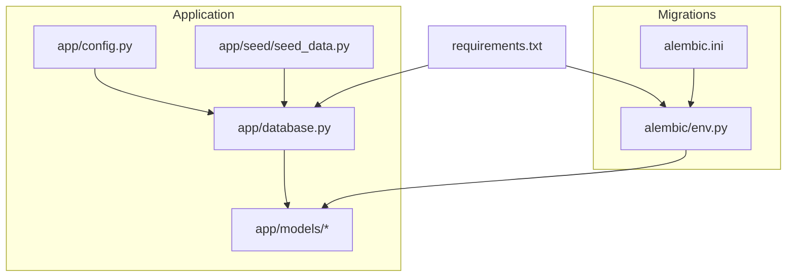
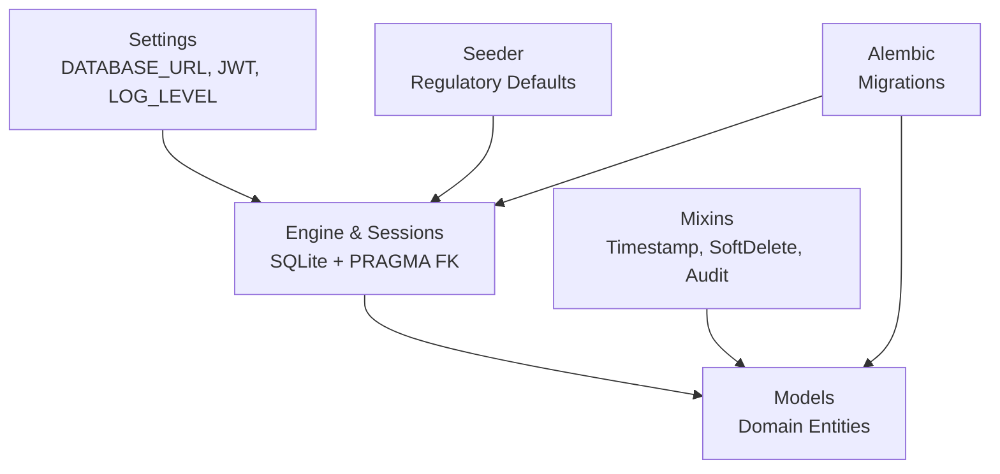
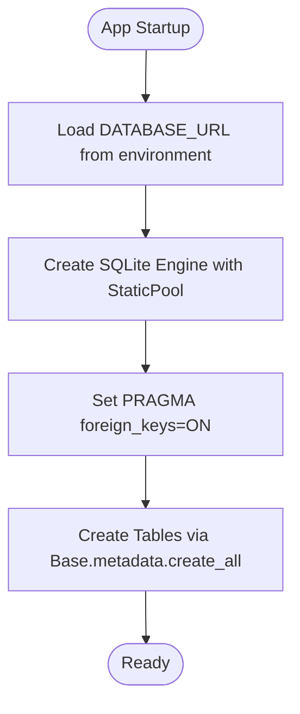
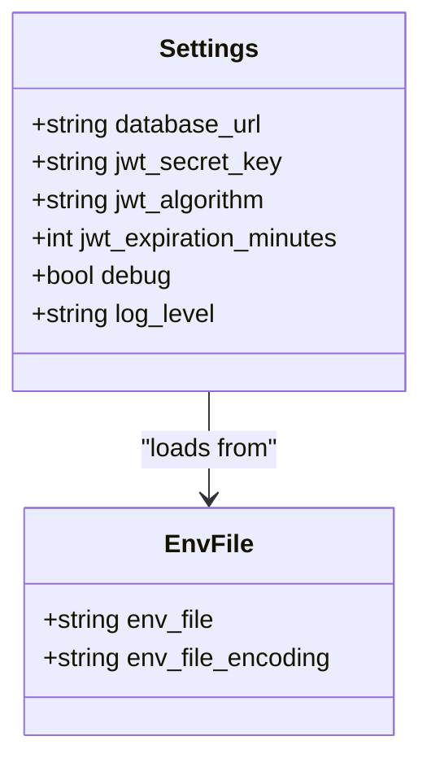
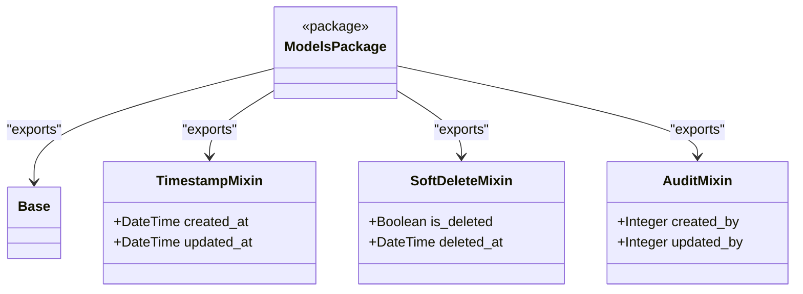
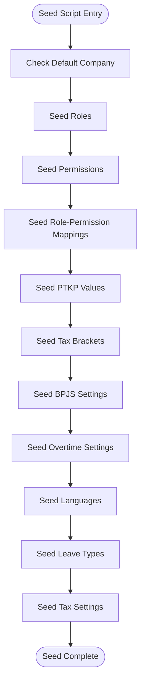
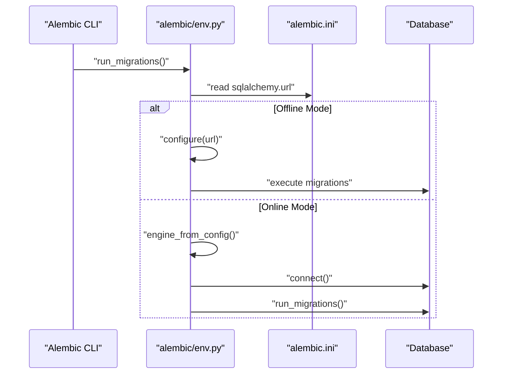
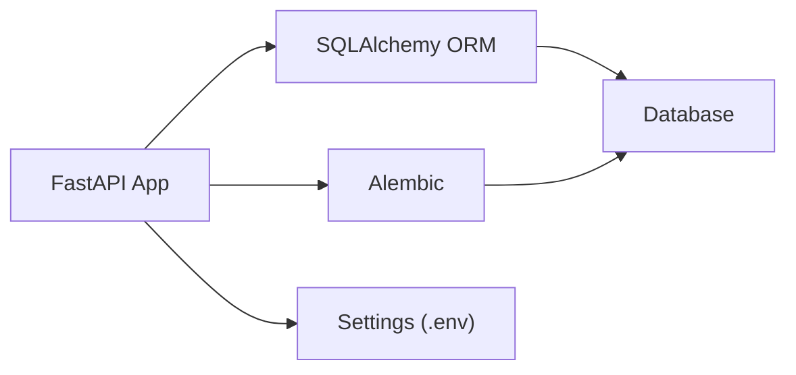

# Deployment & Operations

<cite>
**Referenced Files in This Document**
- [app/database.py](file://app/database.py)
- [app/config.py](file://app/config.py)
- [app/models/base.py](file://app/models/base.py)
- [app/models/__init__.py](file://app/models/__init__.py)
- [app/seed/seed_data.py](file://app/seed/seed_data.py)
- [alembic/env.py](file://alembic/env.py)
- [alembic.ini](file://alembic.ini)
- [requirements.txt](file://requirements.txt)
</cite>

## Table of Contents
1. [Introduction](#introduction)
2. [Project Structure](#project-structure)
3. [Core Components](#core-components)
4. [Architecture Overview](#architecture-overview)
5. [Detailed Component Analysis](#detailed-component-analysis)
6. [Dependency Analysis](#dependency-analysis)
7. [Performance Considerations](#performance-considerations)
8. [Troubleshooting Guide](#troubleshooting-guide)
9. [Conclusion](#conclusion)
10. [Appendices](#appendices)

## Introduction
This document provides comprehensive deployment and operations guidance for the Payroll system. It covers production setup, environment configuration, database deployment, and system maintenance. It also explains containerization options, deployment strategies, monitoring and logging configuration, performance optimization, update procedures, backup and recovery, security hardening, operational troubleshooting, scaling considerations, disaster recovery, and production maintenance.

## Project Structure
The Payroll system is a Python/SQL application using FastAPI and SQLAlchemy. The repository includes:
- Application configuration and database initialization
- Data models and mixins
- Seed data for Indonesian payroll compliance
- Alembic-based migrations for schema evolution
- Dependencies pinned in requirements

**Diagram sources**
- [app/config.py:1-18](file://app/config.py#L1-L18)
- [app/database.py:1-63](file://app/database.py#L1-L63)
- [app/models/base.py:1-57](file://app/models/base.py#L1-L57)
- [app/models/__init__.py:1-69](file://app/models/__init__.py#L1-L69)
- [app/seed/seed_data.py:1-448](file://app/seed/seed_data.py#L1-L448)
- [alembic/env.py:1-80](file://alembic/env.py#L1-L80)
- [alembic.ini:1-77](file://alembic.ini#L1-L77)
- [requirements.txt:1-14](file://requirements.txt#L1-L14)

**Section sources**
- [app/config.py:1-18](file://app/config.py#L1-L18)
- [app/database.py:1-63](file://app/database.py#L1-L63)
- [app/models/base.py:1-57](file://app/models/base.py#L1-L57)
- [app/models/__init__.py:1-69](file://app/models/__init__.py#L1-L69)
- [app/seed/seed_data.py:1-448](file://app/seed/seed_data.py#L1-L448)
- [alembic/env.py:1-80](file://alembic/env.py#L1-L80)
- [alembic.ini:1-77](file://alembic.ini#L1-L77)
- [requirements.txt:1-14](file://requirements.txt#L1-L14)

## Core Components
- Configuration and Environment Variables
  - Centralized settings via pydantic-settings with .env loading
  - Key variables include database URL, JWT secret, algorithm, expiration, debug, and log level
- Database Initialization and Session Management
  - SQLite engine with PRAGMA foreign keys enabled
  - Static connection pooling and FastAPI dependency injection via get_db()
  - Schema initialization via Base.metadata.create_all
- Data Models and Mixins
  - Declarative base and reusable mixins for timestamps, soft deletes, and audit fields
  - Comprehensive model package exports for all domain entities
- Seed Data
  - Idempotent seeding for Indonesian payroll defaults including roles, permissions, PTKP, tax brackets, BPJS, overtime, languages, leave types, and tax settings
- Migrations
  - Alembic environment configured for offline/online modes with batch rendering for SQLite compatibility
  - Alembic configuration file sets default SQLite URL and logging levels

**Section sources**
- [app/config.py:1-18](file://app/config.py#L1-L18)
- [app/database.py:17-63](file://app/database.py#L17-L63)
- [app/models/base.py:18-57](file://app/models/base.py#L18-L57)
- [app/models/__init__.py:1-69](file://app/models/__init__.py#L1-L69)
- [app/seed/seed_data.py:27-64](file://app/seed/seed_data.py#L27-L64)
- [alembic/env.py:29-80](file://alembic/env.py#L29-L80)
- [alembic.ini:30-77](file://alembic.ini#L30-L77)

## Architecture Overview
The system follows a layered architecture:
- Configuration layer manages environment-driven settings
- Database layer handles connection, pooling, and schema initialization
- Model layer defines domain entities and shared behaviors
- Migration layer supports schema evolution
- Seed layer initializes regulatory and system defaults

**Diagram sources**
- [app/config.py:4-10](file://app/config.py#L4-L10)
- [app/database.py:17-35](file://app/database.py#L17-L35)
- [app/models/base.py:18-57](file://app/models/base.py#L18-L57)
- [app/seed/seed_data.py:27-64](file://app/seed/seed_data.py#L27-L64)
- [alembic/env.py:14-26](file://alembic/env.py#L14-L26)

## Detailed Component Analysis

### Database Layer
- Connection and Pooling
  - SQLite engine configured with StaticPool and thread-safe settings
  - Foreign key enforcement enabled via PRAGMA on connection
- Session Management
  - get_db() dependency yields sessions and ensures closure
  - init_db() creates all tables defined in models
- Operational Notes
  - SQLite is suitable for development and small-scale production
  - For high-concurrency production, consider a relational database with robust concurrency controls

**Diagram sources**
- [app/database.py:17-63](file://app/database.py#L17-L63)

**Section sources**
- [app/database.py:17-63](file://app/database.py#L17-L63)

### Configuration Layer
- Settings Management
  - Strongly typed settings loaded from .env
  - Includes database URL, JWT configuration, debug flag, and log level
- Recommendations
  - Override defaults in production via environment variables
  - Store secrets externally and mount into containers securely

**Diagram sources**
- [app/config.py:4-17](file://app/config.py#L4-L17)

**Section sources**
- [app/config.py:1-18](file://app/config.py#L1-L18)

### Models and Mixins
- Base Classes
  - Declarative base and reusable mixins for timestamps, soft deletes, and audit fields
- Model Exports
  - Centralized package exports for all domain entities
- Implications
  - Consistent auditing and lifecycle tracking across entities
  - Simplified schema evolution and maintenance

**Diagram sources**
- [app/models/base.py:18-57](file://app/models/base.py#L18-L57)
- [app/models/__init__.py:41-69](file://app/models/__init__.py#L41-L69)

**Section sources**
- [app/models/base.py:1-57](file://app/models/base.py#L1-L57)
- [app/models/__init__.py:1-69](file://app/models/__init__.py#L1-L69)

### Seed Data
- Purpose
  - Idempotent seeding of Indonesian payroll defaults
- Coverage
  - Roles, permissions, PTKP values, tax brackets, BPJS settings, overtime settings, languages, leave types, and tax settings
- Execution
  - Designed to be run once at initial setup or reset

**Diagram sources**
- [app/seed/seed_data.py:27-448](file://app/seed/seed_data.py#L27-L448)

**Section sources**
- [app/seed/seed_data.py:1-448](file://app/seed/seed_data.py#L1-L448)

### Migrations
- Offline/Online Modes
  - Supports running migrations without an engine (offline) and with a connected engine (online)
- SQLite Compatibility
  - Uses render_as_batch=True for ALTER TABLE compatibility
- Configuration
  - Alembic configuration file defines logging and default SQLite URL

**Diagram sources**
- [alembic/env.py:29-80](file://alembic/env.py#L29-L80)
- [alembic.ini:30-77](file://alembic.ini#L30-L77)

**Section sources**
- [alembic/env.py:1-80](file://alembic/env.py#L1-L80)
- [alembic.ini:1-77](file://alembic.ini#L1-L77)

## Dependency Analysis
- Runtime Dependencies
  - FastAPI, Uvicorn, SQLAlchemy, Alembic, Pydantic, Pydantic Settings, python-dotenv, and others
- Database Connectivity
  - Engine configured via DATABASE_URL; default SQLite; production should override
- Migration Tooling
  - Alembic integrates with SQLAlchemy metadata and environment configuration

**Diagram sources**
- [requirements.txt:1-14](file://requirements.txt#L1-L14)
- [app/config.py:4-10](file://app/config.py#L4-L10)
- [app/database.py:17-24](file://app/database.py#L17-L24)
- [alembic/env.py:14-26](file://alembic/env.py#L14-L26)

**Section sources**
- [requirements.txt:1-14](file://requirements.txt#L1-L14)
- [app/config.py:1-18](file://app/config.py#L1-L18)
- [app/database.py:17-24](file://app/database.py#L17-L24)
- [alembic/env.py:14-26](file://alembic/env.py#L14-L26)

## Performance Considerations
- Database
  - SQLite with StaticPool is lightweight but not ideal for high-concurrency scenarios
  - Consider migrating to a production-grade relational database for scale
- Connection Management
  - Ensure proper session lifecycle via get_db() dependency injection
- Logging
  - Tune log levels via settings.log_level to balance observability and overhead
- Migration Batch Rendering
  - Alembic’s batch rendering improves SQLite ALTER TABLE compatibility

[No sources needed since this section provides general guidance]

## Troubleshooting Guide
- Database Initialization
  - Verify DATABASE_URL environment variable
  - Confirm foreign key enforcement is active (PRAGMA enabled)
  - Ensure init_db() runs at startup to create tables
- Migrations
  - Use Alembic offline mode for dry-run checks
  - For online mode, confirm connectivity and transaction boundaries
- Seed Data
  - Run seed script once; it is idempotent and will skip existing records
- Logs
  - Adjust log levels via settings.log_level
  - Review Alembic and SQLAlchemy loggers as configured

**Section sources**
- [app/database.py:17-63](file://app/database.py#L17-L63)
- [alembic/env.py:29-80](file://alembic/env.py#L29-L80)
- [alembic.ini:44-77](file://alembic.ini#L44-L77)
- [app/seed/seed_data.py:27-64](file://app/seed/seed_data.py#L27-L64)

## Conclusion
The Payroll system is structured for straightforward deployment with SQLite and Alembic-based migrations. Production readiness requires overriding environment variables, securing secrets, selecting a production database, and establishing robust monitoring and backups. The included seed data accelerates initial setup with Indonesian payroll defaults.

[No sources needed since this section summarizes without analyzing specific files]

## Appendices

### A. Production Setup Procedures
- Environment Configuration
  - Set DATABASE_URL to a production database URL
  - Configure JWT secret, algorithm, expiration, debug, and log level via .env
- Database Deployment
  - Initialize schema using init_db() at startup
  - Apply migrations using Alembic in online mode
- Initial Data
  - Run the seed script once to populate defaults

**Section sources**
- [app/config.py:4-10](file://app/config.py#L4-L10)
- [app/database.py:56-63](file://app/database.py#L56-L63)
- [alembic/env.py:53-80](file://alembic/env.py#L53-L80)
- [app/seed/seed_data.py:432-448](file://app/seed/seed_data.py#L432-L448)

### B. Containerization Options
- Image Build
  - Use a Python base image aligned with requirements
  - Install dependencies from requirements.txt
- Entrypoint
  - Run the FastAPI application with Uvicorn
- Volumes and Secrets
  - Mount .env for configuration
  - Persist database files or configure external database connectivity

[No sources needed since this section provides general guidance]

### C. Deployment Strategies
- Rolling Updates
  - Stateless application allows rolling restarts
- Blue-Green or Canary
  - Route traffic incrementally to minimize downtime
- Database Migrations
  - Perform migrations before or during deployments using Alembic

[No sources needed since this section provides general guidance]

### D. Monitoring and Logging
- Logging Levels
  - Control via settings.log_level
- Alembic Logging
  - Configure logger levels in alembic.ini for migration visibility

**Section sources**
- [app/config.py:9-10](file://app/config.py#L9-L10)
- [alembic.ini:44-77](file://alembic.ini#L44-L77)

### E. Security Hardening
- Secrets Management
  - Replace default JWT secret and store securely
  - Avoid committing secrets to source control
- Network and Access
  - Restrict database access and enable TLS where applicable
- Environment Isolation
  - Use separate .env files per environment

**Section sources**
- [app/config.py:5-8](file://app/config.py#L5-L8)

### F. Backup and Recovery
- Database Backups
  - For SQLite, back up the database file regularly
  - For production databases, use native backup tools
- Restore Procedure
  - Stop writes, restore the database file, re-run migrations if necessary, restart the service

[No sources needed since this section provides general guidance]

### G. Scaling Considerations
- Database Scaling
  - Migrate from SQLite to a scalable relational database
- Horizontal Scaling
  - Stateless application supports multiple replicas behind a load balancer
- Caching and Async Tasks
  - Introduce caching and async workers for heavy computations

[No sources needed since this section provides general guidance]

### H. Disaster Recovery
- Recovery Plans
  - Automate backups and test restoration regularly
- Failover
  - Use managed database failover or replication

[No sources needed since this section provides general guidance]

### I. Maintenance Procedures
- Routine Maintenance
  - Monitor logs, enforce retention policies, and review migration history
- Patching
  - Update dependencies per requirements.txt and test thoroughly before production rollout

**Section sources**
- [requirements.txt:1-14](file://requirements.txt#L1-L14)