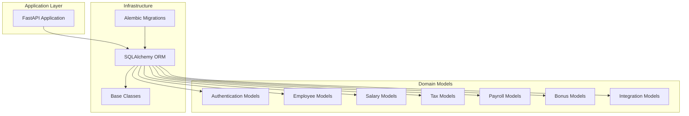
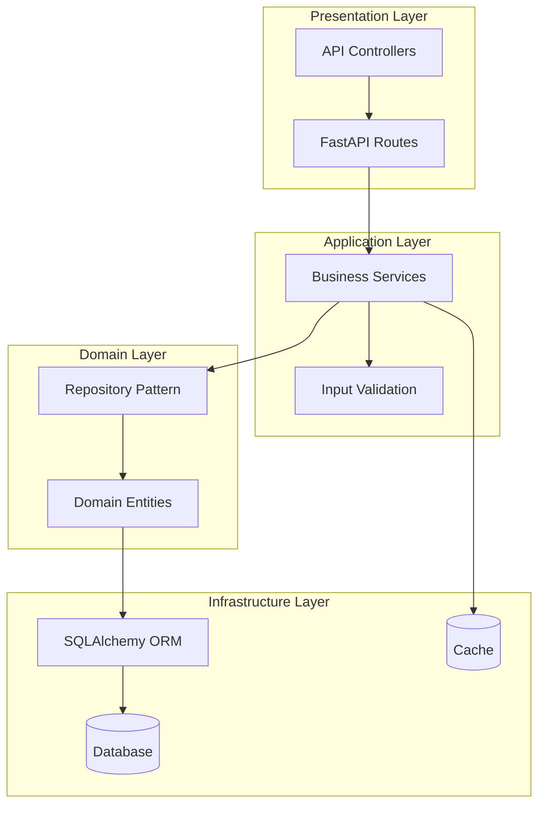
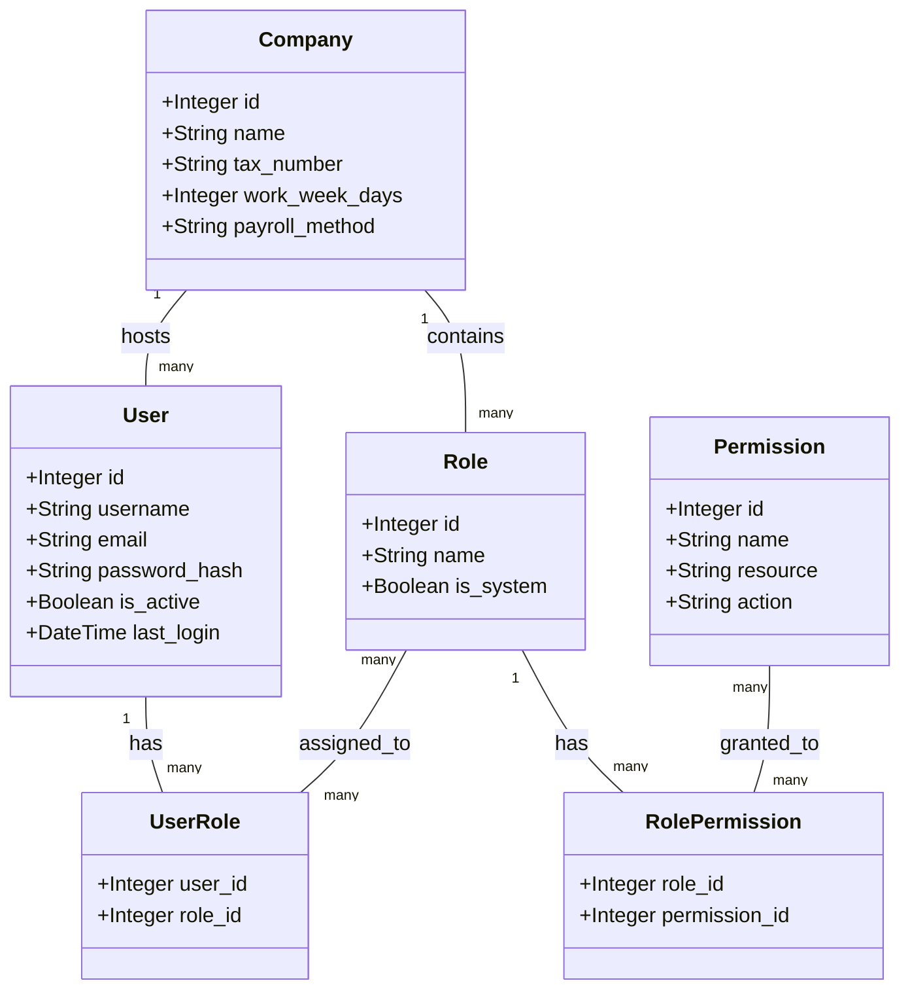
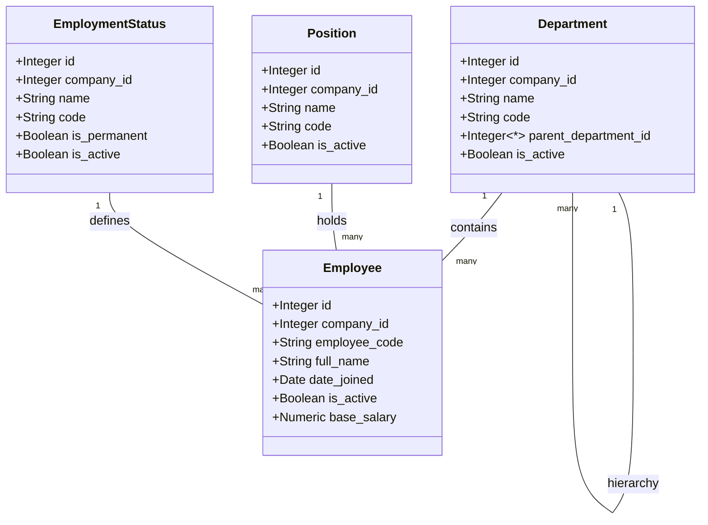
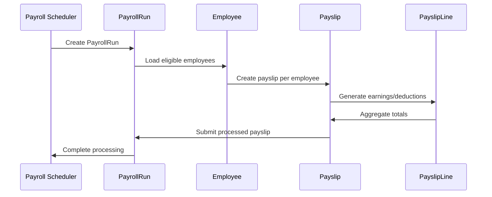

# Development Guidelines

<cite>
**Referenced Files in This Document**
- [requirements.txt](file://requirements.txt)
- [app/database.py](file://app/database.py)
- [app/models/base.py](file://app/models/base.py)
- [app/models/__init__.py](file://app/models/__init__.py)
- [app/models/auth.py](file://app/models/auth.py)
- [app/models/employee.py](file://app/models/employee.py)
- [app/models/salary.py](file://app/models/salary.py)
- [app/models/tax.py](file://app/models/tax.py)
- [app/models/payroll.py](file://app/models/payroll.py)
- [app/models/bonus.py](file://app/models/bonus.py)
- [app/models/integration.py](file://app/models/integration.py)
- [alembic/env.py](file://alembic/env.py)
- [alembic/script.py.mako](file://alembic/script.py.mako)
</cite>

## Table of Contents
1. [Introduction](#introduction)
2. [Project Structure](#project-structure)
3. [Core Components](#core-components)
4. [Architecture Overview](#architecture-overview)
5. [Detailed Component Analysis](#detailed-component-analysis)
6. [Dependency Analysis](#dependency-analysis)
7. [Performance Considerations](#performance-considerations)
8. [Testing Strategies](#testing-strategies)
9. [Contribution Procedures](#contribution-procedures)
10. [Code Review Process](#code-review-process)
11. [Documentation Standards](#documentation-standards)
12. [Troubleshooting Guide](#troubleshooting-guide)
13. [Conclusion](#conclusion)

## Introduction
This document provides comprehensive development guidelines for contributing to the Payroll system. It covers code standards, testing strategies, development environment setup, contribution procedures, and architectural patterns. The Payroll system is a FastAPI application with SQLAlchemy ORM and Alembic migrations, designed to manage HRIS and payroll operations with strong emphasis on Indonesian tax regulations and localization.

## Project Structure
The project follows a layered architecture with clear separation of concerns:
- Database layer: SQLAlchemy models organized by domain areas
- Application layer: FastAPI endpoints and business logic
- Migration layer: Alembic for database schema evolution
- Configuration: Environment variables and dependency management



**Diagram sources**
- [app/models/__init__.py:1-69](file://app/models/__init__.py#L1-L69)
- [app/database.py:1-63](file://app/database.py#L1-L63)
- [alembic/env.py:1-80](file://alembic/env.py#L1-L80)

**Section sources**
- [app/models/__init__.py:1-69](file://app/models/__init__.py#L1-L69)
- [app/database.py:1-63](file://app/database.py#L1-L63)

## Core Components
The system is built around reusable base components and domain-specific models:

### Base Model Components
The foundation consists of three essential mixins:
- **TimestampMixin**: Provides automatic created_at and updated_at fields
- **SoftDeleteMixin**: Adds logical deletion capability with is_deleted flag
- **AuditMixin**: Tracks user who created/updated records

### Database Configuration
The database layer supports SQLite with:
- Foreign key enforcement via PRAGMA statements
- Static connection pooling for performance
- FastAPI dependency injection pattern
- Centralized session management

### Domain Model Categories
Models are organized into functional domains:
- Authentication & Authorization (Company, User, Roles, Permissions)
- Employee Management (Departments, Positions, Employment Status)
- Compensation & Benefits (Grades, Allowances, Deductions)
- Tax Calculation (PTKP, Brackets, Settings)
- Payroll Processing (Runs, Payslips, Line Items)
- Additional Features (Bonuses, Reimbursements, Integrations)

**Section sources**
- [app/models/base.py:1-57](file://app/models/base.py#L1-L57)
- [app/database.py:1-63](file://app/database.py#L1-L63)
- [app/models/__init__.py:1-69](file://app/models/__init__.py#L1-L69)

## Architecture Overview
The system follows a clean architecture pattern with clear boundaries between layers:



**Diagram sources**
- [app/database.py:38-54](file://app/database.py#L38-L54)
- [app/models/base.py:18-57](file://app/models/base.py#L18-L57)

## Detailed Component Analysis

### Authentication & Authorization System
The authentication system implements role-based access control with comprehensive user management:



**Diagram sources**
- [app/models/auth.py:22-133](file://app/models/auth.py#L22-L133)

**Section sources**
- [app/models/auth.py:1-133](file://app/models/auth.py#L1-L133)

### Employee Management System
The employee management system handles organizational structure and personnel data:



**Diagram sources**
- [app/models/employee.py:20-132](file://app/models/employee.py#L20-L132)

**Section sources**
- [app/models/employee.py:1-132](file://app/models/employee.py#L1-L132)

### Payroll Processing Engine
The payroll system manages batch processing and individual payslips:



**Diagram sources**
- [app/models/payroll.py:19-124](file://app/models/payroll.py#L19-L124)

**Section sources**
- [app/models/payroll.py:1-124](file://app/models/payroll.py#L1-L124)

### Tax Calculation Framework
The tax system implements Indonesian tax regulations with configurable settings:


**Diagram sources**
- [app/models/tax.py:19-115](file://app/models/tax.py#L19-L115)

**Section sources**
- [app/models/tax.py:1-115](file://app/models/tax.py#L1-L115)

## Dependency Analysis
The system maintains loose coupling through well-defined interfaces and dependency inversion:

```mermaid
graph TB
subgraph "External Dependencies"
FASTAPI[FastAPI >=0.104.0]
SQLALCHEMY[SQLAlchemy >=2.0.0]
ALEMBIC[Alembic >=1.13.0]
PYDANTIC[Pydantic >=2.0.0]
end
subgraph "Internal Dependencies"
MODELS[app.models.*]
DATABASE[app.database]
CONFIG[app.config]
end
subgraph "Security & Utilities"
JOSE[python-jose >=3.3.0]
PASSLIB[passlib[bcrypt] >=1.7.4]
HTTPX[httpx >=0.25.0]
end
FASTAPI --> MODELS
SQLALCHEMY --> MODELS
ALEMBIC --> DATABASE
PYDANTIC --> MODELS
MODELS --> DATABASE
DATABASE --> SQLALCHEMY
```

**Diagram sources**
- [requirements.txt:1-14](file://requirements.txt#L1-L14)
- [app/database.py:10-15](file://app/database.py#L10-L15)

**Section sources**
- [requirements.txt:1-14](file://requirements.txt#L1-L14)

## Performance Considerations
The system is optimized for performance through several mechanisms:

### Database Optimization
- **Connection Pooling**: StaticPool configuration reduces connection overhead
- **Foreign Key Enforcement**: PRAGMA statements ensure referential integrity
- **Indexing Strategy**: Strategic indexes on frequently queried columns
- **Constraint Validation**: Database-level constraints prevent invalid data

### Caching Opportunities
- **Session Caching**: SQLAlchemy session reuse for repeated queries
- **Result Caching**: Potential for caching company configurations
- **Query Optimization**: Efficient joins and filtered queries

### Scalability Patterns
- **Modular Design**: Domain-specific models enable independent scaling
- **Batch Processing**: Payroll runs process multiple employees efficiently
- **Lazy Loading**: Relationship loading minimizes memory usage

## Testing Strategies
Comprehensive testing should cover all aspects of the system:

### Unit Testing Approach
- **Model Validation**: Test constraint validation and business rules
- **Database Operations**: Verify CRUD operations and relationships
- **Calculation Accuracy**: Validate tax and payroll computations
- **Edge Cases**: Handle boundary conditions and invalid inputs

### Integration Testing
- **Database Migrations**: Test schema evolution and data preservation
- **API Endpoints**: Validate request/response handling
- **Transaction Boundaries**: Ensure atomic operations
- **Error Scenarios**: Test failure recovery and rollback

### Performance Testing
- **Load Testing**: Simulate concurrent users and transactions
- **Memory Profiling**: Monitor memory usage during payroll processing
- **Database Performance**: Analyze query execution plans

## Contribution Procedures
Follow these steps to contribute effectively:

### Development Setup
1. **Environment Preparation**
   - Install Python 3.8+
   - Set up virtual environment
   - Install dependencies from requirements.txt
   - Configure DATABASE_URL environment variable

2. **Local Development**
   - Run database initialization
   - Start development server
   - Verify application health

### Code Contribution Workflow
1. **Branch Creation**
   - Create feature branch from develop
   - Follow naming convention: feature/short-description

2. **Implementation**
   - Write tests before implementation
   - Follow existing code patterns
   - Include proper documentation

3. **Commit Guidelines**
   - Use imperative mood in commit messages
   - Reference related issues
   - Keep commits focused and atomic

4. **Pull Request Process**
   - Include comprehensive description
   - Reference related issues
   - Ensure all tests pass
   - Update documentation

### Code Standards
- **Python Style**: PEP 8 compliance with 4-space indentation
- **Naming Conventions**: 
  - Classes: PascalCase
  - Variables: snake_case
  - Constants: UPPERCASE
- **Docstrings**: Comprehensive docstrings for all public functions
- **Imports**: Organized alphabetically with blank lines separation

### Database Development Practices
- **Migration Guidelines**
  - Always create migrations for schema changes
  - Use descriptive migration names
  - Test migrations on staging environment
  - Include both upgrade and downgrade operations

- **Constraint Definition**
  - Define all business constraints as database constraints
  - Use meaningful constraint names
  - Include check constraints for validation
  - Add unique constraints where appropriate

- **Index Strategy**
  - Create indexes on frequently queried columns
  - Consider composite indexes for common filters
  - Monitor index usage and remove unused indexes

### API Development Standards
- **Endpoint Design**
  - RESTful resource naming
  - Consistent HTTP status codes
  - Standardized response formats
  - Proper error handling

- **Validation**
  - Pydantic models for request validation
  - Database-level constraint validation
  - Input sanitization
  - Rate limiting for public endpoints

- **Security**
  - JWT token authentication
  - Role-based authorization
  - Input validation and sanitization
  - CORS policy configuration

### Adding New Features
1. **Feature Planning**
   - Define feature scope and requirements
   - Identify affected models and relationships
   - Plan migration strategy
   - Design API endpoints

2. **Implementation Steps**
   - Create database migration
   - Implement model changes
   - Add validation logic
   - Create API endpoints
   - Write comprehensive tests
   - Update documentation

3. **Integration Testing**
   - Test feature in isolation
   - Integration with related features
   - Performance impact assessment
   - Security vulnerability review

### Extending Existing Functionality
1. **Backward Compatibility**
   - Maintain existing API contracts
   - Add optional parameters
   - Preserve default behaviors
   - Deprecation notices for breaking changes

2. **Enhancement Process**
   - Identify extension points
   - Design minimal changes
   - Test against existing functionality
   - Update migration scripts if needed

### Maintaining Backward Compatibility
- **Database Schema**: Avoid removing columns or tables
- **API Contracts**: Maintain endpoint signatures
- **Configuration**: Support legacy configuration values
- **Data Migration**: Provide automated migration paths

## Code Review Process
Effective code reviews ensure quality and consistency:

### Review Checklist
- **Requirements Compliance**: Meets specification requirements
- **Code Quality**: Follows established patterns and standards
- **Test Coverage**: Adequate test coverage and quality
- **Performance Impact**: Minimal performance degradation
- **Security**: No security vulnerabilities introduced
- **Documentation**: Updated documentation and comments

### Review Workflow
1. **Automated Checks**: CI pipeline runs tests and linting
2. **Peer Review**: Team members review code changes
3. **Feedback Incorporation**: Address reviewer comments
4. **Approval Process**: Required approvals before merging
5. **Post-Merge Verification**: Monitor for issues

### Review Criteria
- **Technical Excellence**: Clean, maintainable code
- **Architectural Alignment**: Follows system design
- **Testing Quality**: Comprehensive and reliable tests
- **Documentation**: Clear and accurate documentation
- **Security**: Addresses potential security concerns

## Documentation Standards
Maintain comprehensive documentation for all contributions:

### Code Documentation
- **Module Documentation**: Purpose and scope of each module
- **Class Documentation**: Responsibilities and relationships
- **Function Documentation**: Parameters, return values, exceptions
- **Complex Logic**: Inline comments explaining business rules
- **Examples**: Usage examples for public APIs

### API Documentation
- **Endpoint Documentation**: Request/response schemas
- **Authentication**: Token requirements and scopes
- **Error Codes**: Standardized error responses
- **Rate Limits**: API usage limitations
- **Versioning**: API version compatibility

### Database Documentation
- **Schema Documentation**: Entity relationship diagrams
- **Migration Documentation**: Changes and impact analysis
- **Performance Notes**: Index usage and optimization tips
- **Data Dictionary**: Field descriptions and constraints

## Troubleshooting Guide
Common issues and their solutions:

### Database Issues
- **Connection Problems**: Verify DATABASE_URL environment variable
- **Migration Failures**: Check migration dependencies and conflicts
- **Constraint Violations**: Review business rule implementations
- **Performance Issues**: Analyze query execution plans

### Development Environment
- **Import Errors**: Ensure all dependencies are installed
- **Virtual Environment**: Verify Python interpreter selection
- **Configuration Issues**: Check environment variable setup
- **Port Conflicts**: Verify port availability for development server

### Testing Problems
- **Test Failures**: Review test assertions and mock data
- **Database State**: Reset test database between runs
- **Async Issues**: Handle async/await patterns correctly
- **Mock Objects**: Ensure proper mocking of external dependencies

### Deployment Issues
- **Dependency Conflicts**: Resolve version conflicts in requirements.txt
- **Environment Variables**: Verify production configuration
- **Database Connectivity**: Test connection to production database
- **Logging Configuration**: Ensure proper log level and output

## Conclusion
The Payroll system provides a robust foundation for HRIS and payroll management with clear architectural patterns and comprehensive domain modeling. By following these development guidelines, contributors can ensure their modifications align with the system's design principles while maintaining high code quality and system reliability. The modular structure, comprehensive testing approach, and well-defined contribution procedures support sustainable development and future enhancements.