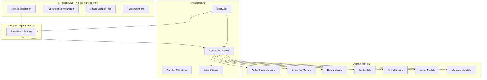
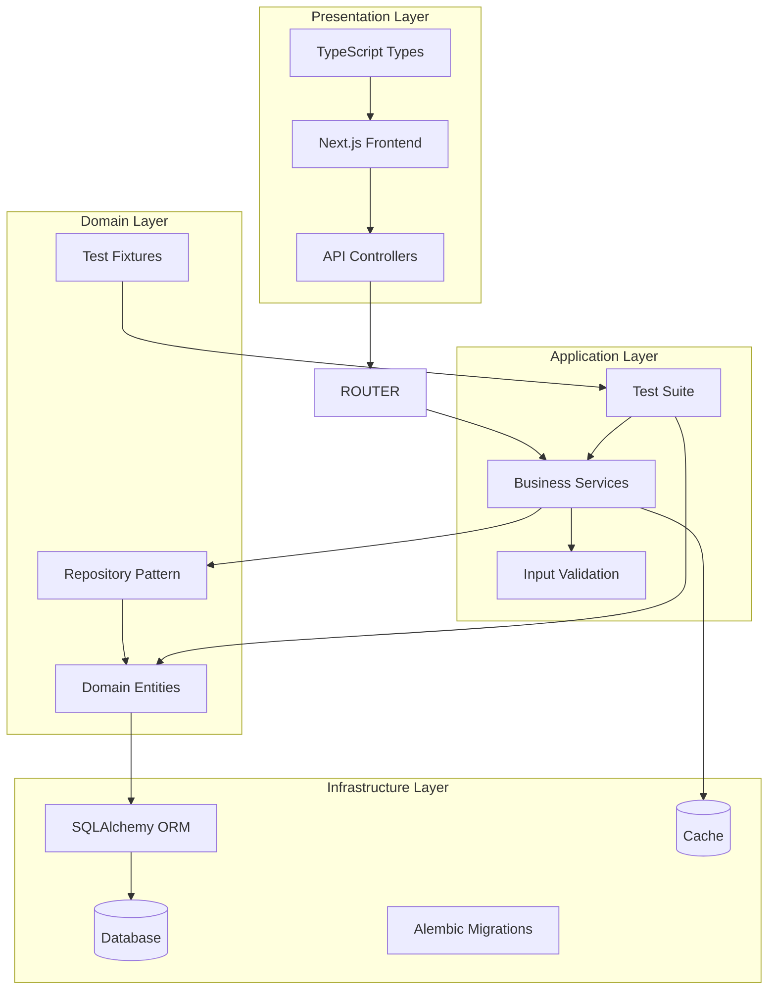
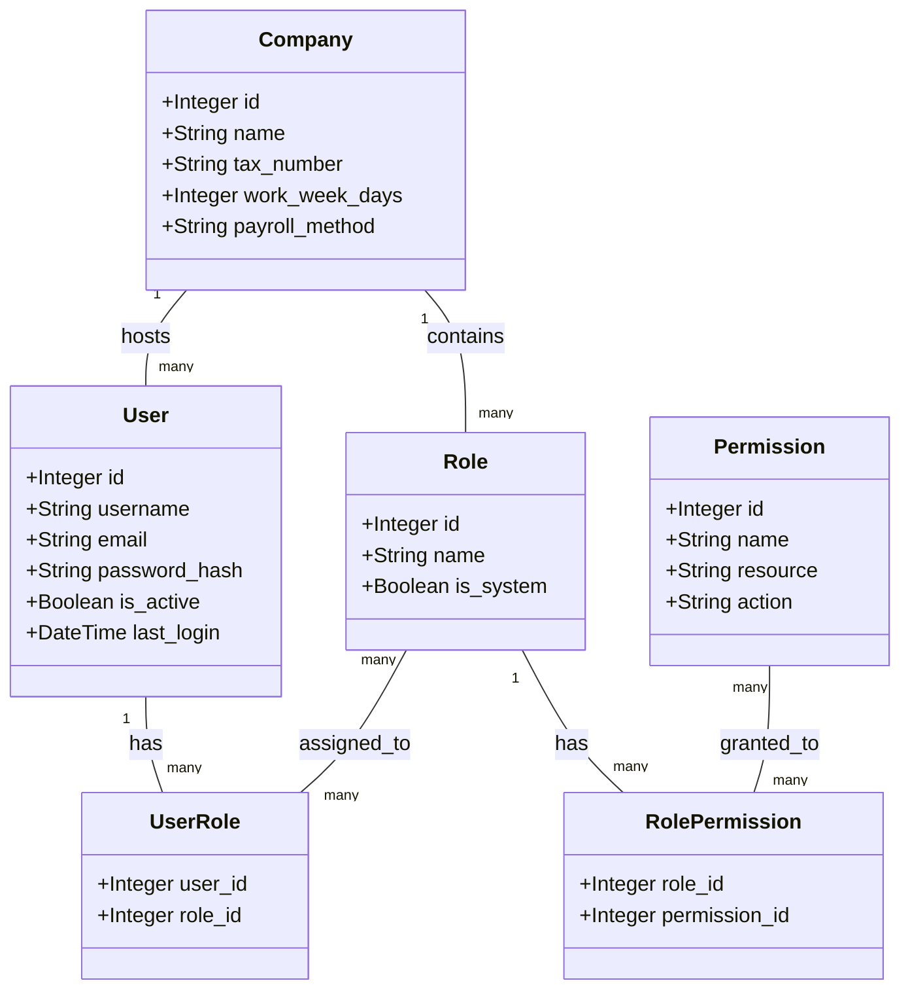
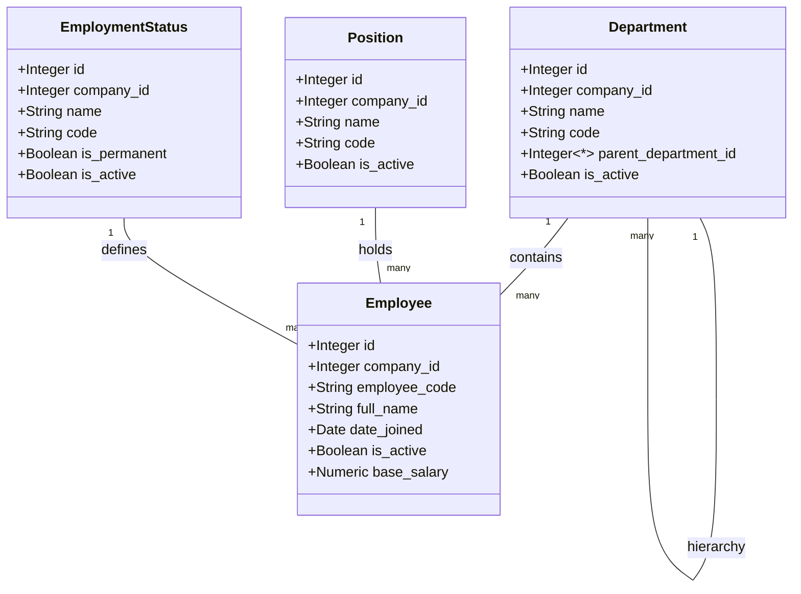
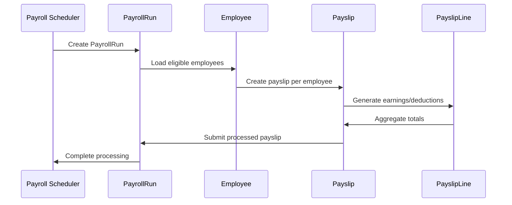
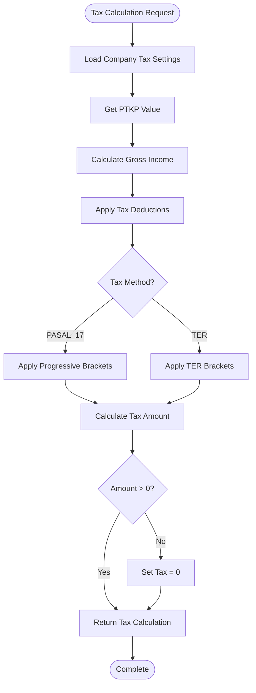

# Development Guidelines

<cite>
**Referenced Files in This Document**
- [requirements.txt](file://requirements.txt)
- [app/database.py](file://app/database.py)
- [app/models/base.py](file://app/models/base.py)
- [app/models/__init__.py](file://app/models/__init__.py)
- [app/models/auth.py](file://app/models/auth.py)
- [app/models/employee.py](file://app/models/employee.py)
- [app/models/salary.py](file://app/models/salary.py)
- [app/models/tax.py](file://app/models/tax.py)
- [app/models/payroll.py](file://app/models/payroll.py)
- [app/models/bonus.py](file://app/models/bonus.py)
- [app/models/integration.py](file://app/models/integration.py)
- [alembic/env.py](file://alembic/env.py)
- [alembic/script.py.mako](file://alembic/script.py.mako)
- [frontend/package.json](file://frontend/package.json)
- [frontend/tsconfig.json](file://frontend/tsconfig.json)
- [frontend/next.config.ts](file://frontend/next.config.ts)
- [frontend/next-env.d.ts](file://frontend/next-env.d.ts)
- [tests/conftest.py](file://tests/conftest.py)
- [tests/test_gross_nett.py](file://tests/test_gross_nett.py)
- [tests/test_overtime.py](file://tests/test_overtime.py)
- [tests/test_pph21_pasal17.py](file://tests/test_pph21_pasal17.py)
</cite>

## Update Summary
**Changes Made**
- Added comprehensive TypeScript integration guidelines for frontend development
- Updated testing strategies to reflect modern pytest framework with fixtures
- Enhanced development workflow documentation with new testing practices
- Added TypeScript configuration and Next.js setup requirements
- Updated dependency management with modern development tools

## Table of Contents
1. [Introduction](#introduction)
2. [Project Structure](#project-structure)
3. [Core Components](#core-components)
4. [Architecture Overview](#architecture-overview)
5. [Detailed Component Analysis](#detailed-component-analysis)
6. [Dependency Analysis](#dependency-analysis)
7. [Performance Considerations](#performance-considerations)
8. [Testing Strategies](#testing-strategies)
9. [TypeScript Integration](#typescript-integration)
10. [Development Workflow](#development-workflow)
11. [Contribution Procedures](#contribution-procedures)
12. [Code Review Process](#code-review-process)
13. [Documentation Standards](#documentation-standards)
14. [Troubleshooting Guide](#troubleshooting-guide)
15. [Conclusion](#conclusion)

## Introduction
This document provides comprehensive development guidelines for contributing to the Payroll system. It covers code standards, testing strategies, development environment setup, contribution procedures, and architectural patterns. The Payroll system is a modern FastAPI application with SQLAlchemy ORM and Alembic migrations, featuring a comprehensive frontend built with Next.js and TypeScript. The system emphasizes Indonesian tax regulations and localization while implementing modern development practices including comprehensive testing, TypeScript integration, and streamlined development workflows.

## Project Structure
The project follows a modern layered architecture with clear separation of concerns and comprehensive frontend integration:



**Diagram sources**
- [frontend/package.json:1-29](file://frontend/package.json#L1-L29)
- [app/models/__init__.py:1-69](file://app/models/__init__.py#L1-L69)
- [app/database.py:1-63](file://app/database.py#L1-L63)
- [alembic/env.py:1-80](file://alembic/env.py#L1-L80)

**Section sources**
- [frontend/package.json:1-29](file://frontend/package.json#L1-L29)
- [app/models/__init__.py:1-69](file://app/models/__init__.py#L1-L69)
- [app/database.py:1-63](file://app/database.py#L1-L63)

## Core Components
The system is built around reusable base components and domain-specific models with modern TypeScript frontend integration:

### Base Model Components
The foundation consists of three essential mixins:
- **TimestampMixin**: Provides automatic created_at and updated_at fields
- **SoftDeleteMixin**: Adds logical deletion capability with is_deleted flag
- **AuditMixin**: Tracks user who created/updated records

### Database Configuration
The database layer supports SQLite with:
- Foreign key enforcement via PRAGMA statements
- Static connection pooling for performance
- FastAPI dependency injection pattern
- Centralized session management

### Domain Model Categories
Models are organized into functional domains:
- Authentication & Authorization (Company, User, Roles, Permissions)
- Employee Management (Departments, Positions, Employment Status)
- Compensation & Benefits (Grades, Allowances, Deductions)
- Tax Calculation (PTKP, Brackets, Settings)
- Payroll Processing (Runs, Payslips, Line Items)
- Additional Features (Bonuses, Reimbursements, Integrations)

### Frontend Architecture
The TypeScript frontend provides:
- Modern React components with TypeScript typing
- Next.js App Router with dynamic routing
- Tailwind CSS for styling
- Zod for form validation
- Comprehensive type safety across the stack

**Section sources**
- [app/models/base.py:1-57](file://app/models/base.py#L1-L57)
- [app/database.py:1-63](file://app/database.py#L1-L63)
- [app/models/__init__.py:1-69](file://app/models/__init__.py#L1-L69)
- [frontend/tsconfig.json:1-35](file://frontend/tsconfig.json#L1-L35)

## Architecture Overview
The system follows a clean architecture pattern with clear boundaries between layers and comprehensive testing integration:



**Diagram sources**
- [app/database.py:38-54](file://app/database.py#L38-L54)
- [app/models/base.py:18-57](file://app/models/base.py#L18-L57)
- [tests/conftest.py:1-338](file://tests/conftest.py#L1-L338)

## Detailed Component Analysis

### Authentication & Authorization System
The authentication system implements role-based access control with comprehensive user management and TypeScript frontend integration:



**Diagram sources**
- [app/models/auth.py:22-133](file://app/models/auth.py#L22-L133)

**Section sources**
- [app/models/auth.py:1-133](file://app/models/auth.py#L1-L133)

### Employee Management System
The employee management system handles organizational structure and personnel data with comprehensive TypeScript integration:



**Diagram sources**
- [app/models/employee.py:20-132](file://app/models/employee.py#L20-L132)

**Section sources**
- [app/models/employee.py:1-132](file://app/models/employee.py#L1-L132)

### Payroll Processing Engine
The payroll system manages batch processing and individual payslips with comprehensive testing integration:



**Diagram sources**
- [app/models/payroll.py:19-124](file://app/models/payroll.py#L19-L124)

**Section sources**
- [app/models/payroll.py:1-124](file://app/models/payroll.py#L1-L124)

### Tax Calculation Framework
The tax system implements Indonesian tax regulations with configurable settings and comprehensive test coverage:



**Diagram sources**
- [app/models/tax.py:19-115](file://app/models/tax.py#L19-L115)

**Section sources**
- [app/models/tax.py:1-115](file://app/models/tax.py#L1-L115)

## Dependency Analysis
The system maintains loose coupling through well-defined interfaces and dependency inversion with modern development tooling:

```mermaid
graph TB
subgraph "Backend Dependencies"
FASTAPI[FastAPI >=0.104.0]
SQLALCHEMY[SQLAlchemy >=2.0.0]
ALEMBIC[Alembic >=1.13.0]
PYDANTIC[Pydantic >=2.0.0]
TESTING[pytest >=7.4.0]
ASYNCIO[pytest-asyncio >=0.21.0]
end
subgraph "Frontend Dependencies"
NEXT[Next.js 16.2.9]
TYPESCRIPT[TypeScript ^5]
REACT[React 19.2.4]
TAILWIND[Tailwind CSS ^3.4.19]
ZOD[Zod ^4.4.3]
end
subgraph "Internal Dependencies"
MODELS[app.models.*]
DATABASE[app.database]
CONFIG[app.config]
TESTFIXTURES[test fixtures]
end
subgraph "Security & Utilities"
JOSE[python-jose >=3.3.0]
PASSLIB[passlib[bcrypt] >=1.7.4]
HTTPX[httpx >=0.25.0]
OPENAI[openai >=1.0.0]
LANGCHAIN[langchain >=0.1.0]
end
FASTAPI --> MODELS
NEXT --> TYPESCRIPT
TESTING --> TESTFIXTURES
MODELS --> DATABASE
DATABASE --> SQLALCHEMY
```

**Diagram sources**
- [requirements.txt:1-23](file://requirements.txt#L1-L23)
- [frontend/package.json:10-27](file://frontend/package.json#L10-L27)

**Section sources**
- [requirements.txt:1-23](file://requirements.txt#L1-L23)
- [frontend/package.json:1-29](file://frontend/package.json#L1-L29)

## Performance Considerations
The system is optimized for performance through several mechanisms with modern development practices:

### Database Optimization
- **Connection Pooling**: StaticPool configuration reduces connection overhead
- **Foreign Key Enforcement**: PRAGMA statements ensure referential integrity
- **Indexing Strategy**: Strategic indexes on frequently queried columns
- **Constraint Validation**: Database-level constraints prevent invalid data

### Caching Opportunities
- **Session Caching**: SQLAlchemy session reuse for repeated queries
- **Result Caching**: Potential for caching company configurations
- **Query Optimization**: Efficient joins and filtered queries

### Scalability Patterns
- **Modular Design**: Domain-specific models enable independent scaling
- **Batch Processing**: Payroll runs process multiple employees efficiently
- **Lazy Loading**: Relationship loading minimizes memory usage

### Frontend Performance
- **Tree Shaking**: TypeScript compilation removes unused code
- **Component Splitting**: Next.js automatic code splitting
- **Image Optimization**: Built-in image optimization with remote patterns
- **CSS Optimization**: Tailwind CSS purging for minimal bundle size

## Testing Strategies
The system implements comprehensive testing with modern pytest framework and fixture-based testing:

### Unit Testing Approach
- **Fixture-Based Testing**: Shared test fixtures for consistent test data
- **Calculation Accuracy**: Validate tax and payroll computations with precise decimal arithmetic
- **Edge Cases**: Handle boundary conditions and invalid inputs systematically
- **Integration Tests**: Test complex workflows and business processes

### Test Organization
- **Shared Fixtures**: Centralized test fixtures in conftest.py
- **Category Tests**: Separate test files for different calculation domains
- **Parameterized Tests**: Use pytest.mark.parametrize for comprehensive coverage
- **Custom Exceptions**: Specific exception testing for error scenarios

### Testing Infrastructure
- **Decimal Precision**: Use Decimal for financial calculations
- **Rounding Functions**: Consistent rounding with round_money utility
- **Convergence Testing**: Test iterative algorithms with tolerance parameters
- **Boundary Condition Testing**: Validate edge cases and limits

**Section sources**
- [tests/conftest.py:1-338](file://tests/conftest.py#L1-L338)
- [tests/test_gross_nett.py:1-196](file://tests/test_gross_nett.py#L1-L196)
- [tests/test_overtime.py:1-286](file://tests/test_overtime.py#L1-L286)
- [tests/test_pph21_pasal17.py:1-237](file://tests/test_pph21_pasal17.py#L1-L237)

## TypeScript Integration
The frontend implements comprehensive TypeScript integration with modern development practices:

### TypeScript Configuration
- **Strict Mode**: Full type checking enabled
- **Modern Target**: ES2017 with latest JavaScript features
- **Path Mapping**: @/* alias for cleaner imports
- **Incremental Compilation**: Faster rebuild times

### Frontend Architecture
- **Next.js App Router**: Modern file-based routing
- **Type Safety**: Complete type definitions for all components
- **Form Validation**: Zod schemas for runtime validation
- **Component Composition**: Reusable React components with TypeScript props

### Development Tools
- **Tailwind CSS**: Utility-first styling with type safety
- **React Hook Form**: Type-safe form handling
- **Lucide React**: Consistent icon library
- **Build System**: Next.js optimized build pipeline

**Section sources**
- [frontend/tsconfig.json:1-35](file://frontend/tsconfig.json#L1-L35)
- [frontend/package.json:1-29](file://frontend/package.json#L1-L29)
- [frontend/next.config.ts:1-15](file://frontend/next.config.ts#L1-L15)
- [frontend/next-env.d.ts:1-7](file://frontend/next-env.d.ts#L1-L7)

## Development Workflow
The modern development workflow emphasizes comprehensive testing, TypeScript integration, and streamlined processes:

### Environment Setup
1. **Backend Setup**
   - Install Python 3.8+ and virtual environment
   - Install dependencies from requirements.txt
   - Configure DATABASE_URL environment variable
   - Initialize Alembic migrations

2. **Frontend Setup**
   - Install Node.js 16+
   - Install dependencies from frontend/package.json
   - Configure TypeScript compiler options
   - Set up Next.js development server

3. **Development Server**
   - Start backend with uvicorn
   - Start frontend with next dev
   - Access frontend at http://localhost:3000
   - Access backend API at http://localhost:8000

### Testing Workflow
1. **Running Tests**
   - Execute pytest for backend tests
   - Use pytest --cov for coverage reports
   - Run specific test categories with pytest tests/test_category.py

2. **Test Development**
   - Create test fixtures in conftest.py
   - Use parametrize for multiple test scenarios
   - Test both success and failure cases
   - Validate mathematical precision with Decimal

3. **Continuous Integration**
   - Automated test execution on pull requests
   - Coverage reporting and monitoring
   - Linting and type checking integration

### Code Quality
- **TypeScript Strict Mode**: Enable all strict type checking options
- **Python Linting**: Use flake8 and black for code formatting
- **Pre-commit Hooks**: Automated checks before commits
- **Documentation**: Comprehensive docstrings and type hints

## Contribution Procedures
Follow these steps to contribute effectively with modern development practices:

### Development Setup
1. **Environment Preparation**
   - Install Python 3.8+ and Node.js 16+
   - Set up virtual environment for backend
   - Install dependencies from requirements.txt and frontend/package.json
   - Configure DATABASE_URL environment variable

2. **Local Development**
   - Run database initialization with Alembic
   - Start development servers for both backend and frontend
   - Verify application health on both ports

### Code Contribution Workflow
1. **Branch Creation**
   - Create feature branch from develop
   - Follow naming convention: feature/short-description
   - Include related issue number in branch name

2. **Implementation**
   - Write comprehensive tests before implementation
   - Follow existing code patterns and TypeScript conventions
   - Include proper TypeScript type definitions
   - Add Pydantic models for request validation

3. **Commit Guidelines**
   - Use imperative mood in commit messages
   - Reference related issues and tests
   - Keep commits focused and atomic
   - Include test updates with feature changes

4. **Pull Request Process**
   - Include comprehensive description with test results
   - Reference related issues and test coverage
   - Ensure all tests pass with pytest
   - Update documentation and type definitions

### Code Standards
- **Python Style**: PEP 8 compliance with 4-space indentation
- **TypeScript Style**: Strict typing with camelCase naming
- **Naming Conventions**: 
  - Classes: PascalCase
  - Variables: snake_case
  - Constants: UPPERCASE
  - Interfaces: IPrefix for TypeScript interfaces
- **Docstrings**: Comprehensive docstrings for all public functions
- **Imports**: Organized alphabetically with blank lines separation
- **Type Annotations**: Complete TypeScript type definitions

### Database Development Practices
- **Migration Guidelines**
  - Always create migrations for schema changes
  - Use descriptive migration names
  - Test migrations on staging environment
  - Include both upgrade and downgrade operations

- **Constraint Definition**
  - Define all business constraints as database constraints
  - Use meaningful constraint names
  - Include check constraints for validation
  - Add unique constraints where appropriate

- **Index Strategy**
  - Create indexes on frequently queried columns
  - Consider composite indexes for common filters
  - Monitor index usage and remove unused indexes

### API Development Standards
- **Endpoint Design**
  - RESTful resource naming
  - Consistent HTTP status codes
  - Standardized response formats
  - Proper error handling with Pydantic models

- **Validation**
  - Pydantic models for request validation
  - Database-level constraint validation
  - Input sanitization
  - Rate limiting for public endpoints

- **Security**
  - JWT token authentication
  - Role-based authorization
  - Input validation and sanitization
  - CORS policy configuration

### Adding New Features
1. **Feature Planning**
   - Define feature scope and requirements
   - Identify affected models and relationships
   - Plan migration strategy
   - Design API endpoints with TypeScript types

2. **Implementation Steps**
   - Create database migration
   - Implement model changes with Pydantic validation
   - Add TypeScript components and type definitions
   - Create API endpoints with proper validation
   - Write comprehensive tests with fixtures
   - Update documentation and type definitions

3. **Integration Testing**
   - Test feature in isolation with pytest
   - Integration with related features and frontend components
   - Performance impact assessment
   - Security vulnerability review

### Extending Existing Functionality
1. **Backward Compatibility**
   - Maintain existing API contracts
   - Add optional parameters with defaults
   - Preserve default behaviors
   - Deprecation notices for breaking changes

2. **Enhancement Process**
   - Identify extension points
   - Design minimal changes with TypeScript safety
   - Test against existing functionality
   - Update migration scripts if needed

### Maintaining Backward Compatibility
- **Database Schema**: Avoid removing columns or tables
- **API Contracts**: Maintain endpoint signatures
- **Type Definitions**: Preserve interface compatibility
- **Configuration**: Support legacy configuration values
- **Data Migration**: Provide automated migration paths

## Code Review Process
Effective code reviews ensure quality and consistency with modern development practices:

### Review Checklist
- **Requirements Compliance**: Meets specification requirements
- **Code Quality**: Follows established patterns and TypeScript standards
- **Test Coverage**: Adequate test coverage and quality with pytest fixtures
- **Performance Impact**: Minimal performance degradation
- **Security**: No security vulnerabilities introduced
- **Documentation**: Updated documentation and type definitions

### Review Workflow
1. **Automated Checks**: CI pipeline runs pytest, linting, and type checking
2. **Peer Review**: Team members review code changes with focus on TypeScript safety
3. **Feedback Incorporation**: Address reviewer comments and test failures
4. **Approval Process**: Required approvals before merging
5. **Post-Merge Verification**: Monitor for issues and test regressions

### Review Criteria
- **Technical Excellence**: Clean, maintainable code with proper TypeScript typing
- **Architectural Alignment**: Follows system design patterns
- **Testing Quality**: Comprehensive and reliable tests with fixtures
- **Documentation**: Clear and accurate documentation with type definitions
- **Security**: Addresses potential security concerns
- **Performance**: Optimizes for both backend and frontend performance

## Documentation Standards
Maintain comprehensive documentation for all contributions with modern practices:

### Code Documentation
- **Module Documentation**: Purpose and scope of each module
- **Class Documentation**: Responsibilities and relationships
- **Function Documentation**: Parameters, return values, exceptions
- **Type Definitions**: Complete TypeScript interface documentation
- **Complex Logic**: Inline comments explaining business rules
- **Examples**: Usage examples for public APIs and TypeScript components

### API Documentation
- **Endpoint Documentation**: Request/response schemas with Pydantic models
- **Authentication**: Token requirements and scopes
- **Error Codes**: Standardized error responses
- **Rate Limits**: API usage limitations
- **Versioning**: API version compatibility

### Database Documentation
- **Schema Documentation**: Entity relationship diagrams
- **Migration Documentation**: Changes and impact analysis
- **Performance Notes**: Index usage and optimization tips
- **Data Dictionary**: Field descriptions and constraints

### Frontend Documentation
- **Component Documentation**: Props, state, and behavior specifications
- **Type Definitions**: Interface and type documentation
- **Usage Examples**: Component integration examples
- **Styling Guidelines**: Tailwind CSS usage patterns

## Troubleshooting Guide
Common issues and their solutions with modern development practices:

### Backend Issues
- **Connection Problems**: Verify DATABASE_URL environment variable
- **Migration Failures**: Check migration dependencies and conflicts
- **Constraint Violations**: Review business rule implementations
- **Performance Issues**: Analyze query execution plans
- **Type Checking Errors**: Fix TypeScript compilation errors

### Frontend Issues
- **Build Failures**: Check TypeScript compilation and Next.js configuration
- **Import Errors**: Ensure proper path resolution and module declarations
- **Type Errors**: Fix TypeScript type mismatches and missing definitions
- **Runtime Errors**: Debug React component rendering and prop validation

### Development Environment
- **Import Errors**: Ensure all dependencies are installed
- **Virtual Environment**: Verify Python interpreter selection
- **Configuration Issues**: Check environment variable setup
- **Port Conflicts**: Verify port availability for development servers

### Testing Problems
- **Test Failures**: Review test assertions and mock data in conftest.py
- **Database State**: Reset test database between runs
- **Async Issues**: Handle async/await patterns correctly
- **Mock Objects**: Ensure proper mocking of external dependencies
- **Type Errors in Tests**: Fix TypeScript compilation in test files

### Deployment Issues
- **Dependency Conflicts**: Resolve version conflicts in requirements.txt and package.json
- **Environment Variables**: Verify production configuration
- **Database Connectivity**: Test connection to production database
- **Logging Configuration**: Ensure proper log level and output
- **Frontend Build Issues**: Check Next.js build configuration and asset optimization

## Conclusion
The Payroll system provides a robust foundation for HRIS and payroll management with clear architectural patterns, comprehensive domain modeling, and modern development practices. The integration of TypeScript frontend, comprehensive pytest testing framework, and streamlined development workflow ensures high code quality and system reliability. By following these development guidelines, contributors can ensure their modifications align with the system's design principles while maintaining the benefits of modern development practices including type safety, comprehensive testing, and efficient development processes. The modular structure, extensive test coverage, and well-defined contribution procedures support sustainable development and future enhancements.