# Employee Management

<cite>
**Referenced Files in This Document**
- [employee.py](file://app/models/employee.py)
- [salary.py](file://app/models/salary.py)
- [payroll.py](file://app/models/payroll.py)
- [attendance.py](file://app/models/attendance.py)
- [tax.py](file://app/models/tax.py)
- [bpjs.py](file://app/models/bpjs.py)
- [leave.py](file://app/models/leave.py)
- [kasbon.py](file://app/models/kasbon.py)
- [bonus.py](file://app/models/bonus.py)
- [base.py](file://app/models/base.py)
- [database.py](file://app/database.py)
- [seed_data.py](file://app/seed/seed_data.py)
</cite>

## Table of Contents
1. [Introduction](#introduction)
2. [Project Structure](#project-structure)
3. [Core Components](#core-components)
4. [Architecture Overview](#architecture-overview)
5. [Detailed Component Analysis](#detailed-component-analysis)
6. [Dependency Analysis](#dependency-analysis)
7. [Performance Considerations](#performance-considerations)
8. [Troubleshooting Guide](#troubleshooting-guide)
9. [Conclusion](#conclusion)
10. [Appendices](#appendices)

## Introduction
This document explains the employee management subsystem of the Payroll & HRIS system. It covers employee record management, organizational structure (departments and positions), employment status tracking, and the integration with salary structures, attendance, leave, bonuses, reimbursements, kasbon (employee advances), BPJS contributions, taxes, and payroll processing. It also documents model relationships, hierarchical organization support, validation rules, lifecycle management, and practical examples for common workflows such as creating employees, assigning positions and departments, maintaining organizational charts, and processing payroll.

## Project Structure
The employee management domain is implemented as a set of SQLAlchemy models grouped under app/models. Supporting infrastructure includes a shared base class with mixins for timestamps, soft deletes, and audit fields, plus database initialization and seeding utilities.

```mermaid
graph TB
subgraph "Models"
E["Employee<br/>app/models/employee.py"]
D["Department<br/>app/models/employee.py"]
P["Position<br/>app/models/employee.py"]
ES["EmploymentStatus<br/>app/models/employee.py"]
G["Grade<br/>app/models/salary.py"]
GSM["GradeSalaryMatrix<br/>app/models/salary.py"]
AT["AllowanceType<br/>app/models/salary.py"]
EA["EmployeeAllowance<br/>app/models/salary.py"]
DT["DeductionType<br/>app/models/salary.py"]
SR["Shift<br/>app/models/attendance.py"]
ESA["EmployeeShiftAssignment<br/>app/models/attendance.py"]
AR["AttendanceRecord<br/>app/models/attendance.py"]
OR["OvertimeRecord<br/>app/models/attendance.py"]
OS["OvertimeSetting<br/>app/models/attendance.py"]
LT["LeaveType<br/>app/models/leave.py"]
ELB["EmployeeLeaveBalance<br/>app/models/leave.py"]
LR["LeaveRequest<br/>app/models/leave.py"]
KR["KasbonRequest<br/>app/models/kasbon.py"]
KI["KasbonInstallment<br/>app/models/kasbon.py"]
BT["BonusType<br/>app/models/bonus.py"]
B["Bonus<br/>app/models/bonus.py"]
RT["ReimbursementType<br/>app/models/bonus.py"]
R["Reimbursement<br/>app/models/bonus.py"]
TS["TaxSetting<br/>app/models/tax.py"]
PT["PtkpValue<br/>app/models/tax.py"]
TP["TaxBracketPasal17<br/>app/models/tax.py"]
TR["TerBracket<br/>app/models/tax.py"]
BS["BpjsSetting<br/>app/models/bpjs.py"]
PR["PayrollRun<br/>app/models/payroll.py"]
PS["Payslip<br/>app/models/payroll.py"]
PL["PayslipLine<br/>app/models/payroll.py"]
end
subgraph "Infrastructure"
Bse["Base & Mixins<br/>app/models/base.py"]
Db["Database Engine & Session<br/>app/database.py"]
Seed["Seeder<br/>app/seed/seed_data.py"]
end
E --- D
E --- P
E --- ES
E --- G
E --- GSM
E --- AT
E --- EA
E --- DT
E --- SR
E --- ESA
E --- AR
E --- OR
E --- OS
E --- LT
E --- ELB
E --- LR
E --- KR
E --- KI
E --- BT
E --- B
E --- RT
E --- R
E --- TS
E --- PT
E --- TP
E --- TR
E --- BS
E --- PR
E --- PS
E --- PL
Bse --> E
Db --> E
Seed --> TS
Seed --> PT
Seed --> TP
Seed --> TR
Seed --> BS
Seed --> OS
Seed --> LT
Seed --> KR
Seed --> KI
Seed --> BT
Seed --> B
Seed --> RT
Seed --> R
Seed --> PR
Seed --> PS
Seed --> PL
```

**Diagram sources**
- [employee.py:20-132](file://app/models/employee.py#L20-L132)
- [salary.py:21-135](file://app/models/salary.py#L21-L135)
- [attendance.py:21-134](file://app/models/attendance.py#L21-L134)
- [leave.py:19-97](file://app/models/leave.py#L19-L97)
- [kasbon.py:18-78](file://app/models/kasbon.py#L18-L78)
- [bonus.py:20-123](file://app/models/bonus.py#L20-L123)
- [tax.py:19-115](file://app/models/tax.py#L19-L115)
- [bpjs.py:17-44](file://app/models/bpjs.py#L17-L44)
- [payroll.py:19-124](file://app/models/payroll.py#L19-L124)
- [base.py:18-57](file://app/models/base.py#L18-L57)
- [database.py:19-63](file://app/database.py#L19-L63)
- [seed_data.py:27-448](file://app/seed/seed_data.py#L27-L448)

**Section sources**
- [employee.py:1-132](file://app/models/employee.py#L1-L132)
- [base.py:1-57](file://app/models/base.py#L1-L57)
- [database.py:1-63](file://app/database.py#L1-L63)
- [seed_data.py:1-448](file://app/seed/seed_data.py#L1-L448)

## Core Components
- Employee master data with personal info, contact, employment metadata, and financial account details.
- Organizational structure: departments with hierarchical parent-child relationships and positions.
- Employment statuses with flags for permanency and activity.
- Salary structures: grades, grade-to-salary matrix, allowance types, employee-specific allowances, and deduction types.
- Attendance and overtime: shifts, daily attendance records, overtime logs, and company-wide overtime settings.
- Leave management: leave types, annual balances, and leave requests.
- Additional benefits and deductions: bonuses, reimbursements, kasbon (employee advances), and installments.
- Taxes and social security: tax settings, PTKP thresholds, tax brackets, TER brackets, and BPJS settings.
- Payroll processing: runs, individual payslips, and detailed payslip line items.

**Section sources**
- [employee.py:76-132](file://app/models/employee.py#L76-L132)
- [salary.py:21-135](file://app/models/salary.py#L21-L135)
- [attendance.py:21-134](file://app/models/attendance.py#L21-L134)
- [leave.py:19-97](file://app/models/leave.py#L19-L97)
- [kasbon.py:18-78](file://app/models/kasbon.py#L18-L78)
- [bonus.py:20-123](file://app/models/bonus.py#L20-L123)
- [tax.py:19-115](file://app/models/tax.py#L19-L115)
- [bpjs.py:17-44](file://app/models/bpjs.py#L17-L44)
- [payroll.py:19-124](file://app/models/payroll.py#L19-L124)

## Architecture Overview
The system uses SQLAlchemy ORM with a shared Base and reusable mixins for timestamps, soft delete, and audit fields. Database sessions are provided via a FastAPI-compatible dependency. Seeding utilities initialize Indonesian regulatory defaults for taxes, BPJS, overtime, languages, leave types, and company settings.

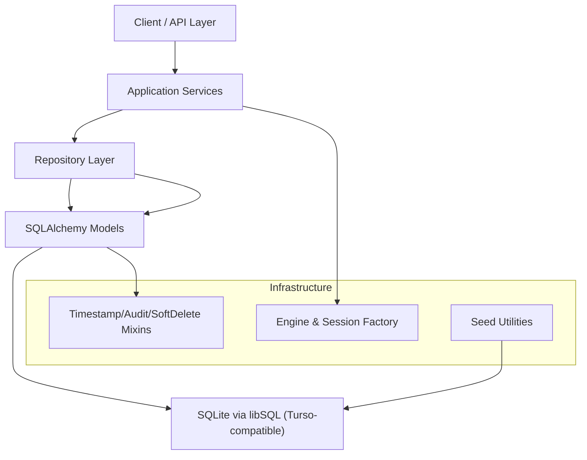

**Diagram sources**
- [base.py:18-57](file://app/models/base.py#L18-L57)
- [database.py:19-63](file://app/database.py#L19-L63)
- [seed_data.py:27-448](file://app/seed/seed_data.py#L27-L448)

## Detailed Component Analysis

### Employee Model and Relationships
The Employee entity centralizes personal, contact, employment, and financial data. It links to Department, Position, EmploymentStatus, Grade, and maintains indexes for efficient queries. Validation constraints ensure data integrity at the database level.

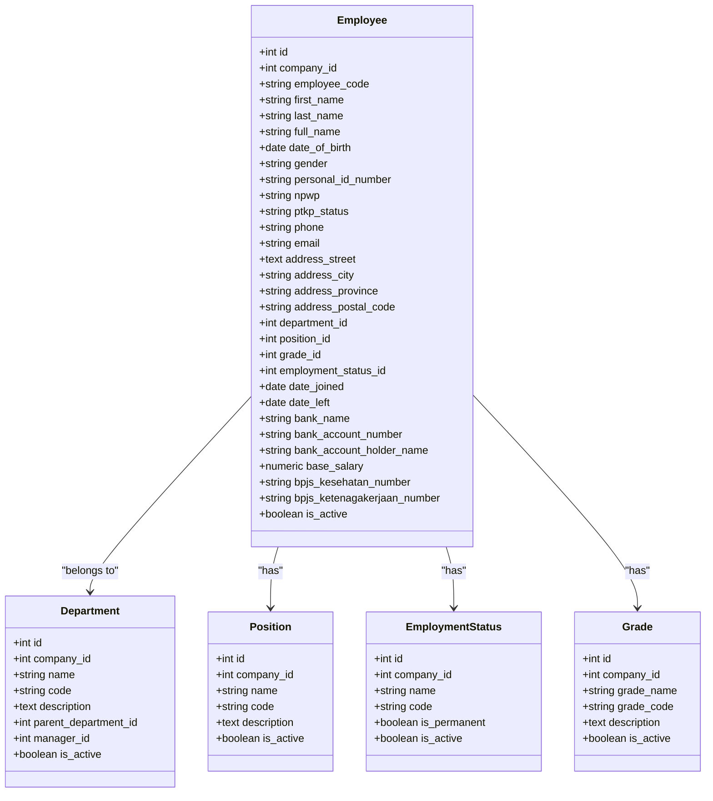

**Diagram sources**
- [employee.py:76-132](file://app/models/employee.py#L76-L132)

**Section sources**
- [employee.py:76-132](file://app/models/employee.py#L76-L132)

### Organizational Structure and Hierarchical Chart
Departments support a self-referential hierarchy via parent_department_id. Departments are scoped per company and uniquely identified by company+code. Positions and employment statuses are similarly scoped and validated.

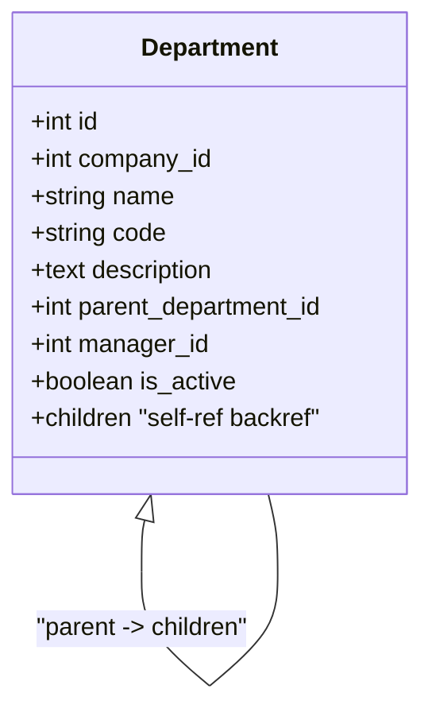

**Diagram sources**
- [employee.py:20-40](file://app/models/employee.py#L20-L40)

**Section sources**
- [employee.py:20-40](file://app/models/employee.py#L20-L40)

### Salary Structures and Compensation
Grades define levels; GradeSalaryMatrix defines effective salary bands per grade. AllowanceType and EmployeeAllowance capture allowance definitions and per-employee assignments. DeductionType supports configurable deductions.

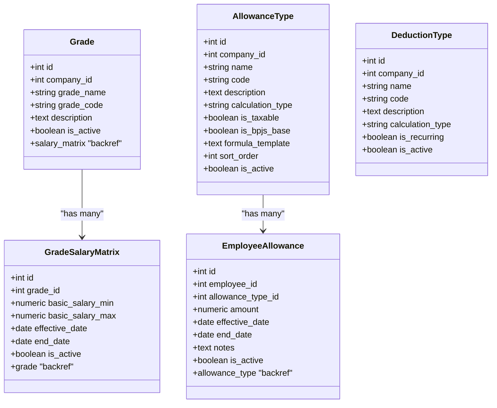

**Diagram sources**
- [salary.py:21-135](file://app/models/salary.py#L21-L135)

**Section sources**
- [salary.py:21-135](file://app/models/salary.py#L21-L135)

### Attendance and Overtime
Shifts define work schedules. EmployeeShiftAssignment ties employees to shifts over date ranges. AttendanceRecord captures daily presence and lateness metrics. OvertimeRecord tracks overtime hours, multipliers, and approval. OvertimeSetting holds company-wide rules.

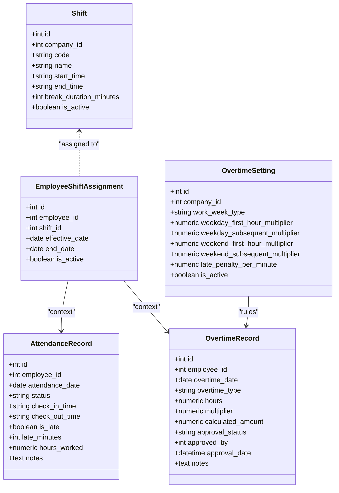

**Diagram sources**
- [attendance.py:21-134](file://app/models/attendance.py#L21-L134)

**Section sources**
- [attendance.py:21-134](file://app/models/attendance.py#L21-L134)

### Leave Management
LeaveType defines categories with entitlements. EmployeeLeaveBalance tracks annual balances per employee and type. LeaveRequest manages requests, approvals, and rejections.

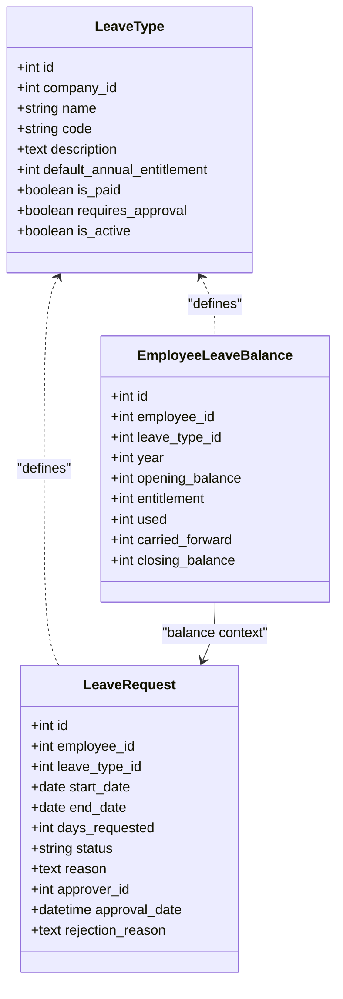

**Diagram sources**
- [leave.py:19-97](file://app/models/leave.py#L19-L97)

**Section sources**
- [leave.py:19-97](file://app/models/leave.py#L19-L97)

### Benefits, Bonuses, Reimbursements, and Kasbon
BonusType and Bonus manage bonus awards with approval and processing flags. ReimbursementType and Reimbursement track claims, approvals, and processing. KasbonRequest and KasbonInstallment handle employee advances and installment schedules linked to payroll runs.

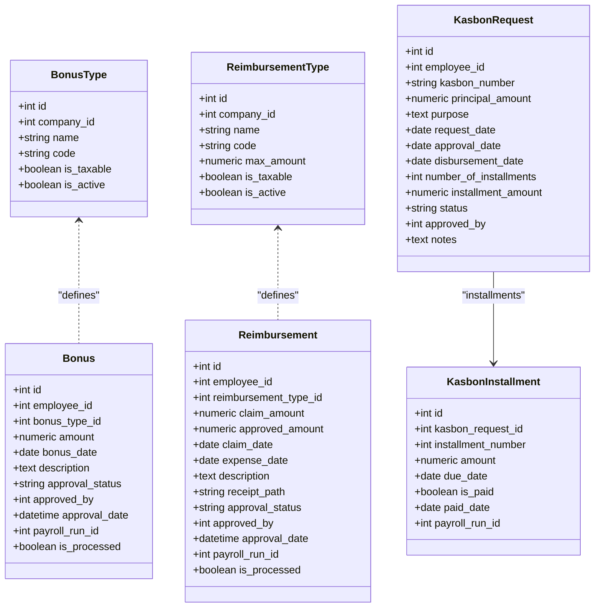

**Diagram sources**
- [bonus.py:20-123](file://app/models/bonus.py#L20-L123)
- [kasbon.py:18-78](file://app/models/kasbon.py#L18-L78)

**Section sources**
- [bonus.py:20-123](file://app/models/bonus.py#L20-L123)
- [kasbon.py:18-78](file://app/models/kasbon.py#L18-L78)

### Taxes and Social Security
TaxSetting selects calculation method (PPh Pasal 17 or TER). PtkpValue defines tax-free thresholds. TaxBracketPasal17 and TerBracket define progressive and average tax brackets respectively. BpjsSetting defines contribution rates and caps per BPJS type.

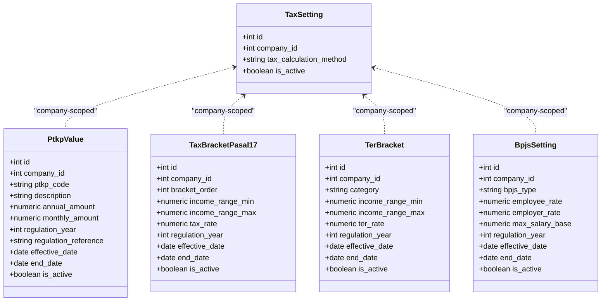

**Diagram sources**
- [tax.py:19-115](file://app/models/tax.py#L19-L115)
- [bpjs.py:17-44](file://app/models/bpjs.py#L17-L44)

**Section sources**
- [tax.py:19-115](file://app/models/tax.py#L19-L115)
- [bpjs.py:17-44](file://app/models/bpjs.py#L17-L44)

### Payroll Processing
PayrollRun batches processing per period with status tracking. Payslip aggregates earnings, allowances, overtime, bonuses, taxes, and deductions per employee per run. PayslipLine itemizes each line (earning, deduction, tax, BPJS, net).

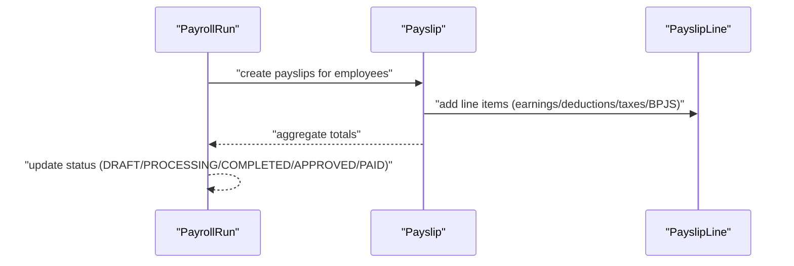

**Diagram sources**
- [payroll.py:19-124](file://app/models/payroll.py#L19-L124)

**Section sources**
- [payroll.py:19-124](file://app/models/payroll.py#L19-L124)

### Employee Lifecycle and Data Integrity
Lifecycle stages include onboarding (creating employee records), assignment (department, position, grade, employment status), active management (attendance, leave, allowances, bonuses/reimbursements/kasbon), and offboarding (date left). Integrity constraints enforce:
- Gender and PTKP enumerations on Employee.
- Salary min/max consistency on GradeSalaryMatrix.
- Allowance amounts non-negative on EmployeeAllowance.
- Payroll run method, tax method, and status enumerations on PayrollRun.
- Attendance status and overtime type enumerations.
- Leave request validations (date range, positive days).
- Kasbon and bonus amounts positive.
- Tax calculation method and bracket categories.
- BPJS type enumeration.

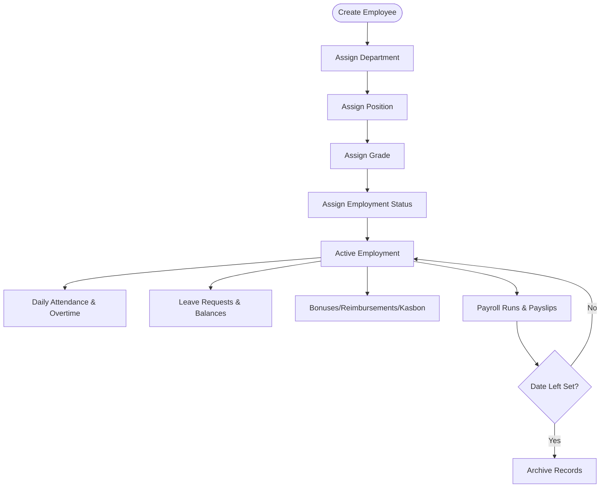

**Diagram sources**
- [employee.py:76-132](file://app/models/employee.py#L76-L132)
- [attendance.py:56-111](file://app/models/attendance.py#L56-L111)
- [leave.py:66-97](file://app/models/leave.py#L66-L97)
- [payroll.py:19-124](file://app/models/payroll.py#L19-L124)

**Section sources**
- [employee.py:119-131](file://app/models/employee.py#L119-L131)
- [salary.py:54-59](file://app/models/salary.py#L54-L59)
- [payroll.py:45-61](file://app/models/payroll.py#L45-L61)
- [attendance.py:72-110](file://app/models/attendance.py#L72-L110)
- [leave.py:83-96](file://app/models/leave.py#L83-L96)
- [kasbon.py:40-55](file://app/models/kasbon.py#L40-L55)
- [bonus.py:57-68](file://app/models/bonus.py#L57-L68)
- [tax.py:29-34](file://app/models/tax.py#L29-L34)
- [bpjs.py:33-43](file://app/models/bpjs.py#L33-L43)

## Dependency Analysis
The models share a common Base and mixins. Database initialization and session management are centralized. Seeding utilities populate Indonesian regulatory defaults.

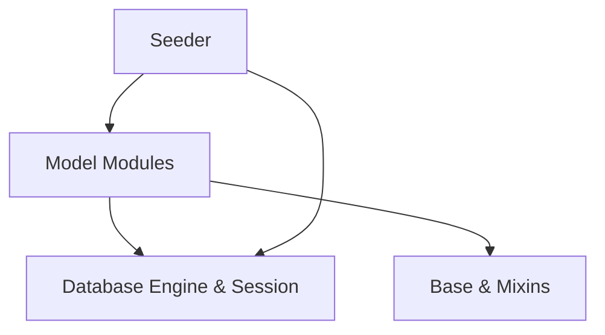

**Diagram sources**
- [base.py:18-57](file://app/models/base.py#L18-L57)
- [database.py:19-63](file://app/database.py#L19-L63)
- [seed_data.py:27-448](file://app/seed/seed_data.py#L27-L448)

**Section sources**
- [base.py:18-57](file://app/models/base.py#L18-L57)
- [database.py:19-63](file://app/database.py#L19-L63)
- [seed_data.py:27-448](file://app/seed/seed_data.py#L27-L448)

## Performance Considerations
- Indexes on frequently filtered or joined columns (e.g., idx_employees_company_active, idx_payslips_employee, idx_attendance_employee_date) improve query performance.
- Unique constraints prevent duplicates and support fast lookups for codes and identifiers.
- Enumerated fields reduce storage and speed comparisons.
- Consider partitioning or materialized summaries for large-scale attendance and leave analytics.

[No sources needed since this section provides general guidance]

## Troubleshooting Guide
Common issues and resolutions:
- Foreign key constraint failures on SQLite: Ensure foreign keys are enabled via PRAGMA and that referenced entities exist before creating child records.
- Duplicate codes: Unique constraints on company+code fields require distinct values per company.
- Invalid enumerations: Constraints enforce allowed values; verify inputs match CK definitions.
- Payroll run state transitions: Validate status values and totals before moving to COMPLETED or APPROVED.

**Section sources**
- [database.py:27-32](file://app/database.py#L27-L32)
- [employee.py:119-131](file://app/models/employee.py#L119-L131)
- [payroll.py:45-61](file://app/models/payroll.py#L45-L61)
- [attendance.py:72-80](file://app/models/attendance.py#L72-L80)
- [leave.py:83-96](file://app/models/leave.py#L83-L96)
- [kasbon.py:40-55](file://app/models/kasbon.py#L40-L55)
- [bonus.py:57-68](file://app/models/bonus.py#L57-L68)
- [tax.py:29-34](file://app/models/tax.py#L29-L34)
- [bpjs.py:33-43](file://app/models/bpjs.py#L33-L43)

## Conclusion
The employee management system provides a robust, regulatory-compliant foundation for HR and payroll operations in Indonesia. Its modular model design, strong validation constraints, and integrated attendance, leave, benefits, taxes, and payroll components enable accurate lifecycle management and reliable data integrity.

[No sources needed since this section summarizes without analyzing specific files]

## Appendices

### Practical Examples (Step-by-step workflows)

- Create an Employee
  - Steps: Define personal info, employment metadata, and financial account details; optionally set base salary and PTKP status; persist record.
  - Related validations: Gender and PTKP enumerations enforced; unique employee_code; indexes optimize lookups.
  - Section sources
    - [employee.py:76-132](file://app/models/employee.py#L76-L132)

- Assign a Position and Department
  - Steps: Create Position and Department entries; set employee.position_id and employee.department_id; maintain department hierarchy via parent_department_id.
  - Section sources
    - [employee.py:20-40](file://app/models/employee.py#L20-L40)
    - [employee.py:114-117](file://app/models/employee.py#L114-L117)

- Map to a Grade and Salary Matrix
  - Steps: Create Grade and GradeSalaryMatrix entries; assign employee.grade_id; use matrix to derive salary bands.
  - Section sources
    - [salary.py:21-59](file://app/models/salary.py#L21-L59)

- Configure Allowances and Deductions
  - Steps: Create AllowanceType and DeductionType; assign EmployeeAllowance to employees; ensure amounts and calculations align with policy.
  - Section sources
    - [salary.py:62-135](file://app/models/salary.py#L62-L135)

- Track Attendance and Overtime
  - Steps: Define Shifts; assign EmployeeShiftAssignment; log AttendanceRecord daily; record OvertimeRecord with appropriate type and multiplier; approve as needed.
  - Section sources
    - [attendance.py:21-134](file://app/models/attendance.py#L21-L134)

- Manage Leaves
  - Steps: Define LeaveType; initialize EmployeeLeaveBalance; process LeaveRequest with approvals; update balances accordingly.
  - Section sources
    - [leave.py:19-97](file://app/models/leave.py#L19-L97)

- Process Payroll
  - Steps: Create PayrollRun for a period; generate Payslip per employee; aggregate earnings (basic, allowances, overtime, bonuses) and deductions (taxes, BPJS, kasbon); finalize totals and status.
  - Section sources
    - [payroll.py:19-124](file://app/models/payroll.py#L19-L124)

- Integrate Taxes and BPJS
  - Steps: Seed TaxSetting and PtkpValue; configure TaxBracketPasal17 or TerBracket; set BpjsSetting rates and caps; apply during payslip generation.
  - Section sources
    - [seed_data.py:224-429](file://app/seed/seed_data.py#L224-L429)
    - [tax.py:19-115](file://app/models/tax.py#L19-L115)
    - [bpjs.py:17-44](file://app/models/bpjs.py#L17-L44)

- Handle Bonuses, Reimbursements, and Kasbon
  - Steps: Define BonusType/ReimbursementType; create Bonus/Reimbursement entries; approve and mark processed; schedule KasbonInstallment linked to PayrollRun.
  - Section sources
    - [bonus.py:20-123](file://app/models/bonus.py#L20-L123)
    - [kasbon.py:18-78](file://app/models/kasbon.py#L18-L78)