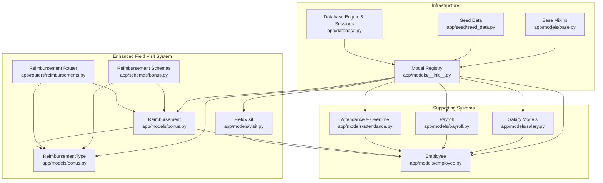
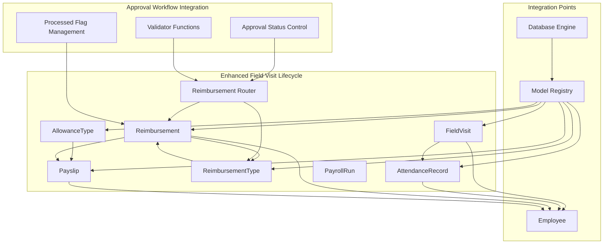
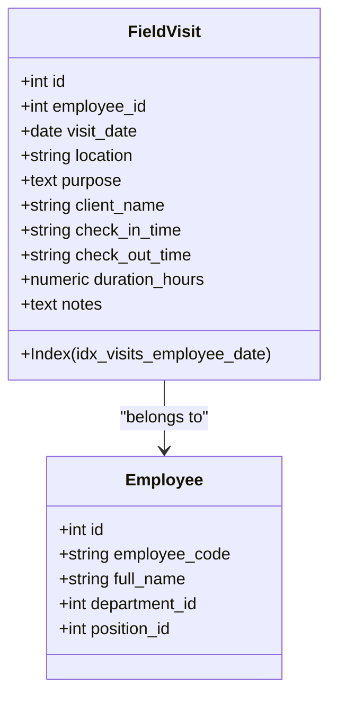
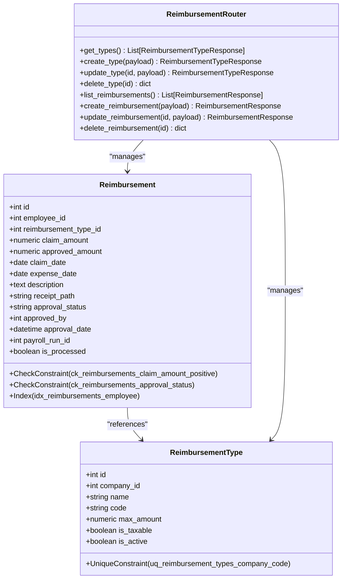
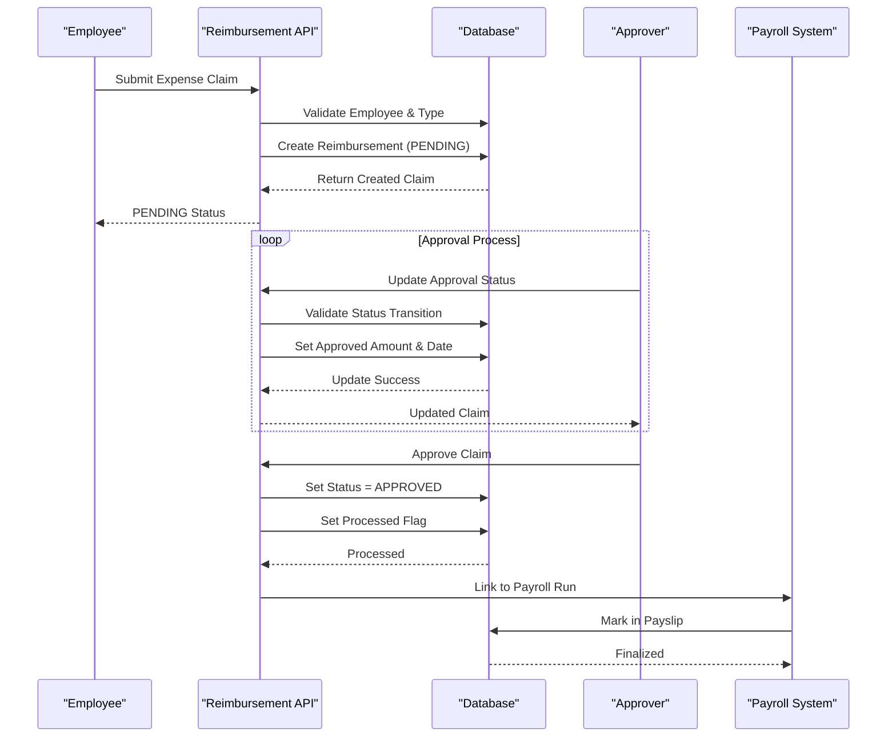
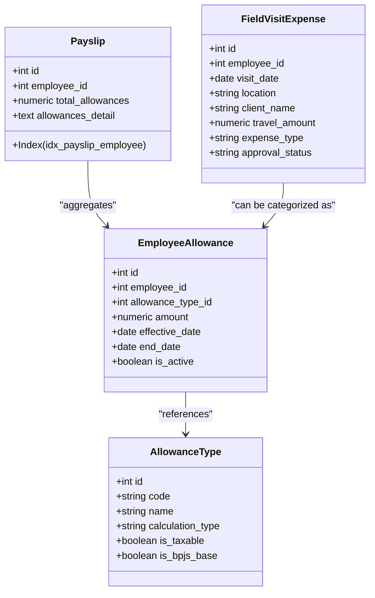
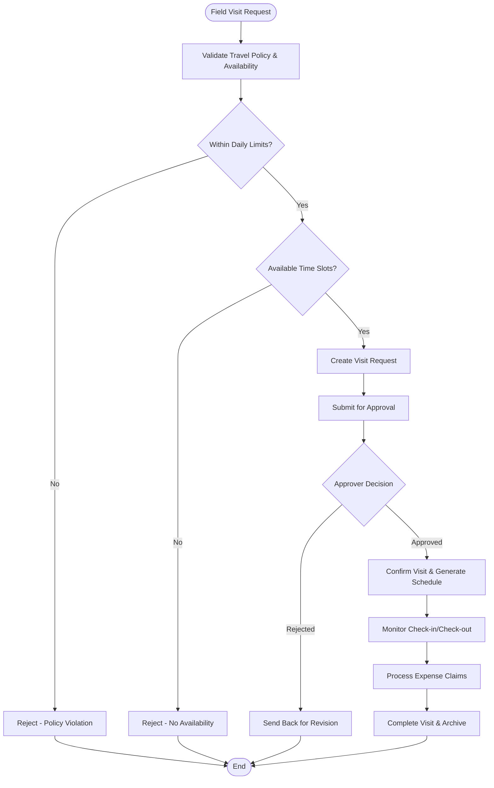
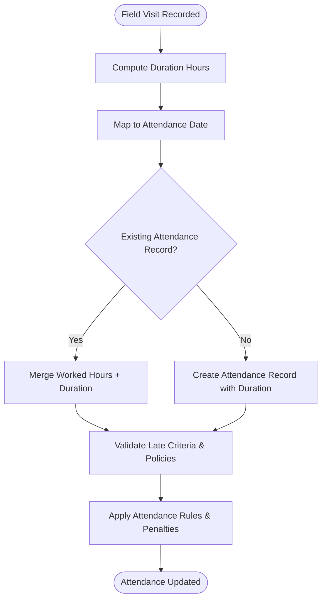
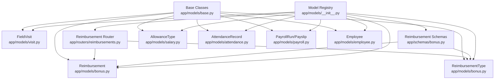

# Field Visit Management

<cite>
**Referenced Files in This Document**
- [visit.py](file://app/models/visit.py)
- [bonus.py](file://app/models/bonus.py)
- [reimbursements.py](file://app/routers/reimbursements.py)
- [bonus_schemas.py](file://app/schemas/bonus.py)
- [salary.py](file://app/models/salary.py)
- [attendance.py](file://app/models/attendance.py)
- [payroll.py](file://app/models/payroll.py)
- [employee.py](file://app/models/employee.py)
- [database.py](file://app/database.py)
- [base.py](file://app/models/base.py)
- [__init__.py](file://app/models/__init__.py)
- [seed_data.py](file://app/seed/seed_data.py)
</cite>

## Update Summary
**Changes Made**
- Enhanced reimbursement management system documentation with comprehensive approval workflows
- Added detailed expense tracking and processing procedures
- Expanded field visit expense integration with approval processes
- Updated travel allowance processing pathways with approval status tracking
- Improved visit scheduling documentation with approval workflow integration

## Table of Contents
1. [Introduction](#introduction)
2. [Project Structure](#project-structure)
3. [Core Components](#core-components)
4. [Architecture Overview](#architecture-overview)
5. [Detailed Component Analysis](#detailed-component-analysis)
6. [Expense Tracking and Approval Workflows](#expense-tracking-and-approval-workflows)
7. [Travel Allowance Processing](#travel-allowance-processing)
8. [Visit Scheduling and Approval Workflows](#visit-scheduling-and-approval-workflows)
9. [Integration with Attendance and Payroll](#integration-with-attendance-and-payroll)
10. [Dependency Analysis](#dependency-analysis)
11. [Performance Considerations](#performance-considerations)
12. [Troubleshooting Guide](#troubleshooting-guide)
13. [Conclusion](#conclusion)

## Introduction
This document explains the field visit management system within the Payroll & HRIS platform, now enhanced with comprehensive expense tracking and approval workflows. The system covers field visit tracking, travel allowance processing, visit scheduling, and integrated expense management with full approval workflows. The system includes dedicated field visit record models, attendance integration, payroll processing capabilities, and robust reimbursement frameworks with complete approval processes. Travel policy integration and expense regulation compliance are built into the approval workflow system.

## Project Structure
The field visit management system is implemented as part of the centralized SQLAlchemy model package with enhanced expense tracking capabilities. The relevant components include:
- Field visit tracking model with comprehensive field visit recording
- Attendance and shift management integration
- Payroll processing and payslip generation
- Complete reimbursement framework with approval workflows
- Allowance types for travel allowance categorization
- Expense tracking with approval status management
- Database initialization and session management

**Diagram sources**
- [visit.py:16-34](file://app/models/visit.py#L16-L34)
- [bonus.py:142-173](file://app/models/bonus.py#L142-L173)
- [bonus.py:121-139](file://app/models/bonus.py#L121-L139)
- [reimbursements.py:23-412](file://app/routers/reimbursements.py#L23-L412)
- [bonus_schemas.py:149-230](file://app/schemas/bonus.py#L149-L230)
- [salary.py:62-112](file://app/models/salary.py#L62-L112)
- [attendance.py:21-134](file://app/models/attendance.py#L21-L134)
- [payroll.py:19-124](file://app/models/payroll.py#L19-L124)
- [employee.py:76-132](file://app/models/employee.py#L76-L132)
- [database.py:17-63](file://app/database.py#L17-L63)
- [__init__.py:35-68](file://app/models/__init__.py#L35-L68)
- [base.py:18-57](file://app/models/base.py#L18-L57)
- [seed_data.py:27-63](file://app/seed/seed_data.py#L27-L63)

**Section sources**
- [visit.py:16-34](file://app/models/visit.py#L16-L34)
- [database.py:17-63](file://app/database.py#L17-L63)
- [__init__.py:35-68](file://app/models/__init__.py#L35-L68)

## Core Components
- **FieldVisit**: Records employee field visits with comprehensive details including date, location, purpose, client name, check-in/out times, duration, and notes. Includes indexing for efficient lookups by employee and visit date.
- **Reimbursement**: Complete expense claim system with full approval workflows, supporting claim and approval processes with status tracking.
- **ReimbursementType**: Expense category management with configurable limits, tax treatment, and activity status controls.
- **AttendanceRecord**: Daily attendance tracking with check-in/check-out times and worked hours for integrating field visit durations.
- **PayrollRun and Payslip**: Payroll processing capabilities with expense integration and allowance incorporation.
- **AllowanceType**: Travel allowance categorization and calculation framework for field visit-related expenses.
- **Employee**: Core entity linking visits to employees with organizational context and approval authority.

**Section sources**
- [visit.py:16-34](file://app/models/visit.py#L16-L34)
- [bonus.py:142-173](file://app/models/bonus.py#L142-L173)
- [bonus.py:121-139](file://app/models/bonus.py#L121-L139)
- [attendance.py:56-80](file://app/models/attendance.py#L56-L80)
- [payroll.py:19-124](file://app/models/payroll.py#L19-L124)
- [salary.py:62-85](file://app/models/salary.py#L62-L85)
- [employee.py:76-132](file://app/models/employee.py#L76-L132)

## Architecture Overview
The enhanced field visit management system integrates seamlessly with attendance, payroll, and comprehensive expense frameworks. The system provides complete approval workflows, expense tracking, and policy enforcement:

**Diagram sources**
- [visit.py:16-34](file://app/models/visit.py#L16-L34)
- [bonus.py:142-173](file://app/models/bonus.py#L142-L173)
- [bonus.py:121-139](file://app/models/bonus.py#L121-L139)
- [reimbursements.py:25-412](file://app/routers/reimbursements.py#L25-L412)
- [attendance.py:56-80](file://app/models/attendance.py#L56-L80)
- [payroll.py:64-124](file://app/models/payroll.py#L64-L124)
- [salary.py:62-85](file://app/models/salary.py#L62-L85)
- [database.py:17-63](file://app/database.py#L17-L63)
- [__init__.py:35-68](file://app/models/__init__.py#L35-L68)

## Detailed Component Analysis

### Field Visit Tracking Model
FieldVisit captures comprehensive details for off-site work or client visits with enhanced data integrity:

**Diagram sources**
- [visit.py:16-34](file://app/models/visit.py#L16-L34)
- [employee.py:76-132](file://app/models/employee.py#L76-L132)

**Section sources**
- [visit.py:16-34](file://app/models/visit.py#L16-L34)

### Enhanced Reimbursement Framework
The reimbursement system provides comprehensive expense tracking with complete approval workflows:

**Diagram sources**
- [bonus.py:142-173](file://app/models/bonus.py#L142-L173)
- [bonus.py:121-139](file://app/models/bonus.py#L121-L139)
- [reimbursements.py:23-412](file://app/routers/reimbursements.py#L23-L412)

**Section sources**
- [bonus.py:142-173](file://app/models/bonus.py#L142-L173)
- [bonus.py:121-139](file://app/models/bonus.py#L121-L139)
- [reimbursements.py:23-412](file://app/routers/reimbursements.py#L23-L412)

## Expense Tracking and Approval Workflows

### Comprehensive Approval Workflow System
The reimbursement system implements a complete approval workflow with status validation and security controls:

**Diagram sources**
- [reimbursements.py:25-412](file://app/routers/reimbursements.py#L25-L412)
- [bonus.py:142-173](file://app/models/bonus.py#L142-L173)

### Expense Claim Processing Pipeline
The system provides comprehensive expense tracking with policy enforcement and audit trails:

**Section sources**
- [reimbursements.py:25-412](file://app/routers/reimbursements.py#L25-L412)
- [bonus.py:142-173](file://app/models/bonus.py#L142-L173)

## Travel Allowance Processing

### Integrated Allowance Framework
The system provides flexible travel allowance processing through the allowance framework:

**Diagram sources**
- [salary.py:62-112](file://app/models/salary.py#L62-L112)
- [payroll.py:64-102](file://app/models/payroll.py#L64-L102)
- [visit.py:16-34](file://app/models/visit.py#L16-L34)

### Travel Allowance Calculation Methods
The allowance framework supports various calculation approaches for field visit expenses:

**Section sources**
- [salary.py:62-112](file://app/models/salary.py#L62-L112)
- [payroll.py:64-102](file://app/models/payroll.py#L64-L102)

## Visit Scheduling and Approval Workflows

### Enhanced Scheduling Integration
The system supports comprehensive field visit scheduling with integrated approval workflows:

**Diagram sources**
- [reimbursements.py:25-412](file://app/routers/reimbursements.py#L25-L412)
- [bonus.py:142-173](file://app/models/bonus.py#L142-L173)

### Approval Status Management
The system enforces strict approval status controls with validation and security:

**Section sources**
- [reimbursements.py:25-412](file://app/routers/reimbursements.py#L25-L412)
- [bonus.py:142-173](file://app/models/bonus.py#L142-L173)

## Integration with Attendance and Payroll

### Attendance Integration for Field Visits
Field visit durations integrate seamlessly with attendance tracking:

**Diagram sources**
- [visit.py:23-29](file://app/models/visit.py#L23-L29)
- [attendance.py:56-80](file://app/models/attendance.py#L56-L80)

### Payroll Integration and Expense Processing
Field visit expenses integrate with payroll processing:

**Section sources**
- [attendance.py:56-80](file://app/models/attendance.py#L56-L80)
- [payroll.py:19-124](file://app/models/payroll.py#L19-L124)

## Dependency Analysis
The enhanced system maintains a robust dependency structure with clear separation of concerns:

**Diagram sources**
- [base.py:18-57](file://app/models/base.py#L18-L57)
- [visit.py:16-34](file://app/models/visit.py#L16-L34)
- [bonus.py:142-173](file://app/models/bonus.py#L142-L173)
- [bonus.py:121-139](file://app/models/bonus.py#L121-L139)
- [reimbursements.py:23-412](file://app/routers/reimbursements.py#L23-L412)
- [bonus_schemas.py:149-230](file://app/schemas/bonus.py#L149-L230)
- [salary.py:62-112](file://app/models/salary.py#L62-L112)
- [attendance.py:56-134](file://app/models/attendance.py#L56-L134)
- [payroll.py:19-124](file://app/models/payroll.py#L19-L124)
- [employee.py:76-132](file://app/models/employee.py#L76-L132)
- [__init__.py:35-68](file://app/models/__init__.py#L35-L68)

**Section sources**
- [base.py:18-57](file://app/models/base.py#L18-L57)
- [__init__.py:35-68](file://app/models/__init__.py#L35-L68)

## Performance Considerations
Enhanced performance optimizations for the expanded system:

- **Indexing Strategy**: FieldVisit includes employee_id and visit_date indexing, AttendanceRecord has employee and date indexing, Reimbursement has employee indexing for optimal query performance across all components.
- **Data Type Precision**: Numeric fields maintain consistent scale and precision for amounts and durations across all models.
- **Foreign Key Constraints**: Comprehensive foreign key enforcement with cascading options for referential integrity.
- **Approval Workflow Optimization**: Batch processing capabilities for approval status updates and expense processing during payroll runs.
- **Audit Trail Performance**: Timestamp indexing and optimized query patterns for expense tracking and approval workflows.

## Troubleshooting Guide
Comprehensive troubleshooting for the enhanced system:

**Common Issues and Resolutions:**
- **Duplicate Attendance Records**: Ensure uniqueness constraints on employee_id and attendance_date prevent duplicates across all attendance-related models.
- **Foreign Key Validation**: Verify employee_id references valid Employee records with proper cascading behavior.
- **Approval Status Validation**: Confirm approval_status values conform to PENDING/APPROVED/REJECTED enum; use standardized transitions with proper validation.
- **Expense Limit Exceeded**: Validate claim_amount against ReimbursementType.max_amount with appropriate error handling.
- **Processed Record Modifications**: Prevent modifications to is_processed=true records with proper state validation.
- **Payroll Integration**: Ensure payroll_run_id is set appropriately when marking reimbursements or allowances as processed.
- **Approval Workflow Errors**: Handle validation errors for processed claims and status transition conflicts.

**Section sources**
- [attendance.py:72-80](file://app/models/attendance.py#L72-L80)
- [bonus.py:162-173](file://app/models/bonus.py#L162-L173)
- [reimbursements.py:25-412](file://app/routers/reimbursements.py#L25-L412)
- [payroll.py:45-61](file://app/models/payroll.py#L45-L61)

## Conclusion
The enhanced field visit management system provides a comprehensive solution for tracking off-site work with integrated expense tracking and complete approval workflows. The system now includes robust reimbursement processing, policy enforcement, and seamless integration with attendance and payroll systems. Organizations can implement sophisticated field visit registration, scheduling, approval processes, and financial processing with full audit trails and compliance controls. The modular design allows for easy extension of travel policies, expense regulations, and integration with additional HRIS components.