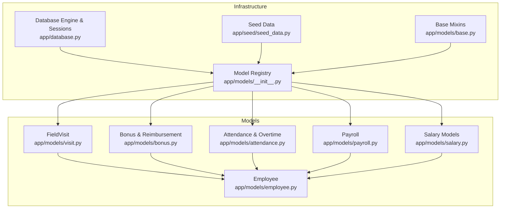
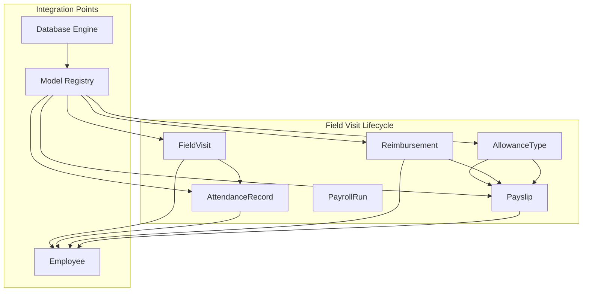
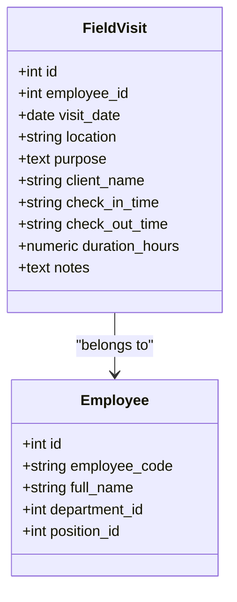
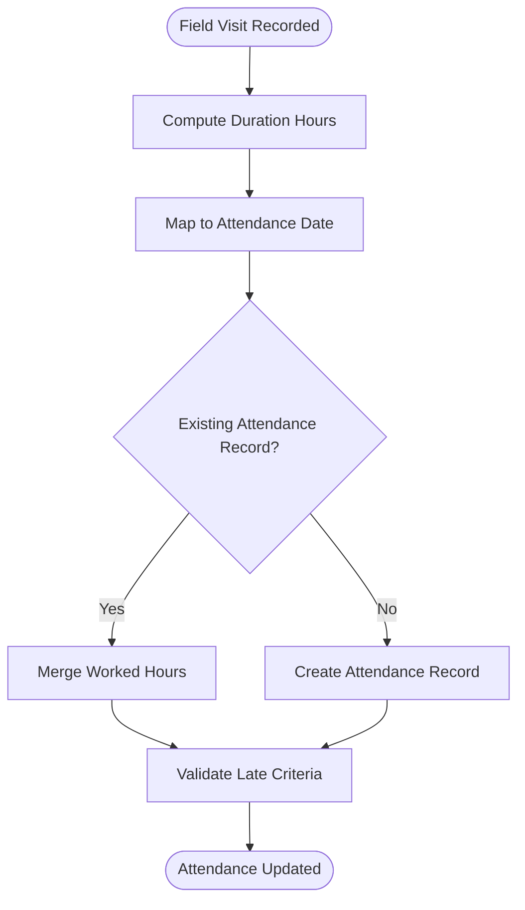
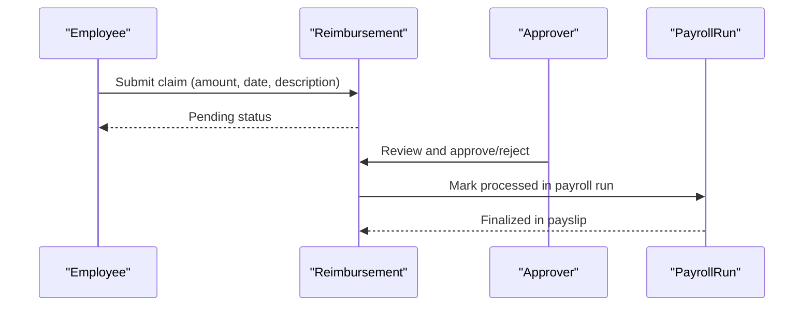
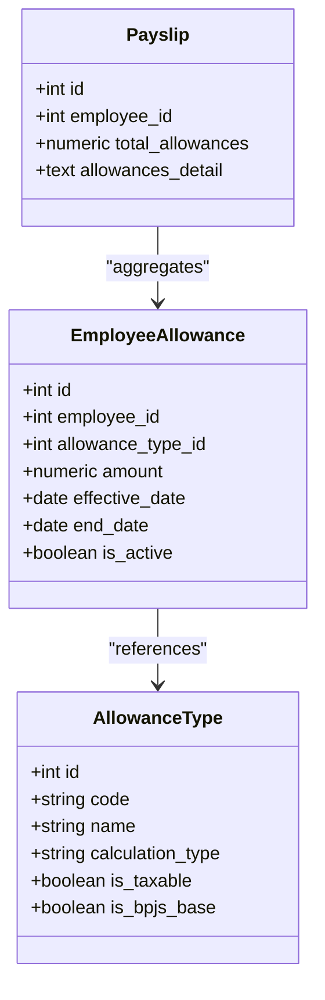
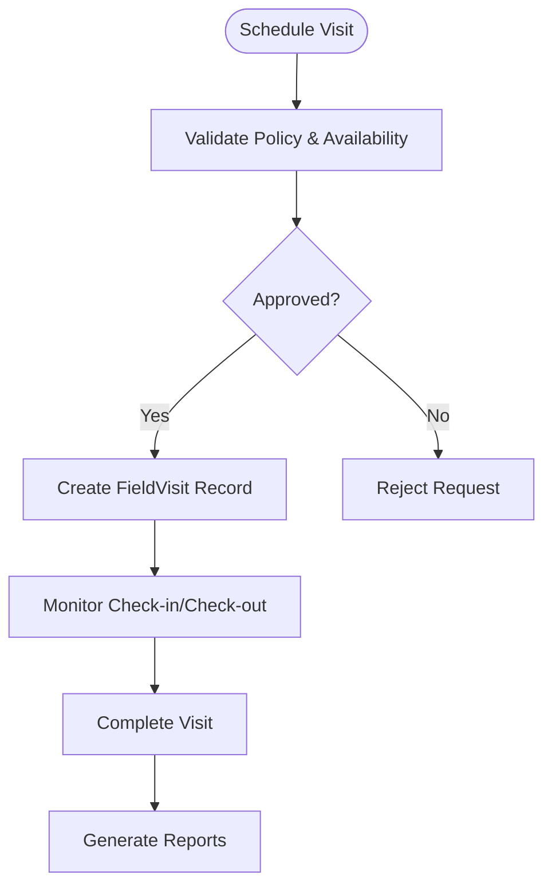
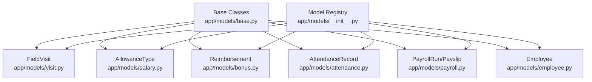

# Field Visit Management

<cite>
**Referenced Files in This Document**
- [visit.py](file://app/models/visit.py)
- [salary.py](file://app/models/salary.py)
- [bonus.py](file://app/models/bonus.py)
- [attendance.py](file://app/models/attendance.py)
- [payroll.py](file://app/models/payroll.py)
- [employee.py](file://app/models/employee.py)
- [database.py](file://app/database.py)
- [base.py](file://app/models/base.py)
- [__init__.py](file://app/models/__init__.py)
- [seed_data.py](file://app/seed/seed_data.py)
</cite>

## Table of Contents
1. [Introduction](#introduction)
2. [Project Structure](#project-structure)
3. [Core Components](#core-components)
4. [Architecture Overview](#architecture-overview)
5. [Detailed Component Analysis](#detailed-component-analysis)
6. [Dependency Analysis](#dependency-analysis)
7. [Performance Considerations](#performance-considerations)
8. [Troubleshooting Guide](#troubleshooting-guide)
9. [Conclusion](#conclusion)

## Introduction
This document explains the field visit management system within the Payroll & HRIS platform. It covers field visit tracking, potential travel allowance processing pathways, visit scheduling considerations, and expense management integration points. The system currently defines a dedicated field visit record model and integrates with attendance, payroll, and reimbursement systems. Travel policy and expense regulation specifics are not embedded in the current codebase; therefore, this document focuses on the implemented data structures and integration points while providing guidance for aligning field visits with attendance tracking, payroll processing, and expense accounting.

## Project Structure
The field visit management system is implemented as part of the centralized SQLAlchemy model package. The relevant components include:
- Field visit tracking model
- Attendance and shift management
- Payroll processing and payslip generation
- Reimbursement framework for expense claims
- Allowance types for potential travel allowance categorization
- Database initialization and session management

**Diagram sources**
- [visit.py:16-34](file://app/models/visit.py#L16-L34)
- [salary.py:62-112](file://app/models/salary.py#L62-L112)
- [bonus.py:71-122](file://app/models/bonus.py#L71-L122)
- [attendance.py:21-134](file://app/models/attendance.py#L21-L134)
- [payroll.py:19-124](file://app/models/payroll.py#L19-L124)
- [employee.py:76-132](file://app/models/employee.py#L76-L132)
- [database.py:17-63](file://app/database.py#L17-L63)
- [__init__.py:35-68](file://app/models/__init__.py#L35-L68)
- [base.py:18-57](file://app/models/base.py#L18-L57)
- [seed_data.py:27-63](file://app/seed/seed_data.py#L27-L63)

**Section sources**
- [visit.py:16-34](file://app/models/visit.py#L16-L34)
- [database.py:17-63](file://app/database.py#L17-L63)
- [__init__.py:35-68](file://app/models/__init__.py#L35-L68)

## Core Components
- FieldVisit: Records employee field visits with date, location, purpose, client name, check-in/out times, duration, and notes. Indexed for efficient lookups by employee and visit date.
- AttendanceRecord: Tracks daily attendance, including check-in/check-out times and worked hours. Provides a foundation for integrating field visit durations with attendance.
- Reimbursement: Supports expense claims with claim and approval workflows, enabling field visit-related expenses to be processed.
- PayrollRun and Payslip: Enable payroll runs and payslip generation, providing a pathway to incorporate allowances or reimbursements into payroll processing.
- AllowanceType: Defines categories for allowances, which can be leveraged to represent travel allowances associated with field visits.
- Employee: Core entity linking visits to employees and supporting organizational context.

**Section sources**
- [visit.py:16-34](file://app/models/visit.py#L16-L34)
- [attendance.py:56-80](file://app/models/attendance.py#L56-L80)
- [bonus.py:92-122](file://app/models/bonus.py#L92-L122)
- [payroll.py:19-124](file://app/models/payroll.py#L19-L124)
- [salary.py:62-85](file://app/models/salary.py#L62-L85)
- [employee.py:76-132](file://app/models/employee.py#L76-L132)

## Architecture Overview
The field visit management system integrates with attendance, payroll, and expense frameworks. While the current codebase does not enforce travel policies or automatic allowance calculations, it provides the building blocks to:
- Record field visits and durations
- Link visits to attendance records
- Process travel-related expenses via reimbursements
- Incorporate allowances into payroll via payslips

**Diagram sources**
- [visit.py:16-34](file://app/models/visit.py#L16-L34)
- [attendance.py:56-80](file://app/models/attendance.py#L56-L80)
- [bonus.py:92-122](file://app/models/bonus.py#L92-L122)
- [payroll.py:64-124](file://app/models/payroll.py#L64-L124)
- [salary.py:62-85](file://app/models/salary.py#L62-L85)
- [database.py:17-63](file://app/database.py#L17-L63)
- [__init__.py:35-68](file://app/models/__init__.py#L35-L68)

## Detailed Component Analysis

### Field Visit Tracking Model
FieldVisit captures essential details for off-site work or client visits, including:
- Employee linkage via foreign key
- Visit date for chronological tracking
- Location, purpose, and client name for auditability
- Check-in/check-out times and computed duration
- Notes for additional context

**Diagram sources**
- [visit.py:16-34](file://app/models/visit.py#L16-L34)
- [employee.py:76-132](file://app/models/employee.py#L76-L132)

**Section sources**
- [visit.py:16-34](file://app/models/visit.py#L16-L34)

### Attendance Integration for Field Visits
Field visit durations can complement daily attendance records. The AttendanceRecord model stores:
- Employee attendance date
- Status and worked hours
- Check-in/check-out times

Integration approach:
- Use field visit duration to inform worked hours when applicable
- Ensure unique attendance records per day per employee
- Apply late indicators and penalties if field work extends beyond scheduled shifts

**Diagram sources**
- [visit.py:23-29](file://app/models/visit.py#L23-L29)
- [attendance.py:56-80](file://app/models/attendance.py#L56-L80)

**Section sources**
- [attendance.py:56-80](file://app/models/attendance.py#L56-L80)

### Expense Management via Reimbursement
Reimbursement supports field visit-related expense claims:
- Claim amount and approved amount
- Claim and expense dates
- Description and receipt path
- Approval status and payroll linkage
- Processed flag for accounting

**Diagram sources**
- [bonus.py:92-122](file://app/models/bonus.py#L92-L122)
- [payroll.py:19-61](file://app/models/payroll.py#L19-L61)

**Section sources**
- [bonus.py:92-122](file://app/models/bonus.py#L92-L122)

### Travel Allowance Processing Pathways
While the codebase does not define travel allowance calculation logic, the allowance framework enables categorization and inclusion in payroll:
- AllowanceType defines categories and calculation types
- EmployeeAllowance assigns allowances to employees
- Payslip aggregates earnings and can include allowance amounts

**Diagram sources**
- [salary.py:62-112](file://app/models/salary.py#L62-L112)
- [payroll.py:64-102](file://app/models/payroll.py#L64-L102)

**Section sources**
- [salary.py:62-112](file://app/models/salary.py#L62-L112)
- [payroll.py:64-102](file://app/models/payroll.py#L64-L102)

### Visit Scheduling and Approval Workflows
The current codebase does not include explicit scheduling or approval workflows for field visits. However, the presence of approval-related fields in related models (e.g., Reimbursement and Bonus) demonstrates a pattern that can be adapted:
- Add scheduling fields to FieldVisit (e.g., scheduled_date, status)
- Introduce approval_status and approver linkage similar to Reimbursement/Bonus
- Enforce policy constraints via CheckConstraints or application-level validation

[No sources needed since this diagram shows conceptual workflow, not actual code structure]

### Expense Reporting
Expense reporting can leverage the Reimbursement model:
- Track claim_date and expense_date
- Maintain receipt_path for audit trails
- Aggregate by employee, type, and period for reporting

**Section sources**
- [bonus.py:92-122](file://app/models/bonus.py#L92-L122)

## Dependency Analysis
The system relies on a shared SQLAlchemy declarative base and consistent mixins for timestamps and auditing. The model registry centralizes imports and exports, ensuring cohesive integration across modules.

**Diagram sources**
- [base.py:18-57](file://app/models/base.py#L18-L57)
- [visit.py:16-34](file://app/models/visit.py#L16-L34)
- [salary.py:62-112](file://app/models/salary.py#L62-L112)
- [bonus.py:71-122](file://app/models/bonus.py#L71-L122)
- [attendance.py:56-134](file://app/models/attendance.py#L56-L134)
- [payroll.py:19-124](file://app/models/payroll.py#L19-L124)
- [employee.py:76-132](file://app/models/employee.py#L76-L132)
- [__init__.py:35-68](file://app/models/__init__.py#L35-L68)

**Section sources**
- [base.py:18-57](file://app/models/base.py#L18-L57)
- [__init__.py:35-68](file://app/models/__init__.py#L35-L68)

## Performance Considerations
- Indexing: FieldVisit includes an index on employee_id and visit_date to accelerate lookups. Consider similar indexing for AttendanceRecord and Reimbursement for optimal query performance.
- Data types: Numeric fields for amounts and durations ensure precision; maintain consistent scale and precision across models.
- Relationships: Foreign keys enforce referential integrity; ensure cascading and constraint checks are aligned with business rules.
- Payroll aggregation: When incorporating allowances or reimbursements into payslips, batch processing during PayrollRun can minimize repeated computations.

[No sources needed since this section provides general guidance]

## Troubleshooting Guide
Common issues and resolutions:
- Duplicate attendance records: Ensure uniqueness constraints on employee_id and attendance_date to prevent duplicates.
- Missing foreign keys: Verify that employee_id references valid Employee records; database-level foreign key enforcement is enabled.
- Reimbursement approvals: Confirm approval_status values conform to expected enums; use standardized transitions (PENDING → APPROVED/REJECTED).
- Payroll linkage: Ensure payroll_run_id is set appropriately when marking reimbursements or allowances as processed.

**Section sources**
- [attendance.py:72-80](file://app/models/attendance.py#L72-L80)
- [bonus.py:112-122](file://app/models/bonus.py#L112-L122)
- [payroll.py:45-61](file://app/models/payroll.py#L45-L61)

## Conclusion
The field visit management system provides a solid foundation for tracking off-site work and integrating with attendance, payroll, and expense frameworks. While travel policies and allowance calculations are not explicitly implemented in code, the allowance and reimbursement models offer clear pathways to incorporate travel allowances and process field visit-related expenses. By leveraging the existing attendance and payroll structures, organizations can build robust workflows for field visit registration, scheduling, approval, and financial processing.