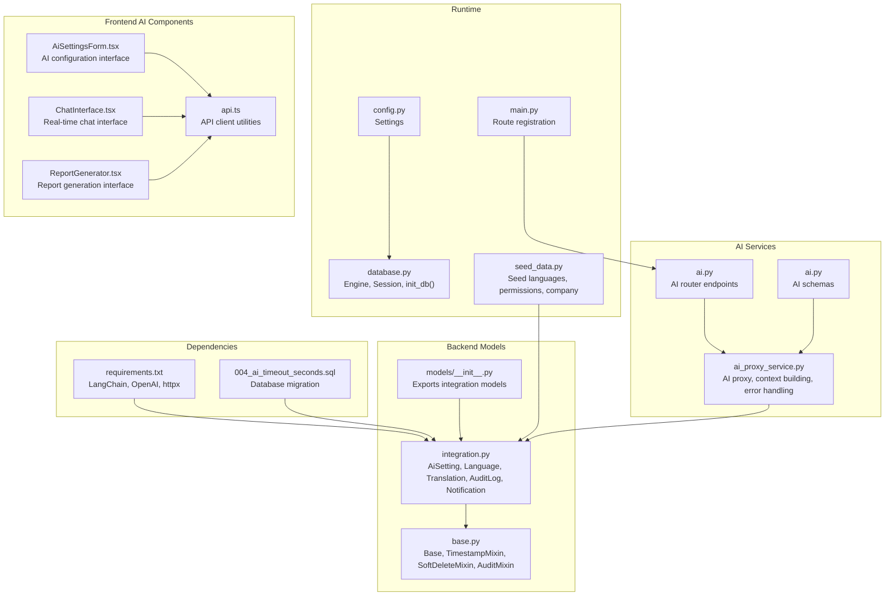
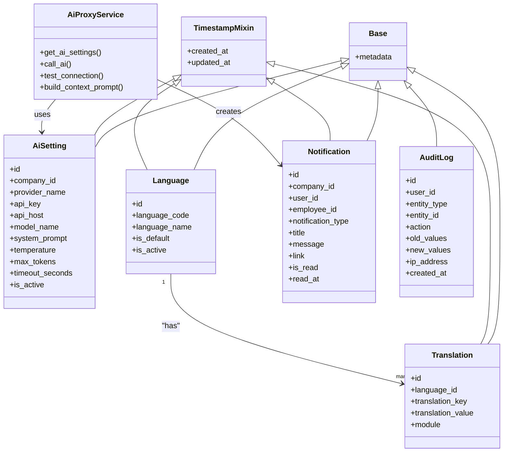
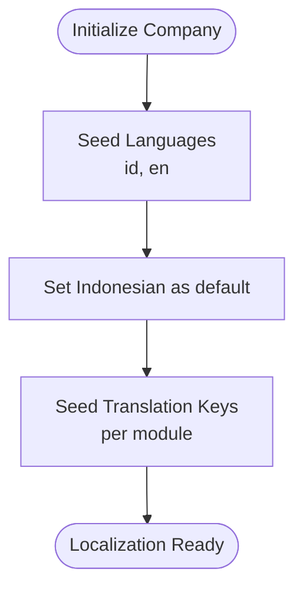
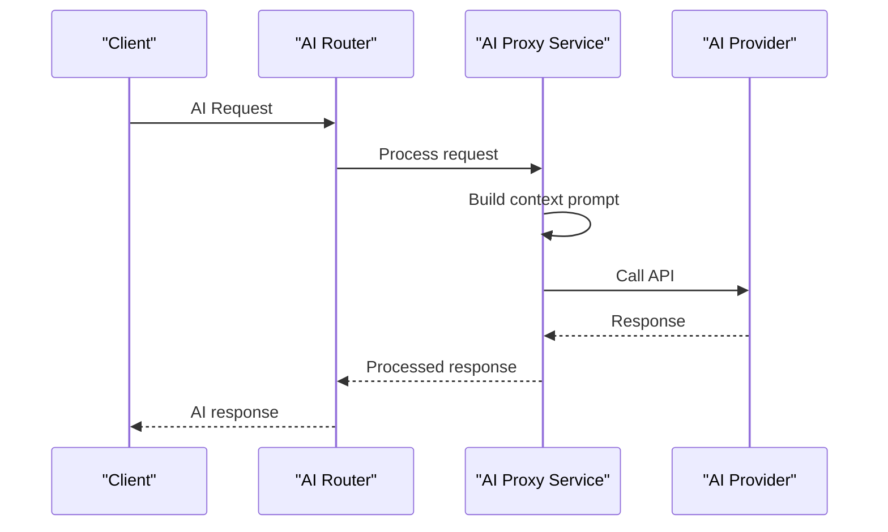
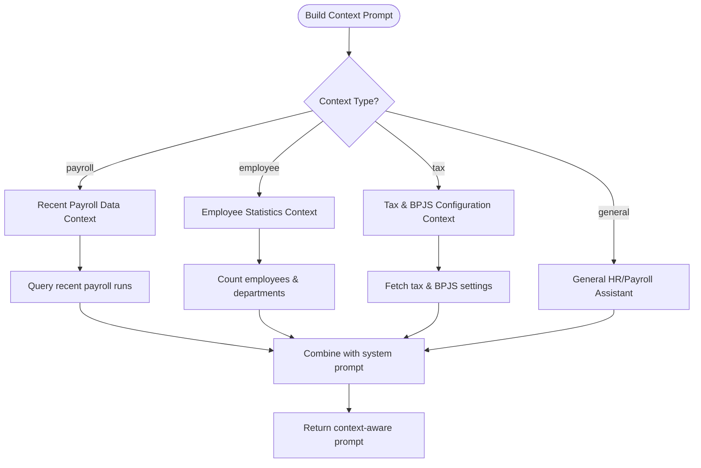
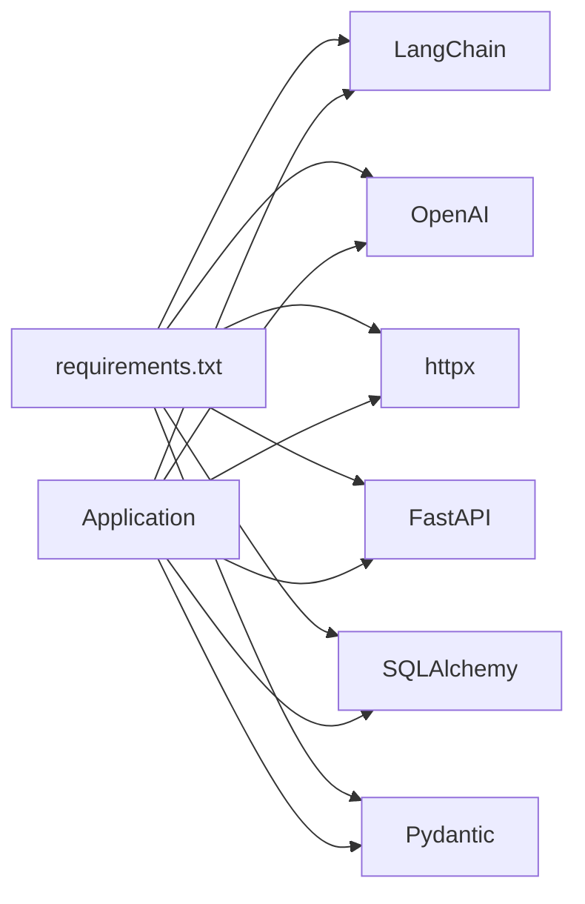

# Integration & Localization

<cite>
**Referenced Files in This Document**
- [integration.py](file://app/models/integration.py)
- [ai_proxy_service.py](file://app/services/ai_proxy_service.py)
- [ai.py](file://app/routers/ai.py)
- [ai.py](file://app/schemas/ai.py)
- [seed_data.py](file://app/seed/seed_data.py)
- [requirements.txt](file://requirements.txt)
- [config.py](file://app/config.py)
- [database.py](file://app/database.py)
- [models/__init__.py](file://app/models/__init__.py)
- [base.py](file://app/models/base.py)
- [main.py](file://app/main.py)
- [api.ts](file://frontend/src/lib/api.ts)
- [AiSettingsForm.tsx](file://frontend/src/components/ai/AiSettingsForm.tsx)
- [ChatInterface.tsx](file://frontend/src/components/ai/ChatInterface.tsx)
- [ReportGenerator.tsx](file://frontend/src/components/ai/ReportGenerator.tsx)
- [ai.ts](file://frontend/src/types/ai.ts)
- [004_ai_timeout_seconds.sql](file://migrations/004_ai_timeout_seconds.sql)
</cite>

## Update Summary
**Changes Made**
- Enhanced AI integration system with comprehensive LangChain and OpenAI capabilities
- Added AI proxy service with advanced error handling and connection testing
- Implemented context-aware prompt building for payroll, employee, and tax domains
- Expanded frontend AI components with settings management, chat interface, and report generation
- Added configurable timeout functionality for AI provider requests
- Integrated notification system alongside AI capabilities

## Table of Contents
1. [Introduction](#introduction)
2. [Project Structure](#project-structure)
3. [Core Components](#core-components)
4. [Architecture Overview](#architecture-overview)
5. [Detailed Component Analysis](#detailed-component-analysis)
6. [AI Integration System](#ai-integration-system)
7. [Frontend AI Components](#frontend-ai-components)
8. [Dependency Analysis](#dependency-analysis)
9. [Performance Considerations](#performance-considerations)
10. [Troubleshooting Guide](#troubleshooting-guide)
11. [Conclusion](#conclusion)
12. [Appendices](#appendices)

## Introduction
This document explains the enhanced integration and localization system for the Payroll & HRIS platform. The system now features comprehensive AI integration capabilities powered by LangChain and OpenAI, alongside robust multi-language support with Indonesian and English. Key enhancements include:

- Advanced AI integration framework with configurable providers and context-aware processing
- Comprehensive external system integrations with audit logging and notification systems
- Enhanced internationalization framework with dynamic language switching
- AI-powered features including chat assistance, automated report generation, and contextual analysis
- Real-time notification system for payroll and HR events
- Configurable timeout settings for AI provider requests

The system is built with FastAPI and SQLAlchemy, featuring extensive frontend components for AI interaction and comprehensive backend services for AI processing and localization management.

## Project Structure
The integration and localization system spans both backend models and frontend components, with comprehensive AI capabilities and internationalization support:



**Diagram sources**
- [integration.py:18-120](file://app/models/integration.py#L18-L120)
- [ai_proxy_service.py:1-286](file://app/services/ai_proxy_service.py#L1-L286)
- [ai.py:1-202](file://app/routers/ai.py#L1-L202)
- [ai.py:1-106](file://app/schemas/ai.py#L1-L106)
- [models/__init__.py:48-85](file://app/models/__init__.py#L48-L85)
- [main.py:16-64](file://app/main.py#L16-L64)
- [AiSettingsForm.tsx:1-306](file://frontend/src/components/ai/AiSettingsForm.tsx#L1-L306)
- [ChatInterface.tsx:1-211](file://frontend/src/components/ai/ChatInterface.tsx#L1-L211)
- [ReportGenerator.tsx:1-144](file://frontend/src/components/ai/ReportGenerator.tsx#L1-L144)
- [api.ts:1-76](file://frontend/src/lib/api.ts#L1-L76)
- [requirements.txt:11-13](file://requirements.txt#L11-L13)
- [004_ai_timeout_seconds.sql:1-8](file://migrations/004_ai_timeout_seconds.sql#L1-L8)

**Section sources**
- [integration.py:18-120](file://app/models/integration.py#L18-L120)
- [ai_proxy_service.py:1-286](file://app/services/ai_proxy_service.py#L1-L286)
- [ai.py:1-202](file://app/routers/ai.py#L1-L202)
- [ai.py:1-106](file://app/schemas/ai.py#L1-L106)
- [models/__init__.py:48-85](file://app/models/__init__.py#L48-L85)
- [main.py:16-64](file://app/main.py#L16-L64)
- [AiSettingsForm.tsx:1-306](file://frontend/src/components/ai/AiSettingsForm.tsx#L1-L306)
- [ChatInterface.tsx:1-211](file://frontend/src/components/ai/ChatInterface.tsx#L1-L211)
- [ReportGenerator.tsx:1-144](file://frontend/src/components/ai/ReportGenerator.tsx#L1-L144)
- [api.ts:1-76](file://frontend/src/lib/api.ts#L1-L76)
- [requirements.txt:11-13](file://requirements.txt#L11-L13)
- [004_ai_timeout_seconds.sql:1-8](file://migrations/004_ai_timeout_seconds.sql#L1-L8)

## Core Components
The enhanced system includes several key components:

**AI Integration Components:**
- AiSetting: Stores per-company AI configuration with provider, endpoint, model, prompt, generation parameters, and activation flag
- AiProxyService: Handles communication with OpenAI-compatible providers, including settings validation, API key masking, and connection testing
- Context-aware prompt building: Generates domain-specific prompts for payroll, employee, tax, and general contexts

**Localization Components:**
- Language: Defines supported languages with default and active flags
- Translation: Holds localized strings keyed by language and optional module
- Notification: Manages in-app notifications for payroll and HR events

**Audit and Compliance:**
- AuditLog: Centralized audit trail for system actions with comprehensive action types

These components enable comprehensive multi-language support, AI-driven automation, real-time notifications, and compliance through centralized audit logging.

**Section sources**
- [integration.py:21-36](file://app/models/integration.py#L21-L36)
- [integration.py:39-51](file://app/models/integration.py#L39-L51)
- [integration.py:54-68](file://app/models/integration.py#L54-L68)
- [integration.py:96-120](file://app/models/integration.py#L96-L120)
- [integration.py:71-93](file://app/models/integration.py#L71-L93)

## Architecture Overview
The enhanced system integrates AI capabilities, internationalization, and comprehensive external service connectivity:



**Diagram sources**
- [integration.py:18-120](file://app/models/integration.py#L18-L120)
- [ai_proxy_service.py:29-286](file://app/services/ai_proxy_service.py#L29-L286)
- [base.py:18-57](file://app/models/base.py#L18-L57)

## Detailed Component Analysis

### Internationalization Framework
The system maintains robust multi-language support with enhanced features:

- **Language seeding**: Defines Indonesian and English as supported languages with Indonesian as the default for initial company setup
- **Translation management**: Stores localized strings with unique constraints and optimized indexing for fast lookups
- **Module scoping**: Organizes translations by functional areas (UI labels, error messages, business terms)
- **Dynamic switching**: Supports runtime language selection based on user preferences

Implementation highlights:
- Language table enforces uniqueness on language_code with default/active flag management
- Translation table prevents duplication through unique constraints and includes module scoping
- Company default language is seeded to Indonesian for immediate localization



**Diagram sources**
- [seed_data.py:371-384](file://app/seed/seed_data.py#L371-L384)
- [integration.py:39-51](file://app/models/integration.py#L39-L51)

**Section sources**
- [seed_data.py:371-384](file://app/seed/seed_data.py#L371-L384)
- [integration.py:39-51](file://app/models/integration.py#L39-L51)

### AI Integration with LangChain and OpenAI
The enhanced AI system provides comprehensive language model integration:

**Core AI Features:**
- **Provider flexibility**: Supports OpenAI, Anthropic, Google AI, and custom OpenAI-compatible APIs
- **Context-aware processing**: Builds domain-specific prompts for payroll, employee, tax, and general contexts
- **Advanced error handling**: Comprehensive HTTPException handling for timeouts, connection failures, and provider errors
- **Connection testing**: Built-in connectivity verification with latency measurement
- **Configurable parameters**: Temperature, max_tokens, and timeout settings per company

**AI Processing Pipeline:**


**Diagram sources**
- [ai.py:120-143](file://app/routers/ai.py#L120-L143)
- [ai_proxy_service.py:65-143](file://app/services/ai_proxy_service.py#L65-L143)

**Section sources**
- [ai_proxy_service.py:29-143](file://app/services/ai_proxy_service.py#L29-L143)
- [ai.py:120-143](file://app/routers/ai.py#L120-L143)

### External System Integrations
The system supports comprehensive external service connectivity:

**AI Provider Integration:**
- **Multi-provider support**: OpenAI, Anthropic, Google AI, and custom endpoints
- **Standardized interface**: OpenAI-compatible chat/completions endpoint
- **Configurable timeouts**: Up to 60 seconds with Vercel Hobby plan optimization

**Audit and Notification Systems:**
- **Comprehensive audit logging**: Tracks CREATE, UPDATE, DELETE, APPROVE, EXPORT, LOGIN actions
- **Notification system**: Real-time in-app notifications for payroll events (PAYSLIP_READY, BULK_COMPLETE, BULK_FAILED)
- **Foreign key relationships**: Maintains referential integrity across all integration components

**Section sources**
- [integration.py:21-36](file://app/models/integration.py#L21-L36)
- [integration.py:71-93](file://app/models/integration.py#L71-L93)
- [integration.py:96-120](file://app/models/integration.py#L96-L120)

### Translation Management
Enhanced translation management with improved performance and organization:

**Database Design:**
- **Unique constraints**: Prevents duplicate translation keys per language
- **Optimized indexing**: Composite indexes for fast language-key lookups
- **Module scoping**: Organizes translations by functional areas (payroll, HR, UI)
- **Active language support**: Dynamic language switching with caching

**Operational Benefits:**
- Bulk operations optimized with pagination support
- Efficient cache invalidation for language changes
- Modular organization reduces translation maintenance overhead

**Section sources**
- [integration.py:54-68](file://app/models/integration.py#L54-L68)

### Audit Trail and Compliance
Comprehensive audit logging with enhanced action tracking:

**Action Types:**
- **Core operations**: CREATE, UPDATE, DELETE, APPROVE, EXPORT, LOGIN
- **Payroll events**: Automated processing, approval workflows, bulk operations
- **System events**: Configuration changes, user actions, API interactions

**Performance Optimizations:**
- **Indexed fields**: Entity type/entity ID, user ID/timestamp combinations
- **Check constraints**: Ensures data integrity for action types
- **Archival considerations**: Efficient querying for compliance reporting

**Section sources**
- [integration.py:71-93](file://app/models/integration.py#L71-L93)

## AI Integration System
The AI integration system represents a significant enhancement to the platform's capabilities:

### AI Proxy Service Architecture
The AI Proxy Service provides a robust abstraction layer for AI provider communication:

**Key Features:**
- **Settings validation**: Ensures active AI settings before processing requests
- **API key security**: Automatic masking of sensitive credentials
- **Error handling**: Comprehensive HTTPException mapping for different failure scenarios
- **Connection testing**: Built-in connectivity verification with latency measurement

**Provider Support Matrix:**
| Provider | Base URL | Authentication | Special Features |
|----------|----------|----------------|------------------|
| OpenAI | https://api.openai.com/v1 | Bearer Token | GPT models, Function calling |
| Anthropic | https://api.anthropic.com/v1 | API Key | Claude models, Safety controls |
| Google AI | https://generativelanguage.googleapis.com/v1 | API Key | Gemini models, Multimodal |
| Custom | User-defined | Flexible | Any OpenAI-compatible API |

### Context-Aware Prompt Engineering
The system implements sophisticated context-aware prompting for domain-specific AI assistance:

**Context Types:**
- **General**: Broad HR/payroll assistance with Indonesian regulatory knowledge
- **Payroll**: Context includes recent payroll runs, employee counts, and financial summaries
- **Employee**: Current headcount, department distribution, and employment status
- **Tax**: Tax settings, PPh 21 brackets, and BPJS contribution rates

**Prompt Construction:**


**Diagram sources**
- [ai_proxy_service.py:161-286](file://app/services/ai_proxy_service.py#L161-L286)

### AI Endpoint Implementation
The AI system exposes comprehensive REST endpoints for different use cases:

**Settings Management:**
- **GET /ai/settings**: Retrieve AI configuration with API key masking
- **POST /ai/settings**: Create new AI configuration
- **PATCH /ai/settings/{id}**: Update existing configuration

**AI Assistance:**
- **POST /ai/chat**: Real-time chat with context awareness
- **POST /ai/reports**: Generate AI-powered reports with customizable periods

**Connectivity Testing:**
- **POST /ai/test-connection**: Verify AI provider connectivity and measure latency

**Section sources**
- [ai_proxy_service.py:29-286](file://app/services/ai_proxy_service.py#L29-L286)
- [ai.py:25-202](file://app/routers/ai.py#L25-L202)

## Frontend AI Components
The frontend provides comprehensive AI interaction capabilities through modern React components:

### AI Settings Management
The AiSettingsForm component offers a complete interface for AI configuration:

**Configuration Options:**
- **Provider Selection**: Dropdown with OpenAI, Anthropic, Google AI, and Custom options
- **Authentication**: Secure API key input with masking for existing configurations
- **Model Parameters**: Temperature slider (0-2), max_tokens input, timeout configuration
- **System Prompt**: Custom instructions for AI behavior
- **Activation Control**: Toggle to enable/disable AI features

**Smart Features:**
- **Provider Host Mapping**: Automatic base URL population for major providers
- **Validation**: Zod-based form validation with real-time feedback
- **Connection Testing**: Built-in connectivity verification with latency display
- **Conditional Fields**: API key field hidden when editing existing settings

### Chat Interface
The ChatInterface provides a sophisticated real-time chat experience:

**Context Management:**
- **Context Switching**: Buttons for general, payroll, employee, and tax contexts
- **Message History**: Persistent conversation with automatic scrolling
- **Typing Indicators**: Visual feedback during AI processing
- **Configuration Detection**: Automatic detection of AI setup status

**User Experience:**
- **Responsive Design**: Mobile-friendly interface with touch-optimized controls
- **Error Handling**: Graceful error display with recovery options
- **Accessibility**: Keyboard navigation and screen reader support
- **Loading States**: Smooth transitions during AI processing

### Report Generation
The ReportGenerator enables AI-powered report creation:

**Report Types:**
- **Payroll Summary**: Comprehensive payroll overview with trends
- **Overtime Analysis**: Lending patterns and analysis
- **Tax Compliance**: PPh 21 compliance review and risk assessment
- **Employee Insights**: Workforce analytics and demographic analysis

**Customization Options:**
- **Period Selection**: Month/year dropdown for historical analysis
- **Real-time Generation**: Immediate report creation with markdown formatting
- **Title Enhancement**: Automatic title formatting with period information

**Section sources**
- [AiSettingsForm.tsx:1-306](file://frontend/src/components/ai/AiSettingsForm.tsx#L1-L306)
- [ChatInterface.tsx:1-211](file://frontend/src/components/ai/ChatInterface.tsx#L1-L211)
- [ReportGenerator.tsx:1-144](file://frontend/src/components/ai/ReportGenerator.tsx#L1-L144)
- [api.ts:1-76](file://frontend/src/lib/api.ts#L1-L76)

## Dependency Analysis
The enhanced system relies on several key external dependencies:

**Core AI Dependencies:**
- **LangChain >=0.1.0**: AI chain orchestration and prompt management
- **OpenAI >=1.0.0**: Official OpenAI client library with streaming support
- **httpx >=0.25.0**: Asynchronous HTTP client for AI provider communication

**Backend Infrastructure:**
- **FastAPI >=0.104.0**: High-performance web framework with automatic API documentation
- **SQLAlchemy >=2.0.0**: Next-generation ORM for database operations
- **Pydantic >=2.0.0**: Data validation and settings management
- **Pydantic-Settings >=2.0.0**: Environment-based configuration loading

**Development Tools:**
- **Alembic >=1.13.0**: Database migration management
- **WeasyPrint >=60.0**: PDF generation for reports and payslips
- **Jinja2 >=3.1.0**: Template engine for dynamic content generation



**Diagram sources**
- [requirements.txt:11-23](file://requirements.txt#L11-L23)

**Section sources**
- [requirements.txt:11-23](file://requirements.txt#L11-L23)

## Performance Considerations
The enhanced system incorporates several performance optimizations:

**AI Request Optimization:**
- **Timeout Management**: Configurable timeouts up to 60 seconds, optimized for Vercel Hobby plan (9-second default)
- **Connection Pooling**: Reusable HTTP client instances for reduced overhead
- **Error Caching**: Failed requests cached to prevent repeated provider load
- **Response Streaming**: Support for streaming responses where available

**Database Performance:**
- **Index Optimization**: Strategic indexing on frequently queried fields (language_code, translation_key, audit indices)
- **Query Optimization**: Efficient joins and subqueries for context building
- **Connection Pooling**: Database connection pooling for concurrent requests
- **Pagination Support**: Bulk translation operations with pagination to prevent memory issues

**Frontend Performance:**
- **Component Memoization**: React.memo for expensive components
- **Lazy Loading**: Dynamic imports for AI components
- **State Management**: Efficient state updates with minimal re-renders
- **Image Optimization**: Responsive images and lazy loading for better LCP scores

**Cache Strategies:**
- **API Response Caching**: Smart caching for AI responses with expiration
- **Translation Caching**: Active language and translation caching
- **Configuration Caching**: AI settings and company preferences caching
- **Session Storage**: User preferences and conversation history persistence

## Troubleshooting Guide
Comprehensive troubleshooting for the enhanced AI and integration system:

**AI Configuration Issues:**
- **Missing AI Settings**: Verify company has active AI configuration with is_active flag
- **Provider Connectivity**: Use /ai/test-connection endpoint to verify provider accessibility
- **API Key Security**: API keys are automatically masked in responses; ensure proper key format
- **Timeout Errors**: Increase timeout_seconds setting if provider is slow or under heavy load

**Database Migration Problems:**
- **Missing Columns**: Run migration 004_ai_timeout_seconds.sql to add timeout_seconds column
- **Constraint Violations**: Check unique constraints on language_code and translation_key combinations
- **Foreign Key Issues**: Ensure company and user references exist before creating AI settings

**Frontend Integration Issues:**
- **API Communication**: Verify NEXT_PUBLIC_API_URL environment variable is set correctly
- **Authentication**: Ensure user sessions are established before accessing AI features
- **Provider Compatibility**: Check that selected provider supports chat/completions endpoint
- **Browser Compatibility**: Modern browsers required for WebSocket and advanced features

**Performance Issues:**
- **Slow Responses**: Monitor AI provider latency and consider rate limiting
- **Memory Leaks**: Check for proper cleanup of event listeners and timers
- **Database Locks**: Monitor for long-running transactions during bulk operations
- **Cache Invalidation**: Ensure proper cache clearing after configuration changes

**Section sources**
- [ai_proxy_service.py:145-158](file://app/services/ai_proxy_service.py#L145-L158)
- [004_ai_timeout_seconds.sql:1-8](file://migrations/004_ai_timeout_seconds.sql#L1-L8)
- [AiSettingsForm.tsx:103-124](file://frontend/src/components/ai/AiSettingsForm.tsx#L103-L124)

## Conclusion
The enhanced Payroll & HRIS system provides a comprehensive foundation for enterprise-grade payroll management with advanced AI capabilities:

**AI Integration Excellence:**
- **Multi-provider Support**: Seamless integration with OpenAI, Anthropic, Google AI, and custom providers
- **Context Awareness**: Domain-specific AI assistance for payroll, HR, and tax domains
- **Robust Error Handling**: Comprehensive error management with user-friendly messaging
- **Performance Optimization**: Configurable timeouts and connection pooling for reliable operation

**Internationalization Mastery:**
- **Multi-language Support**: Indonesian and English with dynamic switching capabilities
- **Translation Management**: Organized translation system with module scoping and unique constraints
- **Seeding Automation**: Out-of-the-box language and permission setup for immediate localization

**Comprehensive Integration:**
- **Audit Logging**: Complete compliance tracking with indexed query performance
- **Notification System**: Real-time in-app notifications for critical payroll events
- **External Connectivity**: Pluggable provider architecture supporting future integrations

The modular design ensures extensibility for additional languages, AI providers, and integration scenarios while maintaining high performance and reliability standards.

## Appendices

### AI Configuration Example
Configure AI settings per company with comprehensive provider support:

**Basic Configuration:**
```json
{
  "company_id": 1,
  "provider_name": "OpenAI",
  "api_key": "sk-...your-api-key...",
  "api_host": "https://api.openai.com/v1",
  "model_name": "gpt-4o-mini",
  "system_prompt": "You are a helpful HR assistant for Indonesian payroll systems.",
  "temperature": 0.7,
  "max_tokens": 2048,
  "timeout_seconds": 9,
  "is_active": true
}
```

**Advanced Configuration:**
- **Custom Providers**: Set api_host to any OpenAI-compatible endpoint
- **Context Customization**: Modify system_prompt for domain-specific behavior
- **Performance Tuning**: Adjust temperature and max_tokens based on use case
- **Security**: API keys are automatically masked in responses

**Section sources**
- [ai.py:46-105](file://app/routers/ai.py#L46-L105)
- [ai.py:16-41](file://app/schemas/ai.py#L16-L41)

### AI Feature Usage Patterns
Implement AI-powered features with context awareness:

**Chat Integration:**
- Select appropriate context type (general, payroll, employee, tax)
- Provide clear user questions with sufficient context
- Monitor token usage for cost optimization
- Handle AI response errors gracefully

**Report Generation:**
- Choose relevant report type for business needs
- Specify appropriate time periods for analysis
- Review AI-generated insights critically
- Export reports for stakeholder consumption

**Section sources**
- [ai.py:120-202](file://app/routers/ai.py#L120-L202)
- [ai_proxy_service.py:161-286](file://app/services/ai_proxy_service.py#L161-L286)

### External System Connections
Establish secure connections to external AI providers:

**Provider Configuration:**
- **OpenAI**: https://api.openai.com/v1 with Bearer token authentication
- **Anthropic**: https://api.anthropic.com/v1 with API key header
- **Google AI**: https://generativelanguage.googleapis.com/v1 with API key
- **Custom**: Any OpenAI-compatible endpoint with proper authentication

**Security Best Practices:**
- Store API keys in environment variables
- Use HTTPS endpoints for all communications
- Implement proper error handling for network failures
- Monitor provider quotas and usage limits

**Section sources**
- [AiSettingsForm.tsx:20-27](file://frontend/src/components/ai/AiSettingsForm.tsx#L20-L27)
- [ai_proxy_service.py:80-90](file://app/services/ai_proxy_service.py#L80-L90)

### Localization Setup Steps
Implement comprehensive internationalization:

**Initial Setup:**
1. Seed languages during database initialization
2. Configure default company language (Indonesian)
3. Populate translation keys for core modules
4. Set up language switching in frontend components

**Runtime Management:**
- Add new languages through Language table entries
- Manage translations via Translation table with unique constraints
- Implement language preference detection and caching
- Handle missing translations gracefully with fallback mechanisms

**Section sources**
- [seed_data.py:371-384](file://app/seed/seed_data.py#L371-L384)
- [integration.py:39-68](file://app/models/integration.py#L39-L68)

### AI Provider Migration
Handle AI provider changes and compatibility:

**Migration Strategy:**
- Update api_host configuration for new provider endpoints
- Adjust model_name for provider-specific model naming
- Modify system_prompt for provider-specific instruction formats
- Test connectivity using /ai/test-connection endpoint

**Compatibility Considerations:**
- Ensure chat/completions endpoint compatibility
- Verify authentication method requirements
- Check token pricing and rate limiting policies
- Monitor provider uptime and performance metrics

**Section sources**
- [ai.py:110-116](file://app/routers/ai.py#L110-L116)
- [AiSettingsForm.tsx:65-72](file://frontend/src/components/ai/AiSettingsForm.tsx#L65-L72)

### Notification System Integration
Leverage the notification system for AI-powered alerts:

**Notification Types:**
- **PAYSLIP_READY**: Notify employees when payslips are available
- **BULK_COMPLETE**: Alert administrators when bulk operations succeed
- **BULK_FAILED**: Inform about failed bulk processing attempts

**Integration Patterns:**
- Trigger notifications based on AI-generated insights
- Send automated alerts for compliance violations detected by AI
- Coordinate with payroll generation workflows
- Provide user-friendly notifications for system events

**Section sources**
- [integration.py:96-120](file://app/models/integration.py#L96-L120)
- [ai_proxy_service.py:145-158](file://app/services/ai_proxy_service.py#L145-L158)