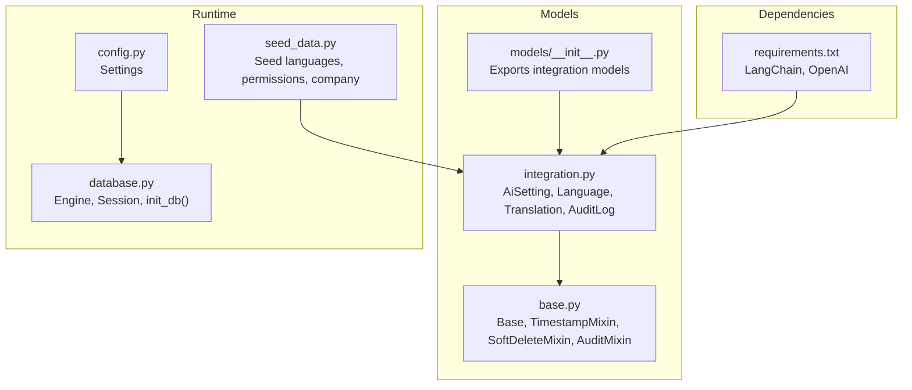
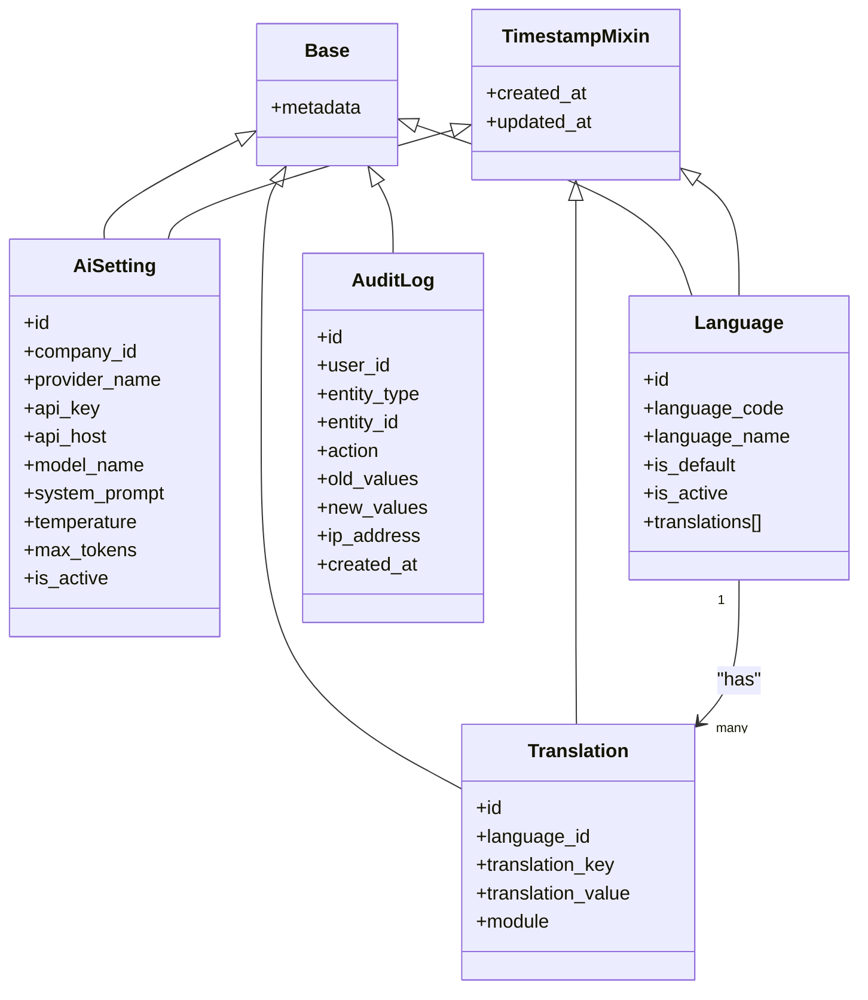
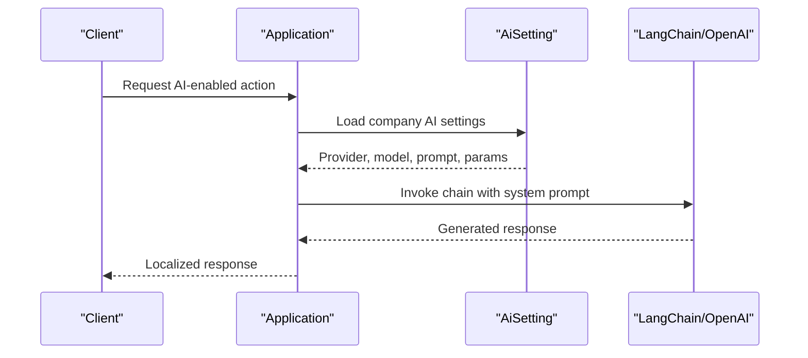
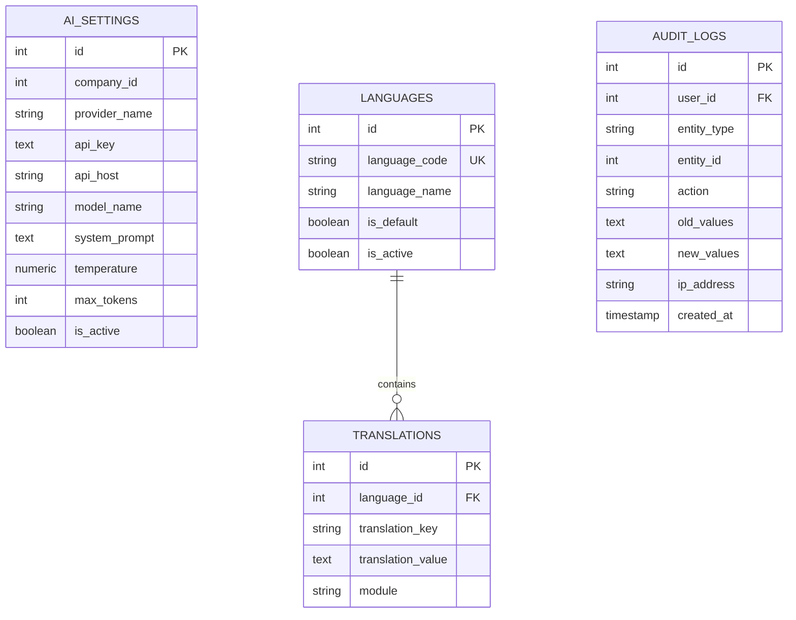
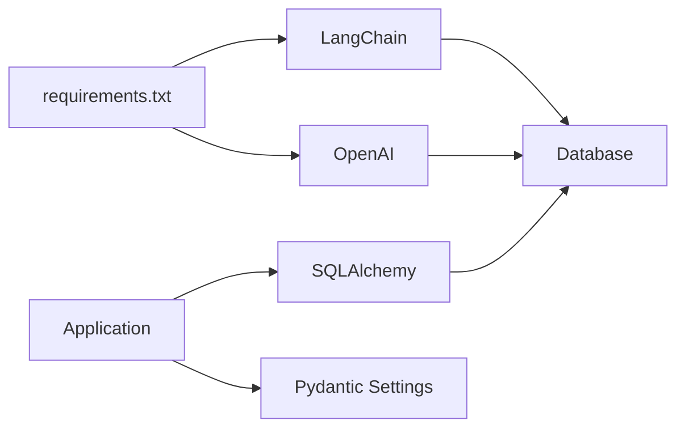

# Integration & Localization

<cite>
**Referenced Files in This Document**
- [integration.py](file://app/models/integration.py)
- [seed_data.py](file://app/seed/seed_data.py)
- [requirements.txt](file://requirements.txt)
- [config.py](file://app/config.py)
- [database.py](file://app/database.py)
- [models/__init__.py](file://app/models/__init__.py)
- [base.py](file://app/models/base.py)
</cite>

## Table of Contents
1. [Introduction](#introduction)
2. [Project Structure](#project-structure)
3. [Core Components](#core-components)
4. [Architecture Overview](#architecture-overview)
5. [Detailed Component Analysis](#detailed-component-analysis)
6. [Dependency Analysis](#dependency-analysis)
7. [Performance Considerations](#performance-considerations)
8. [Troubleshooting Guide](#troubleshooting-guide)
9. [Conclusion](#conclusion)
10. [Appendices](#appendices)

## Introduction
This document explains the integration and localization system for the Payroll & HRIS platform. It covers:
- Multi-language support with Indonesian and English
- AI integration framework using LangChain and OpenAI
- External system integrations and audit logging
- Translation management and language switching mechanisms
- Internationalization (i18n) framework and configuration
- API integration capabilities and extensibility patterns

The system is built with FastAPI and SQLAlchemy, and includes seed data for languages and permissions, enabling out-of-the-box i18n and AI-enabled features.

## Project Structure
The integration and localization features are primarily defined in the models package and seeded during application initialization. The key areas are:
- Models for AI settings, languages, translations, and audit logs
- Seeding logic for default languages and permissions
- Application configuration and database initialization
- Dependencies for LangChain and OpenAI

**Diagram sources**
- [integration.py:1-93](file://app/models/integration.py#L1-L93)
- [base.py:1-57](file://app/models/base.py#L1-L57)
- [models/__init__.py:38-67](file://app/models/__init__.py#L38-L67)
- [config.py:1-18](file://app/config.py#L1-L18)
- [database.py:1-62](file://app/database.py#L1-L62)
- [seed_data.py:360-373](file://app/seed/seed_data.py#L360-L373)
- [requirements.txt:11-12](file://requirements.txt#L11-L12)

**Section sources**
- [integration.py:1-93](file://app/models/integration.py#L1-L93)
- [models/__init__.py:38-67](file://app/models/__init__.py#L38-L67)
- [seed_data.py:360-373](file://app/seed/seed_data.py#L360-L373)
- [config.py:1-18](file://app/config.py#L1-L18)
- [database.py:1-62](file://app/database.py#L1-L62)
- [requirements.txt:11-12](file://requirements.txt#L11-L12)

## Core Components
- AiSetting: Stores per-company AI configuration (provider, endpoint, model, prompt, generation parameters, activation flag)
- Language: Defines supported languages with default and active flags
- Translation: Holds localized strings keyed by language and optional module
- AuditLog: Centralized audit trail for system actions

These components enable:
- Multi-language UI and messaging
- AI-driven automation per company
- Compliance and traceability via audit logs

**Section sources**
- [integration.py:21-36](file://app/models/integration.py#L21-L36)
- [integration.py:38-51](file://app/models/integration.py#L38-L51)
- [integration.py:53-67](file://app/models/integration.py#L53-L67)
- [integration.py:70-92](file://app/models/integration.py#L70-L92)

## Architecture Overview
The system integrates three pillars:
- Internationalization: Language and Translation tables with seeded defaults
- AI Integration: AiSetting per company with LangChain/OpenAI client wiring
- Audit Trail: AuditLog capturing lifecycle events

**Diagram sources**
- [integration.py:18-92](file://app/models/integration.py#L18-L92)
- [base.py:18-57](file://app/models/base.py#L18-L57)

## Detailed Component Analysis

### Internationalization Framework
- Language seeding defines Indonesian and English as supported languages with Indonesian as the default for the initial company.
- Translation keys and values are stored per language with optional module scoping.
- The system supports language switching via the selected language’s translation keys.

Implementation highlights:
- Language table enforces uniqueness on language_code and tracks default/active flags.
- Translation table enforces unique key per language and indexes for fast lookup.
- Company default language is seeded to Indonesian for out-of-the-box localization.

**Diagram sources**
- [seed_data.py:360-373](file://app/seed/seed_data.py#L360-L373)
- [integration.py:38-67](file://app/models/integration.py#L38-L67)

**Section sources**
- [seed_data.py:66-82](file://app/seed/seed_data.py#L66-L82)
- [seed_data.py:360-373](file://app/seed/seed_data.py#L360-L373)
- [integration.py:38-67](file://app/models/integration.py#L38-L67)

### AI Integration with LangChain and OpenAI
- AiSetting stores provider-specific configuration per company, including API host, model name, system prompt, and generation parameters.
- The presence of LangChain and OpenAI in dependencies indicates readiness for AI-powered features.
- Activation flag allows enabling/disabling AI per company.

**Diagram sources**
- [integration.py:21-36](file://app/models/integration.py#L21-L36)
- [requirements.txt:11-12](file://requirements.txt#L11-L12)

**Section sources**
- [integration.py:21-36](file://app/models/integration.py#L21-L36)
- [requirements.txt:11-12](file://requirements.txt#L11-L12)

### External System Integrations
- AiSetting supports pluggable providers and custom API hosts, enabling integration with various AI backends.
- AuditLog captures system actions for compliance and monitoring, indexing by entity and user/date for efficient queries.

**Diagram sources**
- [integration.py:21-92](file://app/models/integration.py#L21-L92)

**Section sources**
- [integration.py:21-36](file://app/models/integration.py#L21-L36)
- [integration.py:70-92](file://app/models/integration.py#L70-L92)

### Translation Management
- Unique constraint on language_id and translation_key prevents duplication.
- Indexes optimize lookups by language and key.
- Module-scoped keys help organize translations by functional area.

Operational guidance:
- Add new translation keys with localized values for each active language.
- Use module prefixes to group related strings (e.g., UI labels, error messages).

**Section sources**
- [integration.py:53-67](file://app/models/integration.py#L53-L67)

### Audit Trail and Compliance
- AuditLog records CREATE, UPDATE, DELETE, APPROVE, EXPORT, LOGIN actions.
- Indexed fields support efficient filtering and reporting.

**Section sources**
- [integration.py:70-92](file://app/models/integration.py#L70-L92)

## Dependency Analysis
External dependencies relevant to integration and localization:
- LangChain and OpenAI: Enable AI features and LLM orchestration
- SQLAlchemy: ORM for persistence of i18n and AI settings
- Pydantic Settings: Centralized configuration loading

**Diagram sources**
- [requirements.txt:11-12](file://requirements.txt#L11-L12)
- [config.py:1-18](file://app/config.py#L1-18)
- [database.py:17-24](file://app/database.py#L17-L24)

**Section sources**
- [requirements.txt:11-12](file://requirements.txt#L11-L12)
- [config.py:1-18](file://app/config.py#L1-18)
- [database.py:17-24](file://app/database.py#L17-L24)

## Performance Considerations
- Use database indexes on frequently queried fields (language_code, translation_key, audit indices) to reduce lookup latency.
- Apply pagination for translation bulk operations to avoid large result sets.
- Cache active language and default language per company to minimize repeated reads.
- For AI prompts, keep system_prompt concise and leverage model parameter limits to control cost and latency.

## Troubleshooting Guide
Common issues and resolutions:
- Missing default language: Ensure seeding ran to populate languages and company default language.
- Duplicate translation keys: The unique constraint prevents duplicates; resolve by updating existing keys.
- AI provider misconfiguration: Verify AiSetting fields (provider, model, host) and activation flag.
- Audit log gaps: Confirm database foreign key enforcement and proper indexing.

**Section sources**
- [seed_data.py:360-373](file://app/seed/seed_data.py#L360-L373)
- [integration.py:53-67](file://app/models/integration.py#L53-L67)
- [integration.py:21-36](file://app/models/integration.py#L21-L36)
- [database.py:27-32](file://app/database.py#L27-L32)

## Conclusion
The Payroll & HRIS system provides a robust foundation for multi-language support and AI integration:
- Internationalization is modeled with Language and Translation tables and seeded with Indonesian and English.
- AI integration is enabled via AiSetting with provider flexibility and LangChain/OpenAI dependencies.
- Audit logging ensures compliance visibility.
- The modular design supports extension for additional languages, AI providers, and translation modules.

## Appendices

### Language Configuration Example
- Default company language is seeded to Indonesian.
- Additional languages can be added through the Language table and marked as default if needed.

**Section sources**
- [seed_data.py:66-82](file://app/seed/seed_data.py#L66-L82)
- [seed_data.py:360-373](file://app/seed/seed_data.py#L360-L373)

### AI Feature Usage Pattern
- Configure AiSetting per company with provider, model, and system prompt.
- Activate AI for the company and wire LangChain/OpenAI clients accordingly.

**Section sources**
- [integration.py:21-36](file://app/models/integration.py#L21-L36)
- [requirements.txt:11-12](file://requirements.txt#L11-L12)

### External System Connections
- Connect AI providers via AiSetting.api_host and AiSetting.provider_name.
- Persist configuration per company for isolation and scalability.

**Section sources**
- [integration.py:21-36](file://app/models/integration.py#L21-L36)

### Localization Setup Steps
- Seed languages and translations during initialization.
- Switch language by selecting the appropriate language_code and rendering translations by translation_key.

**Section sources**
- [seed_data.py:360-373](file://app/seed/seed_data.py#L360-L373)
- [integration.py:38-67](file://app/models/integration.py#L38-L67)