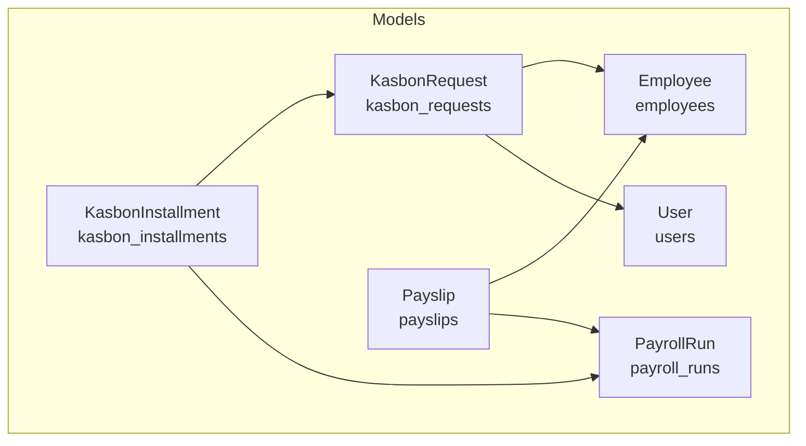
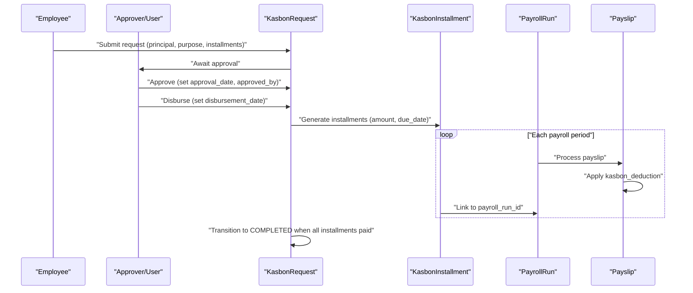
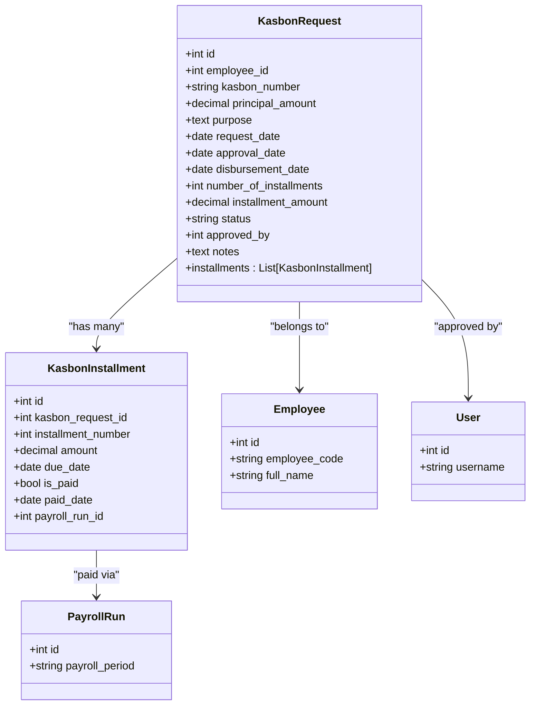
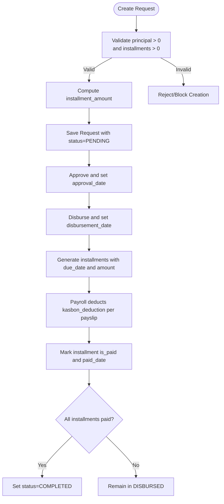
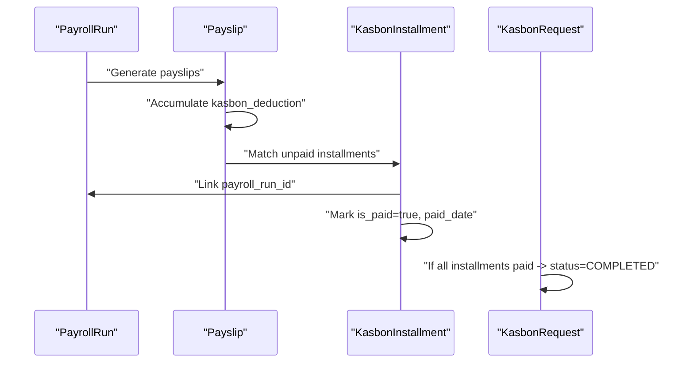
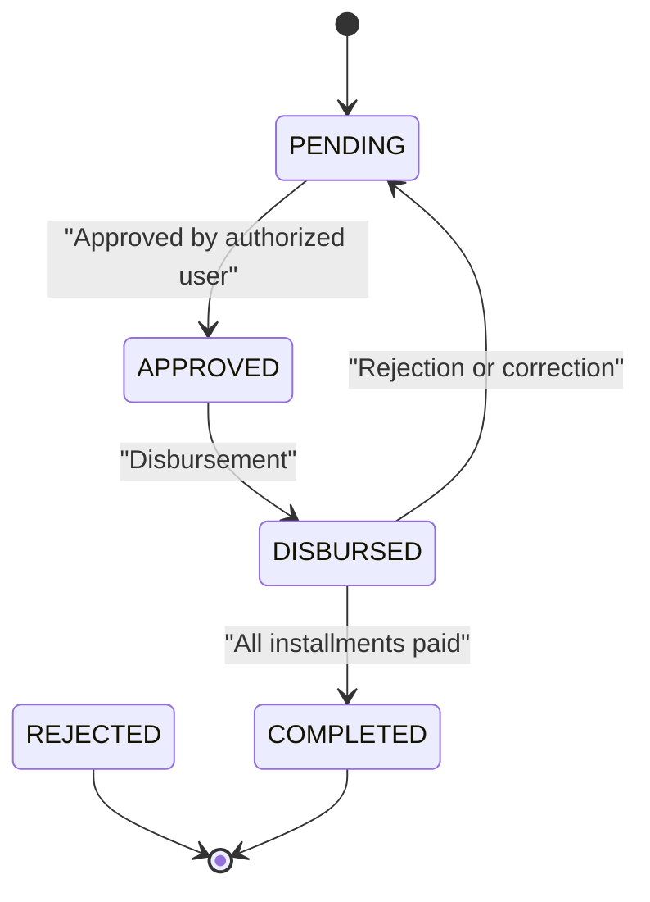
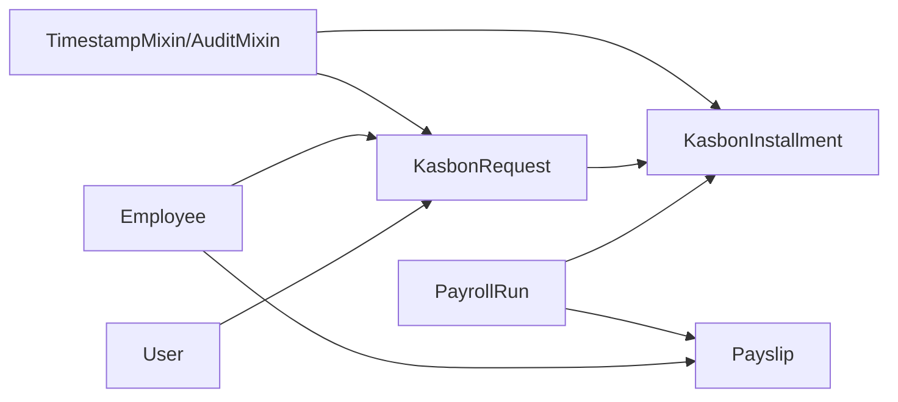

# Kasbon Management

<cite>
**Referenced Files in This Document**
- [kasbon.py](file://app/models/kasbon.py)
- [employee.py](file://app/models/employee.py)
- [payroll.py](file://app/models/payroll.py)
- [auth.py](file://app/models/auth.py)
- [base.py](file://app/models/base.py)
- [models/__init__.py](file://app/models/__init__.py)
- [seed_data.py](file://app/seed/seed_data.py)
</cite>

## Table of Contents
1. [Introduction](#introduction)
2. [Project Structure](#project-structure)
3. [Core Components](#core-components)
4. [Architecture Overview](#architecture-overview)
5. [Detailed Component Analysis](#detailed-component-analysis)
6. [Dependency Analysis](#dependency-analysis)
7. [Performance Considerations](#performance-considerations)
8. [Troubleshooting Guide](#troubleshooting-guide)
9. [Conclusion](#conclusion)
10. [Appendices](#appendices)

## Introduction
This document explains the kasbon (employee advance/loan) management system within the Payroll & HRIS platform. It covers request processing, installment management, employee advance tracking, repayment schedules, approval workflows, installment calculation methods, and integration with payroll processing and employee account management. It also outlines kasbon policies and financial controls embedded in the data model and permissions.

## Project Structure
The kasbon module is implemented as part of the centralized models package and integrates with payroll, employee, and authorization models. The models are organized by domain and exposed via a central package initializer.

**Diagram sources**
- [kasbon.py:18-77](file://app/models/kasbon.py#L18-L77)
- [employee.py:76-132](file://app/models/employee.py#L76-L132)
- [payroll.py:19-124](file://app/models/payroll.py#L19-L124)
- [auth.py:110-133](file://app/models/auth.py#L110-L133)

**Section sources**
- [models/__init__.py:26-33](file://app/models/__init__.py#L26-L33)
- [kasbon.py:1-78](file://app/models/kasbon.py#L1-L78)

## Core Components
- KasbonRequest: Captures employee advance requests, including principal amount, purpose, request date, approvals, disbursement, number of installments, and calculated installment amount. It tracks status and links to installments.
- KasbonInstallment: Defines the installment schedule with due dates, amounts, payment status, and linkage to a payroll run for deduction capture.
- Integration points:
  - Employee: Each kasbon request belongs to an employee.
  - User: Approval and audit trail via approver identity.
  - PayrollRun and Payslip: Installment payments are tracked against a payroll run; kasbon deductions are recorded on payslips.

Key constraints and indexes enforce policy and performance:
- Positive principal and number-of-installments checks.
- Status enumeration enforcement.
- Unique kasbon number and unique installment per request-number combination.
- Indexed lookups by employee and status for efficient filtering.

**Section sources**
- [kasbon.py:18-77](file://app/models/kasbon.py#L18-L77)
- [base.py:18-57](file://app/models/base.py#L18-L57)

## Architecture Overview
The kasbon lifecycle spans request creation, approval, disbursement, scheduled installments, and payroll-driven repayment. The figure below maps the end-to-end flow across models.

**Diagram sources**
- [kasbon.py:18-77](file://app/models/kasbon.py#L18-L77)
- [payroll.py:64-94](file://app/models/payroll.py#L64-L94)

## Detailed Component Analysis

### Data Model: KasbonRequest and KasbonInstallment
The kasbon data model defines two core entities with strong constraints and relationships.

**Diagram sources**
- [kasbon.py:18-77](file://app/models/kasbon.py#L18-L77)
- [employee.py:76-132](file://app/models/employee.py#L76-L132)
- [auth.py:110-133](file://app/models/auth.py#L110-L133)
- [payroll.py:19-61](file://app/models/payroll.py#L19-L61)

**Section sources**
- [kasbon.py:18-77](file://app/models/kasbon.py#L18-L77)

### Installment Calculation Methods
Installment amount is computed at request level and stored for consistency. The model enforces:
- Principal amount > 0
- Number of installments > 0
- Status must be one of PENDING, APPROVED, DISBURSED, COMPLETED, REJECTED

Constraints ensure that installment planning is validated at persistence time.

**Diagram sources**
- [kasbon.py:40-55](file://app/models/kasbon.py#L40-L55)
- [payroll.py:81-82](file://app/models/payroll.py#L81-L82)

**Section sources**
- [kasbon.py:40-55](file://app/models/kasbon.py#L40-L55)
- [payroll.py:81-82](file://app/models/payroll.py#L81-L82)

### Repayment Tracking and Payroll Integration
- Installment tracking: Each installment stores due date, amount, and payment status. Paid installments record paid_date and link to a payroll run.
- Payroll integration: Payroll runs process payslips; each payslip includes a kasbon deduction field. Installments are associated with a payroll run to reflect when deductions occurred.
- Completion: The request transitions to COMPLETED when all installments are marked paid.

**Diagram sources**
- [payroll.py:64-94](file://app/models/payroll.py#L64-L94)
- [kasbon.py:58-77](file://app/models/kasbon.py#L58-L77)

**Section sources**
- [payroll.py:64-94](file://app/models/payroll.py#L64-L94)
- [kasbon.py:58-77](file://app/models/kasbon.py#L58-L77)

### Application Workflow and Approval Processes
- Submission: Employee submits a request with principal, purpose, and number of installments.
- Approval: Authorized user approves the request; approval date and approver are recorded.
- Disbursement: After approval, the advance is disbursed; disbursement date is set.
- Installment planning: Installments are generated with equal amounts and due dates aligned to payroll periods.
- Repayment: Each payroll period deducts the installment from the employee’s payslip; installments are marked paid upon successful deduction.

**Diagram sources**
- [kasbon.py:33-35](file://app/models/kasbon.py#L33-L35)
- [kasbon.py:50-51](file://app/models/kasbon.py#L50-L51)

**Section sources**
- [kasbon.py:33-35](file://app/models/kasbon.py#L33-L35)
- [kasbon.py:50-51](file://app/models/kasbon.py#L50-L51)

### Policies and Financial Controls
- Data integrity:
  - Principal and number of installments must be positive.
  - Status constrained to predefined values.
  - Unique identifiers for kasbon number and installment per request.
- Access control:
  - KASBON permissions are defined and mapped to roles (e.g., READ, CREATE, UPDATE, DELETE, APPROVE).
  - Roles include Payroll Master and Operator with explicit KASBON.* permissions.
- Audit and traceability:
  - Timestamps and audit mixins are inherited from the base model.
  - Approved_by and created_by/updated_by fields support audit trails.

**Section sources**
- [kasbon.py:40-55](file://app/models/kasbon.py#L40-L55)
- [seed_data.py:115-139](file://app/seed/seed_data.py#L115-L139)
- [seed_data.py:166-191](file://app/seed/seed_data.py#L166-L191)
- [base.py:23-57](file://app/models/base.py#L23-L57)

## Dependency Analysis
The kasbon module depends on shared base mixins and integrates with employee, user, payroll, and payslip models. The package initializer exposes kasbon models alongside others.

**Diagram sources**
- [base.py:18-57](file://app/models/base.py#L18-L57)
- [kasbon.py:18-77](file://app/models/kasbon.py#L18-L77)
- [employee.py:76-132](file://app/models/employee.py#L76-L132)
- [payroll.py:19-124](file://app/models/payroll.py#L19-L124)
- [auth.py:110-133](file://app/models/auth.py#L110-L133)

**Section sources**
- [models/__init__.py:26-33](file://app/models/__init__.py#L26-L33)

## Performance Considerations
- Indexes:
  - Employee and status indexing on kasbon_requests accelerates filtering by employee and status.
  - Unique constraints prevent duplicate installments per request-number pair.
- Data types:
  - Numeric precision ensures accurate financial calculations.
- Payroll alignment:
  - Linking installments to payroll runs avoids recalculating deduction schedules and streamlines reconciliation.

[No sources needed since this section provides general guidance]

## Troubleshooting Guide
Common issues and resolutions:
- Validation failures on principal or installments:
  - Ensure principal > 0 and number_of_installments > 0 before saving.
- Status transitions:
  - Verify that status follows the allowed set and transitions occur in the correct order.
- Duplicate installments:
  - Unique constraint prevents duplicate installment numbers per request; resolve duplicates by correcting numbering or request data.
- Payroll mismatch:
  - Confirm that unpaid installments align with payroll periods and that kasbon_deduction is reflected on payslips.

**Section sources**
- [kasbon.py:40-55](file://app/models/kasbon.py#L40-L55)
- [kasbon.py:72-77](file://app/models/kasbon.py#L72-L77)

## Conclusion
The kasbon module provides a robust foundation for managing employee advances with strong data integrity, clear approval workflows, and seamless payroll integration. Constraints and indexes ensure reliable processing, while access control and audit mixins support governance and traceability.

[No sources needed since this section summarizes without analyzing specific files]

## Appendices

### Example Scenarios

- Submit a kasbon request:
  - Create a request with principal, purpose, and number_of_installments.
  - Persist with status=PENDING.
  - Reference: [kasbon.py:24-35](file://app/models/kasbon.py#L24-L35)

- Approve a kasbon request:
  - Update status to APPROVED, set approval_date and approved_by.
  - Reference: [kasbon.py:33-35](file://app/models/kasbon.py#L33-L35)

- Disburse and plan installments:
  - Set disbursement_date and generate installments with due_date and amount.
  - Reference: [kasbon.py:29-32](file://app/models/kasbon.py#L29-L32), [kasbon.py:64-69](file://app/models/kasbon.py#L64-L69)

- Track repayment via payroll:
  - Link installments to a payroll run and mark as paid upon deduction.
  - Reference: [payroll.py:81-82](file://app/models/payroll.py#L81-L82), [kasbon.py:70](file://app/models/kasbon.py#L70)

- Access control:
  - Roles Payroll Master and Operator receive KASBON.* permissions.
  - Reference: [seed_data.py:166-191](file://app/seed/seed_data.py#L166-L191)