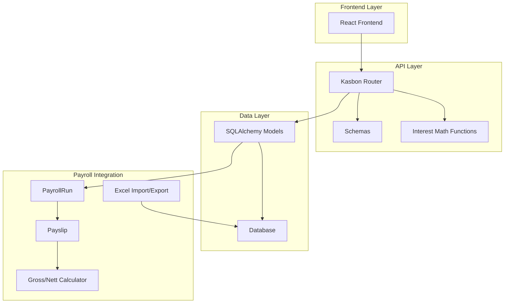
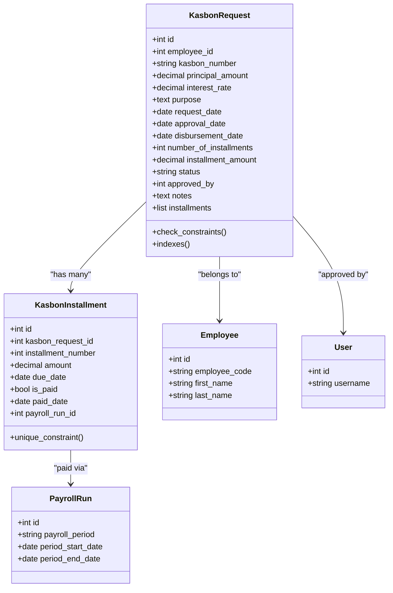
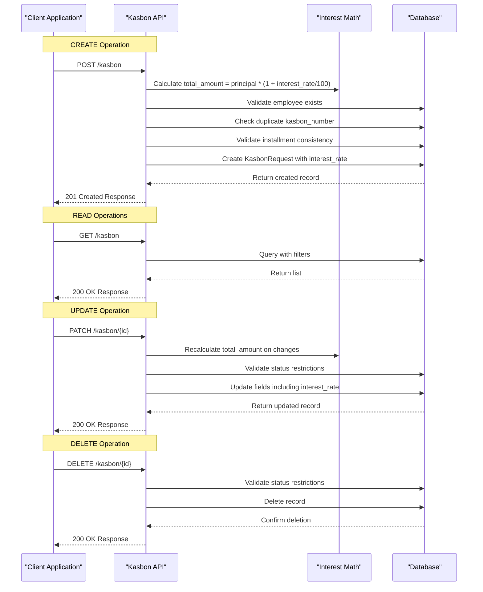
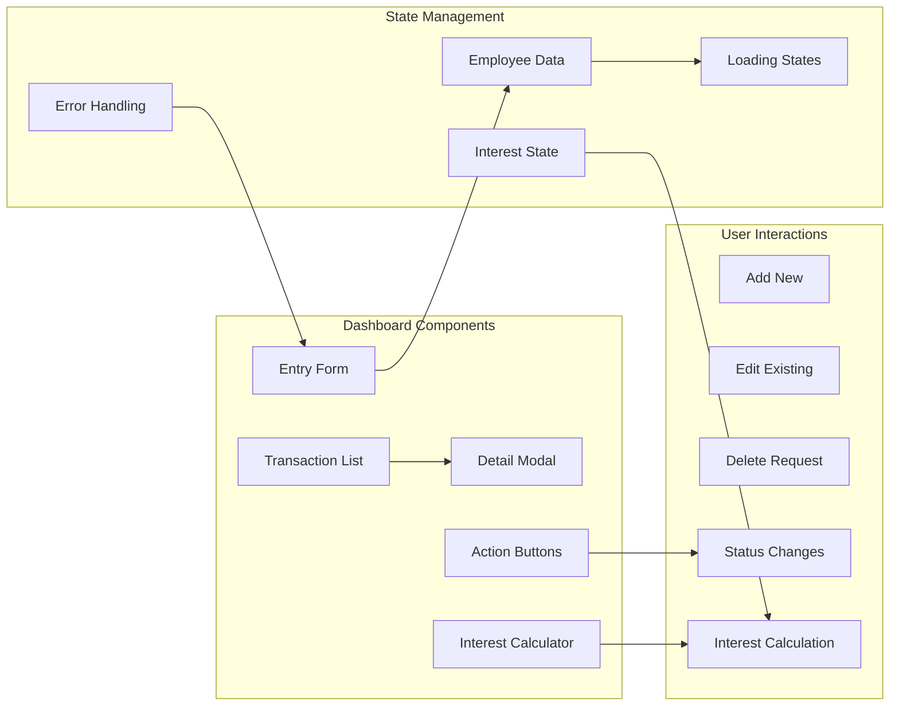
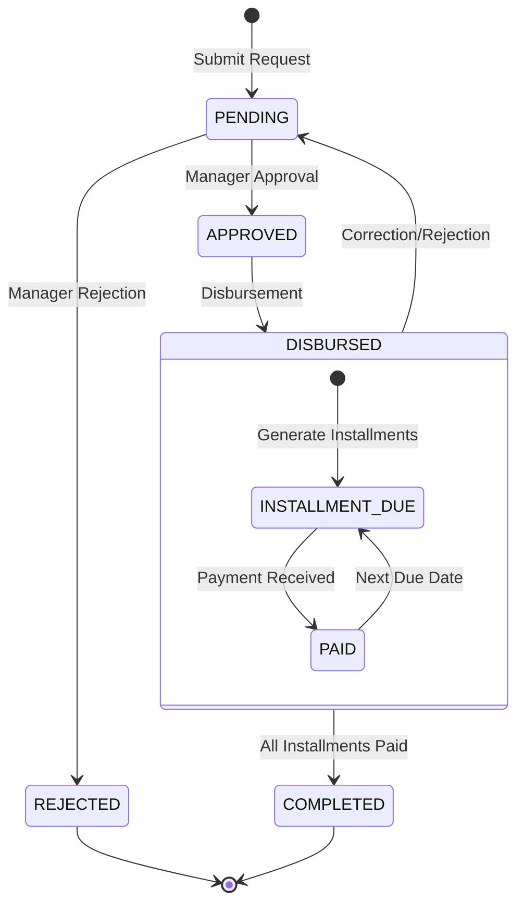
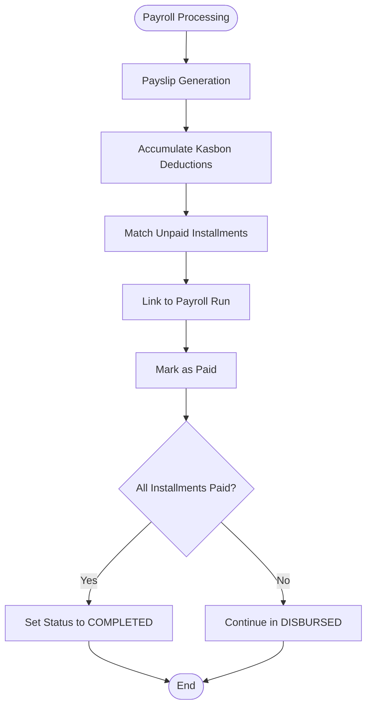

# Kasbon Management

<cite>
**Referenced Files in This Document**
- [kasbon.py](file://app/models/kasbon.py)
- [employee.py](file://app/models/employee.py)
- [payroll.py](file://app/models/payroll.py)
- [auth.py](file://app/models/auth.py)
- [base.py](file://app/models/base.py)
- [models/__init__.py](file://app/models/__init__.py)
- [kasbon.py](file://app/routers/kasbon.py)
- [kasbon.py](file://app/schemas/kasbon.py)
- [page.tsx](file://frontend/src/app/(dashboard)/kasbon/page.tsx)
- [gross_nett.py](file://app/calculations/gross_nett.py)
- [main.py](file://app/main.py)
- [007_kasbon_interest_rate.sql](file://migrations/007_kasbon_interest_rate.sql)
- [excel_export_service.py](file://app/services/excel_export_service.py)
- [excel_import_service.py](file://app/services/excel_import_service.py)
</cite>

## Update Summary
**Changes Made**
- Enhanced financial mathematics implementation with interest calculation feature
- Added comprehensive interest_rate column to database schema
- Updated installment calculation methods to include interest in total amount
- Modified frontend interfaces to display interest-based totals and monthly payments
- Enhanced Excel import/export functionality to support interest rate processing
- Updated API responses to include interest_amount and total_amount fields

## Table of Contents
1. [Introduction](#introduction)
2. [System Architecture](#system-architecture)
3. [Core Data Models](#core-data-models)
4. [API Endpoints](#api-endpoints)
5. [Frontend Implementation](#frontend-implementation)
6. [Business Workflows](#business-workflows)
7. [Financial Controls](#financial-controls)
8. [Payroll Integration](#payroll-integration)
9. [Interest Calculation Mathematics](#interest-calculation-mathematics)
10. [Excel Integration](#excel-integration)
11. [Installation and Setup](#installation-and-setup)
12. [Troubleshooting Guide](#troubleshooting-guide)
13. [Best Practices](#best-practices)
14. [Conclusion](#conclusion)

## Introduction
The Kasbon Management System is a comprehensive employee loan and cash advance management solution integrated into the Payroll & HRIS platform. This system provides end-to-end management of employee advances including request processing, approval workflows, installment scheduling, payment tracking, and seamless payroll integration. The system supports five distinct status states (PENDING, APPROVED, DISBURSED, COMPLETED, REJECTED) with automatic due date calculation and detailed payment tracking capabilities.

**Updated** Enhanced with sophisticated interest calculation feature that computes compound interest on employee advances, providing accurate total repayment amounts and detailed financial breakdowns.

## System Architecture
The kasbon system follows a modular architecture with clear separation between data models, API endpoints, frontend interfaces, and payroll integration layers.



**Diagram sources**
- [kasbon.py:1-397](file://app/routers/kasbon.py#L1-L397)
- [kasbon.py:1-81](file://app/models/kasbon.py#L1-L81)
- [payroll.py:19-197](file://app/models/payroll.py#L19-L197)
- [page.tsx](file://frontend/src/app/(dashboard)/kasbon/page.tsx#L1-L696)

## Core Data Models

### KasbonRequest Model
The primary model representing employee loan/advance requests with comprehensive validation and constraints including new interest calculation capabilities.



**Diagram sources**
- [kasbon.py:20-81](file://app/models/kasbon.py#L20-L81)
- [employee.py:76-132](file://app/models/employee.py#L76-L132)
- [auth.py:110-133](file://app/models/auth.py#L110-L133)
- [payroll.py:19-197](file://app/models/payroll.py#L19-L197)

**Key Features:**
- **Unique Identification**: Each request has a unique kasbon_number
- **Interest Rate Support**: New interest_rate column with NUMERIC(5,2) precision
- **Status Tracking**: Complete lifecycle management (PENDING, APPROVED, DISBURSED, COMPLETED, REJECTED)
- **Financial Validation**: Business rule enforcement for positive amounts and installments
- **Audit Trail**: Comprehensive timestamp and user attribution
- **Relationship Management**: Strong associations with employees and users

### Installment Management
Automated installment generation with intelligent due date calculation and interest-based amount computation.

**Section sources**
- [kasbon.py:20-81](file://app/models/kasbon.py#L20-L81)

## API Endpoints

### CRUD Operations
The system provides comprehensive CRUD operations for kasbon management with enhanced interest calculation support.



**Diagram sources**
- [kasbon.py:161-397](file://app/routers/kasbon.py#L161-L397)

### Status Management
Advanced status transition handling with business rule validation and interest calculation updates.

**Section sources**
- [kasbon.py:283-366](file://app/routers/kasbon.py#L283-L366)

## Frontend Implementation

### React Dashboard Interface
The frontend provides a comprehensive management interface with real-time updates, intuitive workflows, and enhanced interest calculation visualization.



**Diagram sources**
- [page.tsx](file://frontend/src/app/(dashboard)/kasbon/page.tsx#L1-L696)

**Key Features:**
- **Real-time Data**: Automatic refresh and synchronization
- **Smart Interest Calculation**: Real-time interest amount computation
- **Enhanced Visualizations**: Color-coded interest displays and total amounts
- **Responsive Design**: Mobile-friendly interface with interest metrics
- **Form Validation**: Client-side validation with interest-aware calculations
- **Interest Metrics**: Separate display of interest amount and total payable

**Section sources**
- [page.tsx](file://frontend/src/app/(dashboard)/kasbon/page.tsx#L1-L696)

## Business Workflows

### Complete Lifecycle Management
The system manages the complete lifecycle from request submission to final settlement with enhanced interest calculation throughout the process.



**Workflow Details:**
- **Submission**: Employees submit requests with principal amount, interest rate, and tenor
- **Approval**: Authorized users review and approve requests with interest details
- **Disbursement**: Approved advances are processed with interest included in total amount
- **Installment Generation**: Automatic installment schedule creation with interest-based amounts
- **Repayment**: Regular payroll deductions until full settlement including interest

**Section sources**
- [kasbon.py:283-366](file://app/routers/kasbon.py#L283-L366)

## Financial Controls

### Data Integrity and Validation
Comprehensive validation ensures data accuracy and business rule compliance with enhanced interest calculation support.

**Validation Rules:**
- **Principal Amount**: Must be greater than zero
- **Interest Rate**: Must be non-negative (supports up to 99.99%)
- **Installment Count**: Must be greater than zero
- **Status Values**: Restricted to predefined enumeration
- **Unique Identifiers**: Prevents duplicate entries
- **Business Logic**: Installment amount consistency validation with interest

### Access Control Framework
Role-based permissions ensure proper authorization for all operations.

**Permission Structure:**
- **KASBON.CREATE**: Create new requests
- **KASBON.READ**: View requests and details
- **KASBON.UPDATE**: Modify existing requests
- **KASBON.DELETE**: Remove requests
- **KASBON.APPROVE**: Approve/reject requests

**Section sources**
- [kasbon.py:43-58](file://app/models/kasbon.py#L43-L58)
- [kasbon.py:24-25](file://app/routers/kasbon.py#L24-L25)

## Payroll Integration

### Automatic Deduction Processing
Seamless integration with payroll processing enables automatic kasbon deductions with interest inclusion.



**Diagram sources**
- [payroll.py:64-94](file://app/models/payroll.py#L64-L94)
- [gross_nett.py:5-64](file://app/calculations/gross_nett.py#L5-L64)

### Deduction Calculation
Automatic integration with gross-to-net calculation process, including interest-based installment amounts.

**Section sources**
- [payroll.py:64-94](file://app/models/payroll.py#L64-L94)
- [gross_nett.py:5-64](file://app/calculations/gross_nett.py#L5-L64)

## Interest Calculation Mathematics

### Financial Formula Implementation
The system implements sophisticated interest calculation mathematics for accurate loan amortization.

```mermaid
flowchart TD
Principal[Principal Amount] --> Rate[Interest Rate %]
Rate --> Calc1[Calculate Interest = Principal × (Rate/100)]
Calc1 --> Total[Total Amount = Principal + Interest]
Total --> Installments[Divide by Number of Installments]
Installments --> Monthly[Monthly Installment Amount]
Monthly --> Round[Round to Nearest Cent]
Round --> Store[Store in Database]
```

**Mathematical Implementation:**
- **Interest Calculation**: `interest_amount = principal_amount × (interest_rate / 100)`
- **Total Amount**: `total_amount = principal_amount × (1 + interest_rate / 100)`
- **Monthly Installment**: `monthly_amount = total_amount / number_of_installments`
- **Precision**: Uses Decimal arithmetic with 2-decimal precision

**Section sources**
- [kasbon.py:27-46](file://app/routers/kasbon.py#L27-L46)

## Excel Integration

### Data Import/Export Capabilities
Enhanced Excel integration supports comprehensive interest calculation data processing.

**Import Features:**
- **Interest Rate Processing**: Supports decimal interest rates (e.g., 5.5 for 5.5%)
- **Total Amount Calculation**: Automatically calculates total from principal and interest
- **Installment Amount Computation**: Computes monthly installments based on total and tenor
- **Validation**: Ensures interest rates are non-negative numbers

**Export Features:**
- **Interest Metrics**: Includes interest_rate, interest_amount, and total_amount columns
- **Formatted Output**: Currency formatting for interest amounts
- **Template Support**: Provides template with interest calculation examples

**Section sources**
- [excel_export_service.py:640-682](file://app/services/excel_export_service.py#L640-L682)
- [excel_import_service.py:748-792](file://app/services/excel_import_service.py#L748-L792)

## Installation and Setup

### Backend Dependencies
The system requires minimal setup with existing framework integration and enhanced database schema.

**Required Components:**
- SQLAlchemy ORM for database operations
- FastAPI for RESTful API endpoints
- Pydantic for data validation
- React for frontend interface
- Database migration support for interest_rate column

### Database Schema
Automatic schema generation with proper constraints and indexes including new interest calculation support.

**Database Features:**
- **Constraints**: Business rule enforcement at database level
- **Indexes**: Performance optimization for common queries
- **Relationships**: Foreign key constraints for referential integrity
- **Timestamps**: Automatic audit trail creation
- **Interest Column**: NUMERIC(5,2) column for precise interest rate storage

**Migration Support:**
- **Existing Records**: Default interest_rate set to 0.00%
- **Backward Compatibility**: Maintains existing functionality
- **Data Type Precision**: Supports up to 99.99% interest rates

**Section sources**
- [main.py:24-64](file://app/main.py#L24-L64)
- [models/__init__.py:33-34](file://app/models/__init__.py#L33-L34)
- [007_kasbon_interest_rate.sql:1-4](file://migrations/007_kasbon_interest_rate.sql#L1-L4)

## Troubleshooting Guide

### Common Issues and Solutions

**Data Validation Errors:**
- **Principal Amount Invalid**: Ensure amount is greater than zero
- **Interest Rate Invalid**: Verify interest_rate is non-negative (supports up to 99.99%)
- **Installment Count Invalid**: Verify number_of_installments > 0
- **Status Transition Errors**: Check allowed state transitions only

**API Integration Issues:**
- **Employee Not Found**: Verify employee_id exists in system
- **Duplicate Kasbon Number**: Use unique kasbon_number values
- **Installment Mismatch**: Ensure calculated amount equals expected value with interest
- **Interest Calculation Errors**: Verify interest_rate precision and mathematical operations

**Payroll Integration Problems:**
- **Installment Not Matching**: Verify unpaid installments align with payroll periods
- **Deduction Not Applied**: Check kasbon_deduction field on payslips
- **Status Not Updating**: Confirm payroll run linkage and payment processing
- **Interest Not Reflected**: Ensure interest-based installment amounts are used

**Frontend Issues:**
- **Form Validation Errors**: Check client-side validation messages
- **Interest Calculation Not Updating**: Verify real-time interest computation
- **Data Not Loading**: Verify API endpoint accessibility
- **Status Updates Not Reflecting**: Ensure proper state management

**Excel Integration Issues:**
- **Import Errors**: Check interest_rate formatting and validation rules
- **Template Issues**: Verify template column alignment and data types
- **Export Problems**: Ensure interest metrics are properly formatted

**Section sources**
- [kasbon.py:167-210](file://app/routers/kasbon.py#L167-L210)
- [kasbon.py:218-280](file://app/routers/kasbon.py#L218-L280)

## Best Practices

### Implementation Guidelines
Follow these best practices for optimal system performance and user experience with enhanced interest calculation.

**Data Management:**
- **Consistent Numbering**: Use structured kasbon_number formats
- **Proper Validation**: Implement both client and server-side validation with interest awareness
- **Audit Logging**: Maintain comprehensive activity logs including interest calculations
- **Error Handling**: Provide meaningful error messages to users with interest context

**Workflow Optimization:**
- **Approval Efficiency**: Streamline approval processes with interest transparency
- **Payment Tracking**: Monitor installment payments closely with interest components
- **Reporting**: Generate regular status reports with interest metrics
- **Reconciliation**: Match kasbon balances with payroll records including interest

**Security Considerations:**
- **Access Control**: Implement role-based permissions
- **Data Validation**: Sanitize all user inputs including interest rates
- **Audit Trails**: Track all system modifications with interest calculations
- **Error Handling**: Avoid exposing sensitive information in errors

**Interest Management:**
- **Rate Precision**: Use appropriate interest rate precision (up to 2 decimal places)
- **Calculation Accuracy**: Implement proper rounding for monetary calculations
- **Display Consistency**: Ensure interest amounts are consistently formatted across UI
- **Data Migration**: Handle existing records with default interest_rate values

## Conclusion
The Kasbon Management System provides a comprehensive, enterprise-grade solution for employee loan and cash advance management with sophisticated interest calculation capabilities. With its robust data model, strict financial controls, seamless payroll integration, and comprehensive audit capabilities, the system delivers reliable tracking and management of employee advances throughout their complete lifecycle.

**Updated** The enhanced system now includes advanced interest calculation mathematics, comprehensive Excel integration with interest metrics, and sophisticated frontend interfaces that clearly display interest-based totals and monthly payments. The implementation demonstrates best practices in financial system design, including proper validation, clear approval workflows, automated installment calculation with interest, and seamless integration with existing payroll infrastructure.

Key strengths include comprehensive CRUD operations, intelligent status management, automatic due date calculation, detailed payment tracking, seamless payroll integration, and sophisticated interest computation. The system supports five distinct status states with clear business rule enforcement, provides extensive audit capabilities for compliance and reconciliation purposes, and maintains backward compatibility while adding powerful new financial mathematics features.

The addition of interest calculation capability transforms the system from a simple advance management tool to a comprehensive financial service that accurately reflects the true cost of employee borrowing, enabling better financial planning and transparent reporting for both employees and management.