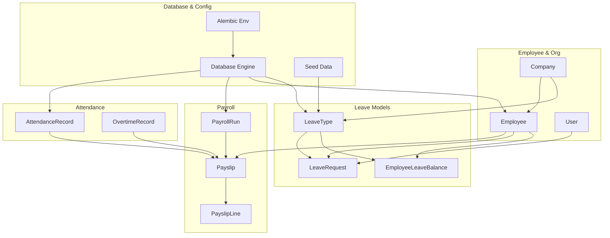
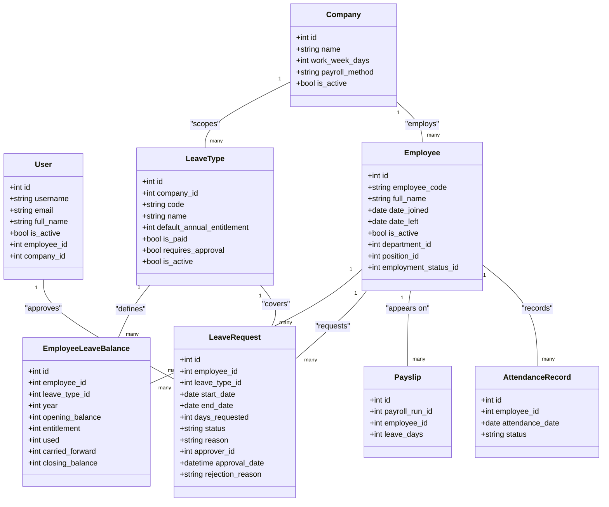
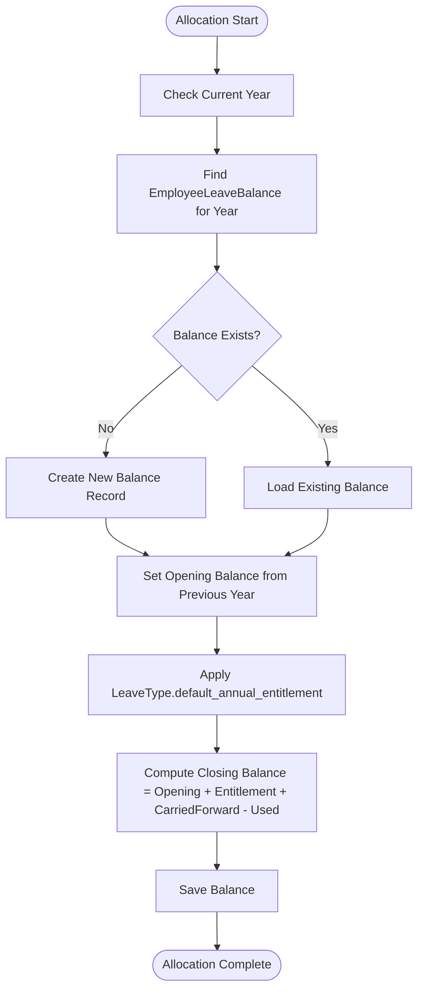
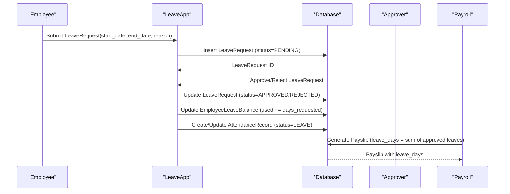
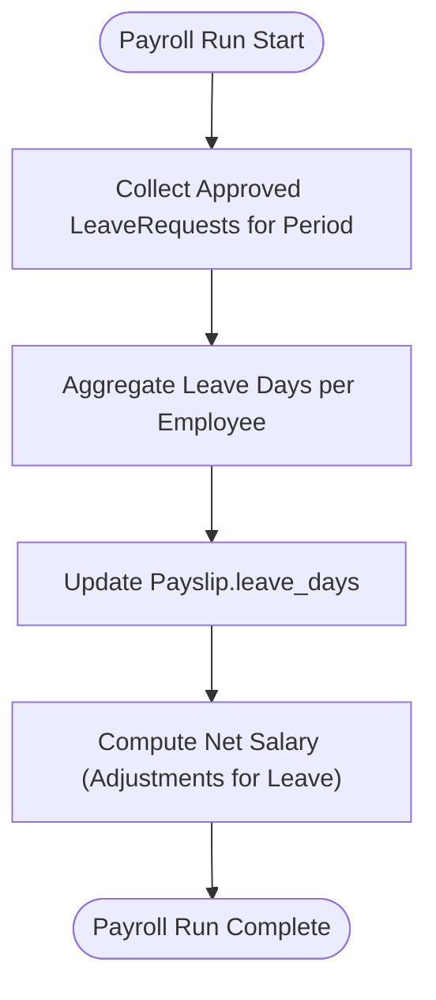
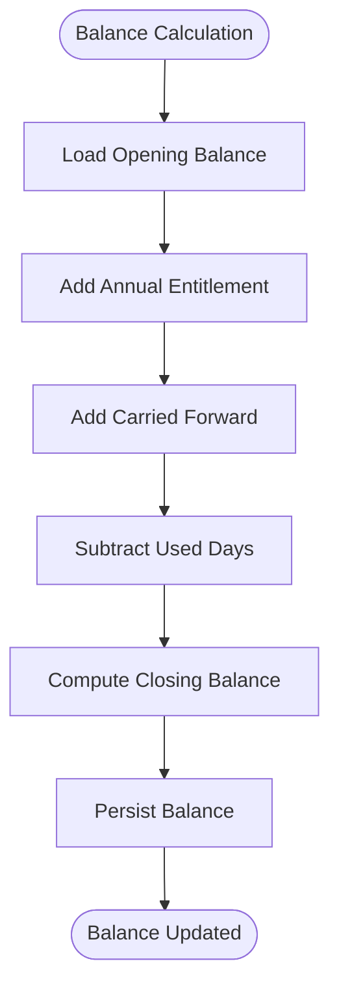
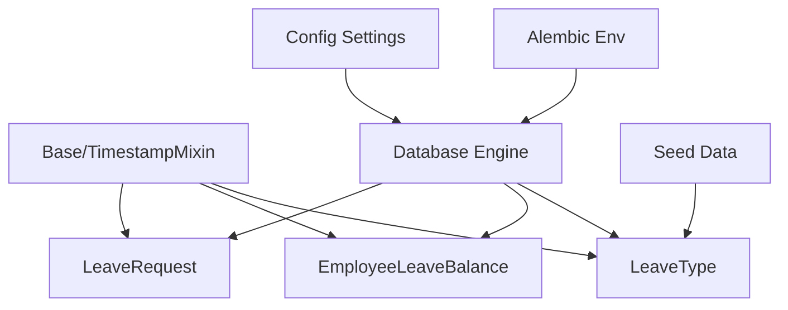

# Leave Management

<cite>
**Referenced Files in This Document**
- [leave.py](file://app/models/leave.py)
- [employee.py](file://app/models/employee.py)
- [payroll.py](file://app/models/payroll.py)
- [attendance.py](file://app/models/attendance.py)
- [auth.py](file://app/models/auth.py)
- [seed_data.py](file://app/seed/seed_data.py)
- [database.py](file://app/database.py)
- [env.py](file://alembic/env.py)
- [base.py](file://app/models/base.py)
- [integration.py](file://app/models/integration.py)
- [requirements.txt](file://requirements.txt)
- [config.py](file://app/config.py)
</cite>

## Table of Contents
1. [Introduction](#introduction)
2. [Project Structure](#project-structure)
3. [Core Components](#core-components)
4. [Architecture Overview](#architecture-overview)
5. [Detailed Component Analysis](#detailed-component-analysis)
6. [Dependency Analysis](#dependency-analysis)
7. [Performance Considerations](#performance-considerations)
8. [Troubleshooting Guide](#troubleshooting-guide)
9. [Conclusion](#conclusion)
10. [Appendices](#appendices)

## Introduction
This document provides comprehensive documentation for the leave management system within the Payroll & HRIS platform. It explains leave types, leave balance management, leave request processing, leave policies, and the impact on payroll. It also covers the leave allocation system, request workflows, approval processes, and leave balance calculations. Concrete examples illustrate leave type configuration, leave request submission, approval workflows, and leave balance tracking. Integration points with attendance records, payroll processing, and employee lifecycle management are addressed, along with regulatory compliance considerations for Indonesian labor law.

## Project Structure
The leave management system is implemented as part of the broader Payroll & HRIS system. The relevant components include:
- Leave-related models: LeaveType, EmployeeLeaveBalance, and LeaveRequest
- Supporting models: Employee, Company, and User for organizational context
- Payroll integration: Payslip includes leave_days field for tracking leaves taken during a payroll period
- Attendance integration: AttendanceRecord supports LEAVE status for daily attendance
- Database configuration and migrations: SQLAlchemy Base, Alembic environment, and seed data
- Configuration: Environment variables and settings for database connectivity

**Diagram sources**
- [leave.py:19-97](file://app/models/leave.py#L19-L97)
- [employee.py:76-132](file://app/models/employee.py#L76-L132)
- [payroll.py:19-124](file://app/models/payroll.py#L19-L124)
- [attendance.py:56-134](file://app/models/attendance.py#L56-L134)
- [auth.py:22-133](file://app/models/auth.py#L22-L133)
- [database.py:17-63](file://app/database.py#L17-L63)
- [env.py:14-80](file://alembic/env.py#L14-L80)
- [seed_data.py:376-410](file://app/seed/seed_data.py#L376-L410)

**Section sources**
- [leave.py:1-97](file://app/models/leave.py#L1-L97)
- [employee.py:1-132](file://app/models/employee.py#L1-L132)
- [payroll.py:1-124](file://app/models/payroll.py#L1-L124)
- [attendance.py:1-134](file://app/models/attendance.py#L1-L134)
- [auth.py:1-133](file://app/models/auth.py#L1-L133)
- [database.py:1-63](file://app/database.py#L1-L63)
- [env.py:1-80](file://alembic/env.py#L1-L80)
- [seed_data.py:1-448](file://app/seed/seed_data.py#L1-L448)

## Core Components
This section documents the core components of the leave management system and their responsibilities.

- LeaveType
  - Defines available leave categories (e.g., Annual, Sick, Maternity, Paternity, Personal, Unpaid)
  - Attributes include code, name, default annual entitlement, paid/unpaid status, approval requirement, and activation flag
  - Provides relationships to balances and requests

- EmployeeLeaveBalance
  - Tracks annual leave balances per employee and leave type by calendar year
  - Fields include opening balance, entitlement, used days, carried forward, and closing balance
  - Enforces uniqueness per employee, leave type, and year

- LeaveRequest
  - Captures employee leave submissions with dates, duration, status, reason, and approval metadata
  - Status values are constrained to PENDING, APPROVED, REJECTED, CANCELLED
  - Includes date range and positive days constraint

- Employee
  - Contains employee master data including personal details, employment status, and department/position associations
  - Supports lifecycle events such as joining and leaving dates

- Company
  - Stores company-level settings including work week days and payroll method
  - Used to scope leave types and configurations

- User
  - System user account with roles and permissions
  - Approver_id in LeaveRequest references User for approvals

- Payslip
  - Payroll output record includes leave_days field for tracking leaves taken during the payroll period
  - Integrates with attendance and leave data for accurate compensation computation

- AttendanceRecord
  - Daily attendance tracking with status including LEAVE
  - Supports integration with leave requests and attendance-based calculations

**Section sources**
- [leave.py:19-97](file://app/models/leave.py#L19-L97)
- [employee.py:76-132](file://app/models/employee.py#L76-L132)
- [auth.py:22-133](file://app/models/auth.py#L22-L133)
- [payroll.py:64-102](file://app/models/payroll.py#L64-L102)
- [attendance.py:56-80](file://app/models/attendance.py#L56-L80)

## Architecture Overview
The leave management system follows a relational database architecture with SQLAlchemy ORM models. The system integrates with:
- Attendance records to mark LEAVE status
- Payroll processing to reflect leave days in payslips
- Employee lifecycle data for eligibility and accrual
- Company scoping for leave type definitions
- User roles for approvals

**Diagram sources**
- [leave.py:19-97](file://app/models/leave.py#L19-L97)
- [employee.py:76-132](file://app/models/employee.py#L76-L132)
- [auth.py:22-133](file://app/models/auth.py#L22-L133)
- [payroll.py:64-102](file://app/models/payroll.py#L64-L102)
- [attendance.py:56-80](file://app/models/attendance.py#L56-L80)

## Detailed Component Analysis

### Leave Types Configuration
Leave types are company-scoped and define entitlements and policy attributes. The seed script initializes default leave types aligned with Indonesian labor regulations and common corporate policies.

Key characteristics:
- Codes: ANNUAL, SICK, MATERNITY, PATERNITY, PERSONAL, UNPAID
- Default annual entitlements: 12 days (Annual), 14 days (Sick), 90 days (Maternity), 2 days (Paternity), 3 days (Personal), 0 days (Unpaid)
- Paid vs unpaid: Determined by is_paid flag
- Approval requirement: requires_approval is enabled by default
- Activation: is_active flag controls availability

Example configuration entries are created during seeding with company association and default attributes.

**Section sources**
- [seed_data.py:376-410](file://app/seed/seed_data.py#L376-L410)
- [leave.py:24-32](file://app/models/leave.py#L24-L32)

### Leave Allocation System
Leave allocation is managed per employee and per leave type per calendar year. The allocation process involves:
- Entitlement calculation based on LeaveType.default_annual_entitlement
- Opening balance carry-forward from previous year (carried_forward)
- Closing balance computed as opening + entitlement + carried_forward - used
- Year boundary resets and rollover policies

Allocation flow:
1. Determine applicable LeaveType for the employee
2. Locate or create EmployeeLeaveBalance for the current year
3. Set opening_balance from prior year carried_forward
4. Apply default_annual_entitlement from LeaveType
5. Compute closing_balance and update used days upon leave approval

**Diagram sources**
- [leave.py:43-63](file://app/models/leave.py#L43-L63)
- [leave.py:29](file://app/models/leave.py#L29)

**Section sources**
- [leave.py:43-63](file://app/models/leave.py#L43-L63)

### Leave Request Processing
Leave requests capture employee intent, duration, and approval status. The workflow includes:
- Submission: Employee creates LeaveRequest with dates and reason
- Validation: Date range and positive days constraints enforced
- Approval: Authorized User updates status to APPROVED or REJECTED
- Impact: Approved leaves reduce EmployeeLeaveBalance.used and update AttendanceRecord.status to LEAVE

**Diagram sources**
- [leave.py:66-97](file://app/models/leave.py#L66-L97)
- [attendance.py:56-80](file://app/models/attendance.py#L56-L80)
- [payroll.py:64-102](file://app/models/payroll.py#L64-L102)

**Section sources**
- [leave.py:66-97](file://app/models/leave.py#L66-L97)
- [attendance.py:56-80](file://app/models/attendance.py#L56-L80)
- [payroll.py:64-102](file://app/models/payroll.py#L64-L102)

### Leave Policies and Regulatory Compliance
The system supports policy configuration through LeaveType attributes:
- requires_approval: Controls whether leave requires supervisor approval
- is_paid: Determines if leave impacts payroll (paid vs unpaid)
- default_annual_entitlement: Sets statutory or corporate entitlements

Regulatory alignment considerations:
- Maternity and Paternity leave entitlements are set to 90 and 2 days respectively, reflecting typical statutory provisions
- Sick leave entitlement aligns with common corporate policies
- Unpaid leave type supports zero-day entitlement for unpaid absences

**Section sources**
- [seed_data.py:376-410](file://app/seed/seed_data.py#L376-L410)
- [leave.py:29-32](file://app/models/leave.py#L29-L32)

### Leave Impact on Payroll
Leave days are tracked in Payslip.leave_days to influence net salary computation. During payroll processing:
- Approved leave days are aggregated per employee per payroll period
- Payroll logic uses leave_days to adjust gross and net amounts according to company policy
- AttendanceRecord.LEAVE status ensures daily absence is recorded consistently

**Diagram sources**
- [payroll.py:64-102](file://app/models/payroll.py#L64-L102)
- [leave.py:66-97](file://app/models/leave.py#L66-L97)

**Section sources**
- [payroll.py:64-102](file://app/models/payroll.py#L64-L102)

### Leave Balance Tracking
Leave balances are maintained per employee, per leave type, per year. The tracking mechanism:
- Ensures uniqueness per employee-type-year combination
- Computes closing balance based on opening, entitlement, carried forward, and used days
- Supports rollover policies by transferring unused days to the next year

**Diagram sources**
- [leave.py:43-63](file://app/models/leave.py#L43-L63)

**Section sources**
- [leave.py:43-63](file://app/models/leave.py#L43-L63)

### Integration with Attendance Records
Attendance integration ensures that approved leaves are reflected in daily attendance:
- AttendanceRecord.status includes LEAVE to mark absence as leave
- LeaveRequest approval triggers attendance updates for the leave period
- This integration supports reporting and compliance verification

**Section sources**
- [attendance.py:56-80](file://app/models/attendance.py#L56-L80)
- [leave.py:66-97](file://app/models/leave.py#L66-L97)

### Integration with Employee Lifecycle Management
Leave management interacts with employee lifecycle:
- Employees are created with join dates affecting accrual eligibility
- Employees who leave before year-end may settle balances according to company policy
- Employment status affects eligibility for certain leave types (e.g., Maternity/Paternity)

**Section sources**
- [employee.py:76-132](file://app/models/employee.py#L76-L132)

## Dependency Analysis
The leave management system depends on several foundational components:
- SQLAlchemy Base and TimestampMixin for ORM and auditing
- Alembic for database migrations
- Seed data for initial configuration
- Environment configuration for database URLs

**Diagram sources**
- [base.py:18-57](file://app/models/base.py#L18-L57)
- [leave.py:16-16](file://app/models/leave.py#L16-L16)
- [database.py:17-63](file://app/database.py#L17-L63)
- [env.py:14-26](file://alembic/env.py#L14-L26)
- [seed_data.py:376-410](file://app/seed/seed_data.py#L376-L410)
- [config.py:4-17](file://app/config.py#L4-L17)

**Section sources**
- [base.py:18-57](file://app/models/base.py#L18-L57)
- [database.py:17-63](file://app/database.py#L17-L63)
- [env.py:14-80](file://alembic/env.py#L14-L80)
- [seed_data.py:376-410](file://app/seed/seed_data.py#L376-L410)
- [config.py:4-17](file://app/config.py#L4-L17)

## Performance Considerations
- Database indexing: Unique constraints and indexes on frequently queried fields (e.g., employee_id, attendance_date, payroll_period) improve query performance
- Batch operations: Use bulk inserts/updates for leave allocations and attendance synchronization
- Caching: Consider caching active leave types and employee balances for high-frequency operations
- Concurrency: Use database transactions to prevent race conditions in balance updates
- Migrations: Alembic render_as_batch=True ensures SQLite compatibility for schema changes

[No sources needed since this section provides general guidance]

## Troubleshooting Guide
Common issues and resolutions:
- Constraint violations on LeaveRequest status or date range: Ensure status values are within allowed set and start_date does not exceed end_date
- Duplicate leave balances: Verify uniqueness constraint on employee_id, leave_type_id, and year
- Attendance LEAVE mismatch: Confirm LeaveRequest approval updates AttendanceRecord.status accordingly
- Payroll leave_days discrepancies: Validate that approved leaves are aggregated correctly per payroll period

**Section sources**
- [leave.py:83-96](file://app/models/leave.py#L83-L96)
- [attendance.py:72-80](file://app/models/attendance.py#L72-L80)

## Conclusion
The leave management system provides a robust foundation for managing leave types, allocations, requests, and approvals while integrating with attendance and payroll. Its design supports regulatory compliance, scalability, and maintainability through clear data models, constraints, and relationships. The seed data establishes baseline configurations aligned with Indonesian labor standards, and the architecture enables future enhancements for advanced leave policies and reporting.

## Appendices

### Example Scenarios

- Leave Type Configuration
  - Configure LeaveType with code, name, default annual entitlement, paid/unpaid flag, and approval requirement
  - Seed default leave types during initial deployment

- Leave Request Submission
  - Employee submits LeaveRequest with start_date, end_date, days_requested, and reason
  - System validates date range and positive days

- Approval Workflow
  - Authorized User approves or rejects LeaveRequest
  - On approval, EmployeeLeaveBalance.used increases and AttendanceRecord.status becomes LEAVE

- Leave Balance Tracking
  - EmployeeLeaveBalance computes closing balance per year using opening balance, entitlement, carried forward, and used days

- Payroll Impact
  - Payslip.leave_days reflects approved leaves for the payroll period
  - Payroll logic adjusts gross and net amounts based on leave_days

**Section sources**
- [seed_data.py:376-410](file://app/seed/seed_data.py#L376-L410)
- [leave.py:66-97](file://app/models/leave.py#L66-L97)
- [payroll.py:64-102](file://app/models/payroll.py#L64-L102)
- [attendance.py:56-80](file://app/models/attendance.py#L56-L80)