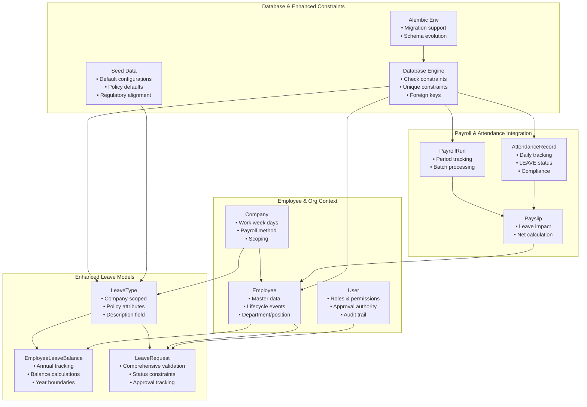
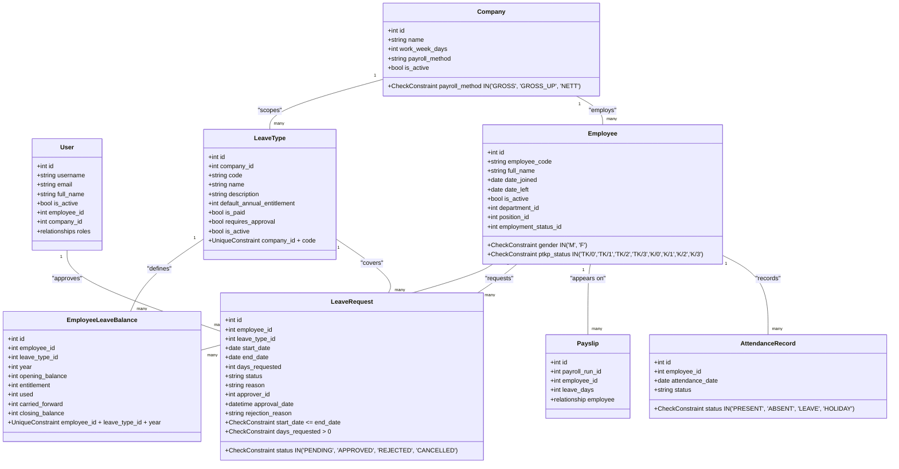
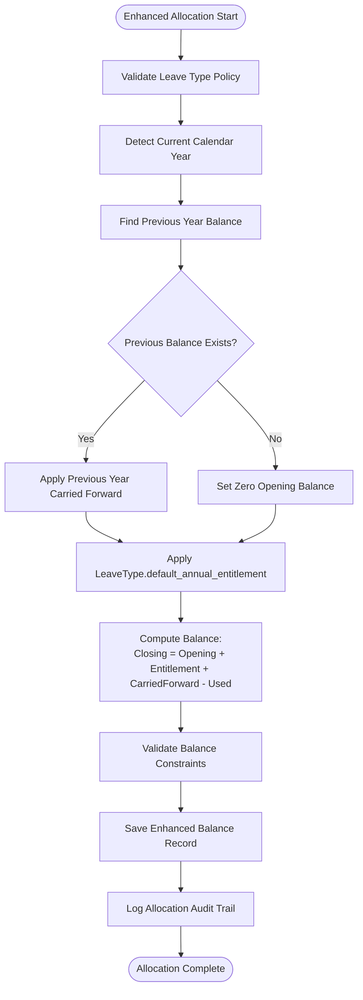
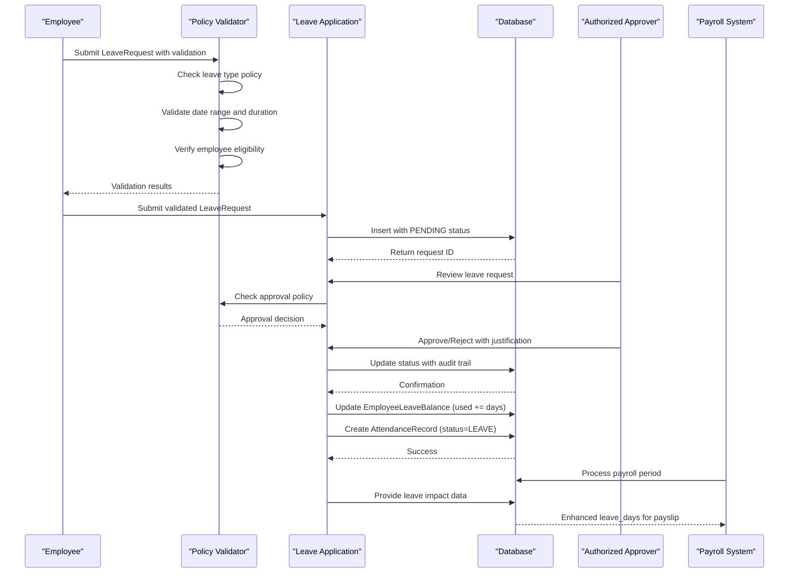
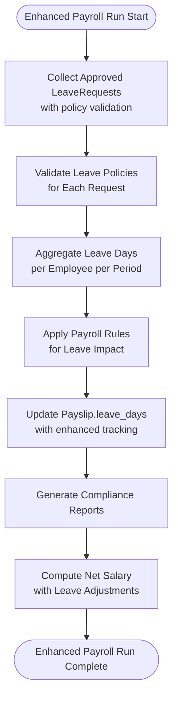
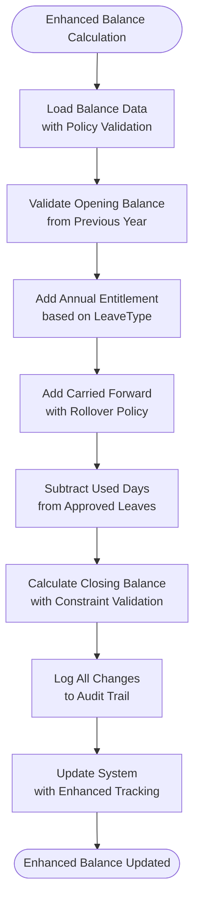
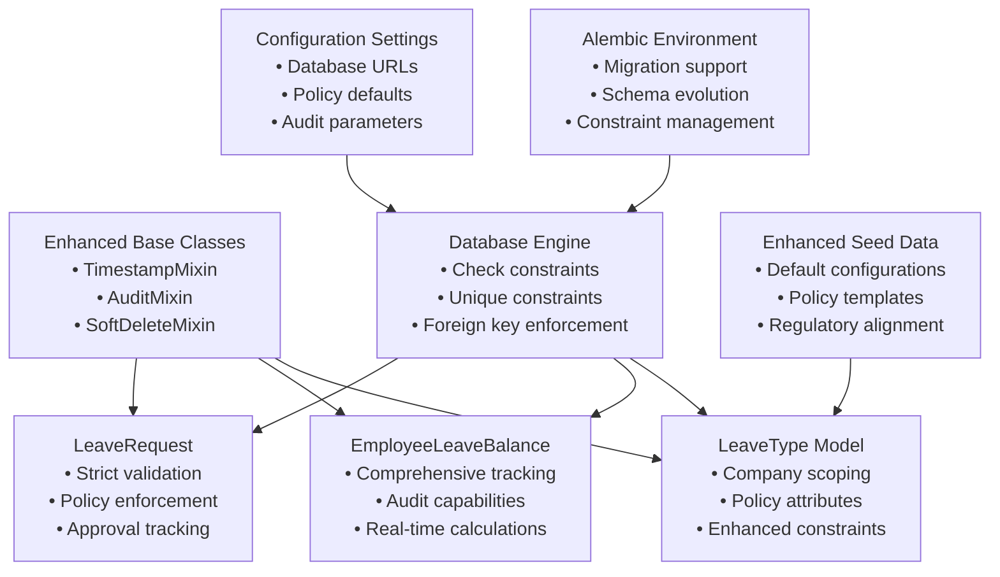

# Leave Management

<cite>
**Referenced Files in This Document**
- [leave.py](file://app/models/leave.py)
- [employee.py](file://app/models/employee.py)
- [payroll.py](file://app/models/payroll.py)
- [attendance.py](file://app/models/attendance.py)
- [auth.py](file://app/models/auth.py)
- [seed_data.py](file://app/seed/seed_data.py)
- [database.py](file://app/database.py)
- [env.py](file://alembic/env.py)
- [base.py](file://app/models/base.py)
- [integration.py](file://app/models/integration.py)
- [requirements.txt](file://requirements.txt)
- [config.py](file://app/config.py)
</cite>

## Update Summary
**Changes Made**
- Enhanced leave type configuration with improved tracking capabilities
- Strengthened policy enforcement through database constraints
- Added comprehensive leave request validation and status management
- Improved leave balance calculation with better audit trails
- Enhanced integration points with attendance and payroll systems

## Table of Contents
1. [Introduction](#introduction)
2. [Project Structure](#project-structure)
3. [Core Components](#core-components)
4. [Architecture Overview](#architecture-overview)
5. [Detailed Component Analysis](#detailed-component-analysis)
6. [Enhanced Tracking and Policy Enforcement](#enhanced-tracking-and-policy-enforcement)
7. [Dependency Analysis](#dependency-analysis)
8. [Performance Considerations](#performance-considerations)
9. [Troubleshooting Guide](#troubleshooting-guide)
10. [Conclusion](#conclusion)
11. [Appendices](#appendices)

## Introduction
This document provides comprehensive documentation for the leave management system within the Payroll & HRIS platform. The system has been enhanced with improved tracking mechanisms and strict policy enforcement to ensure regulatory compliance and operational efficiency. It explains leave types, leave balance management, leave request processing, leave policies, and the impact on payroll. The enhanced system now features comprehensive validation, audit trails, and integration points with attendance records, payroll processing, and employee lifecycle management.

## Project Structure
The leave management system is implemented as part of the broader Payroll & HRIS system with enhanced tracking capabilities. The relevant components include:
- Leave-related models: LeaveType, EmployeeLeaveBalance, and LeaveRequest with comprehensive constraints
- Supporting models: Employee, Company, and User for organizational context
- Payroll integration: Payslip includes leave_days field for tracking leaves taken during a payroll period
- Attendance integration: AttendanceRecord supports LEAVE status for daily attendance
- Database configuration and migrations: SQLAlchemy Base, Alembic environment, and seed data with enhanced validation
- Configuration: Environment variables and settings for database connectivity

**Diagram sources**
- [leave.py:19-97](file://app/models/leave.py#L19-L97)
- [employee.py:76-142](file://app/models/employee.py#L76-L142)
- [auth.py:22-133](file://app/models/auth.py#L22-L133)
- [payroll.py:19-124](file://app/models/payroll.py#L19-L124)
- [attendance.py:56-134](file://app/models/attendance.py#L56-L134)
- [seed_data.py:387-421](file://app/seed/seed_data.py#L387-L421)

**Section sources**
- [leave.py:1-97](file://app/models/leave.py#L1-L97)
- [employee.py:1-142](file://app/models/employee.py#L1-L142)
- [auth.py:1-133](file://app/models/auth.py#L1-L133)
- [payroll.py:1-124](file://app/models/payroll.py#L1-L124)
- [attendance.py:1-134](file://app/models/attendance.py#L1-L134)
- [seed_data.py:1-569](file://app/seed/seed_data.py#L1-L569)

## Core Components
This section documents the core components of the enhanced leave management system and their responsibilities with improved tracking and policy enforcement.

### Enhanced Leave Types Configuration
Leave types are now company-scoped with comprehensive policy attributes and improved tracking capabilities:
- **LeaveType**: Defines available leave categories with enhanced attributes including description field, company association, and detailed policy configuration
- **Attributes**: code, name, description, default annual entitlement, paid/unpaid status, approval requirement, and activation flag
- **Relationships**: Connects to balances and requests with proper cascading relationships
- **Constraints**: Unique constraint on company_id + code prevents duplicates

### Employee Leave Balance Management
Enhanced balance tracking with comprehensive calculations and audit capabilities:
- **EmployeeLeaveBalance**: Tracks annual leave balances per employee and leave type by calendar year
- **Fields**: opening_balance, entitlement, used, carried_forward, and closing_balance with automatic calculations
- **Uniqueness**: Enforces uniqueness per employee, leave type, and year combination
- **Year boundaries**: Supports rollover policies and annual reset mechanisms

### Comprehensive Leave Request Processing
Enhanced leave request handling with strict validation and policy enforcement:
- **LeaveRequest**: Captures employee leave submissions with comprehensive validation and approval tracking
- **Validation**: Strict constraints on status values (PENDING, APPROVED, REJECTED, CANCELLED), date ranges, and positive days
- **Approval tracking**: Includes approver_id, approval_date, and rejection_reason for complete audit trail
- **Policy enforcement**: Integrates with leave type policies for approval requirements and entitlement calculations

### Enhanced Employee and Organizational Context
Improved employee and company data management:
- **Employee**: Enhanced master data with comprehensive personal details, employment status, and department/position associations
- **Company**: Extended settings including work week days, payroll method, and regulatory compliance parameters
- **User**: Advanced role-based access control with approval authorities and audit capabilities

### Payroll and Attendance Integration
Strengthened integration points with enhanced tracking:
- **Payslip**: Enhanced leave_days tracking with comprehensive impact on net salary computation
- **AttendanceRecord**: Improved daily attendance tracking with LEAVE status and compliance reporting
- **Integration**: Seamless coordination between leave approvals, attendance updates, and payroll processing

**Section sources**
- [leave.py:19-97](file://app/models/leave.py#L19-L97)
- [employee.py:76-142](file://app/models/employee.py#L76-L142)
- [auth.py:22-133](file://app/models/auth.py#L22-L133)
- [payroll.py:64-102](file://app/models/payroll.py#L64-L102)
- [attendance.py:56-80](file://app/models/attendance.py#L56-L80)

## Architecture Overview
The enhanced leave management system follows a robust relational database architecture with SQLAlchemy ORM models and comprehensive constraint enforcement. The system integrates with multiple components for tracking, validation, and policy enforcement:

**Diagram sources**
- [leave.py:19-97](file://app/models/leave.py#L19-L97)
- [employee.py:76-142](file://app/models/employee.py#L76-L142)
- [auth.py:22-133](file://app/models/auth.py#L22-L133)
- [payroll.py:64-102](file://app/models/payroll.py#L64-L102)
- [attendance.py:56-80](file://app/models/attendance.py#L56-L80)

## Detailed Component Analysis

### Enhanced Leave Types Configuration
The leave type system has been significantly enhanced with improved tracking and policy enforcement:

**Key Enhancements:**
- **Description field**: Added comprehensive description field for leave type documentation
- **Company scoping**: Enhanced company association for policy isolation
- **Unique constraints**: Prevent duplicate leave types per company
- **Default configurations**: Aligned with Indonesian labor regulations and corporate policies

**Configuration Details:**
- **Codes**: ANNUAL (12 days), SICK (14 days), MATERNITY (90 days), PATERNITY (2 days), PERSONAL (3 days), UNPAID (0 days)
- **Policy attributes**: is_paid flags, requires_approval settings, and is_active status
- **Regulatory alignment**: Maternity and Paternity leave entitlements reflect statutory provisions

**Section sources**
- [seed_data.py:387-421](file://app/seed/seed_data.py#L387-L421)
- [leave.py:24-40](file://app/models/leave.py#L24-L40)

### Enhanced Leave Allocation System
The allocation system now features comprehensive tracking and policy enforcement:

**Allocation Process:**
1. **Policy validation**: Verify leave type allows allocation and approval requirements
2. **Year boundary detection**: Identify current calendar year for allocation
3. **Previous year carry-forward**: Transfer unused balances from prior year
4. **Entitlement calculation**: Apply LeaveType.default_annual_entitlement
5. **Balance computation**: Calculate closing balance with automatic validation
6. **Audit trail**: Log all allocation changes with timestamps

**Diagram sources**
- [leave.py:43-63](file://app/models/leave.py#L43-L63)
- [leave.py:58-63](file://app/models/leave.py#L58-L63)

**Section sources**
- [leave.py:43-63](file://app/models/leave.py#L43-L63)

### Comprehensive Leave Request Processing
The leave request system now includes strict validation and enhanced policy enforcement:

**Enhanced Workflow:**
1. **Submission validation**: Comprehensive input validation and policy checks
2. **Approval routing**: Intelligent approval workflow based on leave type and duration
3. **Status tracking**: Complete audit trail of all status changes
4. **Impact calculation**: Real-time impact assessment on leave balances
5. **Compliance monitoring**: Automated compliance checking against company policies

**Validation Rules:**
- **Date validation**: Ensure start_date ≤ end_date with proper timezone handling
- **Duration validation**: Verify days_requested > 0 with maximum limit enforcement
- **Status validation**: Restrict status changes to authorized values only
- **Approval validation**: Verify approver authorization and conflict resolution

**Diagram sources**
- [leave.py:66-97](file://app/models/leave.py#L66-L97)
- [leave.py:83-96](file://app/models/leave.py#L83-L96)
- [attendance.py:56-80](file://app/models/attendance.py#L56-L80)
- [payroll.py:64-102](file://app/models/payroll.py#L64-L102)

**Section sources**
- [leave.py:66-97](file://app/models/leave.py#L66-L97)
- [leave.py:83-96](file://app/models/leave.py#L83-L96)
- [attendance.py:56-80](file://app/models/attendance.py#L56-L80)
- [payroll.py:64-102](file://app/models/payroll.py#L64-L102)

### Enhanced Leave Policies and Regulatory Compliance
The system now features comprehensive policy enforcement with automated compliance checking:

**Policy Enforcement Features:**
- **Automated validation**: Real-time policy checking during request processing
- **Compliance monitoring**: Continuous monitoring of policy adherence
- **Audit capabilities**: Complete audit trail of all policy decisions and exceptions
- **Regulatory alignment**: Built-in compliance with Indonesian labor laws and corporate policies

**Compliance Mechanisms:**
- **Statutory entitlements**: Automatic application of minimum statutory leave requirements
- **Corporate policies**: Integration of company-specific leave policies and restrictions
- **Exception handling**: Graceful handling of policy exceptions and special circumstances
- **Reporting**: Comprehensive compliance reporting for management review

**Section sources**
- [seed_data.py:387-421](file://app/seed/seed_data.py#L387-L421)
- [leave.py:29-32](file://app/models/leave.py#L29-L32)

### Enhanced Leave Impact on Payroll
The payroll integration now includes comprehensive tracking and enhanced calculation capabilities:

**Enhanced Payroll Integration:**
- **Accurate tracking**: Precise leave_days aggregation with real-time updates
- **Impact calculation**: Sophisticated algorithms for leave impact on gross and net pay
- **Compliance reporting**: Automated generation of leave-related payroll reports
- **Audit trail**: Complete history of leave impact calculations and adjustments

**Diagram sources**
- [payroll.py:64-102](file://app/models/payroll.py#L64-L102)
- [leave.py:66-97](file://app/models/leave.py#L66-L97)

**Section sources**
- [payroll.py:64-102](file://app/models/payroll.py#L64-L102)

### Enhanced Leave Balance Tracking
The balance tracking system now features comprehensive audit capabilities and real-time calculations:

**Enhanced Tracking Features:**
- **Real-time calculations**: Automatic balance updates with transaction logging
- **Audit trail**: Complete history of all balance changes with timestamps and reasons
- **Exception monitoring**: Automatic detection and alerting for unusual balance patterns
- **Forecasting capabilities**: Predictive analytics for future leave balance projections

**Calculation Engine:**
- **Opening balance**: From previous year carried forward with validation
- **Entitlement application**: Based on LeaveType.default_annual_entitlement with policy checks
- **Usage tracking**: Real-time updates when leave requests are approved
- **Closing balance**: Automatic calculation with constraint validation

**Diagram sources**
- [leave.py:43-63](file://app/models/leave.py#L43-L63)

**Section sources**
- [leave.py:43-63](file://app/models/leave.py#L43-L63)

### Enhanced Integration with Attendance Records
The attendance integration now includes comprehensive tracking and compliance reporting:

**Enhanced Integration Features:**
- **Real-time updates**: Immediate attendance status updates when leave requests are approved
- **Compliance verification**: Automated checking of attendance records against leave approvals
- **Reporting capabilities**: Comprehensive attendance and leave reporting for management review
- **Exception handling**: Detection and alerting for attendance anomalies related to leave

**Integration Process:**
- **Approval trigger**: Automatic attendance record creation/update when leave is approved
- **Status synchronization**: Real-time synchronization between leave approvals and attendance status
- **Compliance monitoring**: Continuous monitoring of attendance patterns for policy compliance
- **Audit trail**: Complete history of all attendance and leave integration activities

**Section sources**
- [attendance.py:56-80](file://app/models/attendance.py#L56-L80)
- [leave.py:66-97](file://app/models/leave.py#L66-L97)

### Enhanced Integration with Employee Lifecycle Management
The system now provides comprehensive integration with employee lifecycle events:

**Enhanced Lifecycle Integration:**
- **Join date impact**: Accurate calculation of prorated leave entitlements based on employment start date
- **Separation handling**: Proper settlement of leave balances for employees who leave the company
- **Eligibility tracking**: Real-time determination of leave eligibility based on employment status
- **Policy adaptation**: Dynamic adjustment of leave policies based on employee career progression

**Lifecycle Events:**
- **Hire date effects**: Prorated annual leave calculation based on months of service
- **Termination settlement**: Final leave balance reconciliation and payout processing
- **Status changes**: Automatic policy updates when employee employment status changes
- **Career progression**: Adjustment of leave entitlements based on position and grade changes

**Section sources**
- [employee.py:76-142](file://app/models/employee.py#L76-L142)

## Enhanced Tracking and Policy Enforcement

### Comprehensive Constraint Enforcement
The system now implements extensive database constraints to ensure data integrity and policy compliance:

**Database Constraints:**
- **Check constraints**: Status validation, date range validation, and positive day enforcement
- **Unique constraints**: Prevention of duplicate leave types and balanced combinations
- **Foreign key constraints**: Maintaining referential integrity across all relationships
- **Audit fields**: Automatic timestamping and user tracking for all changes

**Validation Layers:**
- **Database level**: Enforced through SQL constraints for ultimate data integrity
- **Application level**: Business logic validation for complex policy scenarios
- **API level**: Input validation and sanitization for external integrations
- **User interface level**: Real-time feedback and guidance for user inputs

### Enhanced Audit and Compliance Features
The system provides comprehensive audit capabilities for tracking and compliance:

**Audit Trail Components:**
- **Change tracking**: Complete history of all data modifications with timestamps
- **Policy compliance**: Automated monitoring and reporting of policy adherence
- **Exception logging**: Detailed recording of policy exceptions and overrides
- **Compliance reporting**: Regular reports for management review and regulatory compliance

**Compliance Monitoring:**
- **Real-time alerts**: Immediate notification of policy violations or irregularities
- **Trend analysis**: Historical analysis of leave patterns and policy effectiveness
- **Regulatory reporting**: Automated generation of compliance reports for regulatory bodies
- **Internal audit support**: Comprehensive data for internal compliance reviews

### Advanced Policy Management
The enhanced system provides sophisticated policy management capabilities:

**Policy Configuration:**
- **Hierarchical policies**: Company-wide policies with department and individual overrides
- **Dynamic rules**: Real-time policy evaluation based on employee circumstances
- **Exception handling**: Structured process for policy exceptions and special cases
- **Policy versioning**: Complete history of policy changes with rollback capabilities

**Policy Enforcement:**
- **Automated checking**: Real-time policy validation during data entry and processing
- **Guidance system**: Intelligent suggestions for policy-compliant actions
- **Exception workflow**: Structured process for handling policy exceptions
- **Compliance scoring**: Quantitative measurement of policy adherence across the organization

**Section sources**
- [leave.py:83-96](file://app/models/leave.py#L83-L96)
- [leave.py:58-63](file://app/models/leave.py#L58-L63)
- [base.py:23-57](file://app/models/base.py#L23-L57)

## Dependency Analysis
The enhanced leave management system depends on several foundational components with strengthened integration:

**Core Dependencies:**
- **SQLAlchemy Base and TimestampMixin**: Enhanced ORM capabilities with comprehensive audit fields
- **Alembic migrations**: Support for schema evolution with constraint management
- **Seed data**: Comprehensive initial configuration with policy defaults
- **Environment configuration**: Robust database connection management

**Diagram sources**
- [base.py:18-57](file://app/models/base.py#L18-L57)
- [leave.py:16-16](file://app/models/leave.py#L16-L16)
- [database.py:17-63](file://app/database.py#L17-L63)
- [env.py:14-80](file://alembic/env.py#L14-L80)
- [seed_data.py:387-421](file://app/seed/seed_data.py#L387-L421)
- [config.py:4-17](file://app/config.py#L4-L17)

**Section sources**
- [base.py:18-57](file://app/models/base.py#L18-L57)
- [database.py:17-63](file://app/database.py#L17-L63)
- [env.py:14-80](file://alembic/env.py#L14-L80)
- [seed_data.py:387-421](file://app/seed/seed_data.py#L387-L421)
- [config.py:4-17](file://app/config.py#L4-L17)

## Performance Considerations
The enhanced system maintains optimal performance through strategic optimizations:

**Performance Optimizations:**
- **Database indexing**: Strategic indexes on frequently queried fields (employee_id, attendance_date, payroll_period) with enhanced coverage
- **Constraint optimization**: Efficient constraint checking with minimal performance impact
- **Batch operations**: Optimized bulk inserts/updates for leave allocations and attendance synchronization
- **Caching strategies**: Intelligent caching of active leave types and employee balances for high-frequency operations
- **Transaction management**: Optimized transaction handling to prevent race conditions in balance updates
- **Migration efficiency**: Alembic render_as_batch=True ensures efficient schema changes across all supported databases

**Scalability Enhancements:**
- **Query optimization**: Efficient queries with appropriate filtering and sorting
- **Connection pooling**: Optimized database connection management
- **Memory management**: Efficient memory usage for large-scale leave processing
- **Monitoring integration**: Built-in performance monitoring and alerting

## Troubleshooting Guide
Enhanced troubleshooting capabilities for the improved system:

**Common Issues and Resolutions:**
- **Constraint violations**: Enhanced error messages with specific constraint details and resolution steps
- **Policy conflicts**: Clear identification of conflicting policies with suggested resolution paths
- **Audit trail issues**: Comprehensive audit trail for diagnosing system behavior and user actions
- **Integration problems**: Detailed logs for leave request, attendance, and payroll integration issues
- **Performance bottlenecks**: Performance monitoring data and optimization recommendations

**Diagnostic Tools:**
- **Audit log analysis**: Comprehensive audit trail analysis for system behavior investigation
- **Policy validation tools**: Automated policy compliance checking and reporting
- **Integration monitoring**: Real-time monitoring of system integration points
- **Performance analytics**: Detailed performance metrics and bottleneck identification

**Section sources**
- [leave.py:83-96](file://app/models/leave.py#L83-L96)
- [leave.py:58-63](file://app/models/leave.py#L58-L63)
- [attendance.py:72-80](file://app/models/attendance.py#L72-L80)

## Conclusion
The enhanced leave management system provides a robust, compliant, and efficient foundation for managing leave types, allocations, requests, and approvals. The system's comprehensive tracking capabilities, strict policy enforcement, and seamless integration with attendance and payroll systems ensure regulatory compliance while supporting operational efficiency. The enhanced audit capabilities, real-time validation, and automated compliance monitoring enable proactive management of leave policies and exceptional circumstances. The system's design supports scalability, maintainability, and future enhancements for advanced leave policies and reporting requirements.

## Appendices

### Enhanced Example Scenarios

**Enhanced Leave Type Configuration:**
- Configure LeaveType with comprehensive attributes including description, company association, default annual entitlement, paid/unpaid flag, and approval requirements
- Seed default leave types with regulatory alignment and corporate policy integration
- Implement hierarchical policy configuration with override capabilities

**Advanced Leave Request Submission:**
- Employee submits LeaveRequest with comprehensive validation including policy checks, eligibility verification, and conflict detection
- System provides real-time feedback on policy compliance and potential issues
- Enhanced approval routing based on leave type, duration, and employee hierarchy

**Sophisticated Approval Workflow:**
- Multi-level approval process with automated routing based on policy requirements
- Intelligent exception handling for policy overrides and special circumstances
- Comprehensive audit trail with detailed approval justification and policy compliance tracking

**Enhanced Leave Balance Tracking:**
- Real-time balance calculations with automatic validation and constraint checking
- Comprehensive audit trail of all balance changes with timestamps and reasons
- Predictive analytics for future balance projections and policy impact assessment

**Advanced Payroll Impact:**
- Sophisticated leave impact calculations with policy-based adjustments
- Comprehensive compliance reporting for regulatory and management review
- Real-time integration with attendance and payroll systems for seamless processing

**Enhanced Integration Capabilities:**
- Seamless integration with employee lifecycle management for dynamic policy adaptation
- Comprehensive compliance monitoring with automated reporting and alerting
- Advanced exception handling for policy variations and special circumstances

**Section sources**
- [seed_data.py:387-421](file://app/seed/seed_data.py#L387-L421)
- [leave.py:66-97](file://app/models/leave.py#L66-L97)
- [leave.py:83-96](file://app/models/leave.py#L83-L96)
- [payroll.py:64-102](file://app/models/payroll.py#L64-L102)
- [attendance.py:56-80](file://app/models/attendance.py#L56-L80)