# Payroll Processing

<cite>
**Referenced Files in This Document**
- [payroll.py](file://app/models/payroll.py)
- [salary.py](file://app/models/salary.py)
- [bpjs.py](file://app/models/bpjs.py)
- [tax.py](file://app/models/tax.py)
- [attendance.py](file://app/models/attendance.py)
- [employee.py](file://app/models/employee.py)
- [leave.py](file://app/models/leave.py)
- [bonus.py](file://app/models/bonus.py)
- [kasbon.py](file://app/models/kasbon.py)
- [integration.py](file://app/models/integration.py)
- [auth.py](file://app/models/auth.py)
- [base.py](file://app/models/base.py)
- [database.py](file://app/database.py)
- [seed_data.py](file://app/seed/seed_data.py)
- [env.py](file://alembic/env.py)
- [requirements.txt](file://requirements.txt)
</cite>

## Table of Contents
1. [Introduction](#introduction)
2. [Project Structure](#project-structure)
3. [Core Components](#core-components)
4. [Architecture Overview](#architecture-overview)
5. [Detailed Component Analysis](#detailed-component-analysis)
6. [Dependency Analysis](#dependency-analysis)
7. [Performance Considerations](#performance-considerations)
8. [Troubleshooting Guide](#troubleshooting-guide)
9. [Conclusion](#conclusion)
10. [Appendices](#appendices)

## Introduction
This document explains the payroll processing system’s design and workflows for Indonesia-based operations. It covers payroll run configuration, payslip generation, batch processing, approval workflows, calculation algorithms, payslip line item processing, automated payment generation, integrations with attendance and salary structures, tax calculations, and BPJS contributions. It also documents scheduling, approval workflows, and compliance reporting features grounded in the repository’s models and seed data.

## Project Structure
The system is organized around domain-focused SQLAlchemy models grouped under app/models, with database initialization and Alembic migration support. The seed script initializes Indonesian regulatory defaults for taxes, BPJS, leave, and other configurations.

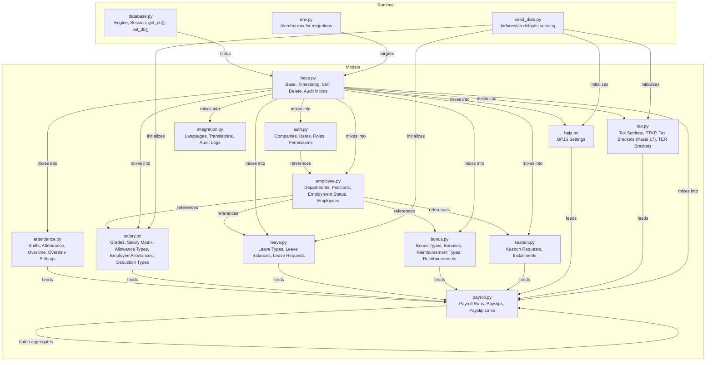

**Diagram sources**
- [payroll.py:19-124](file://app/models/payroll.py#L19-L124)
- [salary.py:21-135](file://app/models/salary.py#L21-L135)
- [bpjs.py:17-44](file://app/models/bpjs.py#L17-L44)
- [tax.py:19-115](file://app/models/tax.py#L19-L115)
- [attendance.py:21-134](file://app/models/attendance.py#L21-L134)
- [employee.py:20-132](file://app/models/employee.py#L20-L132)
- [leave.py:19-97](file://app/models/leave.py#L19-L97)
- [bonus.py:20-123](file://app/models/bonus.py#L20-L123)
- [kasbon.py:18-78](file://app/models/kasbon.py#L18-L78)
- [integration.py:21-93](file://app/models/integration.py#L21-L93)
- [auth.py:22-133](file://app/models/auth.py#L22-L133)
- [base.py:18-57](file://app/models/base.py#L18-L57)
- [database.py:17-63](file://app/database.py#L17-L63)
- [seed_data.py:27-448](file://app/seed/seed_data.py#L27-L448)
- [env.py:14-80](file://alembic/env.py#L14-L80)

**Section sources**
- [database.py:17-63](file://app/database.py#L17-L63)
- [env.py:14-80](file://alembic/env.py#L14-L80)
- [seed_data.py:27-64](file://app/seed/seed_data.py#L27-L64)

## Core Components
- PayrollRun: Batch processing container with period, method, tax method, status, and totals.
- Payslip: Per-employee earnings, deductions, taxes, BPJS, and net amounts; supports detailed line items.
- PayslipLine: Line items categorized as EARNING, DEDUCTION, TAX, BPJS, or NET.
- Salary structures: Grades, salary matrix, allowance types, employee allowances, deduction types.
- Attendance and overtime: Shifts, daily attendance, overtime records, and company-level overtime settings.
- Taxes: Company tax settings, PTKP thresholds, Pasal 17 brackets, and TER brackets.
- BPJS: Contribution rates and caps per type (Kesehatan, JHT, JP, JKK, JKM).
- Leaves, bonuses, reimbursements, and kasbon: Supporting components affecting payroll outcomes.
- Authentication and authorization: Companies, users, roles, permissions for access control.
- Integrations: Languages, translations, and audit logs for compliance and i18n.

**Section sources**
- [payroll.py:19-124](file://app/models/payroll.py#L19-L124)
- [salary.py:21-135](file://app/models/salary.py#L21-L135)
- [attendance.py:21-134](file://app/models/attendance.py#L21-L134)
- [tax.py:19-115](file://app/models/tax.py#L19-L115)
- [bpjs.py:17-44](file://app/models/bpjs.py#L17-L44)
- [leave.py:19-97](file://app/models/leave.py#L19-L97)
- [bonus.py:20-123](file://app/models/bonus.py#L20-L123)
- [kasbon.py:18-78](file://app/models/kasbon.py#L18-L78)
- [auth.py:22-133](file://app/models/auth.py#L22-L133)
- [integration.py:21-93](file://app/models/integration.py#L21-L93)

## Architecture Overview
The system uses a layered architecture:
- Data layer: SQLAlchemy models with shared TimestampMixin, SoftDeleteMixin, and AuditMixin.
- Persistence layer: SQLite-backed engine with static pooling and foreign key enforcement.
- Compliance layer: Seeded Indonesian regulations for tax, BPJS, leave, and overtime.
- Workflow layer: PayrollRun orchestrates batch processing; Payslip aggregates earnings/deductions; PayslipLine captures granular items.

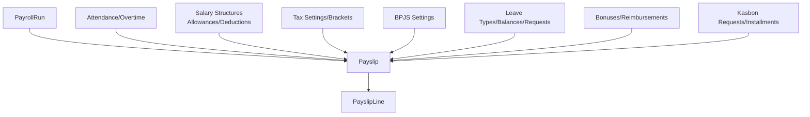

**Diagram sources**
- [payroll.py:19-124](file://app/models/payroll.py#L19-L124)
- [salary.py:21-135](file://app/models/salary.py#L21-L135)
- [attendance.py:21-134](file://app/models/attendance.py#L21-L134)
- [tax.py:19-115](file://app/models/tax.py#L19-L115)
- [bpjs.py:17-44](file://app/models/bpjs.py#L17-L44)
- [leave.py:19-97](file://app/models/leave.py#L19-L97)
- [bonus.py:20-123](file://app/models/bonus.py#L20-L123)
- [kasbon.py:18-78](file://app/models/kasbon.py#L18-L78)

## Detailed Component Analysis

### Payroll Run Configuration
- Period and method: PayrollRun defines payroll_period, period_start_date, period_end_date, payroll_method (GROSS or NETT), and tax_method (PASAL_17 or TER).
- Status lifecycle: DRAFT → PROCESSING → COMPLETED → APPROVED → PAID.
- Totals: Aggregates across payslips for gross, deductions, tax, and net.
- Approval: Tracks approved_by and approval_date.

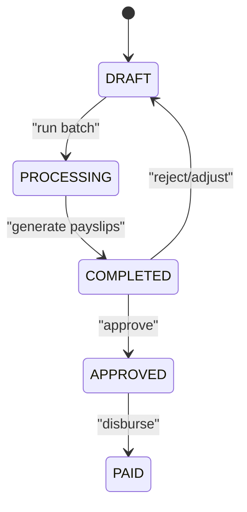

**Diagram sources**
- [payroll.py:29-40](file://app/models/payroll.py#L29-L40)
- [payroll.py:55-57](file://app/models/payroll.py#L55-L57)

**Section sources**
- [payroll.py:19-61](file://app/models/payroll.py#L19-L61)

### Payslip Generation and Line Item Processing
- Payslip captures basic_salary, allowances, overtime, bonuses, gross_salary, BPJS contributions, PPh21 tax, kasbon and other deductions, total_deductions, and net_salary.
- Line item categorization: EARNING, DEDUCTION, TAX, BPJS, NET.
- Detail fields: allowances_detail and deductions_detail for transparency.

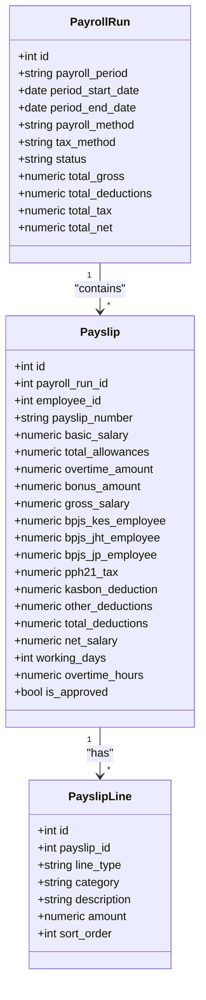

**Diagram sources**
- [payroll.py:64-124](file://app/models/payroll.py#L64-L124)

**Section sources**
- [payroll.py:64-102](file://app/models/payroll.py#L64-L102)
- [payroll.py:105-124](file://app/models/payroll.py#L105-L124)

### Attendance and Overtime Integration
- AttendanceRecord: Daily presence with status, lateness, and worked hours.
- OvertimeRecord: Hourly records with type (weekday/weekend/holiday), multipliers, and approval status.
- OvertimeSetting: Company-level multipliers and week type.

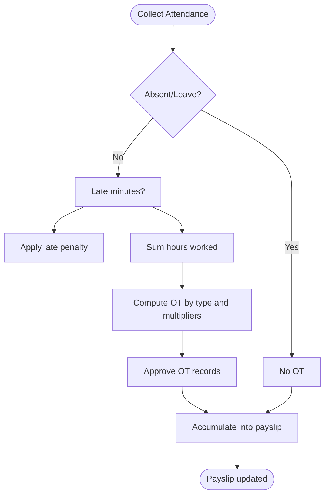

**Diagram sources**
- [attendance.py:56-134](file://app/models/attendance.py#L56-L134)

**Section sources**
- [attendance.py:21-134](file://app/models/attendance.py#L21-L134)

### Salary Structures and Allowances
- Grade and GradeSalaryMatrix define grade-based salary bands with effective dates.
- AllowanceType supports FIXED, PERCENTAGE, FORMULA-based allowances; configurable tax and BPJS base flags.
- EmployeeAllowance assigns specific allowances to employees with effective/end dates.

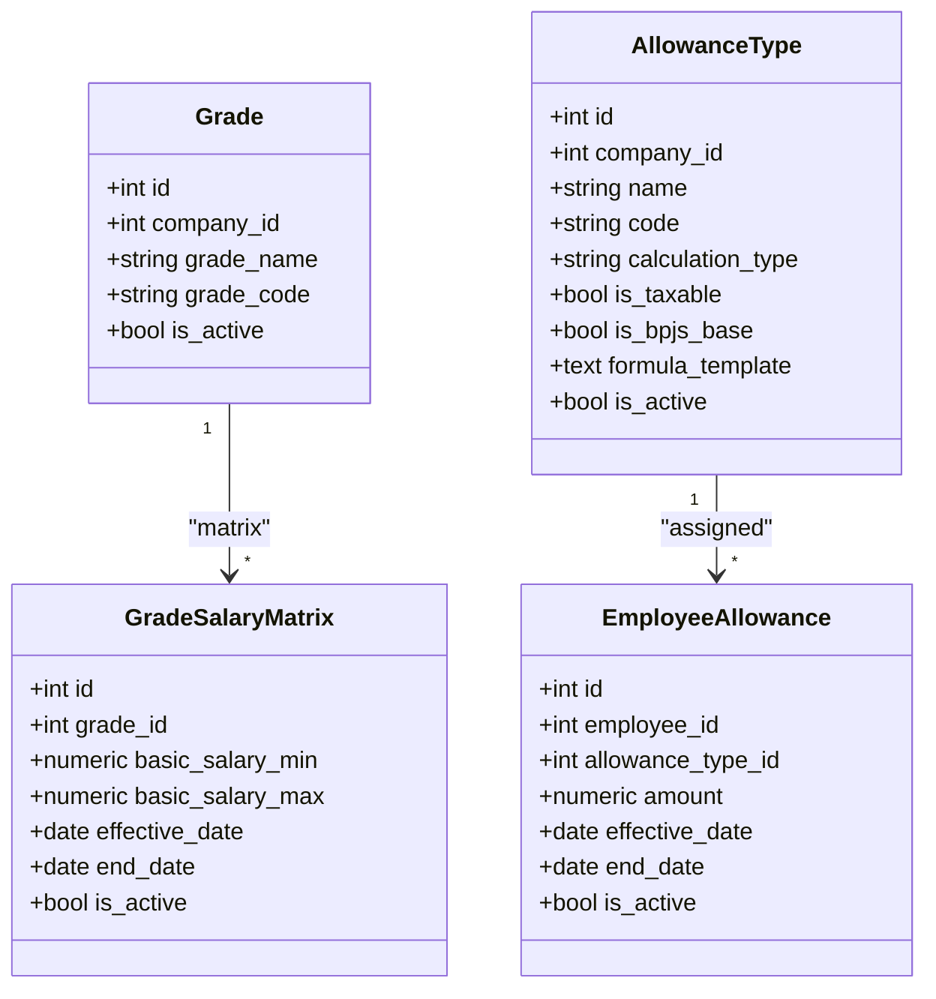

**Diagram sources**
- [salary.py:21-112](file://app/models/salary.py#L21-L112)

**Section sources**
- [salary.py:21-135](file://app/models/salary.py#L21-L135)

### Tax Calculations (PPh Pasal 17 and TER)
- TaxSetting: Company-level method selection (PASAL_17 or TER).
- PtkpValue: Monthly PTKP thresholds per status codes.
- TaxBracketPasal17: Progressive brackets with rates and effective dates.
- TerBracket: Simplified average tax rate brackets.

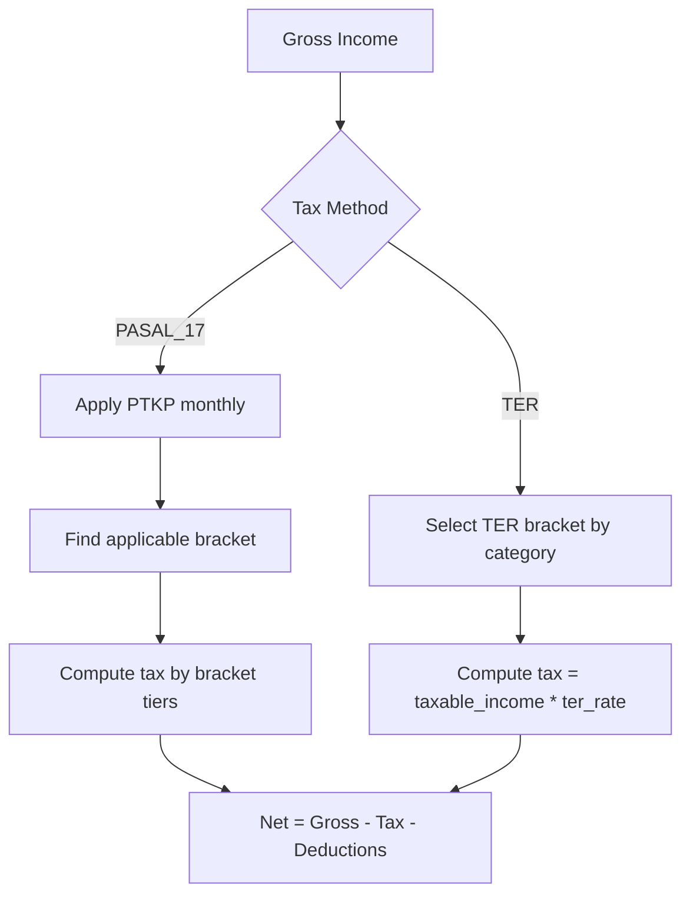

**Diagram sources**
- [tax.py:19-115](file://app/models/tax.py#L19-L115)
- [seed_data.py:224-297](file://app/seed/seed_data.py#L224-L297)
- [seed_data.py:299-333](file://app/seed/seed_data.py#L299-L333)

**Section sources**
- [tax.py:19-115](file://app/models/tax.py#L19-L115)
- [seed_data.py:224-333](file://app/seed/seed_data.py#L224-L333)

### BPJS Contributions
- BpjsSetting: Rates and caps per type (KESEHATAN, JHT, JP, JKK, JKM) with effective dates.
- Payslip accumulates employee BPJS contributions derived from base earnings and caps.

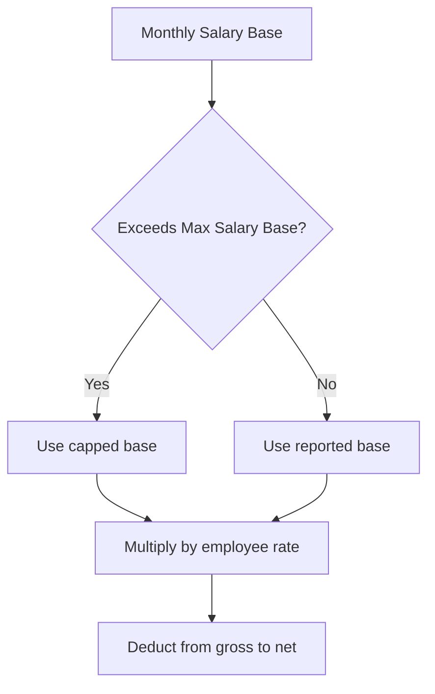

**Diagram sources**
- [bpjs.py:17-44](file://app/models/bpjs.py#L17-L44)
- [payroll.py:78-80](file://app/models/payroll.py#L78-L80)

**Section sources**
- [bpjs.py:17-44](file://app/models/bpjs.py#L17-L44)
- [payroll.py:78-80](file://app/models/payroll.py#L78-L80)

### Leaves, Bonuses, Reimbursements, and Kasbon
- Leave: LeaveType, EmployeeLeaveBalance, LeaveRequest; impacts absence and payslip adjustments indirectly.
- Bonus: BonusType and Bonus; processed into payslips upon approval.
- Reimbursement: ReimbursementType and Reimbursement; claim and approval tracked.
- Kasbon: Request and Installment schedules; installments can be linked to a payroll run.

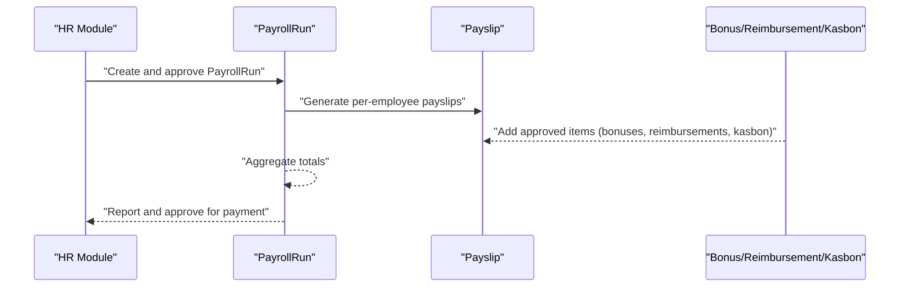

**Diagram sources**
- [bonus.py:40-123](file://app/models/bonus.py#L40-L123)
- [kasbon.py:18-78](file://app/models/kasbon.py#L18-L78)
- [leave.py:19-97](file://app/models/leave.py#L19-L97)
- [payroll.py:64-102](file://app/models/payroll.py#L64-L102)

**Section sources**
- [bonus.py:20-123](file://app/models/bonus.py#L20-L123)
- [kasbon.py:18-78](file://app/models/kasbon.py#L18-L78)
- [leave.py:19-97](file://app/models/leave.py#L19-L97)

### Automated Payment Generation
- Linking: KasbonInstallment can reference a PayrollRun, enabling automated deduction capture during run processing.
- Net salary: Final payable amount after all earnings, deductions, taxes, and BPJS.

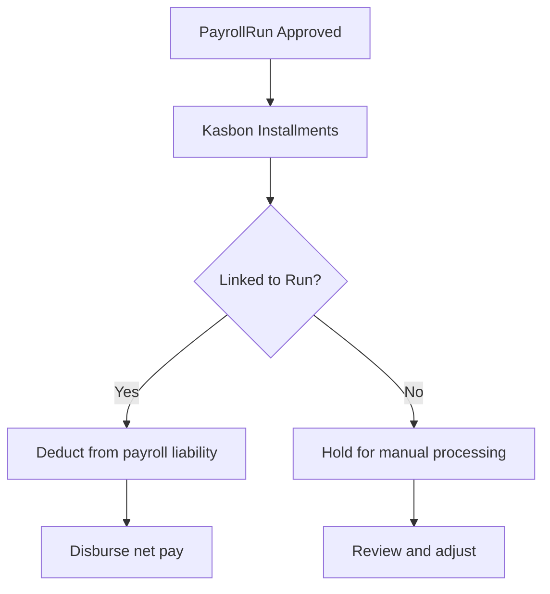

**Diagram sources**
- [kasbon.py:58-78](file://app/models/kasbon.py#L58-L78)
- [payroll.py:84-85](file://app/models/payroll.py#L84-L85)

**Section sources**
- [kasbon.py:58-78](file://app/models/kasbon.py#L58-L78)
- [payroll.py:84-85](file://app/models/payroll.py#L84-L85)

### Approval Workflows and Access Control
- Roles and permissions: Administrator, Payroll Master, Operator, Reporting, Payment, Employee with scoped rights.
- Audit logs: Track CREATE, UPDATE, DELETE, APPROVE, EXPORT, LOGIN actions for compliance.

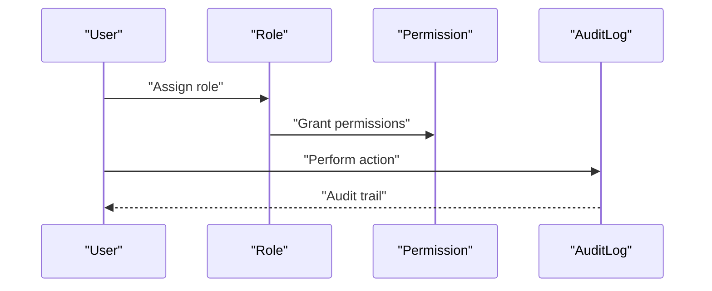

**Diagram sources**
- [auth.py:51-133](file://app/models/auth.py#L51-L133)
- [integration.py:70-93](file://app/models/integration.py#L70-L93)

**Section sources**
- [auth.py:51-133](file://app/models/auth.py#L51-L133)
- [integration.py:70-93](file://app/models/integration.py#L70-L93)

### Compliance Reporting Features
- Audit logs capture entity changes and actions for regulatory compliance.
- Seed data initializes Indonesian defaults (PTKP, tax brackets, BPJS rates, leave types) ensuring regulatory alignment.

**Section sources**
- [integration.py:70-93](file://app/models/integration.py#L70-L93)
- [seed_data.py:224-430](file://app/seed/seed_data.py#L224-L430)

## Dependency Analysis
- Model dependencies: Employee-related models (department, position, employment status) are referenced by Employee; Payslip references PayrollRun and Employees; PayslipLine references Payslip; Attendance, Salary, Tax, and BPJS feed Payslip computation.
- Runtime dependencies: database.py sets up the engine and session; Alembic env targets Base metadata for migrations.

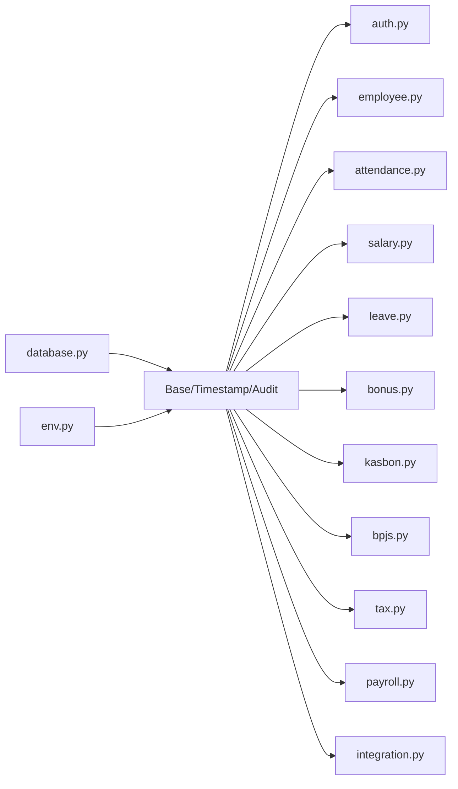

**Diagram sources**
- [base.py:18-57](file://app/models/base.py#L18-L57)
- [database.py:17-63](file://app/database.py#L17-L63)
- [env.py:14-26](file://alembic/env.py#L14-L26)

**Section sources**
- [base.py:18-57](file://app/models/base.py#L18-L57)
- [database.py:17-63](file://app/database.py#L17-L63)
- [env.py:14-26](file://alembic/env.py#L14-L26)

## Performance Considerations
- Indexes on frequently filtered columns (e.g., payroll_runs status, payslips employee, attendance date/status, audit entity/user/date) improve query performance.
- Static connection pooling reduces overhead for local SQLite usage.
- Prefer batch operations for generating payslips and aggregating totals to minimize round trips.

[No sources needed since this section provides general guidance]

## Troubleshooting Guide
- Database initialization: Ensure Base.metadata.create_all is invoked at startup to create tables.
- Foreign keys on SQLite: The engine sets PRAGMA foreign_keys=ON; verify DATABASE_URL points to a writable location.
- Migration compatibility: Alembic uses render_as_batch=True for SQLite ALTER TABLE compatibility.
- Regulatory defaults: Use the seed script to initialize PTKP, tax brackets, BPJS settings, and other defaults.

**Section sources**
- [database.py:56-63](file://app/database.py#L56-L63)
- [env.py:41-73](file://alembic/env.py#L41-L73)
- [seed_data.py:27-64](file://app/seed/seed_data.py#L27-L64)

## Conclusion
The payroll system models a comprehensive Indonesian-compliant framework: batch-run orchestration, detailed payslip computation, attendance and salary integration, tax and BPJS adherence, and robust approval and audit controls. The seed data and Alembic setup streamline onboarding with accurate regulatory defaults.

[No sources needed since this section summarizes without analyzing specific files]

## Appendices

### Concrete Examples (Step-by-step)
- Create a Payroll Run
  - Define period and method; set status to DRAFT; save PayrollRun.
  - Reference: [payroll.py:26-40](file://app/models/payroll.py#L26-L40)
- Generate Payslips
  - Aggregate attendance, salary, leaves, bonuses, reimbursements, and kasbon.
  - Compute taxes (PASAL_17 or TER) and BPJS contributions.
  - Save Payslip and PayslipLines.
  - References: [payroll.py:64-102](file://app/models/payroll.py#L64-L102), [tax.py:19-115](file://app/models/tax.py#L19-L115), [bpjs.py:17-44](file://app/models/bpjs.py#L17-L44)
- Execute Batch Processing
  - Transition PayrollRun status: DRAFT → PROCESSING → COMPLETED.
  - References: [payroll.py:31-40](file://app/models/payroll.py#L31-L40)
- Approve and Pay
  - Approve PayrollRun (approved_by, approval_date); mark PAID.
  - References: [payroll.py:37-40](file://app/models/payroll.py#L37-L40)
- Distribute Payslips
  - Share payslip_number and net_salary; integrate with kasbon installments.
  - References: [payroll.py:72-85](file://app/models/payroll.py#L72-L85), [kasbon.py:58-78](file://app/models/kasbon.py#L58-L78)

### Regulatory Defaults Initialization
- Seed script initializes:
  - PTKP values (2024)
  - Pasal 17 tax brackets (2024)
  - BPJS settings (2024)
  - Overtime settings
  - Languages (id/en)
  - Leave types
  - Tax settings (PASAL_17)
- References: [seed_data.py:224-430](file://app/seed/seed_data.py#L224-L430)