# Payroll Processing

<cite>
**Referenced Files in This Document**
- [payroll.py](file://app/models/payroll.py)
- [salary.py](file://app/models/salary.py)
- [bpjs.py](file://app/models/bpjs.py)
- [tax.py](file://app/models/tax.py)
- [attendance.py](file://app/models/attendance.py)
- [employee.py](file://app/models/employee.py)
- [leave.py](file://app/models/leave.py)
- [bonus.py](file://app/models/bonus.py)
- [kasbon.py](file://app/models/kasbon.py)
- [integration.py](file://app/models/integration.py)
- [auth.py](file://app/models/auth.py)
- [base.py](file://app/models/base.py)
- [database.py](file://app/database.py)
- [seed_data.py](file://app/seed/seed_data.py)
- [env.py](file://alembic/env.py)
- [requirements.txt](file://requirements.txt)
- [payroll_service.py](file://app/services/payroll_service.py)
- [payslip_bulk_service.py](file://app/services/payslip_bulk_service.py)
- [payslip_pdf_service.py](file://app/services/payslip_pdf_service.py)
- [payslip_builder.py](file://app/services/payslip_builder.py)
- [config_loader.py](file://app/services/config_loader.py)
- [employee_loader.py](file://app/services/employee_loader.py)
- [allowance.py](file://app/calculations/allowance.py)
- [overtime.py](file://app/calculations/overtime.py)
- [payroll.py](file://app/routers/payroll.py)
- [payroll.py](file://app/routers/payslip.py)
- [decimal_utils.py](file://app/utils/decimal_utils.py)
- [page.tsx](file://frontend/src/app/(dashboard)/payroll/page.tsx)
- [ProgressModal.tsx](file://frontend/src/components/payslip/ProgressModal.tsx)
</cite>

## Update Summary
**Changes Made**
- Added comprehensive chunked payroll processing system with batch endpoint support
- Enhanced eligibility validation with join-date cutoff logic (15th day cutoff)
- Implemented real-time progress tracking for frontend batch processing
- Added new preview endpoints for eligibility counting and ID retrieval
- Updated endpoint limits from 100 to 1000 employees per request
- Integrated frontend batch processing with progress monitoring

## Table of Contents
1. [Introduction](#introduction)
2. [Project Structure](#project-structure)
3. [Core Components](#core-components)
4. [Architecture Overview](#architecture-overview)
5. [Detailed Component Analysis](#detailed-component-analysis)
6. [Chunked Payroll Processing System](#chunked-payroll-processing-system)
7. [Enhanced Eligibility Validation](#enhanced-eligibility-validation)
8. [Real-time Progress Tracking](#real-time-progress-tracking)
9. [Automated Computation Engine](#automated-computation-engine)
10. [Bulk Generation and Workflow Management](#bulk-generation-and-workflow-management)
11. [Template-Based PDF Generation](#template-based-pdf-generation)
12. [Approval Workflows and Compliance](#approval-workflows-and-compliance)
13. [Performance Considerations](#performance-considerations)
14. [Troubleshooting Guide](#troubleshooting-guide)
15. [Conclusion](#conclusion)
16. [Appendices](#appendices)

## Introduction
This document explains the complete payroll processing system with automated computation, bulk generation, and comprehensive workflow management for Indonesia-based operations. The system features sophisticated batch processing orchestration, detailed payslip computation, attendance and salary integration, tax and BPJS adherence, and robust approval and audit controls. It covers payroll run configuration, payslip generation, batch processing workflows, approval processes, calculation algorithms, payslip line item processing, automated payment generation, integration with attendance records, salary structures, tax calculations, BPJS contributions, scheduling, approval workflows, and compliance reporting features.

**Updated** Added comprehensive chunked payroll processing system with batch endpoint support, enhanced eligibility validation with join-date cutoff logic, real-time progress tracking for frontend batch processing, and new preview endpoints for eligibility counting and ID retrieval. Updated endpoint limits from 100 to 1000 employees per request.

## Project Structure
The system is organized around domain-focused SQLAlchemy models with enhanced service layers for automated computation and bulk processing. The architecture includes pure calculation modules, service orchestration, and comprehensive workflow management with background job processing.

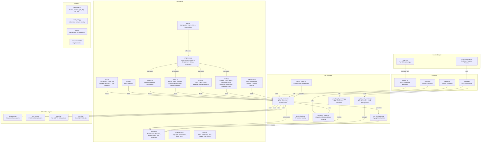

**Diagram sources**
- [payroll.py:19-197](file://app/models/payroll.py#L19-L197)
- [payroll_service.py:51-478](file://app/services/payroll_service.py#L51-L478)
- [payslip_bulk_service.py:27-345](file://app/services/payslip_bulk_service.py#L27-L345)
- [payslip_pdf_service.py:36-508](file://app/services/payslip_pdf_service.py#L36-L508)
- [payslip_builder.py:17-277](file://app/services/payslip_builder.py#L17-L277)
- [config_loader.py:35-144](file://app/services/config_loader.py#L35-L144)
- [allowance.py:19-122](file://app/calculations/allowance.py#L19-L122)
- [overtime.py:26-200](file://app/calculations/overtime.py#L26-L200)
- [employee_loader.py:42-312](file://app/services/employee_loader.py#L42-L312)
- [payroll.py:36-83](file://app/routers/payroll.py#L36-L83)
- [payroll.py:198-235](file://app/routers/payroll.py#L198-L235)

**Section sources**
- [database.py:17-63](file://app/database.py#L17-L63)
- [env.py:14-80](file://alembic/env.py#L14-L80)
- [seed_data.py:27-64](file://app/seed/seed_data.py#L27-L64)

## Core Components
- **PayrollRun**: Batch processing container with period, method, tax method, status, and comprehensive totals
- **Payslip**: Per-employee earnings, deductions, taxes, BPJS, and net amounts with detailed line items
- **PayslipLine**: Line items categorized as EARNING, DEDUCTION, TAX, BPJS, or NET with structured sorting
- **PayslipGenerationJob**: Background job tracking for bulk PDF generation with progress monitoring
- **PayslipTemplate**: Admin-editable HTML templates for customizable PDF generation
- **PayslipRecord**: Metadata tracking for generated PDF files with status and file paths
- **PayrollConfig**: Frozen configuration snapshot containing tax, BPJS, and overtime settings
- **EmployeeLoader**: Enhanced with eligibility validation and batch processing capabilities
- **BatchProcessRequest/Response**: API contracts for chunked payroll processing
- **Pure Calculation Modules**: Stateless calculation engines for allowances, overtime, taxes, and BPJS
- **Service Layer**: Orchestration services for batch processing, bulk generation, and PDF rendering
- **Workflow Management**: Comprehensive approval workflows with audit trails and compliance tracking

**Updated** Added EmployeeLoader with eligibility validation, BatchProcessRequest/Response schemas, and enhanced service layer capabilities.

**Section sources**
- [payroll.py:19-197](file://app/models/payroll.py#L19-L197)
- [payroll_service.py:51-478](file://app/services/payroll_service.py#L51-L478)
- [payslip_bulk_service.py:27-345](file://app/services/payslip_bulk_service.py#L27-L345)
- [payslip_pdf_service.py:36-508](file://app/services/payslip_pdf_service.py#L36-L508)
- [config_loader.py:24-144](file://app/services/config_loader.py#L24-L144)
- [employee_loader.py:42-312](file://app/services/employee_loader.py#L42-L312)
- [payroll.py:79-95](file://app/schemas/payroll.py#L79-L95)

## Architecture Overview
The system uses a comprehensive layered architecture with pure calculation modules, service orchestration, and advanced workflow management:

- **Data Layer**: SQLAlchemy models with shared mixins for timestamps, soft deletes, and audit tracking
- **Service Layer**: Pure calculation modules, batch processing orchestration, and bulk generation services
- **Presentation Layer**: RESTful APIs for payroll management and payslip generation
- **Workflow Layer**: Background job processing, approval workflows, and progress monitoring
- **Template Engine**: Jinja2-based HTML/CSS templating for customizable PDF generation
- **Compliance Layer**: Audit logs, validation rules, and regulatory compliance tracking

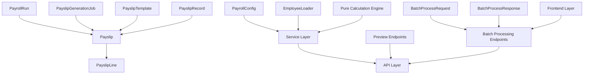

**Diagram sources**
- [payroll.py:19-197](file://app/models/payroll.py#L19-L197)
- [payroll_service.py:51-478](file://app/services/payroll_service.py#L51-L478)
- [payslip_bulk_service.py:27-345](file://app/services/payslip_bulk_service.py#L27-L345)
- [employee_loader.py:42-312](file://app/services/employee_loader.py#L42-L312)
- [payroll.py:79-95](file://app/schemas/payroll.py#L79-L95)
- [payroll.py:36-83](file://app/routers/payroll.py#L36-L83)
- [payroll.py:198-235](file://app/routers/payroll.py#L198-L235)

## Detailed Component Analysis

### Payroll Run Configuration and Lifecycle
The system manages complete payroll run lifecycle with comprehensive status tracking and validation:

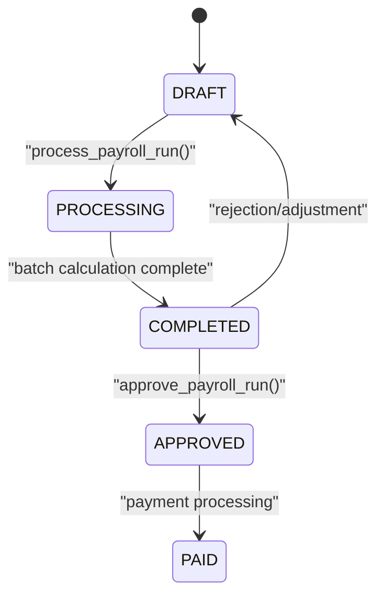

**Diagram sources**
- [payroll.py:29-40](file://app/models/payroll.py#L29-L40)
- [payroll_service.py:137-252](file://app/services/payroll_service.py#L137-L252)

The PayrollRun model supports five distinct states with proper validation and audit tracking. The system ensures data integrity through transaction boundaries and comprehensive error handling.

**Section sources**
- [payroll.py:19-61](file://app/models/payroll.py#L19-L61)
- [payroll_service.py:61-134](file://app/services/payroll_service.py#L61-L134)

### Advanced Payslip Generation System
The payslip generation system creates comprehensive payroll records with detailed line items and automated computation:

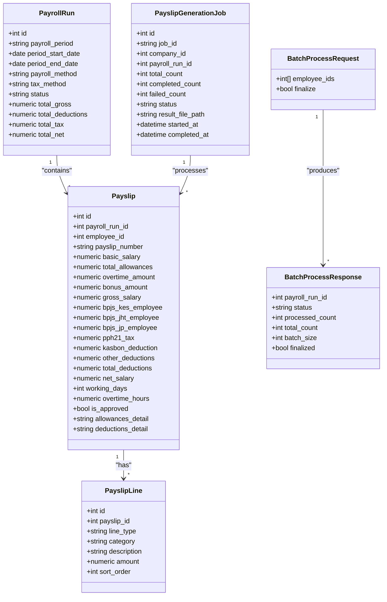

**Diagram sources**
- [payroll.py:64-197](file://app/models/payroll.py#L64-L197)
- [payroll.py:79-95](file://app/schemas/payroll.py#L79-L95)

**Section sources**
- [payroll.py:64-124](file://app/models/payroll.py#L64-L124)
- [payroll.py:126-197](file://app/models/payroll.py#L126-L197)
- [payroll.py:79-95](file://app/schemas/payroll.py#L79-L95)

### Attendance and Overtime Integration
The system integrates comprehensive attendance tracking with sophisticated overtime calculation:

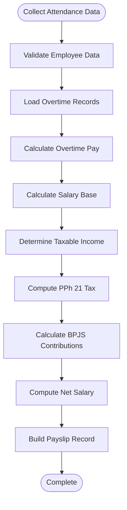

**Diagram sources**
- [payroll_service.py:262-378](file://app/services/payroll_service.py#L262-L378)
- [overtime.py:164-200](file://app/calculations/overtime.py#L164-L200)

**Section sources**
- [attendance.py:21-134](file://app/models/attendance.py#L21-L134)
- [payroll_service.py:262-378](file://app/services/payroll_service.py#L262-L378)

## Chunked Payroll Processing System
The system now features a comprehensive chunked payroll processing system designed to handle large-scale payroll operations without timing out:

### Batch Processing Architecture
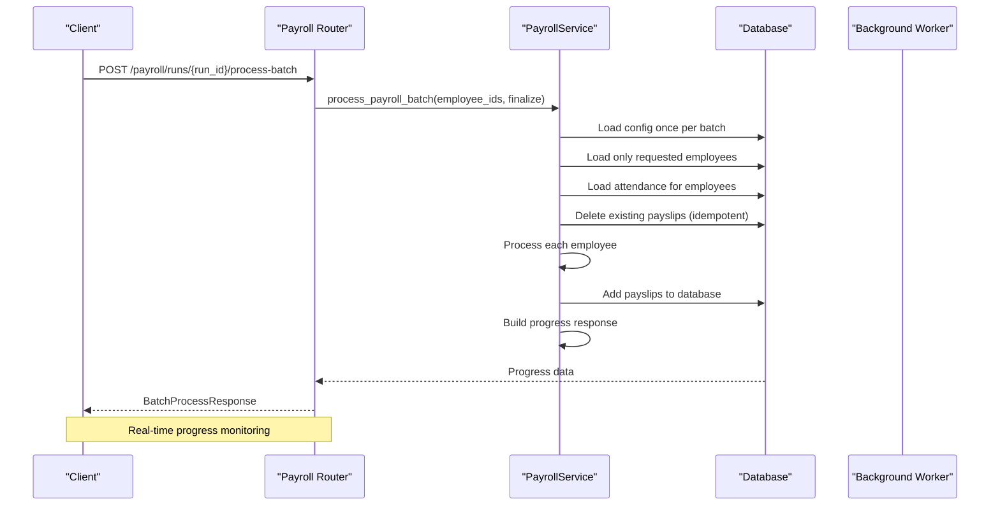

**Diagram sources**
- [payroll.py:198-235](file://app/routers/payroll.py#L198-L235)
- [payroll_service.py:294-370](file://app/services/payroll_service.py#L294-L370)

**Updated** Added comprehensive batch processing system with chunked processing, idempotent operations, and progress tracking.

**Section sources**
- [payroll.py:198-235](file://app/routers/payroll.py#L198-L235)
- [payroll_service.py:294-370](file://app/services/payroll_service.py#L294-L370)
- [payroll.py:79-95](file://app/schemas/payroll.py#L79-L95)

### Batch Processing Request/Response Model
The system defines clear contracts for batch processing operations:

- **BatchProcessRequest**: Contains employee_ids list and finalize flag for controlling run completion
- **BatchProcessResponse**: Provides progress tracking with processed_count, total_count, and batch_size metrics
- **Idempotent Operations**: Automatically cleans up existing payslips for processed employees
- **Finalization Control**: Allows partial processing with finalization on the last batch

**Section sources**
- [payroll.py:79-95](file://app/schemas/payroll.py#L79-L95)
- [payroll_service.py:334-369](file://app/services/payroll_service.py#L334-L369)

## Enhanced Eligibility Validation
The system implements sophisticated eligibility validation with join-date cutoff logic:

### Eligibility Validation Logic
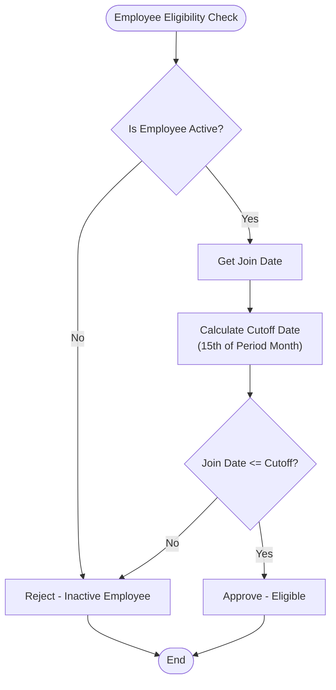

**Diagram sources**
- [employee_loader.py:46-48](file://app/services/employee_loader.py#L46-L48)
- [employee_loader.py:306-311](file://app/services/employee_loader.py#L306-L311)

**Updated** Added join-date cutoff logic with 15th day threshold for payroll eligibility.

**Section sources**
- [employee_loader.py:46-48](file://app/services/employee_loader.py#L46-L48)
- [employee_loader.py:306-311](file://app/services/employee_loader.py#L306-L311)

### Preview Endpoints for Eligibility
The system provides two new preview endpoints for eligibility validation:

- **GET /preview/eligible-count**: Returns the count of eligible employees for a given period
- **GET /preview/eligible-ids**: Returns IDs of eligible employees for batch processing
- **Cutoff Logic**: Employees who joined on or before the 15th of the period month are eligible
- **Pagination Support**: Both endpoints support standard pagination with increased limits

**Section sources**
- [payroll.py:36-83](file://app/routers/payroll.py#L36-L83)
- [employee_loader.py:298-312](file://app/services/employee_loader.py#L298-L312)

## Real-time Progress Tracking
The system provides comprehensive real-time progress tracking for both batch processing and bulk generation:

### Frontend Progress Monitoring
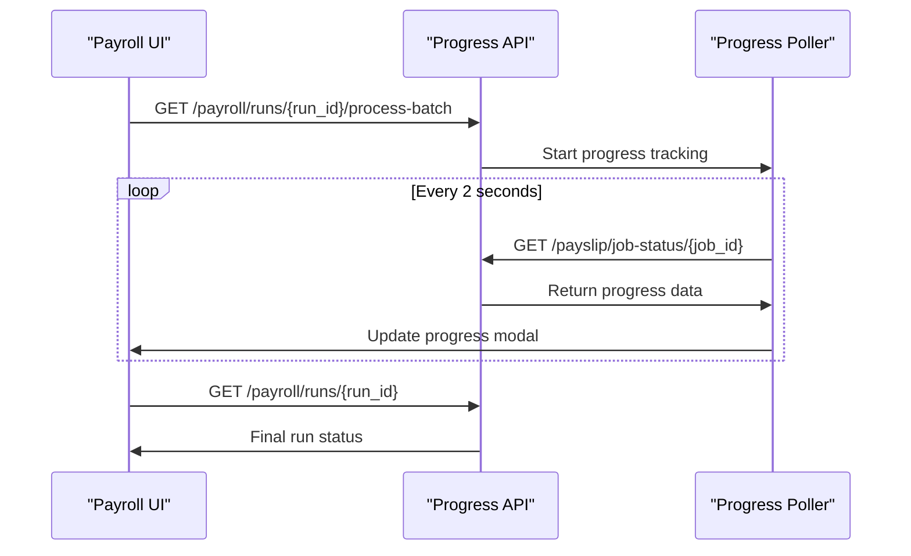

**Diagram sources**
- [page.tsx:160-213](file://frontend/src/app/(dashboard)/payroll/page.tsx#L160-L213)
- [ProgressModal.tsx:28-49](file://frontend/src/components/payslip/ProgressModal.tsx#L28-L49)

**Updated** Added real-time progress tracking with frontend polling and batch processing visualization.

**Section sources**
- [page.tsx:160-213](file://frontend/src/app/(dashboard)/payroll/page.tsx#L160-L213)
- [ProgressModal.tsx:28-49](file://frontend/src/components/payslip/ProgressModal.tsx#L28-L49)

### Progress Tracking Implementation
The system implements comprehensive progress tracking through:

- **Backend Progress Responses**: Real-time batch processing progress with processed_count and total_count
- **Frontend Polling**: Automatic progress updates every 2 seconds for bulk generation jobs
- **Visual Progress Bars**: Interactive progress bars with percentage completion
- **Error Handling**: Graceful error handling with detailed error messages
- **Completion Detection**: Automatic detection of job completion and ZIP file availability

**Section sources**
- [payroll_service.py:398-419](file://app/services/payroll_service.py#L398-L419)
- [ProgressModal.tsx:28-49](file://frontend/src/components/payslip/ProgressModal.tsx#L28-L49)

## Automated Computation Engine
The system features a comprehensive automated computation engine with pure calculation modules:

### Pure Calculation Architecture
All calculation functions are stateless and side-effect free, operating on immutable data structures:

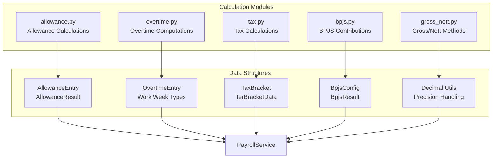

**Diagram sources**
- [allowance.py:19-122](file://app/calculations/allowance.py#L19-L122)
- [overtime.py:26-200](file://app/calculations/overtime.py#L26-L200)
- [config_loader.py:24-144](file://app/services/config_loader.py#L24-L144)
- [decimal_utils.py:11-33](file://app/utils/decimal_utils.py#L11-L33)

**Section sources**
- [allowance.py:19-122](file://app/calculations/allowance.py#L19-L122)
- [overtime.py:26-200](file://app/calculations/overtime.py#L26-L200)
- [config_loader.py:24-144](file://app/services/config_loader.py#L24-L144)
- [decimal_utils.py:11-33](file://app/utils/decimal_utils.py#L11-L33)

## Bulk Generation and Workflow Management
The system provides comprehensive bulk payslip generation with background job processing and progress monitoring:

### Bulk Generation Architecture
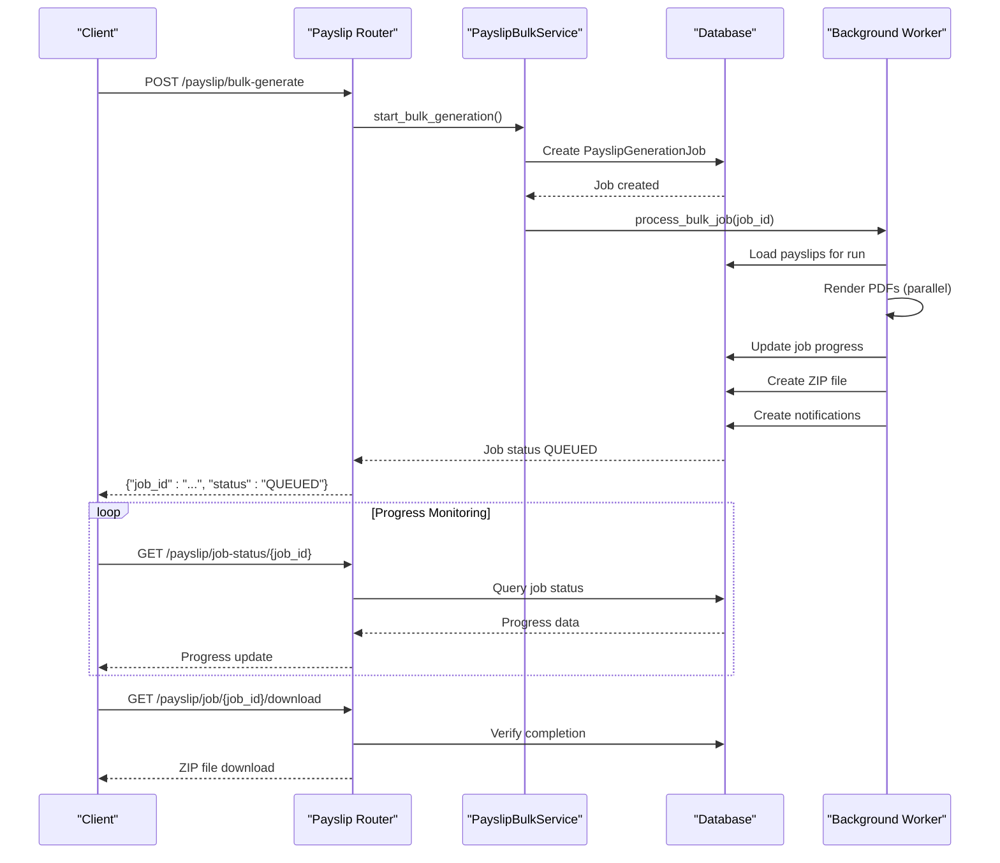

**Diagram sources**
- [payslip_bulk_service.py:32-345](file://app/services/payslip_bulk_service.py#L32-L345)
- [payroll.py:81-157](file://app/routers/payslip.py#L81-L157)

**Section sources**
- [payslip_bulk_service.py:27-345](file://app/services/payslip_bulk_service.py#L27-L345)
- [payroll.py:79-157](file://app/routers/payslip.py#L79-L157)

### Background Job Management
The system implements robust background job processing with thread pool management and progress tracking:

- **Job States**: QUEUED, PROCESSING, COMPLETED, FAILED with comprehensive error handling
- **Progress Tracking**: Real-time progress monitoring with completion and failure counts
- **Parallel Processing**: Thread pool executor for concurrent PDF generation (max 4 workers)
- **Storage Management**: Automatic ZIP file creation and individual PDF storage
- **Notification System**: Audit trail notifications for job completion and failures

**Section sources**
- [payslip_bulk_service.py:93-345](file://app/services/payslip_bulk_service.py#L93-L345)
- [payroll.py:171-197](file://app/models/payroll.py#L171-L197)

## Template-Based PDF Generation
The system provides flexible template-based PDF generation with customizable styling and content:

### Template Architecture
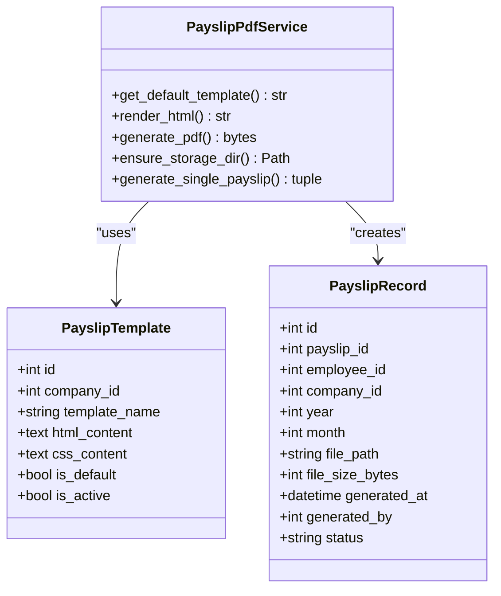

**Diagram sources**
- [payslip_pdf_service.py:36-508](file://app/services/payslip_pdf_service.py#L36-L508)
- [payroll.py:126-168](file://app/models/payroll.py#L126-L168)

**Section sources**
- [payslip_pdf_service.py:36-508](file://app/services/payslip_pdf_service.py#L36-L508)
- [payroll.py:126-168](file://app/models/payroll.py#L126-L168)

### Template Customization Features
- **Jinja2 Templating**: Dynamic HTML generation with variable substitution
- **Custom CSS Support**: Inline and external CSS styling options
- **Period Labeling**: Automatic month/year formatting with Indonesian localization
- **JSON Data Binding**: Structured data binding for allowances and deductions
- **File Storage**: Organized storage by year and month directories

**Section sources**
- [payslip_pdf_service.py:294-508](file://app/services/payslip_pdf_service.py#L294-L508)

## Approval Workflows and Compliance
The system implements comprehensive approval workflows with audit tracking and compliance features:

### Approval Workflow Architecture
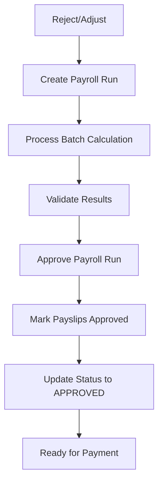

**Diagram sources**
- [payroll_service.py:381-434](file://app/services/payroll_service.py#L381-L434)
- [payroll.py:37-40](file://app/models/payroll.py#L37-L40)

**Section sources**
- [payroll_service.py:381-434](file://app/services/payroll_service.py#L381-L434)
- [payroll.py:37-40](file://app/models/payroll.py#L37-L40)

### Compliance and Audit Features
- **Audit Trail**: Comprehensive logging of all payroll operations and approvals
- **Validation Rules**: Multi-layer validation for data integrity and regulatory compliance
- **Error Handling**: Graceful error handling with detailed error messages
- **Transaction Management**: Atomic operations with rollback capabilities
- **Regulatory Compliance**: Built-in support for Indonesian tax and social security regulations

**Section sources**
- [integration.py:70-93](file://app/models/integration.py#L70-L93)
- [payroll_service.py:137-252](file://app/services/payroll_service.py#L137-L252)

## Performance Considerations
The system is optimized for performance through several key strategies:

### Optimization Strategies
- **Batch Processing**: Bulk inserts for payslips and line items to minimize database round trips
- **Thread Pool Management**: Concurrent PDF generation with controlled parallelism (max 4 workers)
- **Memory Management**: Efficient handling of large PDF generation workloads
- **Database Indexing**: Strategic indexing on frequently queried columns
- **Connection Pooling**: Optimized database connection management
- **Decimal Precision**: Careful handling of monetary calculations with appropriate precision
- **Chunked Processing**: Vercel timeout prevention through chunked batch processing
- **Idempotent Operations**: Safe repeated processing without duplicate payslips

### Scalability Features
- **Background Processing**: Non-blocking job execution for long-running operations
- **Progress Monitoring**: Real-time progress tracking for large-scale operations
- **Resource Management**: Controlled resource usage with worker limits
- **Error Recovery**: Automatic retry mechanisms and comprehensive error handling
- **Increased Limits**: Endpoint limits increased from 100 to 1000 employees per request

**Updated** Added chunked processing, idempotent operations, and increased endpoint limits for better scalability.

## Troubleshooting Guide
Common issues and their solutions:

### Database and Schema Issues
- **Migration Failures**: Ensure Alembic migrations are applied successfully
- **Foreign Key Constraints**: Verify database constraints are properly configured
- **Connection Issues**: Check database URL and connection pool settings

### Calculation Errors
- **Invalid Configuration**: Verify tax settings, BPJS rates, and allowance configurations
- **Missing Data**: Ensure all required employee data is properly entered
- **Precision Issues**: Check decimal precision settings for monetary calculations

### Bulk Generation Problems
- **Job Queue Issues**: Monitor background worker availability and health
- **Storage Space**: Ensure adequate disk space for PDF generation
- **Template Errors**: Validate HTML/CSS template syntax and structure

### Chunked Processing Issues
- **Batch Size Limits**: Ensure batch sizes don't exceed system capabilities
- **Finalization Problems**: Verify finalize flag is set correctly for the last batch
- **Eligibility Validation**: Check join-date cutoff logic for employee eligibility

**Updated** Added troubleshooting guidance for chunked processing and eligibility validation.

**Section sources**
- [database.py:56-63](file://app/database.py#L56-L63)
- [env.py:41-73](file://alembic/env.py#L41-L73)
- [seed_data.py:27-64](file://app/seed/seed_data.py#L27-L64)

## Conclusion
The payroll processing system represents a comprehensive solution for Indonesian payroll management with automated computation, bulk generation capabilities, and robust workflow management. The system's architecture emphasizes modularity, scalability, and compliance with Indonesian labor and tax regulations. Through pure calculation modules, background job processing, template-based PDF generation, and comprehensive real-time progress monitoring, it provides a complete solution for enterprise payroll processing with advanced features like chunked batch processing, enhanced eligibility validation, and detailed audit tracking.

**Updated** Enhanced with comprehensive chunked payroll processing system, real-time progress tracking, and improved scalability features.

## Appendices

### Concrete Examples (Step-by-step)

#### Create and Process Payroll Run with Batch Processing
1. **Create Payroll Run**: Initialize with period, method, and tax configuration
2. **Preview Eligibility**: Use preview endpoints to check eligible employee count and IDs
3. **Process in Batches**: Send employee IDs in chunks of 25 with finalize flag for the last batch
4. **Monitor Progress**: Track real-time progress through frontend interface
5. **Validate Results**: Review computed totals and individual payslips
6. **Approve Run**: Mark as approved and ready for payment processing

**Updated** Added batch processing workflow with eligibility preview and real-time monitoring.

**Section sources**
- [payroll_service.py:61-134](file://app/services/payroll_service.py#L61-L134)
- [payroll_service.py:137-252](file://app/services/payroll_service.py#L137-L252)
- [page.tsx:160-213](file://frontend/src/app/(dashboard)/payroll/page.tsx#L160-L213)

#### Bulk Payslip Generation Workflow
1. **Start Job**: Initiate bulk generation with payroll run reference
2. **Monitor Progress**: Track completion percentage and individual PDF status
3. **Handle Errors**: Review failed generations and resolve issues
4. **Download Results**: Access completed ZIP file with all PDFs

**Section sources**
- [payslip_bulk_service.py:32-345](file://app/services/payslip_bulk_service.py#L32-L345)
- [payroll.py:81-157](file://app/routers/payslip.py#L81-L157)

#### Template-Based PDF Generation
1. **Create Template**: Design HTML/CSS template with Jinja2 variables
2. **Configure Settings**: Set template as active and default
3. **Generate PDF**: Render payslip with dynamic content
4. **Store Results**: Save PDF with metadata tracking

**Section sources**
- [payslip_pdf_service.py:294-508](file://app/services/payslip_pdf_service.py#L294-L508)
- [payroll.py:298-450](file://app/routers/payslip.py#L298-L450)

### System Configuration and Setup
- **Database Setup**: Initialize with proper constraints and indexes
- **Seed Data**: Load Indonesian regulatory defaults automatically
- **Template Management**: Configure default and custom templates
- **Background Workers**: Set up job processing infrastructure
- **Endpoint Limits**: Configure increased limits for better scalability

**Updated** Added configuration for increased endpoint limits and batch processing capabilities.

**Section sources**
- [database.py:17-63](file://app/database.py#L17-L63)
- [seed_data.py:224-430](file://app/seed/seed_data.py#L224-L430)
- [payslip_bulk_service.py:30-31](file://app/services/payslip_bulk_service.py#L30-L31)
- [payroll.py:137-145](file://app/routers/payroll.py#L137-145)