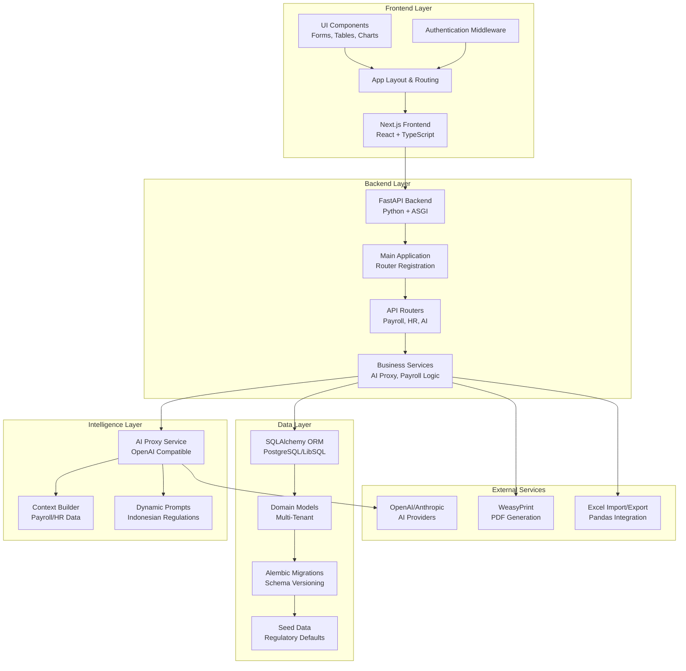
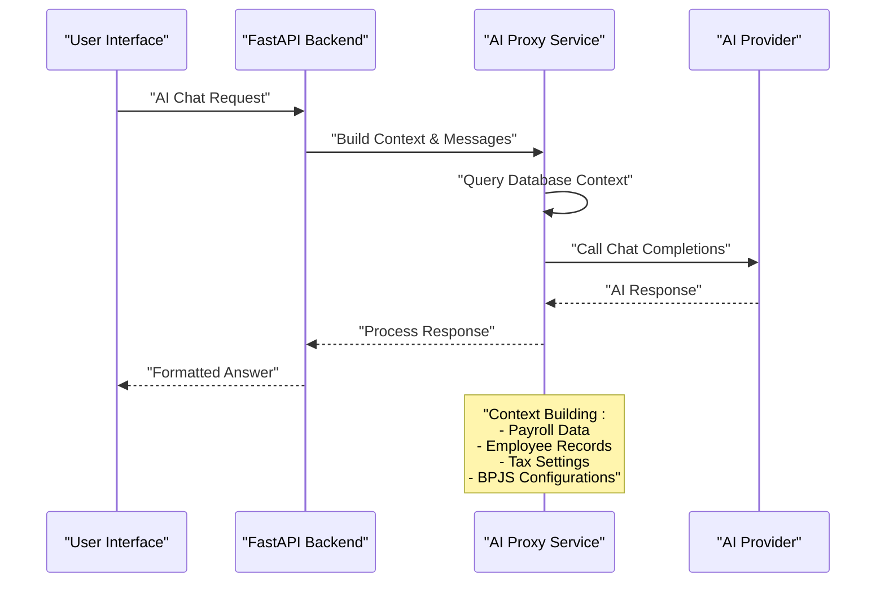
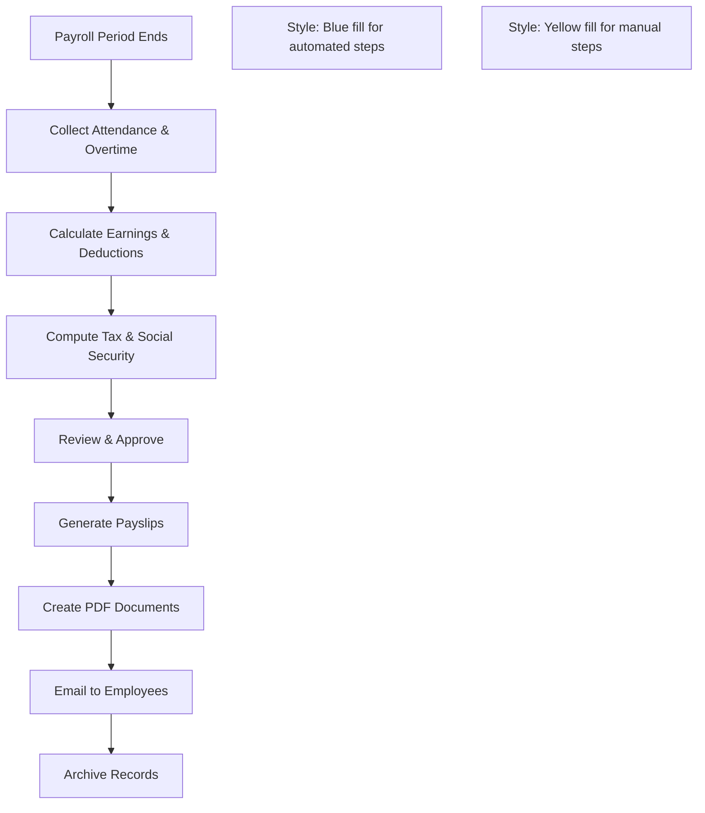

# Project Overview

<cite>
**Referenced Files in This Document**
- [requirements.txt](file://requirements.txt)
- [app/database.py](file://app/database.py)
- [alembic/env.py](file://alembic/env.py)
- [app/models/__init__.y](file://app/models/__init__.py)
- [app/models/base.py](file://app/models/base.py)
- [app/models/auth.py](file://app/models/auth.py)
- [app/models/employee.py](file://app/models/employee.py)
- [app/models/salary.py](file://app/models/salary.py)
- [app/models/tax.py](file://app/models/tax.py)
- [app/models/bpjs.py](file://app/models/bpjs.py)
- [app/models/attendance.py](file://app/models/attendance.py)
- [app/models/leave.py](file://app/models/leave.py)
- [app/models/kasbon.py](file://app/models/kasbon.py)
- [app/models/bonus.py](file://app/models/bonus.py)
- [app/models/payroll.py](file://app/models/payroll.py)
- [app/models/integration.py](file://app/models/integration.py)
- [app/seed/seed_data.py](file://app/seed/seed_data.py)
- [app/main.py](file://app/main.py)
- [app/routers/ai.py](file://app/routers/ai.py)
- [app/services/ai_proxy_service.py](file://app/services/ai_proxy_service.py)
- [app/schemas/ai.py](file://app/schemas/ai.py)
- [frontend/package.json](file://frontend/package.json)
- [frontend/src/app/layout.tsx](file://frontend/src/app/layout.tsx)
- [frontend/src/middleware.ts](file://frontend/src/middleware.ts)
- [frontend/src/lib/api.ts](file://frontend/src/lib/api.ts)
- [frontend/src/components/ai/AiSettingsForm.tsx](file://frontend/src/components/ai/AiSettingsForm.tsx)
- [frontend/src/types/ai.ts](file://frontend/src/types/ai.ts)
</cite>

## Update Summary
**Changes Made**
- Updated architecture to reflect FastAPI backend with Next.js frontend integration
- Added comprehensive AI integration capabilities with OpenAI-compatible providers
- Enhanced multi-tenant design with complete HRIS functionality
- Updated technology stack to include modern frontend frameworks and AI services
- Expanded system capabilities beyond traditional payroll to include intelligent automation

## Table of Contents
1. [Introduction](#introduction)
2. [System Architecture](#system-architecture)
3. [Core Components](#core-components)
4. [Frontend Implementation](#frontend-implementation)
5. [AI Integration](#ai-integration)
6. [Multi-Tenant Design](#multi-tenant-design)
7. [Regulatory Compliance](#regulatory-compliance)
8. [Technology Stack](#technology-stack)
9. [Practical Use Cases](#practical-use-cases)
10. [Deployment Architecture](#deployment-architecture)
11. [Conclusion](#conclusion)

## Introduction
The Indonesian Payroll & HRIS system represents a comprehensive, enterprise-grade solution that has evolved from a traditional payroll backend to a modern, AI-integrated human resources management platform. Built with FastAPI as the backend foundation and Next.js as the frontend framework, the system provides automated payroll processing, intelligent HR insights, and advanced compliance management for Indonesian regulations.

The system serves as a complete HRIS (Human Resource Information System) solution that seamlessly integrates traditional payroll functions with cutting-edge artificial intelligence capabilities. It supports real-time employee management, automated payslip generation, attendance tracking, leave management, tax computation, and intelligent reporting powered by AI assistants.

**Target Audience:**
- Indonesian companies seeking automated payroll and HR management
- HR professionals requiring intelligent insights and compliance monitoring
- Finance teams needing automated tax computation and reporting
- System integrators building on top of modern APIs
- Organizations requiring AI-powered HR assistance and analytics

## System Architecture
The system employs a modern microservices architecture with clear separation between backend APIs, intelligent AI services, and responsive frontend interfaces. The architecture supports horizontal scaling and provides robust tenant isolation for multi-company deployments.

**Diagram sources**
- [app/main.py:30-64](file://app/main.py#L30-L64)
- [app/routers/ai.py:20](file://app/routers/ai.py#L20)
- [app/services/ai_proxy_service.py:65-142](file://app/services/ai_proxy_service.py#L65-L142)
- [frontend/src/app/layout.tsx:12-22](file://frontend/src/app/layout.tsx#L12-L22)

## Core Components
The system consists of several interconnected components that work together to provide comprehensive payroll and HR management capabilities:

### Backend Foundation
- **FastAPI Application**: High-performance asynchronous web framework providing automatic OpenAPI documentation and robust request validation
- **Database Layer**: SQLAlchemy ORM with comprehensive multi-tenant support and audit trails
- **Service Layer**: Business logic encapsulated in specialized services for payroll processing, AI integration, and data management
- **Router System**: Modular API routing organized by functional domains (payroll, HR, tax, attendance)

### HRIS Functionality
- **Employee Management**: Complete employee lifecycle management with organizational hierarchy
- **Payroll Processing**: Automated batch processing with tax computation and benefit calculations
- **Attendance Tracking**: Real-time attendance recording with overtime computation
- **Leave Management**: Automated leave entitlements with approval workflows
- **Compensation Management**: Flexible salary structures with allowance and deduction tracking

### Advanced Features
- **AI Integration**: Intelligent assistants for payroll queries, compliance guidance, and HR insights
- **Reporting Engine**: Dynamic report generation with AI-powered analysis
- **Notification System**: In-app notifications for payslip generation and HR events
- **Audit Trail**: Comprehensive logging for compliance and traceability

**Section sources**
- [app/main.py:10-27](file://app/main.py#L10-L27)
- [app/models/integration.py:21-120](file://app/models/integration.py#L21-L120)
- [requirements.txt:1-23](file://requirements.txt#L1-L23)

## Frontend Implementation
The Next.js frontend provides a modern, responsive user interface with comprehensive HRIS functionality. Built with React and TypeScript, it offers intuitive navigation, real-time data visualization, and seamless integration with the backend APIs.

### Framework Architecture
- **Next.js App Router**: Modern routing system with dynamic routes and API integration
- **TypeScript Integration**: Strongly typed components and API interfaces
- **Tailwind CSS**: Utility-first styling with responsive design
- **React Hook Form**: Form validation and state management
- **Zod Validation**: Runtime type checking and form validation

### User Interface Components
- **Dashboard**: Executive overview with key metrics and recent activities
- **Employee Portal**: Self-service portal for employees to view payslips and attendance
- **HR Management**: Comprehensive forms for employee data, attendance, and leave management
- **Payroll Interface**: Specialized tools for payroll processing and payslip management
- **AI Assistant**: Integrated chat interface for intelligent HR assistance

### Authentication and Navigation
- **Middleware Protection**: Route protection with authentication checks
- **Responsive Design**: Mobile-first approach with adaptive layouts
- **Real-time Updates**: WebSocket integration for live data synchronization
- **Error Handling**: Comprehensive error boundaries and user-friendly error messages

**Section sources**
- [frontend/package.json:10-27](file://frontend/package.json#L10-L27)
- [frontend/src/middleware.ts:6-24](file://frontend/src/middleware.ts#L6-L24)
- [frontend/src/lib/api.ts:42-75](file://frontend/src/lib/api.ts#L42-L75)

## AI Integration
The system incorporates advanced AI capabilities through OpenAI-compatible providers, enabling intelligent automation and insights for HR and payroll operations.

### AI Service Architecture
- **Provider Agnostic**: Support for multiple AI providers (OpenAI, Anthropic, Google AI)
- **Context Intelligence**: Dynamic context building from payroll and HR data
- **Regulatory Compliance**: AI trained on Indonesian tax and labor regulations
- **Security First**: API key masking and secure credential management

### AI Capabilities
- **Intelligent Chat**: Natural language processing for payroll queries and HR assistance
- **Automated Reporting**: AI-powered insights and trend analysis
- **Compliance Guidance**: Real-time advice on tax and labor law compliance
- **Data Analysis**: Pattern recognition in attendance, leave, and payroll data

### Implementation Details
- **HTTP Client Integration**: Synchronous AI calls via httpx with timeout management
- **Prompt Engineering**: Context-aware prompts tailored to Indonesian HR regulations
- **Error Handling**: Comprehensive error handling for network failures and API limits
- **Performance Optimization**: Configurable timeouts and token limits for cost control

**Diagram sources**
- [app/routers/ai.py:120-142](file://app/routers/ai.py#L120-L142)
- [app/services/ai_proxy_service.py:161-285](file://app/services/ai_proxy_service.py#L161-L285)

**Section sources**
- [app/routers/ai.py:1-202](file://app/routers/ai.py#L1-L202)
- [app/services/ai_proxy_service.py:1-286](file://app/services/ai_proxy_service.py#L1-L286)
- [app/schemas/ai.py:1-106](file://app/schemas/ai.py#L1-L106)

## Multi-Tenant Design
The system implements a sophisticated multi-tenant architecture that ensures complete data isolation between organizations while sharing infrastructure resources efficiently.

### Tenant Isolation Strategy
- **Company Boundary**: All data is scoped to company entities through foreign key relationships
- **Resource Sharing**: Shared infrastructure with tenant-specific data partitioning
- **Access Control**: Role-based access control (RBAC) per tenant
- **Billing Separation**: Financial isolation for multi-tenant SaaS deployments

### Data Partitioning
- **Hierarchical Organization**: Departments, positions, and employee hierarchies per company
- **Configuration Isolation**: Company-specific tax settings, allowance types, and payroll methods
- **Audit Separation**: Separate audit trails per tenant for compliance purposes
- **User Management**: Multi-tenant user accounts with company associations

### Scalability Features
- **Database Optimization**: Efficient indexing and query optimization per tenant
- **Caching Strategy**: Tenant-aware caching for improved performance
- **Resource Limits**: Configurable limits per tenant for resource management
- **Backup Isolation**: Tenant-specific backup and recovery procedures

**Section sources**
- [app/models/auth.py:22-48](file://app/models/auth.py#L22-L48)
- [app/models/integration.py:21-37](file://app/models/integration.py#L21-L37)

## Regulatory Compliance
The system is designed to meet all Indonesian payroll and HR regulatory requirements with automated compliance checking and audit trail capabilities.

### Tax Compliance
- **PPh 21 Calculation**: Automated computation based on PTKP status and progressive tax brackets
- **TER Implementation**: Simplified tax computation for eligible companies
- **PTKP Management**: Dynamic PTKP value management aligned with annual regulations
- **Withholding Tax**: Automatic tax deduction and remittance scheduling

### Social Security Compliance
- **BPJS Integration**: Automated contribution calculations for KESEHATAN, JHT, JP, JKK, JKM
- **Rate Management**: Dynamic rate updates based on regulatory changes
- **Contribution Tracking**: Real-time contribution monitoring and reporting
- **Cap Management**: Automatic application of contribution caps and thresholds

### Labor Law Alignment
- **Leave Entitlements**: Automated calculation based on employment status and tenure
- **Overtime Rules**: Compliance with Indonesian overtime regulations and multipliers
- **Working Hours**: Adherence to maximum working hour regulations
- **Contract Types**: Support for various employment contract types

### Audit and Reporting
- **Comprehensive Logging**: Full audit trail of all HR and payroll transactions
- **Regulatory Reporting**: Automated generation of compliance reports
- **Trail Analysis**: Historical analysis for regulatory audits
- **Data Retention**: Automated data lifecycle management

**Section sources**
- [app/models/tax.py:19-114](file://app/models/tax.py#L19-L114)
- [app/models/bpjs.py:17-43](file://app/models/bpjs.py#L17-L43)
- [app/models/integration.py:71-93](file://app/models/integration.py#L71-L93)

## Technology Stack
The system leverages modern technologies to provide a robust, scalable, and maintainable solution.

### Backend Technologies
- **FastAPI**: High-performance asynchronous web framework with automatic API documentation
- **SQLAlchemy**: Object-relational mapping with comprehensive relationship support
- **Alembic**: Database migration management with batch rendering for SQLite compatibility
- **Pydantic**: Data validation and settings management with type safety
- **Passlib**: Secure password hashing and verification
- **HTTPX**: Asynchronous HTTP client for external service integration

### Database Technologies
- **PostgreSQL**: Primary database with advanced features and scalability
- **LibSQL**: Alternative lightweight database option for edge deployments
- **SQLAlchemy ORM**: Type-safe database operations with relationship management
- **Connection Pooling**: Optimized database connection management

### Frontend Technologies
- **Next.js 16**: Latest version with App Router and server-side rendering
- **React 19**: Latest React features with concurrent rendering
- **TypeScript**: Strong typing for better developer experience and error prevention
- **Tailwind CSS**: Utility-first CSS framework for rapid UI development
- **React Hook Form**: Performant form validation and state management
- **Zod**: Runtime type checking and form validation

### AI and Integration
- **LangChain**: AI chain orchestration and prompt management
- **OpenAI SDK**: Official OpenAI integration with provider flexibility
- **WeasyPrint**: High-quality PDF generation for payslips and reports
- **Pandas**: Data manipulation and Excel integration
- **OpenPyXL**: Excel file processing and export capabilities

### Development and Deployment
- **Pytest**: Comprehensive testing framework with async support
- **Faker**: Test data generation for development environments
- **Vercel**: Cloud platform for frontend deployment and edge computing
- **Docker**: Containerization for consistent development and production environments

**Section sources**
- [requirements.txt:1-23](file://requirements.txt#L1-L23)
- [frontend/package.json:10-27](file://frontend/package.json#L10-L27)

## Practical Use Cases
The system demonstrates practical applications across various HR and payroll scenarios, showcasing its comprehensive capabilities.

### Automated Payslip Generation
The system streamlines the entire payslip creation process from raw data to final delivery:

**Diagram sources**
- [app/models/payroll.py:19-123](file://app/models/payroll.py#L19-L123)

### AI-Powered HR Assistance
Employees and HR staff can interact with intelligent assistants for complex payroll questions:

- **Natural Language Queries**: "How is my tax calculated?"
- **Compliance Guidance**: "What are the rules for overtime pay?"
- **Policy Interpretation**: "Can I take leave during probation period?"
- **Data Analysis**: "Show me attendance trends for my department"

### Real-Time Attendance Management
The system provides comprehensive attendance tracking with automated calculations:

- **Clock-in/Clock-out**: GPS-enabled attendance with location verification
- **Late Arrivals**: Automatic detection and penalty calculation
- **Leave Integration**: Automatic attendance adjustment for approved leaves
- **Overtime Detection**: Automatic overtime calculation based on working hours

### Dynamic Reporting and Insights
Managers receive AI-powered insights through customizable reports:

- **Payroll Summary**: Monthly and quarterly financial summaries
- **Attendance Analysis**: Patterns and trends in employee punctuality
- **Compliance Review**: Automated audit of tax and social security compliance
- **Employee Insights**: Demographic and performance trend analysis

**Section sources**
- [app/routers/ai.py:147-202](file://app/routers/ai.py#L147-L202)
- [app/services/ai_proxy_service.py:161-285](file://app/services/ai_proxy_service.py#L161-L285)

## Deployment Architecture
The system supports flexible deployment options from cloud platforms to edge computing environments.

### Cloud-Native Deployment
- **Microservices Architecture**: Independent service containers for scalability
- **Load Balancing**: Automatic traffic distribution across service instances
- **Auto-scaling**: Dynamic resource allocation based on demand
- **CI/CD Pipeline**: Automated testing and deployment processes

### Edge Computing Support
- **LibSQL Integration**: Lightweight database for edge deployments
- **Offline Capability**: Local data processing with eventual consistency
- **Edge AI**: On-premises AI inference for privacy-sensitive data
- **Reduced Latency**: Local processing for real-time HR operations

### Security and Compliance
- **Data Encryption**: End-to-end encryption for sensitive HR data
- **Access Control**: Multi-factor authentication and role-based permissions
- **Audit Logging**: Comprehensive logging for compliance auditing
- **Data Residency**: Regional data storage for legal compliance

### Monitoring and Observability
- **Performance Metrics**: Real-time monitoring of system performance
- **Error Tracking**: Comprehensive error reporting and alerting
- **Usage Analytics**: Insight into system utilization and user behavior
- **Health Checks**: Automated system health monitoring and alerts

## Conclusion
The Indonesian Payroll & HRIS system represents a significant advancement in automated HR management, combining traditional payroll expertise with modern AI capabilities. The migration from a simple backend to a comprehensive platform demonstrates the evolution toward intelligent, automated HR solutions.

The system's strength lies in its comprehensive approach to Indonesian payroll and HR compliance, supported by robust multi-tenant architecture, advanced AI integration, and modern frontend development. It addresses the complex needs of Indonesian businesses while maintaining strict adherence to local regulations and providing intelligent automation capabilities.

Key advantages include:
- **Complete HRIS Coverage**: From payroll to employee management and compliance
- **AI Integration**: Intelligent assistance and insights powered by natural language processing
- **Regulatory Expertise**: Deep understanding of Indonesian tax and labor laws
- **Scalable Architecture**: Multi-tenant design supporting growth from SMEs to enterprise
- **Modern Technology Stack**: Leveraging best practices in both backend and frontend development

The system positions itself as a forward-thinking solution that embraces both traditional HR needs and emerging AI-driven capabilities, providing Indonesian organizations with a competitive advantage in workforce management automation.