# Project Overview

<cite>
**Referenced Files in This Document**
- [requirements.txt](file://requirements.txt)
- [app/database.py](file://app/database.py)
- [alembic/env.py](file://alembic/env.py)
- [app/models/__init__.py](file://app/models/__init__.py)
- [app/models/base.py](file://app/models/base.py)
- [app/models/auth.py](file://app/models/auth.py)
- [app/models/employee.py](file://app/models/employee.py)
- [app/models/salary.py](file://app/models/salary.py)
- [app/models/tax.py](file://app/models/tax.py)
- [app/models/bpjs.py](file://app/models/bpjs.py)
- [app/models/attendance.py](file://app/models/attendance.py)
- [app/models/leave.py](file://app/models/leave.py)
- [app/models/kasbon.py](file://app/models/kasbon.py)
- [app/models/bonus.py](file://app/models/bonus.py)
- [app/models/payroll.py](file://app/models/payroll.py)
- [app/models/integration.py](file://app/models/integration.py)
- [app/seed/seed_data.py](file://app/seed/seed_data.py)
</cite>

## Table of Contents
1. [Introduction](#introduction)
2. [Project Structure](#project-structure)
3. [Core Components](#core-components)
4. [Architecture Overview](#architecture-overview)
5. [Detailed Component Analysis](#detailed-component-analysis)
6. [Dependency Analysis](#dependency-analysis)
7. [Performance Considerations](#performance-considerations)
8. [Troubleshooting Guide](#troubleshooting-guide)
9. [Conclusion](#conclusion)
10. [Appendices](#appendices)

## Introduction
This Indonesian Payroll & HRIS system is a comprehensive backend solution designed to automate payroll processing, manage employee data, and ensure Indonesian tax and social security (BPJS) compliance. Built with FastAPI and SQLAlchemy, it provides a robust foundation for multi-tenant operations with strong data modeling, auditability, and extensibility. The system supports key HRIS workflows such as attendance tracking, leave management, bonuses/reimbursements, and structured payslip generation, while enforcing Indonesian regulations for tax computation (PPh Pasal 17 and TER), PTKP thresholds, and BPJS contribution settings.

Target audience:
- Payroll administrators and finance teams managing Indonesian payroll
- HR professionals handling employee data, attendance, and leaves
- System integrators building on top of the backend APIs
- Auditors and compliance officers leveraging audit logs and standardized data

## Project Structure
The project follows a layered, feature-oriented structure:
- Application core: FastAPI application entry and routing live outside this repository snapshot; the backend logic is encapsulated in models, database configuration, and migrations.
- Models: SQLAlchemy declarative models grouped by domain (authentication, employees, payroll, attendance, tax, BPJS, etc.) under app/models/.
- Database: Centralized engine and session management with FastAPI dependency injection.
- Migrations: Alembic configuration for schema versioning and batch-compatible SQLite operations.
- Seed data: Initial dataset for Indonesian regulatory defaults (PTKP, tax brackets, BPJS, languages, leave types, etc.).

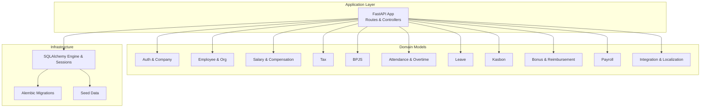

**Diagram sources**
- [app/models/__init__.py:1-69](file://app/models/__init__.py#L1-L69)
- [app/database.py:1-63](file://app/database.py#L1-L63)
- [alembic/env.py:1-80](file://alembic/env.py#L1-L80)
- [app/seed/seed_data.py:1-448](file://app/seed/seed_data.py#L1-L448)

**Section sources**
- [app/models/__init__.py:1-69](file://app/models/__init__.py#L1-L69)
- [app/database.py:1-63](file://app/database.py#L1-L63)
- [alembic/env.py:1-80](file://alembic/env.py#L1-L80)
- [app/seed/seed_data.py:1-448](file://app/seed/seed_data.py#L1-L448)

## Core Components
- Authentication and company master data: Companies, users, roles, permissions, and RBAC mapping enable multi-tenant access control.
- Employee and organizational structure: Departments, positions, employment statuses, and employee master data with demographic, tax, and bank details.
- Salary and compensation: Employee grades, salary matrix, allowance types, and employee-specific allowances; deduction types.
- Tax computation: Company-level tax settings, PTKP thresholds, PPh Pasal 17 progressive brackets, and TER brackets aligned with Indonesian regulations.
- BPJS configuration: Contribution rates and caps for KESEHATAN, JHT, JP, JKK, JKM.
- Attendance and overtime: Shift definitions, daily attendance records, and overtime calculations with configurable multipliers.
- Leaves: Leave types, annual entitlements, balances, and approval workflows.
- Kasbon (employee advances): Loan requests and installment schedules integrated into payroll runs.
- Bonuses and reimbursements: Award types, bonus grants, and expense reimbursement claims linked to payroll runs.
- Payroll processing: Batch payroll runs, individual payslips, and detailed payslip line items (earnings, deductions, taxes, BPJS).
- Integration and localization: AI settings, language packs, translations, and audit logs for compliance and traceability.

Key technologies:
- FastAPI: Asynchronous web framework for building APIs with automatic OpenAPI documentation.
- SQLAlchemy: ORM for database modeling, relationships, and migrations.
- Alembic: Schema migration tool with batch rendering for SQLite compatibility.
- Pydantic: Data validation and settings management.

**Section sources**
- [requirements.txt:1-14](file://requirements.txt#L1-L14)
- [app/models/auth.py:1-133](file://app/models/auth.py#L1-L133)
- [app/models/employee.py:1-132](file://app/models/employee.py#L1-L132)
- [app/models/salary.py:1-135](file://app/models/salary.py#L1-L135)
- [app/models/tax.py:1-115](file://app/models/tax.py#L1-L115)
- [app/models/bpjs.py:1-44](file://app/models/bpjs.py#L1-L44)
- [app/models/attendance.py:1-134](file://app/models/attendance.py#L1-L134)
- [app/models/leave.py:1-97](file://app/models/leave.py#L1-L97)
- [app/models/kasbon.py:1-78](file://app/models/kasbon.py#L1-L78)
- [app/models/bonus.py:1-123](file://app/models/bonus.py#L1-L123)
- [app/models/payroll.py:1-124](file://app/models/payroll.py#L1-L124)
- [app/models/integration.py:1-93](file://app/models/integration.py#L1-L93)

## Architecture Overview
The system employs a multi-tenant architecture centered around the Company entity. Each tenant (company) has isolated data for employees, payroll configurations, tax settings, and other HRIS entities. The database layer uses a shared engine with FastAPI dependency injection to supply sessions per request. Alembic manages schema evolution with batch rendering for SQLite compatibility.

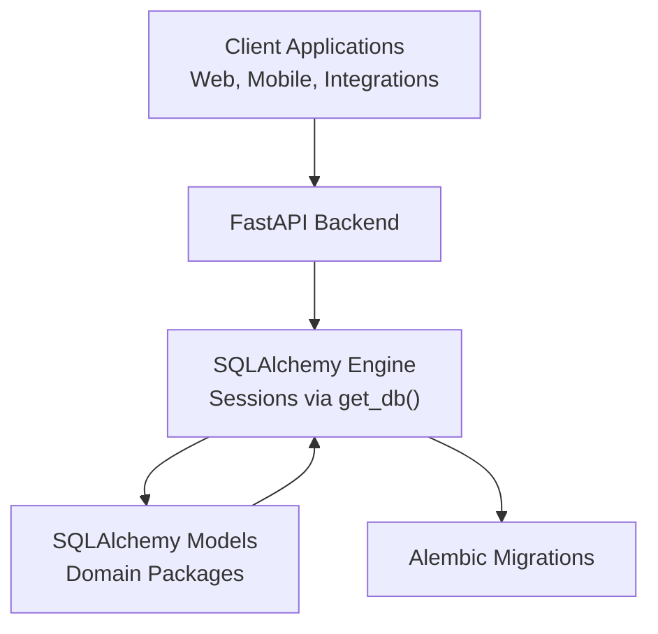

**Diagram sources**
- [app/database.py:38-54](file://app/database.py#L38-L54)
- [alembic/env.py:25-26](file://alembic/env.py#L25-L26)
- [app/models/__init__.py:1-69](file://app/models/__init__.py#L1-L69)

**Section sources**
- [app/database.py:1-63](file://app/database.py#L1-L63)
- [alembic/env.py:1-80](file://alembic/env.py#L1-L80)
- [app/models/__init__.py:1-69](file://app/models/__init__.py#L1-L69)

## Detailed Component Analysis

### Multi-Tenant Design and Company Context
- Company serves as the tenant boundary. All major entities (users, employees, tax settings, allowances, etc.) are scoped to a company via foreign keys.
- Company-level defaults influence payroll method, work week days, and language preferences.
- Users are associated with a company and can be linked to an employee record for self-service access.

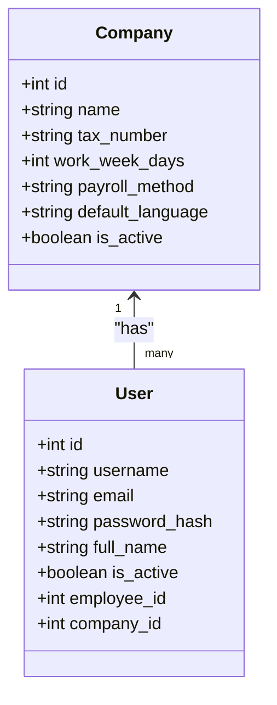

**Diagram sources**
- [app/models/auth.py:22-48](file://app/models/auth.py#L22-L48)
- [app/models/auth.py:110-132](file://app/models/auth.py#L110-L132)

**Section sources**
- [app/models/auth.py:22-48](file://app/models/auth.py#L22-L48)
- [app/models/auth.py:110-132](file://app/models/auth.py#L110-L132)

### Employee and Organizational Data
- Employees are linked to departments, positions, employment statuses, and grades.
- Demographic and tax fields include NPWP and PTKP status aligned with Indonesian regulations.
- Indexes optimize queries by company, department, and PTKP status.

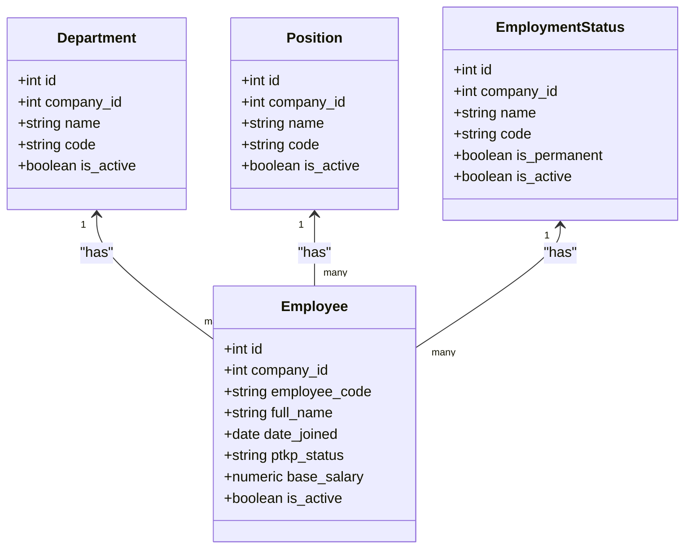

**Diagram sources**
- [app/models/employee.py:20-131](file://app/models/employee.py#L20-L131)

**Section sources**
- [app/models/employee.py:1-132](file://app/models/employee.py#L1-L132)

### Salary and Compensation
- Grades define hierarchical levels; a salary matrix defines min/max ranges with effective/end dates.
- Allowance types support fixed, percentage, or formula-based calculations and are marked taxable/BPJS base.
- Employee allowances are assigned with effective date ranges.
- Deduction types capture recurring or one-time deductions.

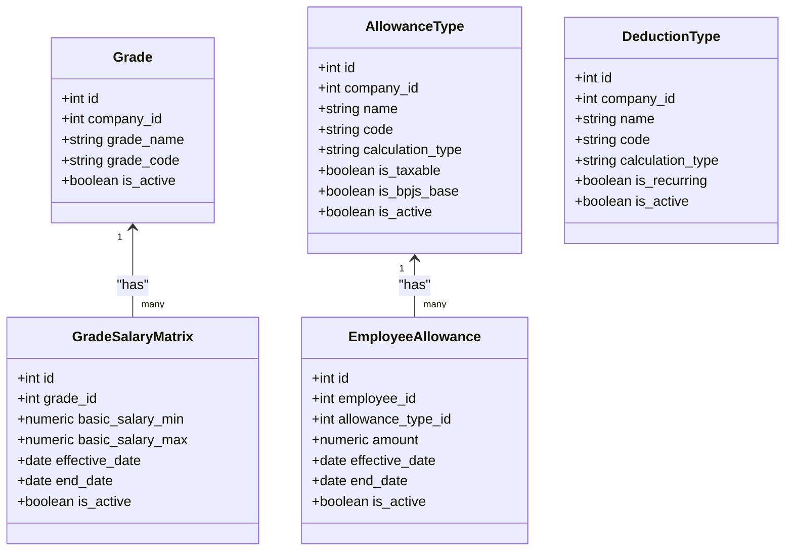

**Diagram sources**
- [app/models/salary.py:21-134](file://app/models/salary.py#L21-L134)

**Section sources**
- [app/models/salary.py:1-135](file://app/models/salary.py#L1-L135)

### Tax Compliance (Indonesian PPh)
- TaxSetting stores company-level tax calculation method (PASAL_17 or TER).
- PtkpValue holds monthly thresholds per PTKP category aligned with regulations.
- TaxBracketPasal17 defines progressive tax brackets for UU HPP.
- TerBracket defines TER categories and rates for simplified tax computation.

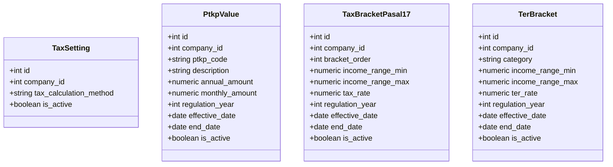

**Diagram sources**
- [app/models/tax.py:19-114](file://app/models/tax.py#L19-L114)

**Section sources**
- [app/models/tax.py:1-115](file://app/models/tax.py#L1-L115)

### BPJS Configuration
- BpjsSetting defines contribution rates and optional caps for KESEHATAN, JHT, JP, JKK, JKM per company and effective date.

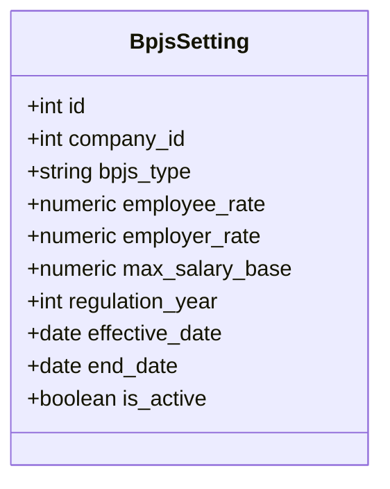

**Diagram sources**
- [app/models/bpjs.py:17-43](file://app/models/bpjs.py#L17-L43)

**Section sources**
- [app/models/bpjs.py:1-44](file://app/models/bpjs.py#L1-L44)

### Attendance and Overtime
- Shift defines work timing and break duration.
- EmployeeShiftAssignment links employees to shifts with effective date ranges.
- AttendanceRecord captures daily presence with status and lateness metrics.
- OvertimeRecord tracks overtime hours, multipliers, and approval lifecycle.
- OvertimeSetting configures company-level multipliers and weekly pattern.

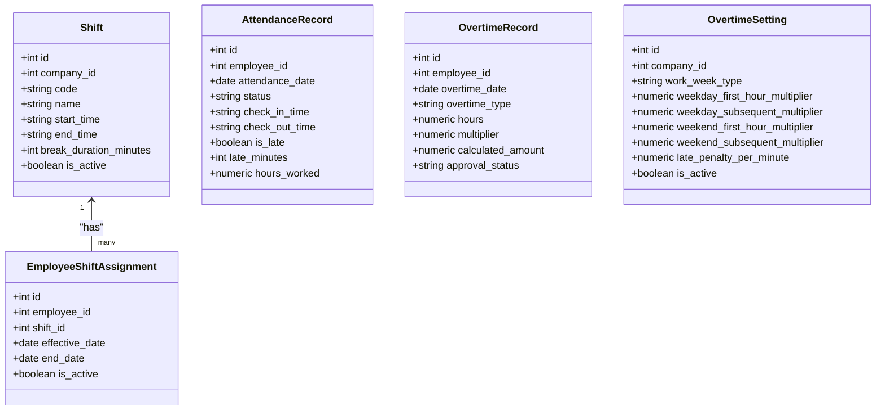

**Diagram sources**
- [app/models/attendance.py:21-133](file://app/models/attendance.py#L21-L133)

**Section sources**
- [app/models/attendance.py:1-134](file://app/models/attendance.py#L1-L134)

### Leaves
- LeaveType defines categories with default annual entitlements and approval requirements.
- EmployeeLeaveBalance tracks opening/closing balances and carry-forward per year.
- LeaveRequest manages submission, approvals, and status transitions.

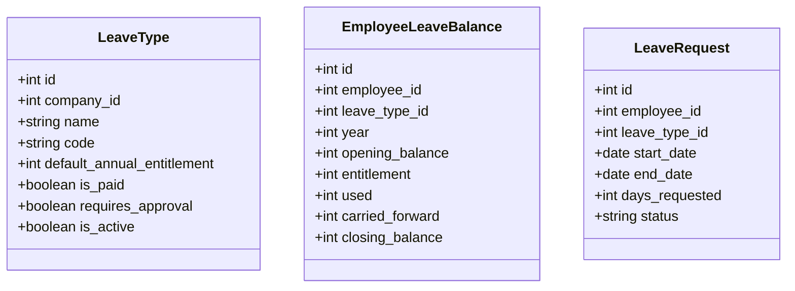

**Diagram sources**
- [app/models/leave.py:19-96](file://app/models/leave.py#L19-L96)

**Section sources**
- [app/models/leave.py:1-97](file://app/models/leave.py#L1-L97)

### Kasbon (Employee Advances)
- KasbonRequest models loan requests with installments, amounts, and status.
- KasbonInstallment schedules payments and optionally links to a payroll run.

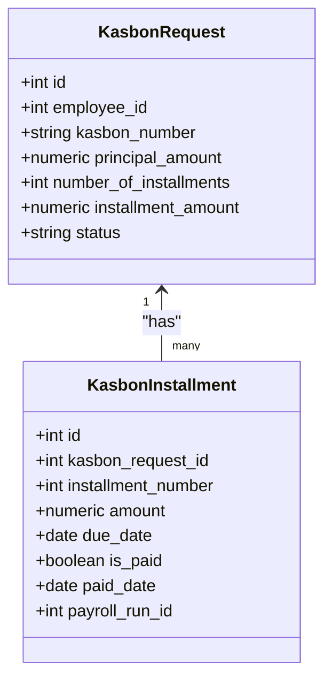

**Diagram sources**
- [app/models/kasbon.py:18-77](file://app/models/kasbon.py#L18-L77)

**Section sources**
- [app/models/kasbon.py:1-78](file://app/models/kasbon.py#L1-L78)

### Bonuses and Reimbursements
- BonusType and Bonus track award types and processed bonuses linked to payroll runs.
- ReimbursementType and Reimbursement handle expense claims with approval and processing.

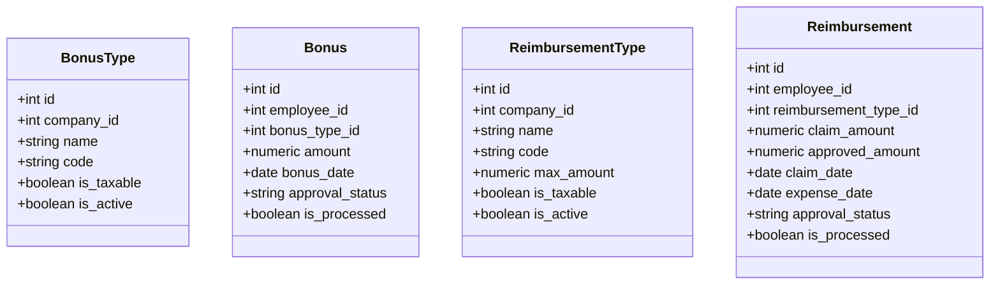

**Diagram sources**
- [app/models/bonus.py:20-122](file://app/models/bonus.py#L20-L122)

**Section sources**
- [app/models/bonus.py:1-123](file://app/models/bonus.py#L1-L123)

### Payroll Processing
- PayrollRun orchestrates batch processing per company and period with status tracking.
- Payslip aggregates earnings, deductions, taxes, and BPJS contributions per employee.
- PayslipLine itemizes each line (earning, deduction, tax, BPJS, net) with categorization and sorting.

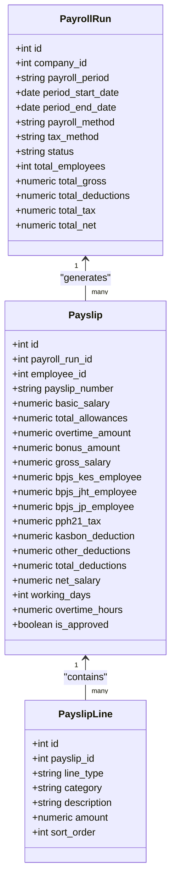

**Diagram sources**
- [app/models/payroll.py:19-123](file://app/models/payroll.py#L19-L123)

**Section sources**
- [app/models/payroll.py:1-124](file://app/models/payroll.py#L1-L124)

### Integration, Localization, and Audit
- AiSetting enables AI integrations per company with provider configuration.
- Language and Translation support multi-language UI and messaging.
- AuditLog records user actions across entities for compliance and traceability.

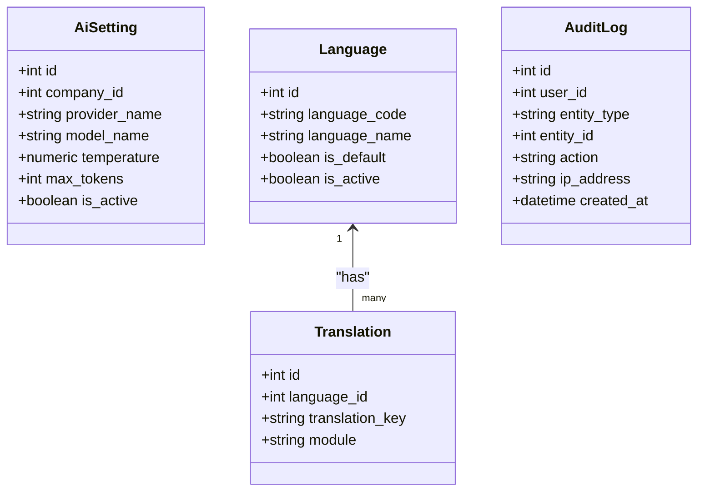

**Diagram sources**
- [app/models/integration.py:21-92](file://app/models/integration.py#L21-L92)

**Section sources**
- [app/models/integration.py:1-93](file://app/models/integration.py#L1-L93)

### Practical Use Cases and Workflows

#### Payslip Generation
- Scenario: At month-end, a PayrollRun is created for a company’s payroll period. The system aggregates attendance, allowances, overtime, bonuses, and applies tax and BPJS calculations based on employee data and company settings. Each employee receives a Payslip with a breakdown via PayslipLine entries.

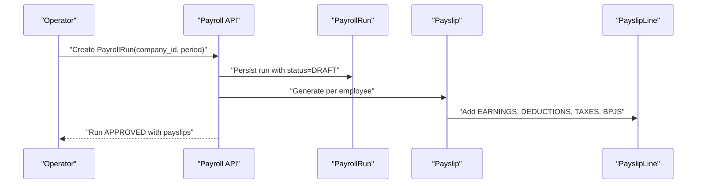

**Diagram sources**
- [app/models/payroll.py:19-123](file://app/models/payroll.py#L19-L123)

**Section sources**
- [app/models/payroll.py:1-124](file://app/models/payroll.py#L1-L124)

#### Attendance Tracking and Overtime
- Scenario: An employee clocks in/out daily. AttendanceRecord captures status and lateness. OvertimeRecords are submitted and approved; multipliers from OvertimeSetting compute amounts included in Payslip.

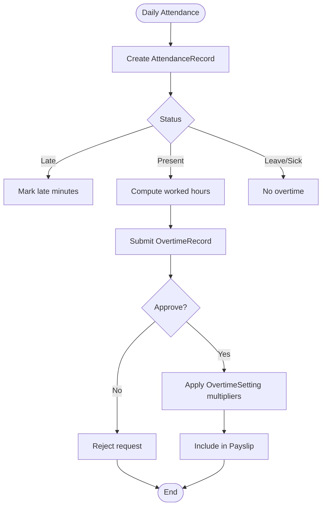

**Diagram sources**
- [app/models/attendance.py:56-133](file://app/models/attendance.py#L56-L133)

**Section sources**
- [app/models/attendance.py:1-134](file://app/models/attendance.py#L1-L134)

#### Tax Computation (PPh Pasal 17 and TER)
- Scenario: Based on company tax settings and employee PTKP status, the system selects applicable brackets or TER rates to compute PPH21 tax for each payslip.

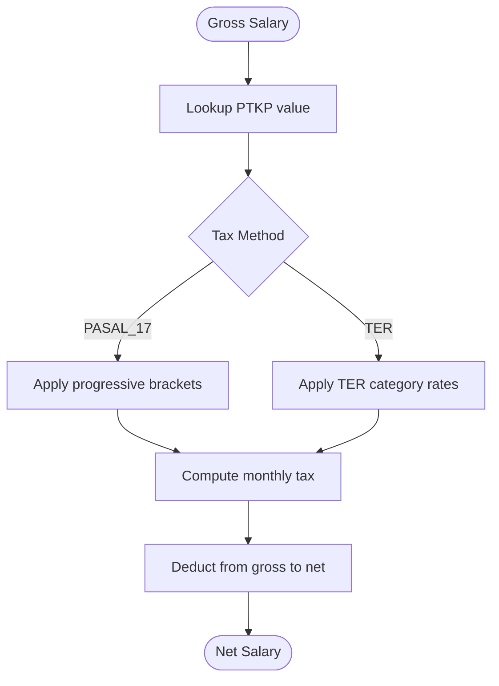

**Diagram sources**
- [app/models/tax.py:19-114](file://app/models/tax.py#L19-L114)

**Section sources**
- [app/models/tax.py:1-115](file://app/models/tax.py#L1-L115)

#### Leave Management
- Scenario: An employee submits a leave request; the system validates entitlements via EmployeeLeaveBalance and updates status upon approval.

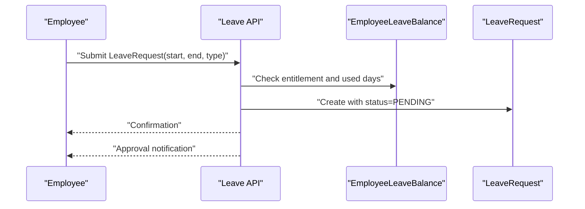

**Diagram sources**
- [app/models/leave.py:66-96](file://app/models/leave.py#L66-L96)

**Section sources**
- [app/models/leave.py:1-97](file://app/models/leave.py#L1-L97)

## Dependency Analysis
- Database and sessions: Centralized engine and get_db() dependency inject sessions for each request.
- Model registry: app/models/__init__.py exposes all domain models for Alembic autogenerate and Base metadata.
- Migrations: Alembic env loads Base metadata and runs offline/online migrations with batch rendering.
- Seed data: Initial Indonesian regulatory defaults are loaded via app/seed/seed_data.py.

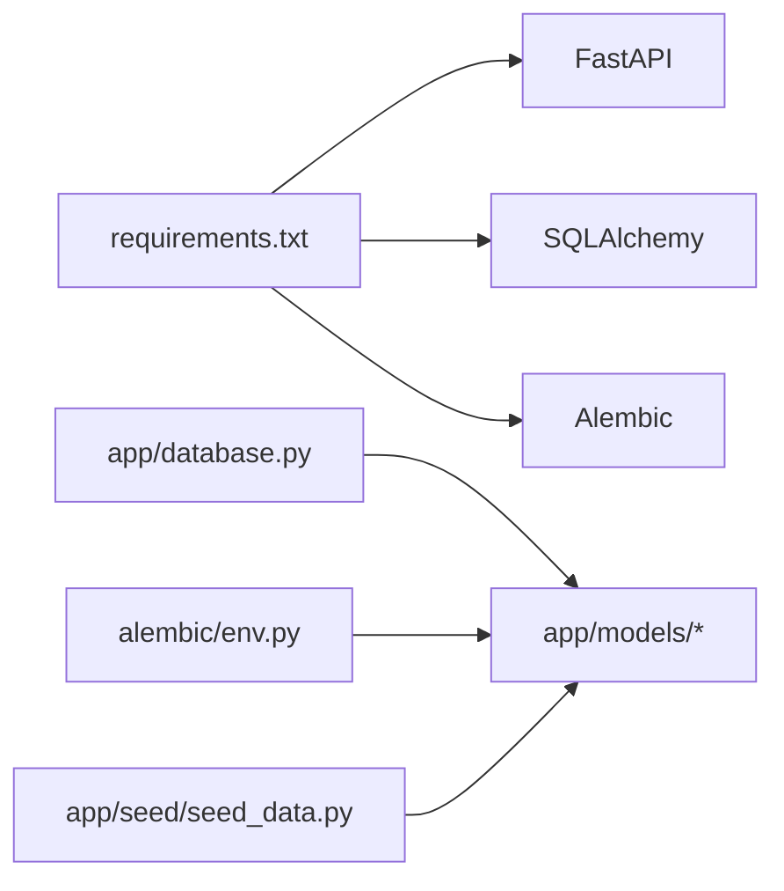

**Diagram sources**
- [requirements.txt:1-14](file://requirements.txt#L1-L14)
- [app/database.py:15-17](file://app/database.py#L15-L17)
- [alembic/env.py:14-26](file://alembic/env.py#L14-L26)
- [app/seed/seed_data.py:19-24](file://app/seed/seed_data.py#L19-L24)

**Section sources**
- [requirements.txt:1-14](file://requirements.txt#L1-L14)
- [app/database.py:1-63](file://app/database.py#L1-L63)
- [alembic/env.py:1-80](file://alembic/env.py#L1-L80)
- [app/seed/seed_data.py:1-448](file://app/seed/seed_data.py#L1-L448)

## Performance Considerations
- Database tuning: Static connection pooling and foreign key enforcement for SQLite; consider connection pooling and indexing strategies for production-grade databases.
- Query optimization: Leverage existing indexes on frequently filtered columns (e.g., employee_id, status, payroll period).
- Batch operations: Use bulk inserts during seeding and migrations; avoid N+1 queries by eager-loading relationships where appropriate.
- Caching: Consider caching company-level settings (tax, BPJS, overtime) to reduce repeated lookups.

## Troubleshooting Guide
- Database initialization: Ensure Base.metadata.create_all is invoked at startup or run Alembic migrations to create tables.
- Session lifecycle: Use the get_db() dependency to ensure sessions are yielded and closed properly.
- Migration errors: Confirm Alembic env loads Base.metadata and render_as_batch is enabled for SQLite compatibility.
- Regulatory data: Verify seed data is executed to populate Indonesian defaults (PTKP, tax brackets, BPJS, languages, leave types).

**Section sources**
- [app/database.py:56-63](file://app/database.py#L56-L63)
- [app/database.py:38-54](file://app/database.py#L38-L54)
- [alembic/env.py:25-79](file://alembic/env.py#L25-L79)
- [app/seed/seed_data.py:27-63](file://app/seed/seed_data.py#L27-L63)

## Conclusion
This Indonesian Payroll & HRIS backend provides a solid, multi-tenant foundation for automating payroll, attendance, leaves, bonuses, and tax compliance with Indonesian regulations. Its modular SQLAlchemy models, robust RBAC, and regulatory-aligned data structures enable scalable deployments for HR and finance teams. The combination of FastAPI for APIs, SQLAlchemy for persistence, and Alembic for migrations offers a maintainable and extensible architecture suitable for both small businesses and enterprise-scale operations.

## Appendices
- Multi-tenant scope: All major entities are bound to Company via foreign keys, ensuring tenant isolation.
- Auditability: AuditLog captures key actions across entities for compliance and traceability.
- Localization: Language and Translation tables prepare the system for multi-language support.