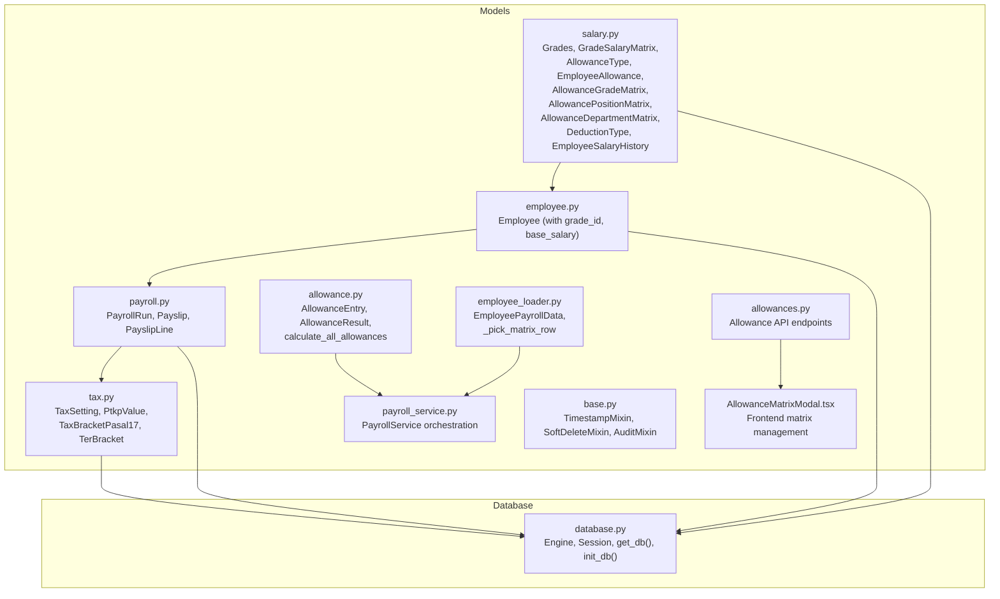
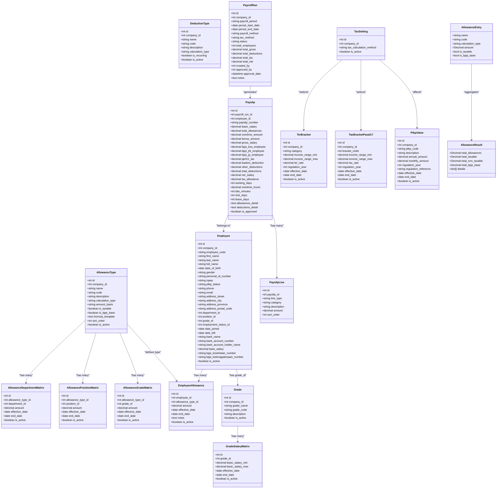
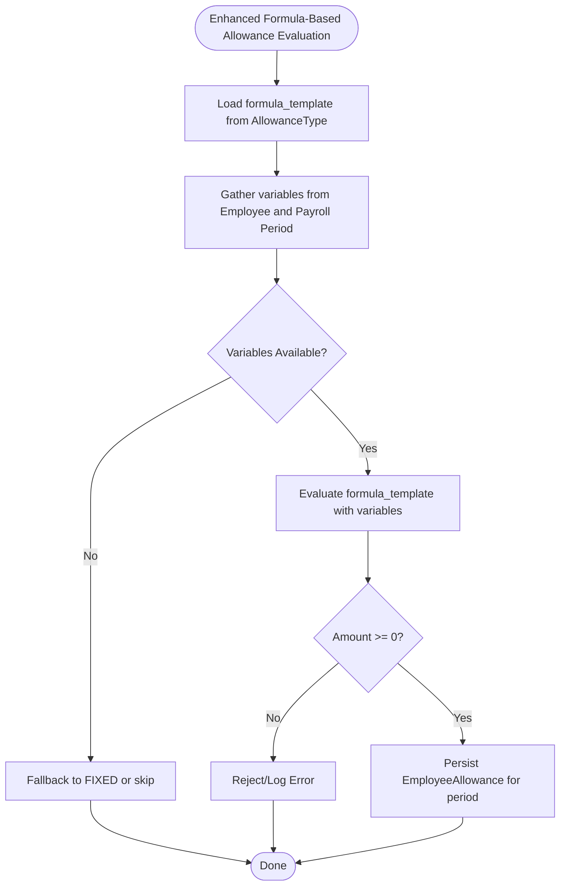
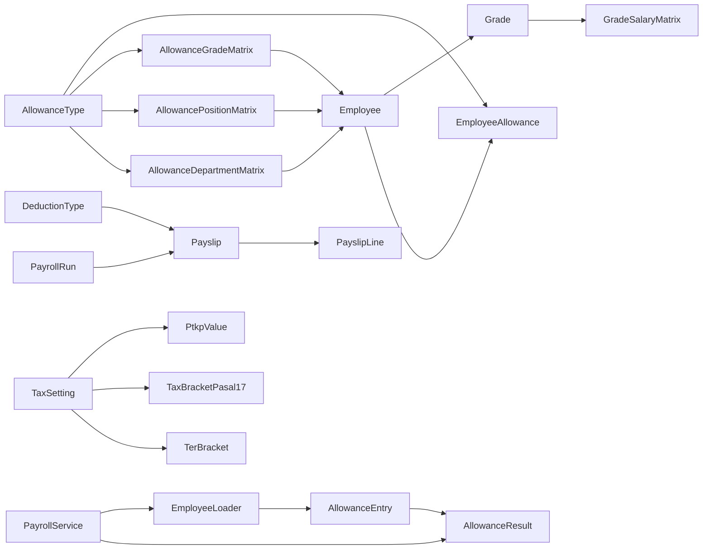

# Salary & Compensation

<cite>
**Referenced Files in This Document**
- [salary.py](file://app/models/salary.py)
- [payroll.py](file://app/models/payroll.py)
- [employee.py](file://app/models/employee.py)
- [tax.py](file://app/models/tax.py)
- [allowance.py](file://app/calculations/allowance.py)
- [employee_loader.py](file://app/services/employee_loader.py)
- [payroll_service.py](file://app/services/payroll_service.py)
- [allowances.py](file://app/routers/allowances.py)
- [AllowanceMatrixModal.tsx](file://frontend/src/components/settings/AllowanceMatrixModal.tsx)
- [seed_data.py](file://app/seed/seed_data.py)
- [database.py](file://app/database.py)
- [base.py](file://app/models/base.py)
</cite>

## Update Summary
**Changes Made**
- Added comprehensive allowance matrix system with grade, position, and department-based calculations
- Enhanced salary processing with allowance matrices for dynamic compensation tracking
- Implemented grade-based calculations with effective date handling
- Added new allowance matrix models and APIs for administrative management
- Updated payroll calculation engine to support matrix-based allowance determination

## Table of Contents
1. [Introduction](#introduction)
2. [Project Structure](#project-structure)
3. [Core Components](#core-components)
4. [Architecture Overview](#architecture-overview)
5. [Detailed Component Analysis](#detailed-component-analysis)
6. [Dependency Analysis](#dependency-analysis)
7. [Performance Considerations](#performance-considerations)
8. [Troubleshooting Guide](#troubleshooting-guide)
9. [Conclusion](#conclusion)
10. [Appendices](#appendices)

## Introduction
This document explains the enhanced salary and compensation system implemented in the Payroll & HRIS application. The system now features comprehensive allowance matrices, grade-based calculations, and dynamic compensation tracking capabilities. It covers the expanded salary grade system with allowance matrices, grade salary matrix, allowance types and management, deduction configurations, and employee-specific compensation setups. The system now supports sophisticated allowance calculations based on organizational hierarchy and effective date management for accurate payroll processing.

## Project Structure
The salary and compensation domain is primarily modeled under the app/models package, with supporting models for payroll, taxes, and employee master data. The system now includes dedicated allowance matrix tables for grade, position, and department-based calculations. The database engine and session management are centralized in app/database.py, while reusable mixins for auditing and soft deletion live in app/models/base.py. The seed module initializes Indonesian regulatory defaults (PTKP, tax brackets, BPJS rates) that inform tax and benefit computations.

**Diagram sources**
- [salary.py:21-248](file://app/models/salary.py#L21-L248)
- [payroll.py:19-124](file://app/models/payroll.py#L19-L124)
- [employee.py:76-142](file://app/models/employee.py#L76-L142)
- [tax.py:19-115](file://app/models/tax.py#L19-L115)
- [allowance.py:19-122](file://app/calculations/allowance.py#L19-L122)
- [employee_loader.py:140-265](file://app/services/employee_loader.py#L140-L265)
- [payroll_service.py:51-378](file://app/services/payroll_service.py#L51-L378)
- [allowances.py:12-473](file://app/routers/allowances.py#L12-L473)
- [AllowanceMatrixModal.tsx:77-459](file://frontend/src/components/settings/AllowanceMatrixModal.tsx#L77-L459)
- [base.py:18-57](file://app/models/base.py#L18-L57)
- [database.py:17-63](file://app/database.py#L17-L63)

**Section sources**
- [salary.py:1-248](file://app/models/salary.py#L1-L248)
- [payroll.py:1-124](file://app/models/payroll.py#L1-L124)
- [employee.py:1-142](file://app/models/employee.py#L1-L142)
- [tax.py:1-115](file://app/models/tax.py#L1-L115)
- [allowance.py:1-122](file://app/calculations/allowance.py#L1-L122)
- [employee_loader.py:1-265](file://app/services/employee_loader.py#L1-L265)
- [payroll_service.py:1-478](file://app/services/payroll_service.py#L1-L478)
- [allowances.py:1-473](file://app/routers/allowances.py#L1-L473)
- [AllowanceMatrixModal.tsx:1-459](file://frontend/src/components/settings/AllowanceMatrixModal.tsx#L1-L459)

## Core Components
This section introduces the enhanced core entities that define the salary and compensation system:

- **Enhanced Salary Grade System**
  - Grade: Defines company-specific employee grades with unique codes and activation flags.
  - GradeSalaryMatrix: Stores minimum and maximum basic salary bands per grade with effective/end dates and activation flags.

- **Comprehensive Allowance Matrix System**
  - AllowanceType: Defines company-wide allowance types with calculation modes (FIXED, PERCENTAGE, FORMULA), amount basis (UNIVERSAL, GRADE, POSITION, DEPARTMENT, INDIVIDUAL), taxability, BPJS base inclusion, formula templates, ordering, and activation flags.
  - AllowanceGradeMatrix: Stores allowance amounts per grade with effective dates and activation flags.
  - AllowancePositionMatrix: Stores allowance amounts per position with effective dates and activation flags.
  - AllowanceDepartmentMatrix: Stores allowance amounts per department with effective dates and activation flags.
  - EmployeeAllowance: Assigns specific allowance amounts to employees for given periods with effective/end dates and activation flags.

- **Enhanced Deduction Management**
  - DeductionType: Defines company-wide deduction types with calculation modes (FIXED, PERCENTAGE, FORMULA), recurrence flags, and activation flags.

- **Advanced Payroll and Tax Integration**
  - PayrollRun: Batch payroll processing with method (GROSS, GROSS_UP, NETT), tax method (PASAL_17, TER), status lifecycle, totals, and approvals.
  - Payslip: Per-employee payslip with basic salary, allowances, overtime, bonuses, gross, taxes, BPJS contributions, deductions, and net salary.
  - PayslipLine: Line-item breakdown of earnings, deductions, taxes, and BPJS entries.
  - TaxSetting, PtkpValue, TaxBracketPasal17, TerBracket: Regulatory configuration for Indonesian income tax computation.

- **Enhanced Employee Master Data**
  - Employee: Includes grade_id, position_id, department_id, and base_salary fields that link to the enhanced grade system and can influence initial compensation setup.

**Section sources**
- [salary.py:21-248](file://app/models/salary.py#L21-L248)
- [payroll.py:19-124](file://app/models/payroll.py#L19-L124)
- [employee.py:76-142](file://app/models/employee.py#L76-L142)
- [tax.py:19-115](file://app/models/tax.py#L19-L115)
- [allowance.py:19-122](file://app/calculations/allowance.py#L19-L122)

## Architecture Overview
The enhanced salary and compensation architecture connects employee master data, grade structures, allowance matrices, and payroll runs. The system now supports matrix-based allowance calculations that consider organizational hierarchy and effective dates. Payroll calculations aggregate earnings (basic, allowances, overtime, bonuses) and subtract taxes, BPJS contributions, and other deductions to produce net pay. Tax computation relies on company-level settings and regulatory brackets.

**Diagram sources**
- [salary.py:21-248](file://app/models/salary.py#L21-L248)
- [payroll.py:19-124](file://app/models/payroll.py#L19-L124)
- [employee.py:76-142](file://app/models/employee.py#L76-L142)
- [tax.py:19-115](file://app/models/tax.py#L19-L115)
- [allowance.py:19-122](file://app/calculations/allowance.py#L19-L122)

## Detailed Component Analysis

### Enhanced Salary Grade System
- **Purpose**: Define hierarchical employee grades with company-scoped uniqueness and activation controls.
- **Key attributes**: grade_name, grade_code, description, is_active.
- **Relationship**: One-to-many with GradeSalaryMatrix for salary bands.
- **Enhancement**: Now integrates with allowance matrix system for grade-based calculations.

Practical example (conceptual steps):
- Create a new grade with a unique code under a company.
- Add grade salary matrix rows with effective dates and min/max bands.
- Configure allowance types with amount_basis set to GRADE to utilize grade matrix.
- Assign employees to a grade; their base salary can be derived from the matrix during payroll processing.

**Section sources**
- [salary.py:21-39](file://app/models/salary.py#L21-L39)
- [salary.py:41-59](file://app/models/salary.py#L41-L59)

### Comprehensive Allowance Matrix System
- **AllowanceType Enhancement**:
  - calculation_type supports FIXED, PERCENTAGE, FORMULA.
  - amount_basis supports UNIVERSAL, GRADE, POSITION, DEPARTMENT, INDIVIDUAL.
  - is_taxable and is_bpjs_base flags control tax and contribution bases.
  - formula_template enables dynamic computation templates.
  - sort_order defines presentation order.
- **AllowanceGradeMatrix**:
  - Stores allowance amounts per grade with effective dates and activation flags.
  - Unique constraint prevents duplicate entries for same type, grade, and effective date.
- **AllowancePositionMatrix**:
  - Stores allowance amounts per position with effective dates and activation flags.
  - Unique constraint prevents duplicate entries for same type, position, and effective date.
- **AllowanceDepartmentMatrix**:
  - Stores allowance amounts per department with effective dates and activation flags.
  - Unique constraint prevents duplicate entries for same type, department, and effective date.

Practical example (conceptual steps):
- Define allowance types with amount_basis set to GRADE, POSITION, or DEPARTMENT.
- Create matrix entries for each allowance type specifying amounts for different organizational units.
- Configure effective dates to manage historical changes and future adjustments.
- During payroll processing, the system automatically selects the appropriate matrix row based on employee's organizational hierarchy.

**Section sources**
- [salary.py:62-90](file://app/models/salary.py#L62-L90)
- [salary.py:119-182](file://app/models/salary.py#L119-L182)

### Advanced Employee-Specific Compensation Setups
- **Employee model enhancement**: Includes grade_id, position_id, and department_id fields.
- **Linking to matrices**: Allows deriving allowances from grade, position, or department matrices.
- **Direct assignments**: EmployeeAllowance still supports individual employee allowance assignments.
- **Hierarchical precedence**: Matrix-based allowances take precedence over individual assignments when applicable.

Practical example (conceptual steps):
- On employee record update, set grade_id, position_id, and department_id.
- Configure allowance types with appropriate amount_basis (GRADE, POSITION, DEPARTMENT).
- Create matrix entries for each allowance type and organizational level.
- Assign allowances via EmployeeAllowance for INDIVIDUAL basis or rely on matrix for hierarchical basis.

**Section sources**
- [employee.py:76-142](file://app/models/employee.py#L76-L142)
- [salary.py:93-116](file://app/models/salary.py#L93-L116)

### Enhanced Payroll Calculation Engine
- **PayrollService orchestration**:
  - Enhanced to coordinate matrix-based allowance loading and calculation.
  - Integrates with EmployeeLoader for comprehensive employee data including matrix allowances.
- **Allowance calculation enhancement**:
  - AllowanceEntry and AllowanceResult data structures support detailed breakdown.
  - calculate_all_allowances function aggregates totals by taxable/non-taxable and BPJS base categories.
- **Matrix-based allowance selection**:
  - EmployeeLoader loads allowance types and applies effective date filtering.
  - _pick_matrix_row function selects appropriate matrix row based on period and entity hierarchy.
  - Supports GRADE, POSITION, and DEPARTMENT matrix bases.

Practical example (conceptual steps):
- For each employee in a payroll period, the system:
  - Loads active allowance types with amount_basis set to GRADE, POSITION, or DEPARTMENT.
  - Queries matrix tables for applicable entries filtered by effective_date range.
  - Selects the most appropriate matrix row based on employee's organizational hierarchy.
  - Calculates allowance amounts using the selected matrix values.
  - Aggregates all allowances with proper tax and BPJS categorization.
  - Computes gross salary including basic salary, allowances, overtime, and bonuses.
  - Applies tax calculations using selected tax method and regulatory brackets.
  - Calculates net salary after deductions and produces detailed payslip.

**Section sources**
- [payroll_service.py:262-378](file://app/services/payroll_service.py#L262-L378)
- [allowance.py:19-122](file://app/calculations/allowance.py#L19-L122)
- [employee_loader.py:140-265](file://app/services/employee_loader.py#L140-L265)

### Frontend Allowance Matrix Management
- **AllowanceMatrixModal component**:
  - Provides user interface for managing allowance matrix entries.
  - Supports GRADE, POSITION, and DEPARTMENT matrix types.
  - Integrates with backend APIs for CRUD operations.
  - Handles entity validation and form submission.
- **API integration**:
  - Fetches allowance types and matrix entries via REST endpoints.
  - Loads master data (grades, positions, departments) for entity selection.
  - Supports add, edit, and delete operations with proper validation.

Practical example (conceptual steps):
- Navigate to allowance configuration in admin panel.
- Select allowance type with amount_basis set to GRADE, POSITION, or DEPARTMENT.
- Open matrix modal to view existing entries.
- Click "Tambah" to add new matrix entry.
- Select entity from dropdown (grade, position, or department).
- Enter amount, effective date, and optional end date.
- Toggle activation status as needed.
- Save changes to persist matrix entry.

**Section sources**
- [AllowanceMatrixModal.tsx:77-459](file://frontend/src/components/settings/AllowanceMatrixModal.tsx#L77-L459)
- [allowances.py:235-473](file://app/routers/allowances.py#L235-L473)

### Tax and Regulatory Compliance
- **TaxSetting**:
  - Selects company-level tax calculation method (PASAL_17 or TER).
- **PtkpValue**:
  - Provides monthly PTKP thresholds for tax computation.
- **TaxBracketPasal17**:
  - Progressive tax brackets for UU HPP 2024.
- **TerBracket**:
  - Simplified TER brackets by category.

Seed initialization demonstrates:
- Seeding PTKP values for 2024.
- Seeding PASAL_17 tax brackets for 2024.
- Seeding default tax settings to PASAL_17.

Practical example (conceptual steps):
- At runtime, select TaxSetting for the company.
- Retrieve active PtkpValue for the month and active TaxBracketPasal17 or TerBracket depending on method.
- Compute taxable income and tax liability accordingly.

**Section sources**
- [tax.py:19-115](file://app/models/tax.py#L19-L115)
- [seed_data.py:224-430](file://app/seed/seed_data.py#L224-L430)

### Dynamic Allowance Formula Execution
- **AllowanceType.formula_template** stores a template string for formula-based allowances.
- **Enhanced calculation logic**:
  - Resolve variables from the employee record (e.g., base_salary).
  - Optionally incorporate period-specific factors (e.g., working_days).
  - Evaluate the formula to produce a numeric amount.
  - Persist the computed amount via EmployeeAllowance for the payroll period.
- **Current implementation** treats FORMULA type as FIXED in v1 with reserved support for future expansion.

**Diagram sources**
- [salary.py:62-90](file://app/models/salary.py#L62-L90)
- [salary.py:93-116](file://app/models/salary.py#L93-L116)
- [allowance.py:42-69](file://app/calculations/allowance.py#L42-L69)

## Dependency Analysis
The enhanced salary and compensation system exhibits clear separation of concerns with improved matrix-based calculations:
- Models encapsulate domain entities with constraints and relationships including new matrix tables.
- PayrollService orchestrates batch processing with enhanced matrix loading and calculation.
- EmployeeLoader coordinates matrix-based allowance loading with effective date filtering.
- Allowance calculation functions provide pure computation utilities.
- Tax models provide regulatory configuration selected by TaxSetting.
- Employee model bridges to organizational hierarchy for matrix-based compensation.
- Frontend components integrate with backend APIs for matrix management.

**Diagram sources**
- [salary.py:21-248](file://app/models/salary.py#L21-L248)
- [payroll_service.py:262-378](file://app/services/payroll_service.py#L262-L378)
- [employee_loader.py:140-265](file://app/services/employee_loader.py#L140-L265)
- [allowance.py:19-122](file://app/calculations/allowance.py#L19-L122)
- [tax.py:19-115](file://app/models/tax.py#L19-L115)

**Section sources**
- [salary.py:21-248](file://app/models/salary.py#L21-L248)
- [payroll_service.py:262-378](file://app/services/payroll_service.py#L262-L378)
- [employee_loader.py:140-265](file://app/services/employee_loader.py#L140-L265)
- [allowance.py:19-122](file://app/calculations/allowance.py#L19-L122)
- [tax.py:19-115](file://app/models/tax.py#L19-L115)

## Performance Considerations
- **Enhanced indexing and constraints**:
  - Unique constraints on matrix tables prevent duplicates and speed lookups.
  - Check constraints enforce data integrity (e.g., amount >= 0, valid enums).
  - Indexes on payroll runs and payslips optimize filtering by status and employee.
  - New indexes on matrix tables for allowance_type_id, entity_id, and effective_date combinations.
- **Efficient matrix queries**:
  - Filter active matrix rows by effective_date range and is_active flag.
  - Load matrix rows for all relevant allowance types in single queries per basis.
  - Build lookup maps for O(1) matrix row selection during payroll processing.
  - Use _pick_matrix_row function to select appropriate matrix entry based on period.
- **Optimized payroll processing**:
  - Batch load matrix data for all employees in a single transaction.
  - Use efficient dictionary lookups for matrix row retrieval.
  - Leverage SQLAlchemy relationships for cascading operations.
- **Caching strategies**:
  - Cache frequently accessed regulatory data (PTKP, tax brackets) per company and period.
  - Cache allowance type configurations and matrix data for active payroll runs.
- **Batch processing improvements**:
  - Process PayrollRun in batches to limit memory usage and improve throughput.
  - Implement lazy loading for matrix data where appropriate.

## Troubleshooting Guide
Common issues and resolutions grounded in enhanced model constraints and matrix-based processing:

- **Invalid salary range**
  - Symptom: Insertion fails due to min > max.
  - Resolution: Ensure basic_salary_min ≤ basic_salary_max in GradeSalaryMatrix.

- **Duplicate allowance assignment**
  - Symptom: Unique constraint violation for employee/type/effective_date.
  - Resolution: Adjust effective_date or end_date to avoid overlap; or update existing record.

- **Invalid calculation type**
  - Symptom: Constraint error for allowance/deduction calculation_type.
  - Resolution: Use FIXED, PERCENTAGE, or FORMULA consistently.

- **Matrix entry conflicts**
  - Symptom: Duplicate matrix entry for same allowance type, entity, and effective date.
  - Resolution: Adjust effective_date or end_date to create separate entries; or update existing record.

- **Amount basis mismatch**
  - Symptom: Cannot create matrix entry because allowance amount_basis doesn't match entity type.
  - Resolution: Ensure allowance.amount_basis matches GRADE, POSITION, or DEPARTMENT as appropriate.

- **Matrix row selection issues**
  - Symptom: Employee receives wrong allowance amount despite correct matrix entries.
  - Resolution: Verify effective_date ranges don't overlap and are properly ordered; check entity hierarchy precedence.

- **Tax method mismatch**
  - Symptom: PayrollRun tax_method not in allowed set.
  - Resolution: Set PayrollRun.tax_method to PASAL_17 or TER.

- **Missing regulatory configuration**
  - Symptom: Tax computation cannot resolve PTKP or brackets.
  - Resolution: Seed default tax settings and brackets for the company and year.

**Section sources**
- [salary.py:54-59](file://app/models/salary.py#L54-L59)
- [salary.py:105-116](file://app/models/salary.py#L105-L116)
- [salary.py:132-138](file://app/models/salary.py#L132-L138)
- [salary.py:154-160](file://app/models/salary.py#L154-L160)
- [salary.py:176-182](file://app/models/salary.py#L176-L182)
- [salary.py:79-90](file://app/models/salary.py#L79-L90)
- [payroll.py:46-58](file://app/models/payroll.py#L46-L58)
- [allowances.py:325-332](file://app/routers/allowances.py#L325-L332)
- [seed_data.py:412-430](file://app/seed/seed_data.py#L412-L430)

## Conclusion
The enhanced salary and compensation system models provide a robust foundation for managing employee grades, allowance types, matrix-based compensation, deductions, and payroll runs. The addition of comprehensive allowance matrices with grade, position, and department-based calculations significantly improves the system's flexibility and accuracy. By leveraging company-scoped definitions, effective-date windows, hierarchical organization data, and regulatory compliance data, the system supports sophisticated and accurate payroll calculations. The seed module establishes Indonesian tax and benefit defaults, ensuring readiness for real-world payroll processing. The frontend integration provides intuitive management interfaces for allowance matrix administration.

## Appendices

### Practical Examples (Enhanced)

#### Creating a Grade-Based Allowance Matrix
- Steps: Define AllowanceType with amount_basis set to GRADE; create AllowanceGradeMatrix entries for each grade; set effective_date and amount values; verify matrix precedence over individual assignments.
- References: [salary.py:62-90](file://app/models/salary.py#L62-L90), [salary.py:119-138](file://app/models/salary.py#L119-L138)

#### Configuring Position-Based Allowance Types
- Steps: Create AllowanceType with amount_basis set to POSITION; add AllowancePositionMatrix entries for each position; configure amounts based on job responsibilities; test matrix selection during payroll processing.
- References: [salary.py:62-90](file://app/models/salary.py#L62-L90), [salary.py:141-160](file://app/models/salary.py#L141-L160)

#### Managing Department-Based Allowance Matrices
- Steps: Define AllowanceType with amount_basis set to DEPARTMENT; create AllowanceDepartmentMatrix entries for each department; set amounts reflecting organizational cost centers; monitor matrix effectiveness during payroll runs.
- References: [salary.py:62-90](file://app/models/salary.py#L62-L90), [salary.py:163-182](file://app/models/salary.py#L163-L182)

#### Using the Frontend Matrix Management Interface
- Steps: Navigate to allowance configuration; select allowance type with matrix basis; open matrix modal; add/edit/delete matrix entries; validate entity selection and effective date ranges; save changes and verify in payroll processing.
- References: [AllowanceMatrixModal.tsx:77-459](file://frontend/src/components/settings/AllowanceMatrixModal.tsx#L77-L459), [allowances.py:235-473](file://app/routers/allowances.py#L235-L473)

#### Processing Payroll with Matrix-Based Allowances
- Steps: Configure allowance types with appropriate amount_basis; create matrix entries for all relevant organizational levels; run payroll processing; verify matrix-based allowance calculation; review payslip details for proper categorization.
- References: [payroll_service.py:262-378](file://app/services/payroll_service.py#L262-L378), [employee_loader.py:140-265](file://app/services/employee_loader.py#L140-L265)

#### Relating Hierarchical Structures to Employee Salaries and Payroll
- Steps: Assign grade_id, position_id, and department_id to Employee; configure allowance types with appropriate amount_basis; create matrix entries; derive allowances from matrix rather than individual assignments; aggregate all components into gross; compute taxes and deductions; produce net salary in Payslip.
- References: [employee.py:76-142](file://app/models/employee.py#L76-L142), [payroll_service.py:262-378](file://app/services/payroll_service.py#L262-L378)

#### Regulatory Compliance with Enhanced Matrix System
- Steps: Seed TaxSetting to PASAL_17; seed PtkpValue and TaxBracketPasal17 for the year; configure allowance matrices with proper taxability flags; test matrix-based calculations against regulatory requirements; maintain audit trails for matrix changes.
- References: [seed_data.py:412-430](file://app/seed/seed_data.py#L412-L430), [tax.py:19-115](file://app/models/tax.py#L19-L115)