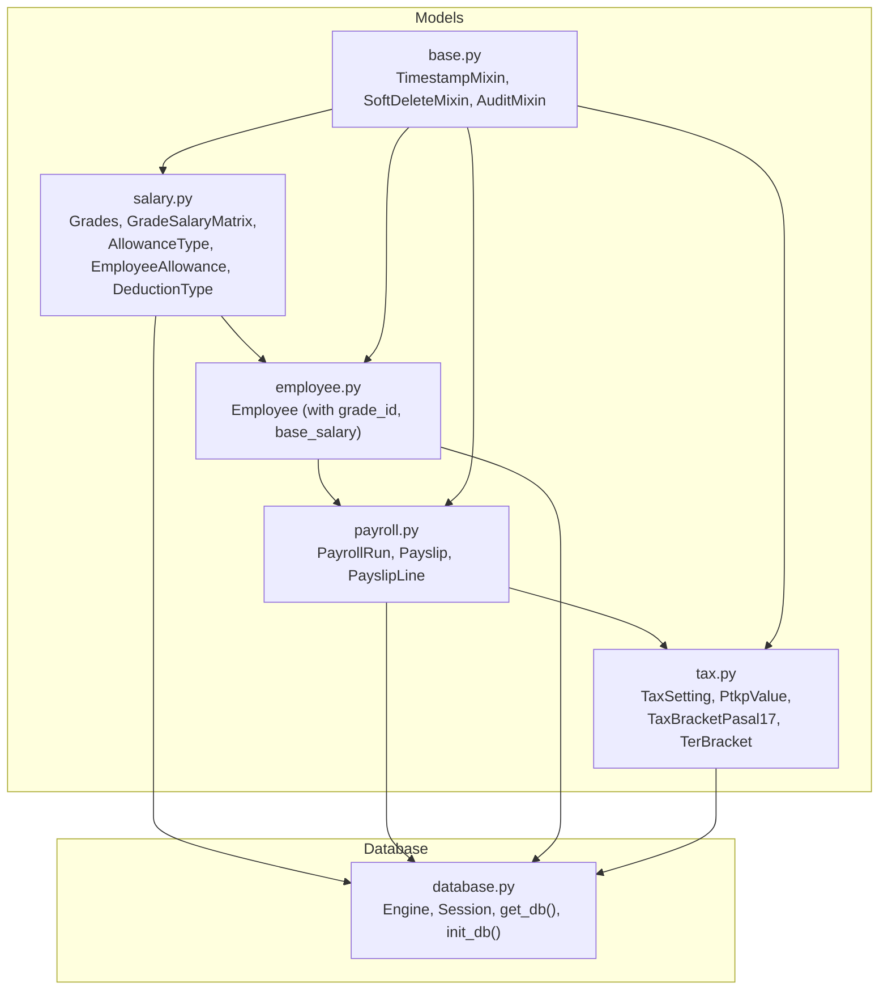
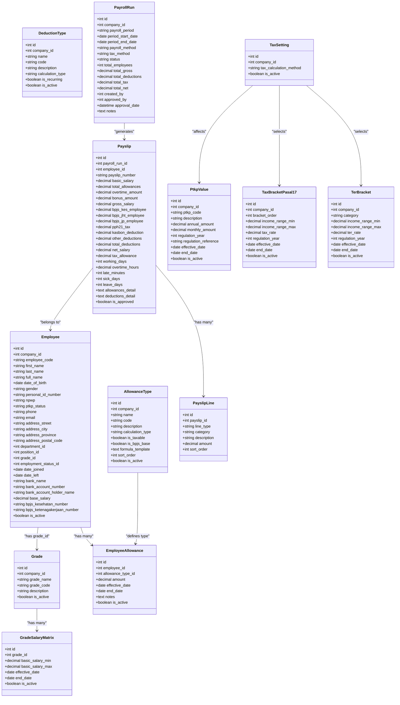
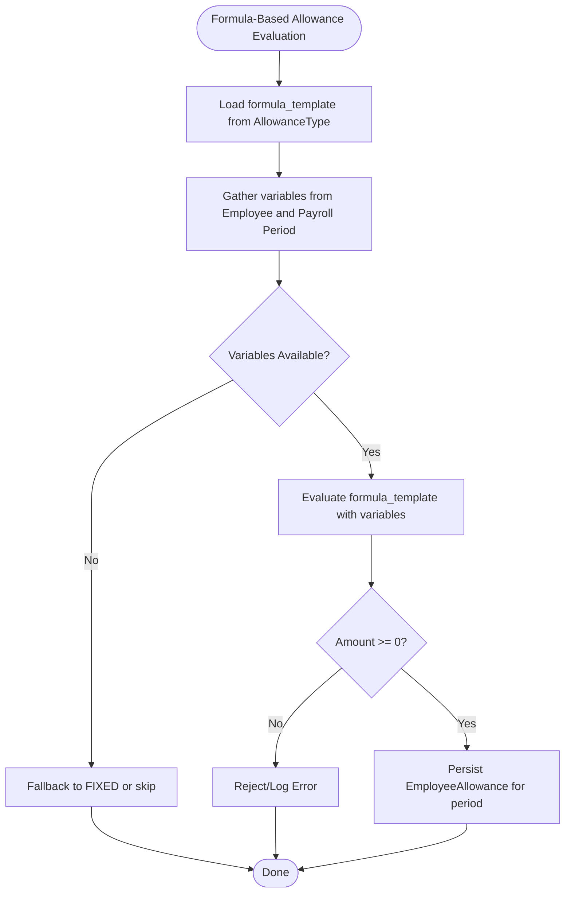
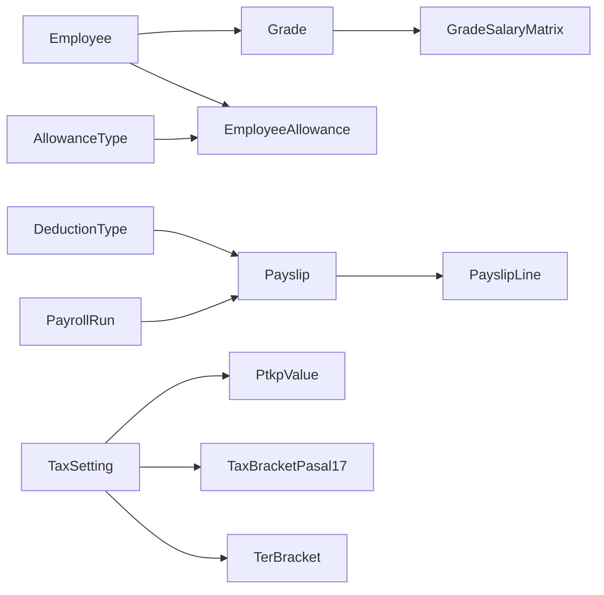

# Salary & Compensation

<cite>
**Referenced Files in This Document**
- [salary.py](file://app/models/salary.py)
- [payroll.py](file://app/models/payroll.py)
- [employee.py](file://app/models/employee.py)
- [tax.py](file://app/models/tax.py)
- [seed_data.py](file://app/seed/seed_data.py)
- [database.py](file://app/database.py)
- [base.py](file://app/models/base.py)
</cite>

## Table of Contents
1. [Introduction](#introduction)
2. [Project Structure](#project-structure)
3. [Core Components](#core-components)
4. [Architecture Overview](#architecture-overview)
5. [Detailed Component Analysis](#detailed-component-analysis)
6. [Dependency Analysis](#dependency-analysis)
7. [Performance Considerations](#performance-considerations)
8. [Troubleshooting Guide](#troubleshooting-guide)
9. [Conclusion](#conclusion)
10. [Appendices](#appendices)

## Introduction
This document explains the salary and compensation system implemented in the Payroll & HRIS application. It covers the salary grade system, grade salary matrix, allowance types and management, deduction configurations, and employee-specific compensation setups. It also documents the salary structure models, allowance formulas, and dynamic compensation calculation methods, along with practical examples for creating salary grades, configuring allowances, assigning employee allowances, and managing deductions. Finally, it clarifies the relationship between salary grades, individual employee salaries, and payroll calculations, and addresses compensation policies and regulatory compliance aspects grounded in the repository’s data models and seed configuration.

## Project Structure
The salary and compensation domain is primarily modeled under the app/models package, with supporting models for payroll, taxes, and employee master data. The database engine and session management are centralized in app/database.py, while reusable mixins for auditing and soft deletion live in app/models/base.py. The seed module initializes Indonesian regulatory defaults (PTKP, tax brackets, BPJS rates) that inform tax and benefit computations.

**Diagram sources**
- [salary.py:21-135](file://app/models/salary.py#L21-L135)
- [payroll.py:19-124](file://app/models/payroll.py#L19-L124)
- [employee.py:76-132](file://app/models/employee.py#L76-L132)
- [tax.py:19-115](file://app/models/tax.py#L19-L115)
- [base.py:18-57](file://app/models/base.py#L18-L57)
- [database.py:17-63](file://app/database.py#L17-L63)

**Section sources**
- [salary.py:1-135](file://app/models/salary.py#L1-L135)
- [payroll.py:1-124](file://app/models/payroll.py#L1-L124)
- [employee.py:1-132](file://app/models/employee.py#L1-L132)
- [tax.py:1-115](file://app/models/tax.py#L1-L115)
- [base.py:1-57](file://app/models/base.py#L1-L57)
- [database.py:1-63](file://app/database.py#L1-L63)

## Core Components
This section introduces the core entities that define the salary and compensation system:

- Salary Grades and Matrix
  - Grade: Defines company-specific employee grades with unique codes and activation flags.
  - GradeSalaryMatrix: Stores minimum and maximum basic salary bands per grade with effective/end dates and activation flags.

- Allowance Management
  - AllowanceType: Defines company-wide allowance types with calculation modes (FIXED, PERCENTAGE, FORMULA), taxability, BPJS base inclusion, formula templates, ordering, and activation flags.
  - EmployeeAllowance: Assigns specific allowance amounts to employees for given periods with effective/end dates and activation flags.

- Deduction Management
  - DeductionType: Defines company-wide deduction types with calculation modes (FIXED, PERCENTAGE, FORMULA), recurrence flags, and activation flags.

- Payroll and Tax Integration
  - PayrollRun: Batch payroll processing with method (GROSS/NETT), tax method (PASAL_17/TER), status lifecycle, totals, and approvals.
  - Payslip: Per-employee payslip with basic salary, allowances, overtime, bonuses, gross, taxes, BPJS contributions, deductions, and net salary.
  - PayslipLine: Line-item breakdown of earnings, deductions, taxes, and BPJS entries.
  - TaxSetting, PtkpValue, TaxBracketPasal17, TerBracket: Regulatory configuration for Indonesian income tax computation.

- Employee Master Data
  - Employee: Includes grade_id and base_salary fields that link to the grade system and can influence initial compensation setup.

**Section sources**
- [salary.py:21-135](file://app/models/salary.py#L21-L135)
- [payroll.py:19-124](file://app/models/payroll.py#L19-L124)
- [employee.py:76-132](file://app/models/employee.py#L76-L132)
- [tax.py:19-115](file://app/models/tax.py#L19-L115)

## Architecture Overview
The salary and compensation architecture connects employee master data, grade structures, allowance/deduction definitions, and payroll runs. Payroll calculations aggregate earnings (basic, allowances, overtime, bonuses) and subtract taxes, BPJS contributions, and other deductions to produce net pay. Tax computation relies on company-level settings and regulatory brackets.

**Diagram sources**
- [salary.py:21-135](file://app/models/salary.py#L21-L135)
- [payroll.py:19-124](file://app/models/payroll.py#L19-L124)
- [employee.py:76-132](file://app/models/employee.py#L76-L132)
- [tax.py:19-115](file://app/models/tax.py#L19-L115)

## Detailed Component Analysis

### Salary Grade System
- Purpose: Define hierarchical employee grades with company-scoped uniqueness and activation controls.
- Key attributes: grade_name, grade_code, description, is_active.
- Relationship: One-to-many with GradeSalaryMatrix for salary bands.

Practical example (conceptual steps):
- Create a new grade with a unique code under a company.
- Add grade salary matrix rows with effective dates and min/max bands.
- Assign employees to a grade; their base salary can be derived from the matrix during payroll processing.

**Section sources**
- [salary.py:21-39](file://app/models/salary.py#L21-L39)

### Grade Salary Matrix
- Purpose: Store legal and internal salary bands per grade with validity windows.
- Key attributes: basic_salary_min, basic_salary_max, effective_date, end_date, is_active.
- Constraints: Min must be less than or equal to Max.

Practical example (conceptual steps):
- For a given grade, insert a matrix row with current effective date and appropriate min/max.
- When an employee’s base falls outside the band, adjust grade or add a new matrix row with revised dates.

**Section sources**
- [salary.py:41-59](file://app/models/salary.py#L41-L59)

### Allowance Types and Management
- AllowanceType:
  - calculation_type supports FIXED, PERCENTAGE, FORMULA.
  - is_taxable and is_bpjs_base flags control tax and contribution bases.
  - formula_template enables dynamic computation templates.
  - sort_order defines presentation order.
- EmployeeAllowance:
  - Assigns a specific amount or computed value to an employee for a period.
  - Amount must be non-negative; uniqueness enforced by employee, type, and effective date.

Practical example (conceptual steps):
- Define allowance types (e.g., transportation, housing, performance) with FIXED or PERCENTAGE or FORMULA.
- For FORMULA types, populate formula_template with placeholders for variables (e.g., basic_salary, days_worked).
- Assign allowances to employees with effective_date aligned to payroll period.

**Section sources**
- [salary.py:62-85](file://app/models/salary.py#L62-L85)
- [salary.py:88-111](file://app/models/salary.py#L88-L111)

### Deduction Types and Management
- DeductionType:
  - calculation_type supports FIXED, PERCENTAGE, FORMULA.
  - is_recurring indicates whether deductions repeat automatically.
- Supports company-scoped definitions and activation flags.

Practical example (conceptual steps):
- Define deductions (e.g., loan repayment, insurance, tax advance).
- Set is_recurring for automatic periodic deductions.
- During payroll, compute deduction amounts per employee and period.

**Section sources**
- [salary.py:114-135](file://app/models/salary.py#L114-L135)

### Employee-Specific Compensation Setups
- Employee model includes grade_id and base_salary fields.
- Linking to Grade and GradeSalaryMatrix allows deriving or validating base salary during processing.
- EmployeeAllowance ties individual allowances to employees with effective periods.

Practical example (conceptual steps):
- On employee record update, set grade_id and optionally override base_salary.
- Assign allowances via EmployeeAllowance with effective_date matching the payroll period.

**Section sources**
- [employee.py:76-132](file://app/models/employee.py#L76-L132)
- [salary.py:88-111](file://app/models/salary.py#L88-L111)

### Payroll Calculation Models
- PayrollRun:
  - Defines batch period, method (GROSS vs NETT), tax method (PASAL_17 vs TER), status lifecycle, and totals.
- Payslip:
  - Aggregates basic_salary, total_allowances, overtime_amount, bonus_amount into gross_salary.
  - Deductions include BPJS contributions, pph21_tax, kasbon_deduction, other_deductions, and computes total_deductions and net_salary.
  - Includes metadata like working_days, overtime_hours, and textual details for allowances and deductions.
- PayslipLine:
  - Breakdown of line items categorized as EARNING, DEDUCTION, TAX, BPJS, or NET.

Practical example (conceptual steps):
- For each employee in a payroll period, compute:
  - Basic salary from grade matrix or employee base_salary.
  - Allowances from EmployeeAllowance and any formula-driven values.
  - Overtime and bonuses from related records.
  - Taxes using TaxSetting and applicable brackets (PASAL_17 or TER).
  - BPJS contributions based on employee and employer rates.
  - Other deductions from DeductionType definitions.
  - Net equals gross minus total deductions.

**Section sources**
- [payroll.py:19-124](file://app/models/payroll.py#L19-L124)

### Tax and Regulatory Compliance
- TaxSetting:
  - Selects company-level tax calculation method (PASAL_17 or TER).
- PtkpValue:
  - Provides monthly PTKP thresholds for tax computation.
- TaxBracketPasal17:
  - Progressive tax brackets for UU HPP 2024.
- TerBracket:
  - Simplified TER brackets by category.

Seed initialization demonstrates:
- Seeding PTKP values for 2024.
- Seeding PASAL_17 tax brackets for 2024.
- Seeding default tax settings to PASAL_17.

Practical example (conceptual steps):
- At runtime, select TaxSetting for the company.
- Retrieve active PtkpValue for the month and active TaxBracketPasal17 or TerBracket depending on method.
- Compute taxable income and tax liability accordingly.

**Section sources**
- [tax.py:19-115](file://app/models/tax.py#L19-L115)
- [seed_data.py:224-430](file://app/seed/seed_data.py#L224-L430)

### Dynamic Allowance Formula Execution
- AllowanceType.formula_template stores a template string for formula-based allowances.
- Computation logic should:
  - Resolve variables from the employee record (e.g., base_salary).
  - Optionally incorporate period-specific factors (e.g., working_days).
  - Evaluate the formula to produce a numeric amount.
  - Persist the computed amount via EmployeeAllowance for the payroll period.

**Diagram sources**
- [salary.py:62-85](file://app/models/salary.py#L62-L85)
- [salary.py:88-111](file://app/models/salary.py#L88-L111)

## Dependency Analysis
The salary and compensation system exhibits clear separation of concerns:
- Models encapsulate domain entities with constraints and relationships.
- PayrollRun orchestrates batch processing and links to Payslip.
- Payslip aggregates earnings and deductions and references Employee.
- Tax models provide regulatory configuration selected by TaxSetting.
- Employee model bridges to Grade and GradeSalaryMatrix indirectly through compensation setup.

**Diagram sources**
- [salary.py:21-135](file://app/models/salary.py#L21-L135)
- [payroll.py:19-124](file://app/models/payroll.py#L19-L124)
- [tax.py:19-115](file://app/models/tax.py#L19-L115)

**Section sources**
- [salary.py:21-135](file://app/models/salary.py#L21-L135)
- [payroll.py:19-124](file://app/models/payroll.py#L19-L124)
- [tax.py:19-115](file://app/models/tax.py#L19-L115)

## Performance Considerations
- Indexes and constraints:
  - Unique constraints on company-scoped codes prevent duplicates and speed lookups.
  - Check constraints enforce data integrity (e.g., min ≤ max, valid enums).
  - Indexes on payroll runs and payslips optimize filtering by status and employee.
- Efficient queries:
  - Filter active matrix rows by effective_date and is_active.
  - Join allowance types with employee allowances using effective_date windows.
  - Use TaxSetting to select applicable regulatory data for the period.
- Caching:
  - Cache frequently accessed regulatory data (PTKP, tax brackets) per company and period.
- Batch processing:
  - Process PayrollRun in batches to limit memory usage and improve throughput.

[No sources needed since this section provides general guidance]

## Troubleshooting Guide
Common issues and resolutions grounded in model constraints and seed configuration:

- Invalid salary range
  - Symptom: Insertion fails due to min > max.
  - Resolution: Ensure basic_salary_min ≤ basic_salary_max in GradeSalaryMatrix.

- Duplicate allowance assignment
  - Symptom: Unique constraint violation for employee/type/effective_date.
  - Resolution: Adjust effective_date or end_date to avoid overlap; or update existing record.

- Invalid calculation type
  - Symptom: Constraint error for allowance/deduction calculation_type.
  - Resolution: Use FIXED, PERCENTAGE, or FORMULA consistently.

- Tax method mismatch
  - Symptom: PayrollRun tax_method not in allowed set.
  - Resolution: Set PayrollRun.tax_method to PASAL_17 or TER.

- Missing regulatory configuration
  - Symptom: Tax computation cannot resolve PTKP or brackets.
  - Resolution: Seed default tax settings and brackets for the company and year.

**Section sources**
- [salary.py:54-59](file://app/models/salary.py#L54-L59)
- [salary.py:105-111](file://app/models/salary.py#L105-L111)
- [salary.py:79-85](file://app/models/salary.py#L79-L85)
- [payroll.py:46-58](file://app/models/payroll.py#L46-L58)
- [seed_data.py:412-430](file://app/seed/seed_data.py#L412-L430)

## Conclusion
The salary and compensation system models provide a robust foundation for managing employee grades, allowance types, employee-specific allowances, deductions, and payroll runs. By leveraging company-scoped definitions, effective-date windows, and regulatory compliance data, the system supports accurate and compliant payroll calculations. The seed module establishes Indonesian tax and benefit defaults, ensuring readiness for real-world payroll processing.

[No sources needed since this section summarizes without analyzing specific files]

## Appendices

### Practical Examples (Conceptual)
- Creating a Salary Grade
  - Steps: Define Grade with company_id, grade_code, grade_name; add GradeSalaryMatrix rows with effective_date and min/max bands.
  - References: [salary.py:21-59](file://app/models/salary.py#L21-L59)

- Configuring Allowance Types
  - Steps: Create AllowanceType with calculation_type (FIXED/PERCENTAGE/FORMULA), is_taxable, is_bpjs_base, optional formula_template, sort_order.
  - References: [salary.py:62-85](file://app/models/salary.py#L62-L85)

- Assigning Employee Allowances
  - Steps: Create EmployeeAllowance linking employee_id and allowance_type_id, set amount or computed value, specify effective_date and optional end_date.
  - References: [salary.py:88-111](file://app/models/salary.py#L88-L111)

- Managing Deductions
  - Steps: Define DeductionType with calculation_type and is_recurring; apply during payroll to compute deduction amounts per employee.
  - References: [salary.py:114-135](file://app/models/salary.py#L114-L135)

- Relating Grades to Employee Salaries and Payroll
  - Steps: Assign grade_id to Employee; derive basic_salary from GradeSalaryMatrix for the period; aggregate allowances, overtime, bonuses into gross; compute taxes and deductions; produce net salary in Payslip.
  - References: [employee.py:76-132](file://app/models/employee.py#L76-L132), [payroll.py:19-124](file://app/models/payroll.py#L19-L124)

- Regulatory Compliance
  - Steps: Seed TaxSetting to PASAL_17; seed PtkpValue and TaxBracketPasal17 for the year; optionally configure TerBracket.
  - References: [seed_data.py:412-430](file://app/seed/seed_data.py#L412-L430), [tax.py:19-115](file://app/models/tax.py#L19-L115)