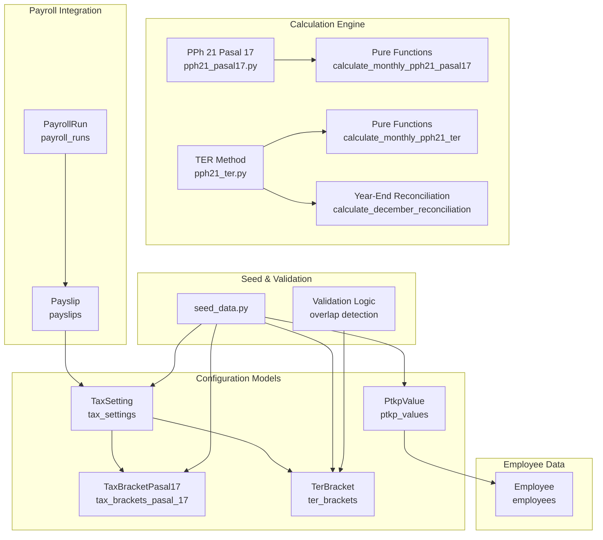
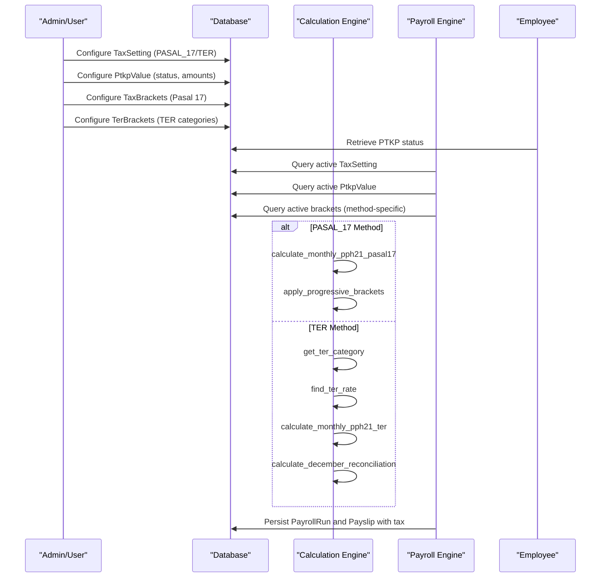
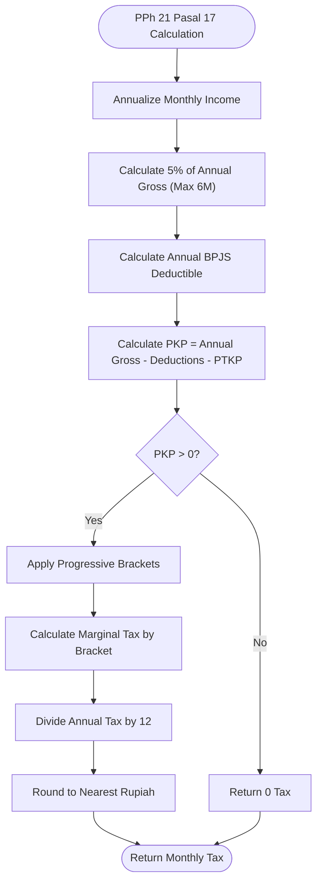
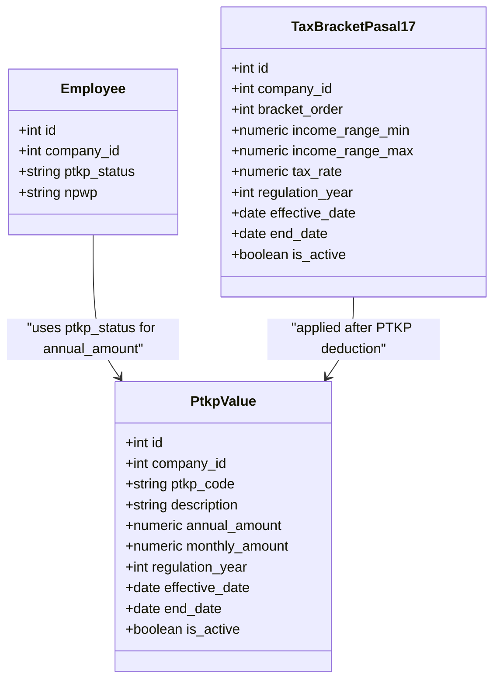
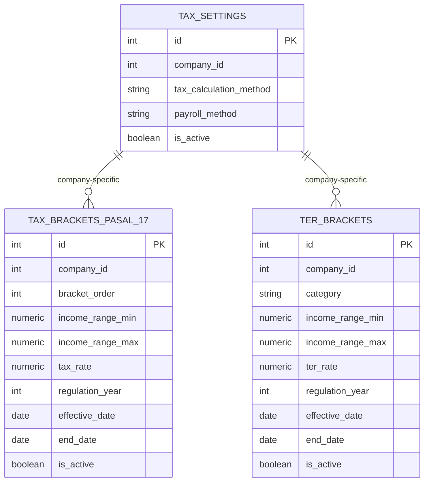
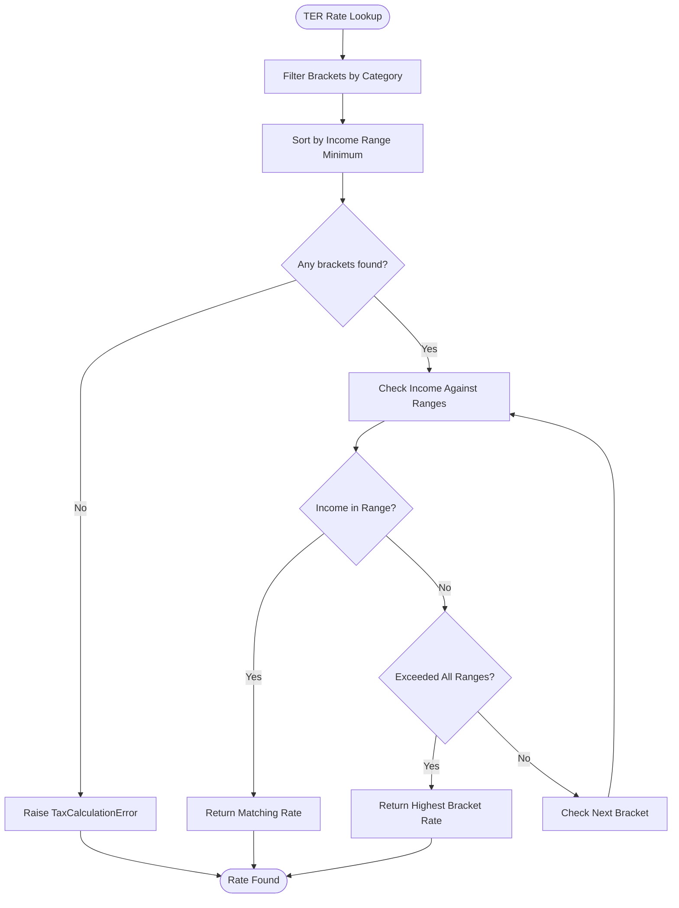
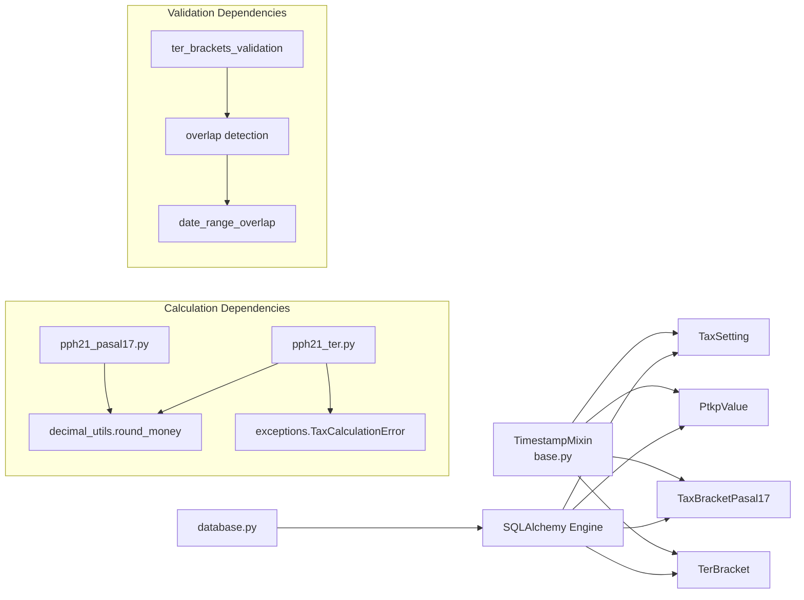

# Tax Compliance

<cite>
**Referenced Files in This Document**
- [tax.py](file://app/models/tax.py)
- [pph21_pasal17.py](file://app/calculations/pph21_pasal17.py)
- [pph21_ter.py](file://app/calculations/pph21_ter.py)
- [seed_data.py](file://app/seed/seed_data.py)
- [payroll.py](file://app/models/payroll.py)
- [employee.py](file://app/models/employee.py)
- [database.py](file://app/database.py)
- [base.py](file://app/models/base.py)
- [test_pph21_pasal17.py](file://tests/test_pph21_pasal17.py)
- [test_pph21_ter.py](file://tests/test_pph21_ter.py)
</cite>

## Update Summary
**Changes Made**
- Added comprehensive PPh 21 calculation engine with both Pasal 17 progressive tax and TER (Tarif Efektif Rata-rata) methods
- Implemented advanced tax compliance system with dual calculation methodologies
- Enhanced tax management with territorial tax handling and year-end reconciliation
- Expanded tax setting administration to support both PASAL_17 and TER calculation methods
- Integrated pure calculation functions with database-backed tax configuration models

## Table of Contents
1. [Introduction](#introduction)
2. [Project Structure](#project-structure)
3. [Core Components](#core-components)
4. [Architecture Overview](#architecture-overview)
5. [Detailed Component Analysis](#detailed-component-analysis)
6. [Advanced Tax Calculation Methods](#advanced-tax-calculation-methods)
7. [Territorial Tax Handling](#territorial-tax-handling)
8. [Year-End Tax Reconciliation](#year-end-tax-reconciliation)
9. [Dependency Analysis](#dependency-analysis)
10. [Performance Considerations](#performance-considerations)
11. [Troubleshooting Guide](#troubleshooting-guide)
12. [Conclusion](#conclusion)
13. [Appendices](#appendices)

## Introduction
This document explains the advanced tax compliance subsystem for Indonesian payroll, featuring a comprehensive dual-method tax calculation system:
- **PPh Pasal 17 Progressive Tax Calculation**: Traditional progressive tax system with five-tier brackets (5%, 15%, 25%, 30%, 35%)
- **TER (Tarif Efektif Rata-rata) Method**: Simplified territorial tax calculation with three categories (A, B, C)
- **Advanced Tax Management**: Complete tax setting administration, PTKP management, and bracket configuration
- **Regulatory Compliance**: Alignment with UU HPP 2024 and PMK 168/2023 for both calculation methods
- **Integration Capabilities**: Seamless integration with payroll processing, employee tax obligations, and monthly tax reporting

The system now supports both PASAL_17 and TER tax calculation methods, providing flexibility for different employee categories and tax optimization strategies. The implementation includes pure calculation functions, database-backed configuration models, and comprehensive validation mechanisms.

## Project Structure
The tax compliance domain now encompasses both calculation engines and configuration management:
- **Calculation Layer**: Pure functions for PPh 21 Pasal 17 and TER calculations
- **Configuration Models**: Database-backed tax settings, PTKP values, and bracket configurations
- **Integration Layer**: PayrollRun and Payslip integration with tax computation
- **Validation Layer**: Comprehensive input validation and error handling

**Diagram sources**
- [pph21_pasal17.py:101-139](file://app/calculations/pph21_pasal17.py#L101-L139)
- [pph21_ter.py:103-167](file://app/calculations/pph21_ter.py#L103-L167)
- [tax.py:19-120](file://app/models/tax.py#L19-L120)
- [payroll.py:19-124](file://app/models/payroll.py#L19-L124)
- [employee.py:76-132](file://app/models/employee.py#L76-L132)
- [seed_data.py:423-441](file://app/seed/seed_data.py#L423-L441)

**Section sources**
- [pph21_pasal17.py:1-290](file://app/calculations/pph21_pasal17.py#L1-L290)
- [pph21_ter.py:1-168](file://app/calculations/pph21_ter.py#L1-L168)
- [tax.py:1-120](file://app/models/tax.py#L1-L120)
- [seed_data.py:1-579](file://app/seed/seed_data.py#L1-L579)

## Core Components
The system now features a dual-method tax calculation architecture:

### Calculation Engine Components
- **PPh 21 Pasal 17 Engine**: Pure calculation functions with TaxBracket dataclass and progressive tax application
- **TER Method Engine**: Pure calculation functions with TerBracketData and category-based rate lookup
- **Year-End Reconciliation**: December tax calculation with Pasal 17 recalculation and adjustment

### Configuration Management Components
- **TaxSetting**: Company-level tax method selection (PASAL_17 or TER) with payroll method configuration
- **PtkpValue**: PTKP thresholds per employee status with annual/monthly amounts and effective dates
- **TaxBracketPasal17**: Progressive tax brackets with ordered ranges and rates (5 brackets)
- **TerBracket**: Simplified territorial tax brackets with category-based rates (A/B/C)

### Integration Components
- **PayrollRun and Payslip**: Integration with payroll processing and tax computation
- **Employee**: Employee PTKP status and personal identifiers for tax calculations

**Section sources**
- [pph21_pasal17.py:19-139](file://app/calculations/pph21_pasal17.py#L19-L139)
- [pph21_ter.py:18-167](file://app/calculations/pph21_ter.py#L18-L167)
- [tax.py:19-120](file://app/models/tax.py#L19-L120)

## Architecture Overview
The advanced tax compliance architecture now supports dual calculation methods with comprehensive validation and integration:

**Diagram sources**
- [pph21_pasal17.py:101-139](file://app/calculations/pph21_pasal17.py#L101-L139)
- [pph21_ter.py:41-167](file://app/calculations/pph21_ter.py#L41-L167)
- [tax.py:19-120](file://app/models/tax.py#L19-L120)

## Detailed Component Analysis

### PPh 21 Pasal 17 Progressive Tax Calculation
The system implements a sophisticated progressive tax calculation engine with pure functions and comprehensive validation:

#### Core Calculation Algorithm
1. **Annualization**: Monthly gross × 12
2. **Biaya Jabatan**: min(5% × Annual Gross, 6,000,000)
3. **BPJS Deductible**: (JHT employee + JP employee) × 12
4. **PKP Calculation**: Annual Gross - Biaya Jabatan - BPJS Deductible - PTKP
5. **Progressive Application**: Bracket-wise tax calculation with marginal rates
6. **Monthly Division**: Annual tax ÷ 12 with currency rounding

**Diagram sources**
- [pph21_pasal17.py:33-139](file://app/calculations/pph21_pasal17.py#L33-L139)

**Section sources**
- [pph21_pasal17.py:33-139](file://app/calculations/pph21_pasal17.py#L33-L139)
- [test_pph21_pasal17.py:171-237](file://tests/test_pph21_pasal17.py#L171-L237)

### PTKP Management System
The PTKP (Penghasilan Tidak Kena Pajak) management system supports eight employee status categories with comprehensive annual and monthly calculations:

#### PTKP Categories and Values (2024 Regulation)
- **TK/0**: Tidak Kawin tanpa tanggungan - Rp 54,000,000 annually (Rp 4,500,000 monthly)
- **TK/1**: Tidak Kawin dengan 1 tanggungan - Rp 58,500,000 annually (Rp 4,875,000 monthly)
- **TK/2**: Tidak Kawin dengan 2 tanggungan - Rp 63,000,000 annually (Rp 5,250,000 monthly)
- **TK/3**: Tidak Kawin dengan 3 tanggungan - Rp 67,500,000 annually (Rp 5,625,000 monthly)
- **K/0**: Kawin tanpa tanggungan - Rp 58,500,000 annually (Rp 4,875,000 monthly)
- **K/1**: Kawin dengan 1 tanggungan - Rp 63,000,000 annually (Rp 5,250,000 monthly)
- **K/2**: Kawin dengan 2 tanggungan - Rp 67,500,000 annually (Rp 5,625,000 monthly)
- **K/3**: Kawin dengan 3 tanggungan - Rp 72,000,000 annually (Rp 6,000,000 monthly)

**Diagram sources**
- [tax.py:42-65](file://app/models/tax.py#L42-L65)
- [tax.py:68-90](file://app/models/tax.py#L68-L90)
- [seed_data.py:245-271](file://app/seed/seed_data.py#L245-L271)

**Section sources**
- [tax.py:42-65](file://app/models/tax.py#L42-L65)
- [seed_data.py:245-271](file://app/seed/seed_data.py#L245-L271)

### Tax Bracket Configuration
The system supports five progressive tax brackets with comprehensive validation and effective date management:

#### Pasal 17 Progressive Brackets (2024 Regulation)
- **Bracket 1**: 0 - 60,000,000: 5% rate
- **Bracket 2**: 60,000,000 - 250,000,000: 15% rate  
- **Bracket 3**: 250,000,000 - 500,000,000: 25% rate
- **Bracket 4**: 500,000,000 - 5,000,000,000: 30% rate
- **Bracket 5**: >5,000,000,000: 35% rate (unbounded upper limit)

**Diagram sources**
- [tax.py:19-39](file://app/models/tax.py#L19-L39)
- [tax.py:68-90](file://app/models/tax.py#L68-L90)
- [tax.py:93-119](file://app/models/tax.py#L93-L119)

**Section sources**
- [tax.py:68-90](file://app/models/tax.py#L68-L90)
- [seed_data.py:284-307](file://app/seed/seed_data.py#L284-L307)

## Advanced Tax Calculation Methods

### PPh 21 Pasal 17 Method
The traditional progressive tax calculation method with comprehensive bracket application:

#### Key Features
- **Pure Calculation Functions**: No database access, no side effects
- **Comprehensive Deductions**: Biaya jabatan, BPJS deductible, PTKP application
- **Progressive Application**: Bracket-wise calculation with marginal rates
- **Currency Precision**: Decimal arithmetic with proper rounding

#### Calculation Steps
1. **Annualization**: Convert monthly income to annual income
2. **Biaya Jabatan**: Calculate occupational expense deduction (max 6M/year)
3. **BPJS Deductible**: Annual employee BPJS contribution deduction
4. **PKP Calculation**: Apply all deductions to determine taxable income
5. **Bracket Application**: Apply progressive rates to each bracket tier
6. **Monthly Distribution**: Divide annual tax by 12 for monthly payment

**Section sources**
- [pph21_pasal17.py:101-139](file://app/calculations/pph21_pasal17.py#L101-L139)
- [test_pph21_pasal17.py:171-237](file://tests/test_pph21_pasal17.py#L171-L237)

### TER (Tarif Efektif Rata-rata) Method
The simplified territorial tax calculation method with category-based rates:

#### Category Mapping (PMK 168/2023)
- **Category A**: TK/0, TK/1 (lowest tax burden)
- **Category B**: TK/2, TK/3, K/0, K/1 (medium tax burden)  
- **Category C**: K/2, K/3 (highest tax burden)

#### Monthly vs Year-End Calculation
- **Monthly (January-November)**: Simple gross × TER rate calculation
- **December**: Year-end reconciliation with Pasal 17 recalculation
- **Adjustment**: December tax = Full-year Pasal 17 tax - Jan-Nov TER taxes

**Section sources**
- [pph21_ter.py:41-167](file://app/calculations/pph21_ter.py#L41-L167)
- [test_pph21_ter.py:127-198](file://tests/test_pph21_ter.py#L127-L198)

## Territorial Tax Handling
The system implements comprehensive territorial tax handling with category-based rate determination and effective date management:

### Category-Based Rate Determination
The PTKP status directly determines the TER category assignment:
- **TK/0, TK/1**: Category A (0% initial rate, 0.25% incremental)
- **TK/2, TK/3, K/0, K/1**: Category B (0% initial rate, 0.5% incremental)  
- **K/2, K/3**: Category C (0% initial rate, 0.75% incremental)

### Rate Lookup Algorithm
The system uses binary search-like bracket matching for efficient rate determination:
1. **Category Filtering**: Filter brackets by assigned category
2. **Range Matching**: Find bracket containing the monthly income
3. **Boundary Handling**: Use highest bracket rate if income exceeds all ranges
4. **Validation**: Raise errors for invalid categories or missing brackets

**Diagram sources**
- [pph21_ter.py:66-100](file://app/calculations/pph21_ter.py#L66-L100)

**Section sources**
- [pph21_ter.py:18-118](file://app/calculations/pph21_ter.py#L18-L118)
- [test_pph21_ter.py:56-89](file://tests/test_pph21_ter.py#L56-L89)

## Year-End Tax Reconciliation
The system implements comprehensive year-end tax reconciliation for TER method employees:

### December Calculation Process
The year-end reconciliation ensures tax accuracy by comparing TER payments with actual progressive tax liability:

#### Steps in Year-End Reconciliation
1. **Full-Year Pasal 17 Calculation**: Recalculate annual tax using progressive method
2. **TER Tax Accumulation**: Sum all TER taxes paid from January to November
3. **Adjustment Calculation**: December tax = Full-year Pasal 17 tax - Jan-Nov TER taxes
4. **Non-Negative Constraint**: Return 0 if adjustment is negative (overpayment)
5. **Precision Handling**: Apply proper rounding to nearest Rupiah

#### Validation and Error Handling
- **Input Validation**: Comprehensive parameter validation and type checking
- **Bracket Validation**: Ensure Pasal 17 brackets are available for calculation
- **Category Validation**: Verify TER category mapping exists for PTKP status
- **Range Validation**: Check for overlapping or invalid bracket ranges

**Section sources**
- [pph21_ter.py:121-167](file://app/calculations/pph21_ter.py#L121-L167)
- [test_pph21_ter.py:127-198](file://tests/test_pph21_ter.py#L127-L198)

## Dependency Analysis
The system maintains clean separation between calculation logic and data persistence:

**Diagram sources**
- [base.py:23-57](file://app/models/base.py#L23-L57)
- [database.py:17-63](file://app/database.py#L17-L63)
- [pph21_pasal17.py:137-139](file://app/calculations/pph21_pasal17.py#L137-L139)
- [pph21_ter.py:96-100](file://app/calculations/pph21_ter.py#L96-L100)

**Section sources**
- [base.py:1-57](file://app/models/base.py#L1-L57)
- [database.py:1-63](file://app/database.py#L1-L63)
- [pph21_pasal17.py:14-16](file://app/calculations/pph21_pasal17.py#L14-L16)

## Performance Considerations
The system is optimized for performance through several mechanisms:

### Calculation Engine Optimizations
- **Pure Functions**: No database calls, enabling easy unit testing and caching
- **Decimal Arithmetic**: Precise monetary calculations avoiding floating-point errors
- **Efficient Bracket Lookup**: Sorted bracket arrays with O(log n) search complexity
- **Early Termination**: Calculation stops when remaining taxable income reaches zero

### Database Optimization Strategies
- **Active Configuration Indexes**: Unique constraints and indexes for fast bracket and PTKP lookups
- **Effective Date Management**: Proper date filtering reduces query complexity
- **Method-Specific Queries**: Separate queries for PASAL_17 vs TER configurations
- **Batch Operations**: Efficient bulk operations for seed data and configuration updates

### Memory Management
- **Dataclass Usage**: Efficient memory usage for bracket representations
- **Immutable Calculations**: Pure functions eliminate state management overhead
- **Proper Rounding**: Centralized rounding logic prevents precision loss accumulation

## Troubleshooting Guide

### Common Calculation Issues
- **No Active Tax Brackets Found**: Verify effective dates and is_active flags; ensure seed data applied for target regulation year
- **Incorrect PTKP Amount**: Confirm employee ptkp_status matches available PtkpValue entries for payroll period
- **Tax Method Mismatch**: Check TaxSetting for company; ensure PayrollRun.tax_method aligns with company setting
- **TER Category Errors**: Verify PTKP status codes match expected values (TK/0, K/1, etc.)

### Bracket Configuration Problems
- **Overlapping Bracket Ranges**: Use validation endpoints to detect and resolve bracket overlaps
- **Invalid Category Values**: Ensure TER categories are limited to A, B, or C
- **Missing Effective Dates**: All brackets require proper effective_date and end_date ranges
- **Non-Sequential Orders**: PASAL_17 brackets must have sequential bracket_order values

### Year-End Reconciliation Issues
- **December Tax Negative**: System automatically returns 0 for overpayments; verify calculation inputs
- **Missing Pasal 17 Brackets**: Ensure progressive tax brackets are configured for year-end calculation
- **TER Tax Accumulation Errors**: Verify all monthly TER payments are properly recorded

**Section sources**
- [pph21_pasal17.py:207-233](file://app/calculations/pph21_pasal17.py#L207-L233)
- [pph21_ter.py:66-100](file://app/calculations/pph21_ter.py#L66-L100)
- [tax.py:59-90](file://app/models/tax.py#L59-L90)

## Conclusion
The advanced tax compliance subsystem now provides a comprehensive foundation for Indonesian payroll tax management:

### Key Achievements
- **Dual Calculation Methods**: Support for both PASAL_17 progressive tax and TER simplified tax
- **Advanced Validation**: Comprehensive input validation and overlap detection for tax configurations
- **Year-End Reconciliation**: Automatic December tax adjustment ensuring tax accuracy
- **Regulatory Compliance**: Alignment with UU HPP 2024 and PMK 168/2023 regulations
- **Flexible Configuration**: Company-level tax method selection with effective date management

### System Benefits
- **Clean Architecture**: Pure calculation functions separated from database concerns
- **Extensive Testing**: Comprehensive unit tests covering edge cases and boundary conditions
- **Performance Optimization**: Efficient algorithms and database indexing for production use
- **Scalable Design**: Modular components supporting future regulatory updates and feature additions

The system successfully addresses the complex requirements of Indonesian tax compliance while maintaining simplicity and reliability for payroll processing operations.

## Appendices

### Concrete Examples

#### Example: Dual Tax Method Configuration
- **Company Setup**: Configure TaxSetting with PASAL_17 or TER method
- **Method Selection**: PASAL_17 for progressive tax optimization, TER for simplified calculation
- **Path**: [seed_data.py:433-440](file://app/seed/seed_data.py#L433-L440)

#### Example: PTKP Configuration Update
- **Status Codes**: Update PTKP values for all eight employee categories (TK/0 to K/3)
- **Annual/Monthly Values**: Configure both annual and monthly PTKP amounts
- **Path**: [seed_data.py:245-271](file://app/seed/seed_data.py#L245-L271)

#### Example: Progressive Bracket Adjustment
- **Bracket Creation**: Add or modify PASAL_17 brackets with proper ordering and rates
- **Rate Validation**: Ensure bracket rates follow progressive pattern (5% → 35%)
- **Path**: [seed_data.py:284-307](file://app/seed/seed_data.py#L284-L307)

#### Example: TER Bracket Configuration
- **Category Assignment**: Configure brackets for categories A, B, and C with proper income ranges
- **Rate Structure**: Implement tiered rates with increasing complexity by category
- **Path**: [pph21_ter.py:18-118](file://app/calculations/pph21_ter.py#L18-L118)

#### Example: Year-End Reconciliation Processing
- **December Calculation**: Execute full-year Pasal 17 calculation and adjust TER payments
- **Overpayment Handling**: Automatic zero tax for overpaid amounts
- **Path**: [pph21_ter.py:121-167](file://app/calculations/pph21_ter.py#L121-L167)

#### Example: Tax Calculation Accuracy Verification
- **Progressive Method**: Verify bracket application with boundary value testing
- **TER Method**: Validate category mapping and rate lookup accuracy
- **Paths**: [test_pph21_pasal17.py:171-237](file://tests/test_pph21_pasal17.py#L171-L237), [test_pph21_ter.py:127-198](file://tests/test_pph21_ter.py#L127-L198)

#### Example: Regulatory Compliance Monitoring
- **Effective Dates**: Ensure only one active configuration per company and date
- **Unique Constraints**: Prevent duplicate active configurations across all tax tables
- **Paths**: [tax.py:59-65](file://app/models/tax.py#L59-L65), [tax.py:84-90](file://app/models/tax.py#L84-L90), [tax.py:110-119](file://app/models/tax.py#L110-L119)