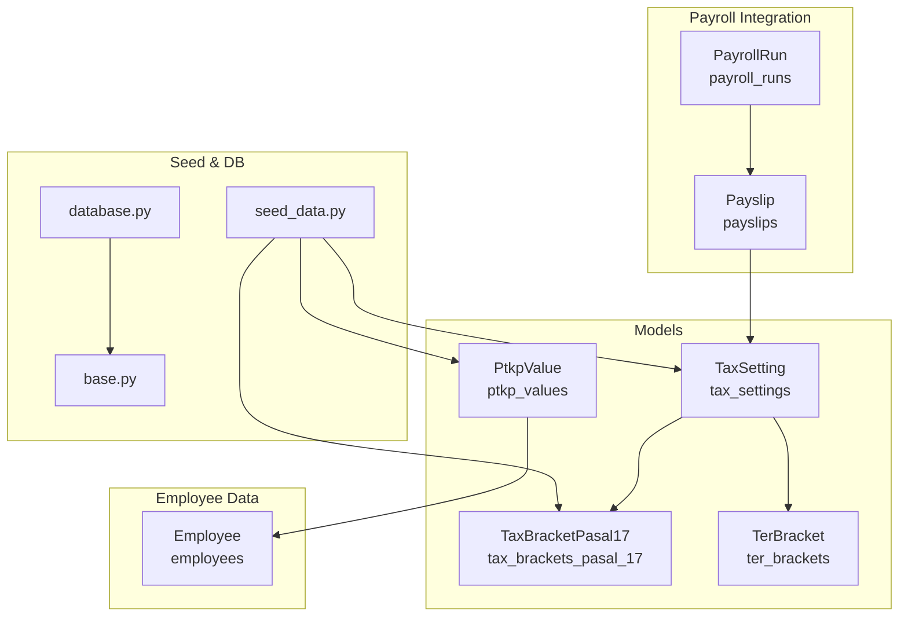
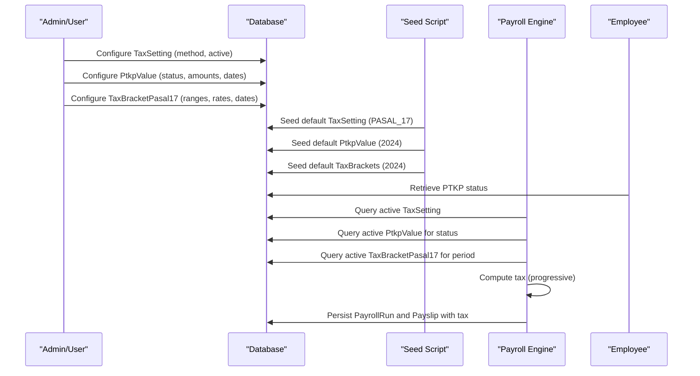
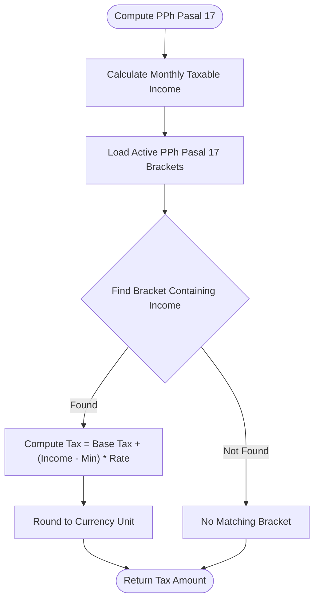
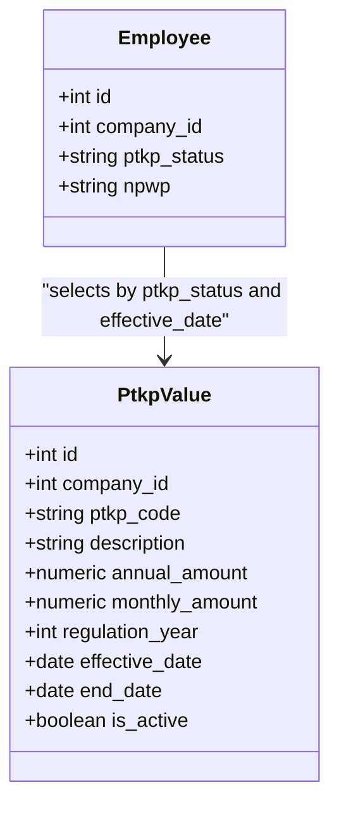
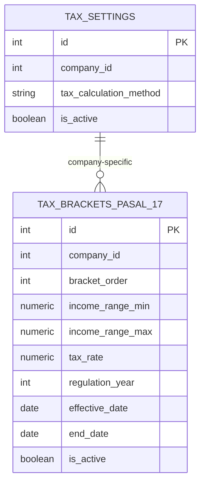
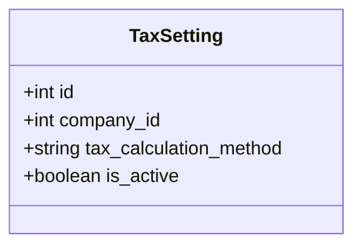
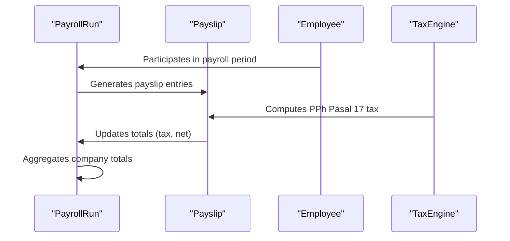
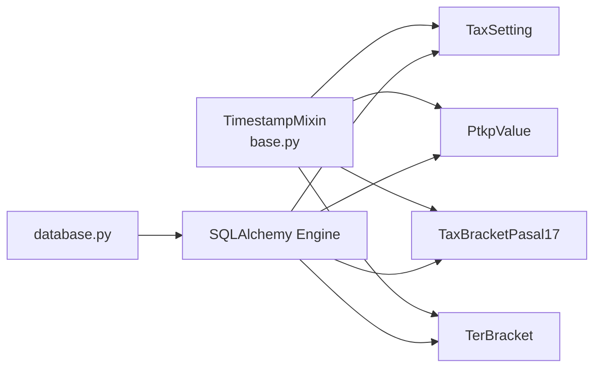

# Tax Compliance

<cite>
**Referenced Files in This Document**
- [tax.py](file://app/models/tax.py)
- [seed_data.py](file://app/seed/seed_data.py)
- [payroll.py](file://app/models/payroll.py)
- [employee.py](file://app/models/employee.py)
- [database.py](file://app/database.py)
- [base.py](file://app/models/base.py)
</cite>

## Table of Contents
1. [Introduction](#introduction)
2. [Project Structure](#project-structure)
3. [Core Components](#core-components)
4. [Architecture Overview](#architecture-overview)
5. [Detailed Component Analysis](#detailed-component-analysis)
6. [Dependency Analysis](#dependency-analysis)
7. [Performance Considerations](#performance-considerations)
8. [Troubleshooting Guide](#troubleshooting-guide)
9. [Conclusion](#conclusion)
10. [Appendices](#appendices)

## Introduction
This document explains the tax compliance subsystem for Indonesian payroll, focusing on:
- PPh Pasal 17 progressive tax calculation
- PTKP (Personal Tax Deduction) management
- Tax bracket configuration aligned with UU HPP 2024
- Tax setting administration
- Integration with payroll processing, employee tax obligations, and monthly tax reporting
- Regulatory compliance and update mechanisms

The system models company-level tax settings, PTKP thresholds, and PPh Pasal 17 tax brackets. It seeds default values for 2024 regulations and supports both PASAL_17 and TER tax calculation methods.

## Project Structure
The tax compliance domain is primarily implemented in the models layer with supporting seed data and database configuration:
- Models define tax-related entities and constraints
- Seed scripts initialize default tax configurations for the current regulation year
- Database configuration enables SQLite with foreign key enforcement

**Diagram sources**
- [tax.py:19-114](file://app/models/tax.py#L19-L114)
- [payroll.py:19-124](file://app/models/payroll.py#L19-L124)
- [employee.py:76-132](file://app/models/employee.py#L76-L132)
- [seed_data.py:27-63](file://app/seed/seed_data.py#L27-L63)
- [database.py:17-63](file://app/database.py#L17-L63)
- [base.py:18-57](file://app/models/base.py#L18-L57)

**Section sources**
- [tax.py:1-115](file://app/models/tax.py#L1-L115)
- [payroll.py:1-124](file://app/models/payroll.py#L1-L124)
- [employee.py:1-132](file://app/models/employee.py#L1-L132)
- [seed_data.py:1-448](file://app/seed/seed_data.py#L1-L448)
- [database.py:1-63](file://app/database.py#L1-L63)
- [base.py:1-57](file://app/models/base.py#L1-L57)

## Core Components
- TaxSetting: Stores company-level tax method selection (PASAL_17 or TER) and activation status.
- PtkpValue: Defines PTKP thresholds per employee status (TK/0, TK/1, etc.) with monthly and annual amounts, regulation year, and effective dates.
- TaxBracketPasal17: Progressive tax brackets for PPh Pasal 17 with ordered ranges and rates, including an unbounded upper bound for the top bracket.
- TerBracket: Simplified TER brackets categorized by A/B/C with income ranges and rates.
- PayrollRun and Payslip: Integrate tax computation into monthly payroll runs and individual payslips, capturing computed tax and totals.
- Employee: Holds employee PTKP status and personal identifiers used in tax computations.

Key constraints and indexes ensure data integrity and efficient lookups:
- Enumerated method values and statuses
- Unique constraints for active configurations per company and date
- Indexed active rows for fast retrieval

**Section sources**
- [tax.py:19-114](file://app/models/tax.py#L19-L114)
- [payroll.py:19-124](file://app/models/payroll.py#L19-L124)
- [employee.py:76-132](file://app/models/employee.py#L76-L132)

## Architecture Overview
The tax compliance architecture separates configuration from computation:
- Configuration layer: TaxSetting, PtkpValue, TaxBracketPasal17, TerBracket
- Computation layer: Not present in code; tax calculation logic is externalized (see Implementation Notes)
- Integration layer: PayrollRun and Payslip persist computed tax and totals
- Data lifecycle: Seed scripts populate default configurations; runtime queries select active configurations by company and effective date

**Diagram sources**
- [seed_data.py:412-430](file://app/seed/seed_data.py#L412-L430)
- [seed_data.py:224-260](file://app/seed/seed_data.py#L224-L260)
- [seed_data.py:263-296](file://app/seed/seed_data.py#L263-L296)
- [tax.py:19-114](file://app/models/tax.py#L19-L114)
- [payroll.py:19-124](file://app/models/payroll.py#L19-L124)
- [employee.py:76-132](file://app/models/employee.py#L76-L132)

## Detailed Component Analysis

### PPh Pasal 17 Progressive Tax Calculation
The system stores progressive tax brackets and selects the applicable bracket based on taxable income. The algorithm proceeds as follows:
- Determine the employee’s monthly taxable income after allowances and PTKP deduction
- Select active PPh Pasal 17 brackets effective during the payroll period
- Apply the progressive formula: cumulative tax from lower brackets plus marginal tax on the portion exceeding the lowest threshold of the selected bracket

**Diagram sources**
- [tax.py:63-85](file://app/models/tax.py#L63-L85)
- [payroll.py:64-102](file://app/models/payroll.py#L64-L102)

**Section sources**
- [tax.py:63-85](file://app/models/tax.py#L63-L85)
- [payroll.py:64-102](file://app/models/payroll.py#L64-L102)

### PTKP Management
PTKP values are stored per employee status and regulation year. The system:
- Maintains monthly and annual PTKP amounts
- Supports effective dates to manage regulatory updates
- Uses employee PTKP status to select the appropriate threshold

**Diagram sources**
- [tax.py:37-60](file://app/models/tax.py#L37-L60)
- [employee.py:76-132](file://app/models/employee.py#L76-L132)

**Section sources**
- [tax.py:37-60](file://app/models/tax.py#L37-L60)
- [employee.py:76-132](file://app/models/employee.py#L76-L132)

### Tax Bracket Configuration
Brackets are configured with ordered ranges and rates. The seed script initializes 2024 brackets aligned with UU HPP. Effective dates enable phased updates.

**Diagram sources**
- [tax.py:19-34](file://app/models/tax.py#L19-L34)
- [tax.py:63-85](file://app/models/tax.py#L63-L85)

**Section sources**
- [tax.py:63-85](file://app/models/tax.py#L63-L85)
- [seed_data.py:263-296](file://app/seed/seed_data.py#L263-L296)

### Tax Setting Administration
TaxSetting defines the company-wide method (PASAL_17 or TER) and activation flag. The seed script sets a default PASAL_17 configuration.

**Diagram sources**
- [tax.py:19-34](file://app/models/tax.py#L19-L34)
- [seed_data.py:412-430](file://app/seed/seed_data.py#L412-L430)

**Section sources**
- [tax.py:19-34](file://app/models/tax.py#L19-L34)
- [seed_data.py:412-430](file://app/seed/seed_data.py#L412-L430)

### Integration with Payroll and Employee Tax Obligations
PayrollRun and Payslip capture computed taxes and totals. The system persists:
- Gross and net salaries
- Tax amounts per payslip
- Period-level aggregates for reporting

**Diagram sources**
- [payroll.py:19-124](file://app/models/payroll.py#L19-L124)
- [tax.py:19-114](file://app/models/tax.py#L19-L114)

**Section sources**
- [payroll.py:19-124](file://app/models/payroll.py#L19-L124)
- [tax.py:19-114](file://app/models/tax.py#L19-L114)

### Monthly Tax Reporting
Monthly reporting is supported by:
- PayrollRun aggregation fields (total_tax, total_gross, total_net)
- Payslip tax fields for individual transparency
- Status tracking for run lifecycle (DRAFT, PROCESSING, COMPLETED, APPROVED, PAID)

**Section sources**
- [payroll.py:19-61](file://app/models/payroll.py#L19-L61)
- [payroll.py:64-102](file://app/models/payroll.py#L64-L102)

## Dependency Analysis
The models rely on shared mixins for timestamps and soft deletes. Database configuration enforces foreign keys for SQLite compatibility.

**Diagram sources**
- [base.py:23-57](file://app/models/base.py#L23-L57)
- [database.py:17-63](file://app/database.py#L17-L63)
- [tax.py:16-16](file://app/models/tax.py#L16-L16)

**Section sources**
- [base.py:1-57](file://app/models/base.py#L1-L57)
- [database.py:1-63](file://app/database.py#L1-L63)
- [tax.py:11-16](file://app/models/tax.py#L11-L16)

## Performance Considerations
- Indexes on active configurations and effective dates optimize bracket and PTKP lookups
- Unique constraints prevent duplicate active configurations per company and date
- Use of Decimal types ensures precise monetary calculations
- Consider caching active configurations per company and period to reduce repeated queries

## Troubleshooting Guide
Common issues and resolutions:
- No active tax brackets found: Verify effective dates and is_active flags; ensure seed data was applied for the target regulation year
- Incorrect PTKP amount: Confirm employee ptkp_status matches available PtkpValue entries for the payroll period
- Tax method mismatch: Check TaxSetting for the company; ensure PayrollRun.tax_method aligns with company setting
- Payroll totals inconsistent: Review PayrollRun aggregation fields and ensure all payslips are included in the run

**Section sources**
- [tax.py:29-34](file://app/models/tax.py#L29-L34)
- [tax.py:54-60](file://app/models/tax.py#L54-L60)
- [tax.py:79-85](file://app/models/tax.py#L79-L85)
- [payroll.py:46-61](file://app/models/payroll.py#L46-L61)

## Conclusion
The tax compliance subsystem provides a robust foundation for Indonesian payroll tax management:
- Clear separation of configuration (TaxSetting, PtkpValue, TaxBracketPasal17) and integration (PayrollRun, Payslip)
- Regulatory alignment with UU HPP 2024 through seeded defaults
- Extensible design supporting future regulatory updates via effective dates and unique constraints

## Appendices

### Concrete Examples

- Example: Tax Setting Update
  - Update company-wide method to PASAL_17 or TER
  - Path: [seed_data.py:412-430](file://app/seed/seed_data.py#L412-L430)

- Example: PTKP Configuration
  - Add or modify PTKP values for a new regulation year
  - Path: [seed_data.py:224-260](file://app/seed/seed_data.py#L224-L260)

- Example: Bracket Adjustments
  - Insert new PPh Pasal 17 brackets with ordered ranges and rates
  - Path: [seed_data.py:263-296](file://app/seed/seed_data.py#L263-L296)

- Example: Tax Computation Result
  - After processing, PayrollRun and Payslip reflect computed tax and totals
  - Path: [payroll.py:19-124](file://app/models/payroll.py#L19-L124)

- Example: Regulatory Compliance
  - Effective dates and unique constraints ensure only one active configuration per company and date
  - Paths: [tax.py:54-60](file://app/models/tax.py#L54-L60), [tax.py:79-85](file://app/models/tax.py#L79-L85), [tax.py:104-114](file://app/models/tax.py#L104-L114)